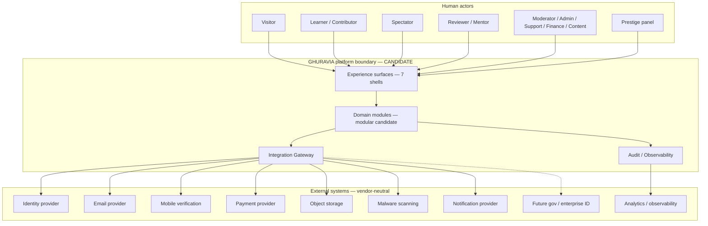

# GHURAVIA System Context

| Field | Value |
|-------|-------|
| **Document ID** | GHV-ARCH-1A-CTX |
| **Version** | 0.1.0 |
| **Status** | **VALIDATION PLAN** |
| **Owner** | Founder (RAVEN) |
| **Source Gate** | GHV.ARCHITECTURE.1A §9 |
| **Last updated** | 2026-07-21 |
| **Limitations** | Vendor-neutral · providers **NOT SELECTED** · spikes **NOT RUN** · diagram is candidate context, not implemented topology |

```text
CANDIDATE SYSTEM CONTEXT
NO VENDOR LOCK
NOT TECHNICALLY VALIDATED
```

## Actors (product)

| Actor | Role summary |
|-------|----------------|
| Visitor | Public shell only; no activated account |
| Learner | Primary journey owner; Nest, Missions, Evidence, Progression |
| Contributor | Creates/shares within governed community rules |
| Spectator | Live Sky observe-only; no contribution credit |
| Reviewer | Evidence review / appeals handling |
| Mentor | Guided support within scoped privileges |
| Moderator | Trust restrictions, community safety |
| Administrator | Privileged configuration and corrections |
| Support operator | Assisted recovery without silent state edits |
| Finance operator | Plans, invoices, reconciliation (no progression grants) |
| Content operator | Catalogue / CMS within publishing controls |
| Prestige panel member | Prestige nomination judgment (governed) |

## Actors (external / system)

| Actor | Role summary |
|-------|----------------|
| External identity provider | Authn federation candidate |
| Email provider | Verification and transactional mail |
| Mobile-verification provider | OTP where used |
| Payment provider | Checkout + webhooks |
| Object-storage provider | Evidence binaries |
| Malware-scanning provider | Upload safety |
| Notification provider | Push/email/SMS fanout |
| Analytics / observability provider | Metrics, logs, traces |
| Future Saudi government identity / enterprise integration | Deferred integration class |

---

## Context diagram (candidate)



Trust boundary: everything inside **GHURAVIA platform boundary** is application trust; externals are **untrusted until authenticated/validated**. Object storage and payment webhooks must not imply admin authority (QAS-014).

---

## External dependencies (vendor-neutral)

For each: purpose, data exchanged, trust boundary, availability dependency, failure mode, fallback, privacy classification, security control, substitution strategy, validation spike.

### E-01 Identity provider

| Field | Content |
|-------|---------|
| **Purpose** | Authenticate sessions / federated identity |
| **Data** | Subject identifiers, email claims, session tokens |
| **Trust boundary** | External → Integration Gateway → Identity domain |
| **Availability** | Critical for sign-in; activation may already be mid-flight |
| **Failure mode** | Login unavailable |
| **Fallback** | Degraded message; no fabricated activation |
| **Privacy** | High — credentials/PII |
| **Security** | OAuth/OIDC best practices; no long-lived secrets in clients |
| **Substitution** | Protocol-level adapter |
| **Spike** | SPK-IDN-01 authn/session (**NOT RUN**) |

### E-02 Email provider

| Field | Content |
|-------|---------|
| **Purpose** | Email verification (ACT-003/011) and transactional mail |
| **Data** | Address, verification tokens, templates |
| **Trust boundary** | Provider cannot set activation state alone |
| **Availability** | High for activation UX; delays expected (QAS-005) |
| **Failure mode** | Delay/outage → Pending remains explainable |
| **Fallback** | Resend / recovery (ACT-012); support path |
| **Privacy** | High — email |
| **Security** | Token single-use; rate limits |
| **Substitution** | SMTP/API adapter |
| **Spike** | SPK-MAIL-01 verification latency (**NOT RUN**) |

### E-03 Mobile verification provider

| Field | Content |
|-------|---------|
| **Purpose** | OTP where product requires mobile verify |
| **Data** | Phone, OTP challenges |
| **Trust boundary** | Optional path must not skip mandatory activation formula |
| **Availability** | Conditional |
| **Failure mode** | OTP fail/timeout |
| **Fallback** | Governed later/blocked screens |
| **Privacy** | High — phone |
| **Security** | Attempt limits; no OTP in logs |
| **Substitution** | Provider adapter |
| **Spike** | SPK-MOB-01 (**NOT RUN** · may DEFER) |

### E-04 Payment provider

| Field | Content |
|-------|---------|
| **Purpose** | Plans, checkout, invoices |
| **Data** | Customer refs, amounts, webhook events |
| **Trust boundary** | Webhooks → entitlement only — **never** progression (P-03, QAS-007) |
| **Availability** | Critical for commercial; not for learning core |
| **Failure mode** | Success-without-webhook / outage |
| **Fallback** | Reconciliation job; no silent XP |
| **Privacy** | High — billing |
| **Security** | Signature verify; least privilege keys |
| **Substitution** | Payment adapter + replay tools |
| **Spike** | SPK-PAY-01 webhook delay (**NOT RUN**) |

### E-05 Object storage

| Field | Content |
|-------|---------|
| **Purpose** | Evidence binary storage |
| **Data** | Objects, signed URLs, metadata refs |
| **Trust boundary** | Storage credentials ≠ app admin (QAS-014) |
| **Availability** | Critical for Evidence upload |
| **Failure mode** | Partial upload (QAS-002) |
| **Fallback** | Idempotent retry; quarantine |
| **Privacy** | High — may contain sensitive artifacts |
| **Security** | Bucket isolation; short-lived URLs |
| **Substitution** | S3-compatible interface |
| **Spike** | SPK-OBJ-01 upload resume (**NOT RUN**) |

### E-06 Malware scanning

| Field | Content |
|-------|---------|
| **Purpose** | Scan uploads before acceptance workflow |
| **Data** | Object refs / scan verdicts |
| **Trust boundary** | Scanner cannot approve Learning Evidence |
| **Availability** | Blocking for unsafe content path |
| **Failure mode** | Scanner timeout |
| **Fallback** | Hold-in-quarantine; no auto-approve |
| **Privacy** | Medium–High |
| **Security** | Network egress control |
| **Substitution** | Alternate scanner adapter |
| **Spike** | SPK-SCAN-01 (**NOT RUN**) |

### E-07 Notification provider

| Field | Content |
|-------|---------|
| **Purpose** | Push/email/SMS fanout |
| **Data** | Notification payloads, device tokens |
| **Trust boundary** | Delivery failure must not mutate business state (QAS-018) |
| **Availability** | Non-critical for core journeys |
| **Failure mode** | Dropped/delayed notify |
| **Fallback** | In-app inbox / retry queue |
| **Privacy** | Medium |
| **Security** | Template injection controls |
| **Substitution** | Multi-channel adapter |
| **Spike** | SPK-NTF-01 (**NOT RUN**) |

### E-08 Analytics / observability

| Field | Content |
|-------|---------|
| **Purpose** | Operate and diagnose |
| **Data** | Metrics, traces, scrubbed logs |
| **Trust boundary** | No PII sprawl (P-05/P-19) |
| **Availability** | Degraded ops if down — product may continue |
| **Failure mode** | Blind operation |
| **Fallback** | Local structured logs (launch) |
| **Privacy** | Controlled |
| **Security** | Key rotation; sampling |
| **Substitution** | OTel-compatible exporters |
| **Spike** | SPK-OBS-01 (**NOT RUN**) |

### E-09 Future gov / enterprise identity

| Field | Content |
|-------|---------|
| **Purpose** | Future national/enterprise assurance |
| **Data** | TBD assurance claims |
| **Trust boundary** | Deferred; must not block launch architecture |
| **Availability** | N/A launch |
| **Failure mode** | N/A |
| **Fallback** | N/A |
| **Privacy** | High when introduced |
| **Security** | TBD 1C+ |
| **Substitution** | Interface reserved |
| **Spike** | **DEFERRED** |

---

## Internal trust zones (candidate)

| Zone | Contains | Notes |
|------|----------|-------|
| Public edge | Public shell | No authenticated learner data |
| Authenticated app | Nest, Learning, Progression UX | Server-authoritative state |
| Privileged ops | Admin / Moderation / Finance | Stronger authz + audit |
| Evidence pipeline | Upload, scan, review | Quarantine until accept |
| Ledger core | Progression events, entitlements | Highest integrity |

## Spikes register (planned — NOT RUN)

| Spike ID | Topic | Gate |
|----------|-------|------|
| SPK-IDN-01 | Authn/session | 1C/1E |
| SPK-MAIL-01 | Verification delay UX + state | 1C/1E |
| SPK-PAY-01 | Webhook delay reconciliation | 1C/1E |
| SPK-OBJ-01 | Evidence upload resume/idempotency | 1C/1E |
| SPK-RT-01 | Live Sky reconnect credit | 1D/1E |
| SPK-OBS-01 | Minimal operable telemetry | 1D/1E |

## Change history

| Version | Date | Change |
|---------|------|--------|
| 0.1.0 | 2026-07-21 | Initial candidate context under GHV.ARCHITECTURE.1A |
