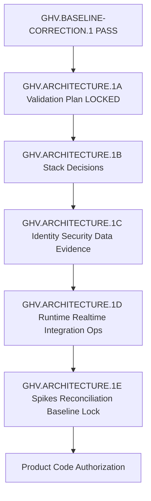
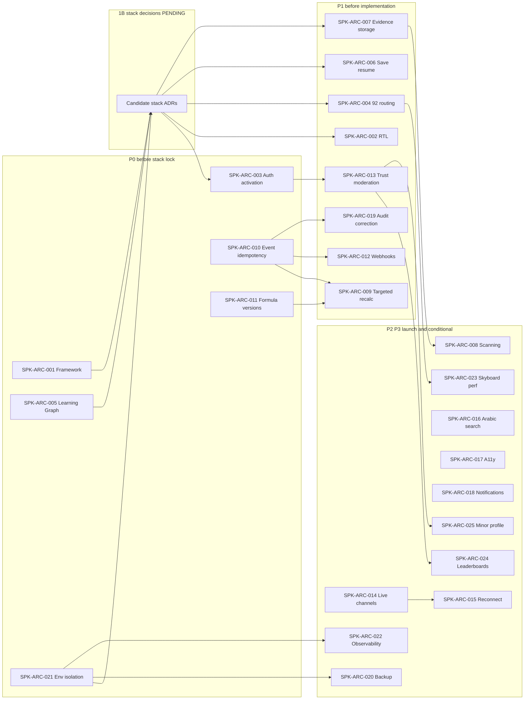

# Technical Validation Dependency Graph

| Field | Value |
|-------|-------|
| **Document ID** | GHV-ARC-VAL-DEP-GRAPH-001 |
| **Version** | 1.0.0 |
| **Status** | **VALIDATION PLAN** |
| **Owner** | Founder (RAVEN) |
| **Source Gate** | GHV.ARCHITECTURE.1A §44 |
| **Last updated** | 2026-07-21 |
| **Related** | [TECHNICAL-SPIKE-REGISTRY.md](./TECHNICAL-SPIKE-REGISTRY.md) · [TECHNICAL-SPIKE-PRIORITY-MATRIX.md](./TECHNICAL-SPIKE-PRIORITY-MATRIX.md) |

```text
Technical Spikes Run = 0
Graph is Gate-level planning only
Acyclic at Gate level by construction
```

## Purpose

Show Gate-level dependencies among architecture programme stages, stack decisions, and spike clusters without creating circular evidence requirements.

## Gate-level programme (acyclic)



## Spike clusters and decision dependencies



## Domain dependency notes

| Dependency class | Depends on | Feeds |
|------------------|------------|-------|
| **Identity** | SPK-ARC-001 · stack candidates | SPK-ARC-003 · 013 · 025 |
| **Data / Learning Graph** | SPK-ARC-005 · no graph-DB-by-name | Mission runtime · unlock engine |
| **Progression** | SPK-ARC-010 · 011 | SPK-ARC-009 · 012 · 019 · 020 |
| **Evidence / security** | SPK-ARC-007 | SPK-ARC-008 · 009 |
| **Live Sky** | stack + SPK-ARC-014 | SPK-ARC-015 |
| **Deployment** | SPK-ARC-021 · TECH-018 | Preview/prod ops · observability |
| **Security** | threat models (planned) | All sensitive ADRs |

## Circular-evidence resolution rules

If a circular evidence dependency appears:

1. **Split** the spike into a neutral prior harness and a dependent experiment.
2. Use a **temporary neutral harness** that does not presuppose the contested ADR.
3. **Defer** the decision to the next Gate with an explicit assumption ID.
4. Record a **minimal prior assumption** in the Architecture Assumption Register (not mitigated by plan alone).

## Explicit non-claims

```text
Graph ≠ executed validation
No spike evidence yet
No ACCEPTED stack
Product Code BLOCKED
```

## Change history

| Version | Date | Change |
|---------|------|--------|
| 1.0.0 | 2026-07-21 | GHV.ARCHITECTURE.1A §44 — Gate-level acyclic dependency graph |
