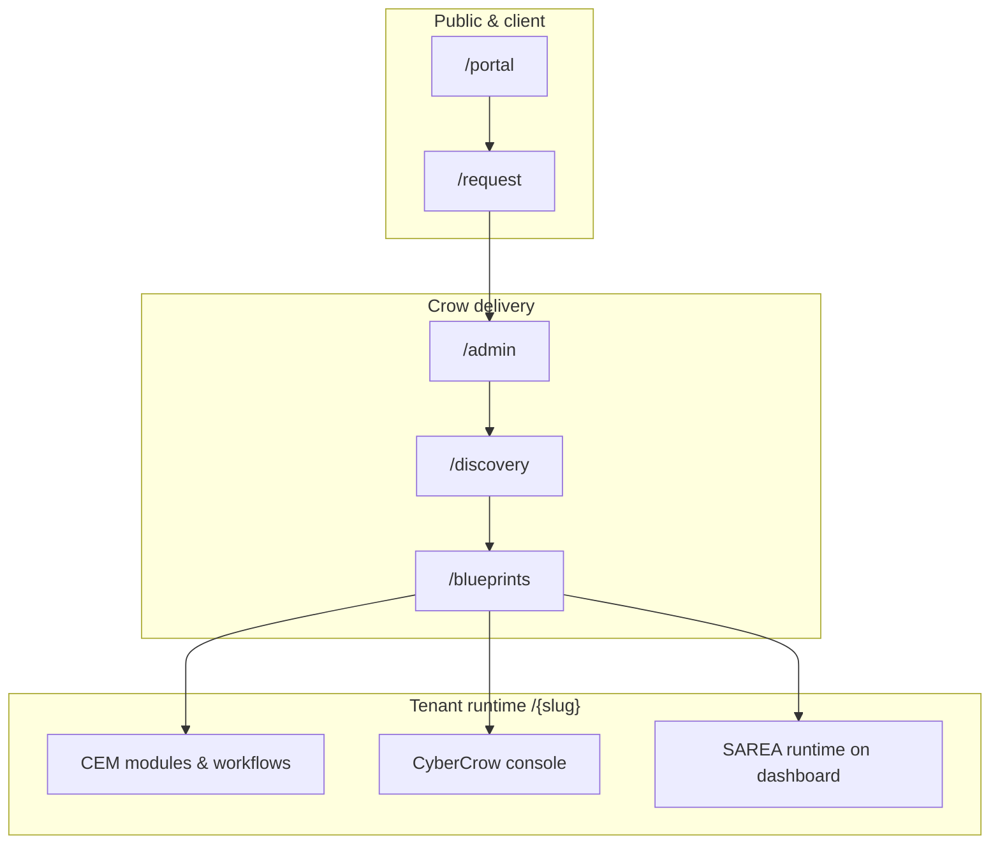

# Architecture overview (public)

**SecDevOps + AI practices**, implemented in a **multi-tenant** reference platform (**Crow Ecosystem**).  
Conceptual doc for portfolio readers — internal layer diagrams stay private.

---

## What we are building

**Enterprise Operational Intelligence** — a governed path from customer intent to live operations, delivered as three engines on one tenant.

Customers see:

```text
Three engines  +  One delivery pipeline
CEM · CyberCrow · SAREA     Request → Discovery → Blueprint → Go-live
```

Engineers implement:

```text
Public · Admin · Discovery · Blueprint · Portal · Tenant · SAREA Studio
```

---

## High-level diagram



---

## Core architectural principles

### 1. Pipeline before modules

The product is the **lifecycle**, not a module catalog. Modules are selected during Discovery and bound in the Blueprint.

### 2. Blueprint as contract

The Blueprint aggregates:

- Commercial estimate (SAR bands, modules, security, SAREA, AI extras)
- Technical intent (integrations, identity, module keys)
- Readiness gates before go-live
- Provisioning intent (conceptual — implementation details private)

### 3. RBAC vs SAREA (Adaptive RBUX)

| Layer | Question | Mechanism |
|-------|----------|-----------|
| **RBAC** | Who may act? | Roles, permissions, tenant membership, route guards |
| **SAREA** | How should work feel? | Personas, layouts, navigation, widgets |

Security policy must not be reimplemented inside UI variants. SAREA adapts experience **within** authorized boundaries.

### 4. Multi-tenant isolation

Each customer organization receives a **tenant slug** (`/{slug}/…`). Platform staff use `/admin`, `/discovery`, `/blueprints`. Tenant users use CEM and CyberCrow under their slug.

### 5. Identity continuity

**Microsoft Entra ID** (via Supabase Auth) supports one identity from client portal tracking through tenant operations — role promotion, not duplicate accounts.

### 6. Truth before scale

Local-first development proves pipeline, seeds, and E2E before cloud production. Cloud is **earned**, not assumed.

---

## Technology map (non-sensitive)

| Concern | Choice |
|---------|--------|
| Web app | Next.js 15 App Router, TypeScript, React 19 |
| Styling | Tailwind CSS, entity-themed design tokens |
| Data | PostgreSQL, Prisma ORM |
| Auth | Supabase Auth, optional Entra SSO |
| Notifications | Resend (pipeline events) |
| Target production | Azure (App Service + managed Postgres) — optional Vercel interim |

---

## Application surfaces

| Surface | Purpose |
|---------|---------|
| Public marketing | Positioning, modules, pricing, request intake |
| Admin console | Request queue, tenants, audit |
| Discovery workspace | Structured organizational intelligence |
| Blueprint builder | Pricing, engines, readiness, go-live |
| Client portal | Request tracking for sponsors |
| CEM tenant | Operational modules, workflows, settings |
| CyberCrow console | Security posture, audit, compliance narrative |
| SAREA studio | Experience configuration (platform) |

---

## What this document intentionally omits

- Prisma model-level provisioning order
- Security service internals and control mappings
- Customer-specific seeds and IDs
- Production environment values

These remain in the **private engineering repository** or operational runbooks.

---

## Related public docs

- [`SECDEVOPS.md`](SECDEVOPS.md) · [`AI_PLATFORM.md`](AI_PLATFORM.md) · [`MULTI_TENANT.md`](MULTI_TENANT.md)
- [`PLATFORM_ENGINES.md`](PLATFORM_ENGINES.md)
- [`LIFECYCLE.md`](LIFECYCLE.md)
- [`ROADMAP.md`](ROADMAP.md)
