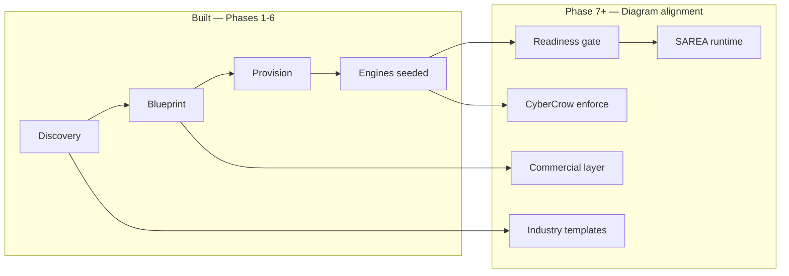

# CyberCrow — architecture diagram (north star)

**Purpose:** Map the founder architecture diagram to the codebase and delivery phases.  
**Golden rule:** Discovery understands → Blueprint defines → CEM runs → CyberCrow protects → SAREA adapts.

**Related:** [`ROADMAP.md`](ROADMAP.md) · [`PHASE7.md`](PHASE7.md) · [`PLATFORM_STATUS.md`](PLATFORM_STATUS.md)

> Store a copy of the diagram image at `docs/assets/cybercrow-architecture.png` for presentations (optional).

---

## Diagram at a glance

The diagram defines four views of one platform:

1. **13-step lifecycle** (left) — commercial and delivery journey  
2. **10 architecture layers** (center) — functional stack  
3. **Three engines + seven principles** (right) — CEM, CyberCrow, SAREA  
4. **Industry templates + go-live readiness** (middle/bottom) — acceleration and gates  

Nothing in the diagram is a separate product. It is one **adaptive enterprise orchestration platform**.

---

## Three engines (right panel)

| Engine | Diagram role | Code today | To match diagram fully |
|--------|----------------|------------|-------------------------|
| **CEM** | Runs the organization | `/[tenant]/*`, pipeline CEM seed | Deep ERP modules + workflows in production use |
| **CyberCrow** | Protects identities, data, workflows | `/[tenant]/cybercrow/*`, seed, admin baselines | **Enforcement** — policy blocks actions, MFA, anomaly |
| **SAREA** | Adapts UX by role, context, device | `/sarea/*` studio, seed at provision | **Runtime** — tenant UI changes per persona/role |

---

## Ten architecture layers (center stack)

| Layer | Diagram contents | Primary routes / code | Status |
|-------|------------------|------------------------|--------|
| **01** Client engagement | Website, clients, pricing, onboarding, proposals | `(public)/*`, `/request`, API | **Partial** — intake live; proposals & rich marketing TBD |
| **02** Ecosystem identity | Vision, standards, governance, trust | `PLATFORM_*` constants, docs, brand UI | **Light** — no dedicated governance console |
| **03** Discovery engine | Templates, AI predictions, org structure, security | `/discovery/[id]/*`, `discovery.service.ts` | **Strong** — structure & security live; templates & AI TBD |
| **04** Enterprise blueprint | Org blueprint, RBAC, integrations, SAREA/CC baselines | `/blueprints/[id]/*`, `pipeline.service.ts` | **Strong** — provision chain works |
| **05** Pricing & subscription | Complexity, infra estimate, plans | `/pricing`, `SubscriptionPlan`, request plans | **Partial** — no complexity engine or formal quotes |
| **06** CEM runtime | HR, ops, logistics, finance, CRM, automation | `/[tenant]/hr`, `/crm`, users, workflows, … | **Early** — HR/CRM MVP; most modules shell |
| **07** CyberCrow security | RBAC, MFA, audit, anomaly, risk | `/[tenant]/cybercrow/*`, `cybercrow-seed.service.ts` | **Partial** — visibility yes; enforcement no |
| **08** SAREA experience | Role UX, adaptive dashboards, navigation | `/sarea/*`, `sarea-seed.service.ts` | **Partial** — studio yes; tenant runtime no |
| **09** Infrastructure & integrations | Cloud, DB, APIs, IdP | Supabase, Prisma, `IntegrationConnection` | **Foundation** — no in-app infra console |
| **10** Enterprise operations | Tenant monitoring, health, performance | `/admin/*`, audit, subscriptions | **Good v0** — monitoring/perf dashboards TBD |

**Repo mapping:** `src/lib/constants/platform.ts` → `PLATFORM_ENGINES` (01–10). See also [`ARCHITECTURE_DOMAINS.md`](ARCHITECTURE_DOMAINS.md).

---

## Thirteen lifecycle steps (left column)

| # | Step | Status | Implementation / gap |
|---|------|--------|-------------------------|
| 1 | Client engagement | **Live** | `/request`, public portal |
| 2 | Discovery | **Live** | Discovery workspace + admin hub |
| 3 | Enterprise blueprint | **Live** | Auto blueprint from discovery |
| 4 | Pricing intelligence | **Partial** | Plans in DB; no complexity/infra estimator |
| 5 | Commercial proposal | **Not built** | Proposal artifact + client view |
| 6 | Client approval | **Partial** | Admin approve; no client sign-off portal |
| 7 | Tenant provisioning | **Live** | `provisionAndInitializeTenant` |
| 8 | CyberCrow initialization | **Live** | `initializeCyberCrow` + seed |
| 9 | SAREA initialization | **Live** | `initializeSarea` + `seedSareaProfileDefaults` |
| 10 | Identity initialization | **Partial** | Membership + invite; SSO/Entra TBD |
| 11 | Readiness validation | **Not built** | Use `BlueprintGoLiveChecklist` + readiness UI |
| 12 | Go-live | **Live** | Status `GO_LIVE`, tenant workspace |
| 13 | Continuous improvement | **Not built** | Metrics, feedback, optimization loop |

**Phases 1–6** delivered steps **1–3, 7–10, 12**. **Phase 7+** targets **4–6, 11, 13** and engine depth.

---

## Lifecycle states (bottom bar)

Diagram states (simplified):

`Pending Discovery` → … → `LIVE`

**App mapping** (`ImplementationRequestStatus` in Prisma):

| Diagram concept | Prisma status (examples) |
|-----------------|---------------------------|
| Pending discovery | `PENDING_REVIEW` → `UNDER_DISCOVERY` |
| Blueprint build | `BLUEPRINT_BUILD` |
| Provisioning | `TENANT_PROVISIONING` |
| Security / SAREA init | `SECURITY_INIT`, `SAREA_INIT` |
| Live | `GO_LIVE` |

---

## Go-live readiness checklist (bottom)

Diagram checklist → product keys for `BlueprintGoLiveChecklist.itemKey`:

| Checklist item (diagram) | `itemKey` | How to verify (automated) |
|--------------------------|-----------|----------------------------|
| Blueprint approved | `blueprint_approved` | `EnterpriseBlueprint.status === APPROVED` |
| Security initialized | `security_initialized` | CyberCrow audit log `CYBERCROW_INITIALIZED` |
| SAREA configured | `sarea_configured` | `SareaExperienceProfile.count > 0` for tenant |
| Identities synced | `identities_synced` | `TenantMembership.count > 0` or primary profile exists |
| Integrations healthy | `integrations_healthy` | Discovery integrations recorded (v1); health ping later |
| Workflows validated | `workflows_validated` | `Workflow.count > 0` for tenant |
| Infrastructure ready | `infrastructure_ready` | Manual / env checklist (v1) |
| Performance validated | `performance_validated` | Manual / smoke test (v1) |
| Support ready | `support_ready` | Manual platform staff toggle (v1) |

**Phase 7.1 deliverable:** `/blueprints/[id]/readiness` — computed pass/fail + persist checklist rows.

---

## Industry templates (middle)

| Template | Diagram modules | Discovery seed (planned) |
|----------|-----------------|---------------------------|
| Logistics | Fleet, dispatch, warehouse, delivery | Departments + modules + workflows JSON |
| Construction | Projects, sites, resources, materials, safety | Same pattern |
| Aviation | Flights, maintenance, crew, compliance | Same pattern |
| Healthcare | Patients, staff, appointments, compliance | Same pattern |
| Retail | Stores, inventory, sales, customers | Same pattern |

**Phase 7.4 deliverable:** `industryKey` on request → `seedDiscoveryFromTemplate(industryKey)`.

---

## Data & governance foundation (bottom icons)

| Pillar | Diagram | Platform approach |
|--------|---------|-------------------|
| Data governance | Icon | Tenant scoping in all services; audit tables |
| Data security | Icon | CyberCrow + RLS future; Supabase auth |
| Audit & compliance | Icon | `CybercrowAuditLog`, compliance controls |
| Privacy | Icon | Policies + consent (TBD) |
| Data quality | Icon | Validation via Zod + discovery completeness |
| Retention | Icon | Retention rules (TBD) |

---

## Platform principles (right panel)

| Principle | Meaning for implementation |
|-----------|---------------------------|
| Blueprint-driven | No tenant without approved blueprint path |
| Tenant-first | Every query scoped by `tenantId` |
| Adaptive | SAREA runtime (Phase 7.2) |
| Security-first | CyberCrow before widening CEM surface |
| Lifecycle-aware | Status machine on `ImplementationRequest` |
| Infrastructure-aware | Pricing/infra estimation (Phase 7.5) |
| Experience-driven | Role-based nav/widgets, not one UI for all |

---

## Gap summary: diagram vs app (May 2026)

| Area | % toward diagram vision |
|------|-------------------------|
| Core pipeline (steps 1–3, 7–12) | ~85% |
| Three engines (behavior, not just data) | ~35% |
| Commercial layer (steps 4–6) | ~25% |
| Enterprise operations (layer 10 depth) | ~50% |
| Industry templates | ~10% |
| Continuous improvement (step 13) | ~5% |

---

## How we work toward this

All new work should trace to a **diagram box**:

1. Name the layer or lifecycle step in PR/commit/phase doc.  
2. Add or extend a **readiness check** if it affects go-live.  
3. Prefer **engine behavior** (protect / adapt) over new placeholder pages.  
4. Update [`PLATFORM_STATUS.md`](PLATFORM_STATUS.md) when a box moves from shell → live.

**Execution plan:** [`PHASE7.md`](PHASE7.md)
