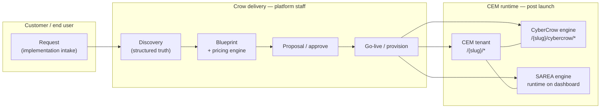
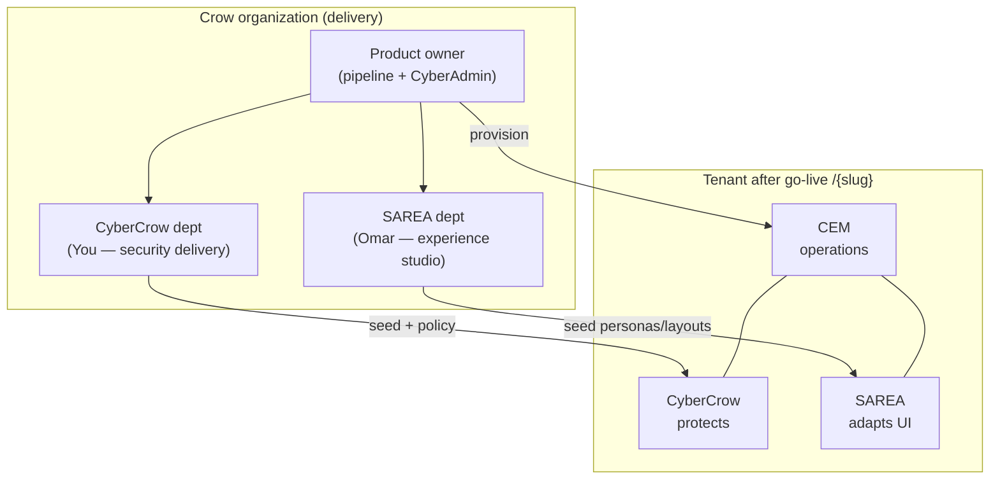
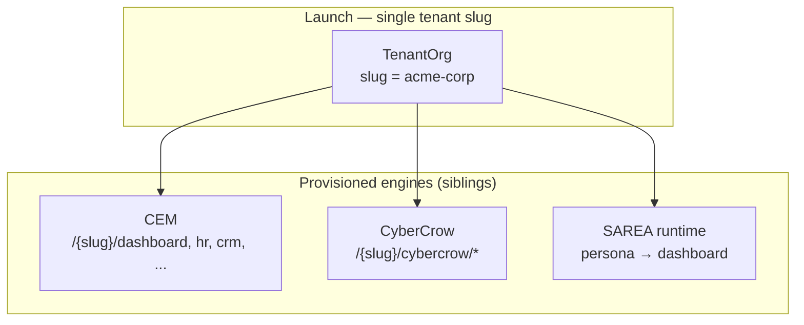

# Crow Ecosystem — Core product flow

**Audience:** Product owner, delivery leads, and engineers redesigning the platform around the commercial pipeline.

**Related:** [`ROLES_AND_WORKFLOW.md`](ROLES_AND_WORKFLOW.md) (auth & routes), [`PAGE_DESIGNS.md`](PAGE_DESIGNS.md) (wireframe specs), [`DESIGN_SYSTEM.md`](DESIGN_SYSTEM.md) (entity colors), [`PLATFORM_STATUS.md`](PLATFORM_STATUS.md) (built vs shell).

**Canonical route builders:** `src/lib/routes.ts`

---

## System heart (commercial + technical)

The platform is a **B2B implementation factory**: a customer submits intent, Crow staff discover truth, a **Blueprint prices and defines** the deal, the client approves, then **Launch provisions a CEM tenant** with CyberCrow and SAREA as configured siblings.

| Step | Product label | Primary actor | Primary routes (today) | Persisted artifact |
|------|---------------|---------------|------------------------|-------------------|
| 1 | **Request** | Customer / sponsor | `/request`, `POST /api/implementation-requests` | `ImplementationRequest` (`PENDING_REVIEW`) |
| 2 | **Discovery** | Crow implementer (CyberCrow dept + cross-functional) | `/discovery/:requestId/*`, `/admin/discovery` | Discovery answers, structure, security package |
| 3 | **Blueprint + pricing** | Crow implementer; commercial review | `/blueprints/:id/overview` (+ proposed `/pricing` tab) | `EnterpriseBlueprint`, `estimatedMonthlySar`, line-item estimate |
| 4 | **Proposal / approve** | Client (token); Crow sends | `/proposal/:token`, proposal panel on blueprint overview | `proposalToken`, `proposalStatus` |
| 5 | **Go-live** | Crow implementer (`platform_admin` / `implementer`) | `/blueprints/:id/go-live`, `/readiness` | Tenant org, provision pipeline |
| 6 | **CEM operations** | Tenant CyberAdmin, users | `/{slug}/dashboard`, `/{slug}/*` | CEM + memberships |
| 7 | **Ongoing engines** | Tenant + Crow support | `/{slug}/cybercrow/*`, SAREA runtime | CyberCrow tables, SAREA profiles |

---

## Crow departments vs tenant engines

**Departments** are how **Crow** organizes delivery (people and accountability). **Engines** are what gets **provisioned on the customer tenant** at launch (product surfaces under one slug).

| Dimension | **CyberCrow** (dept) | **SAREA** (dept) | **You — product owner** | **CEM** (runtime) |
|-----------|----------------------|------------------|-------------------------|-------------------|
| **What it is** | Crow security / cyber operations team at Crow | Omar's experience studio (adaptive UI, personas, layouts) | Platform owner; drives pipeline; becomes **tenant CyberAdmin** after go-live | Customer's operational home — ERP-style modules, identity, workflows |
| **Led by** | Muhanad (NCA-aligned delivery, audits, Microsoft/Entra, tenant posture) | **MEEM (Omar)** — customer SAREA acceptance only; Muhanad ships Crow `/sarea/*` runtime | Muhanad | Customer tenant admin (Muhanad seeds flagship `meem-global`) |
| **When it leads** | Discovery **security** step, blueprint **CyberCrow** tab, provision seed, ongoing `/{slug}/cybercrow/*` | Discovery **experience** step, `/sarea/*` studio, blueprint **SAREA** tab, dashboard runtime | `/admin/*`, request → blueprint orchestration, commercial send | All post-launch `/{slug}/*` except cybercrow prefix |
| **Maps to engine** | **CyberCrow** engine on tenant | **SAREA** engine on tenant | **Platform ops** + **CEM CyberAdmin** role | **CEM** engine on tenant |
| **Entity color** | Violet / indigo (`entity-cybercrow`) | Rose / amber (`entity-sarea`) | Neutral / platform cobalt | Cyan / teal (`entity-cem`) |
| **Key routes (delivery)** | `/discovery/.../security`, `/blueprints/.../cybercrow`, `/admin/security-baselines`, `/admin/audit` | `/discovery/.../experience`, `/sarea/*`, `/blueprints/.../sarea` | `/admin/requests`, `/admin/overview`, pipeline actions | N/A until `/{slug}/dashboard` |
| **Key routes (runtime)** | `/{slug}/cybercrow/dashboard`, compliance, audit, GRC | Runtime via `sarea-runtime.service` on `/{slug}/dashboard` | `/{slug}/users`, settings (as CyberAdmin) | `/{slug}/hr`, `crm`, modules, workflows, etc. |

**Naming discipline:** In workshops, say *"CyberCrow department"* vs *"CyberCrow engine on Acme's tenant"* to avoid conflating Crow staff with the product module.

---

## Phase ownership

| Phase | Customer | You / CyberCrow dept | Omar / SAREA dept | CEM runtime |
|-------|----------|----------------------|-------------------|-------------|
| Request | Submits intake, selects initial modules/tier | Reviews `/admin/requests` | — | — |
| Discovery | Validates org truth (workshops) | Leads structure, **security**, identity, integrations | Leads **experience** requirements | — |
| Blueprint | — | Owns overview, commercial, readiness, **CyberCrow** tab | Owns **SAREA** tab (layouts/personas from discovery) | — |
| Pricing & proposal | Approves via `/proposal/:token` | Sends proposal, adjusts discovery-driven SKUs | **GREENFIELD:** SAREA package line items in estimate | — |
| Go-live | — | Runs provision (`pipeline.service.ts`), grants access | Confirms SAREA seed checklist | — |
| Operations | Uses CEM modules as business users | Supports posture, audits (platform or tenant) | Tunes studio; runtime adapts dashboard | Day-to-day work on `/{slug}/*` |

---

## Pricing in the Blueprint (central, not afterthought)

### Design intent

**Blueprint overview** should become the **pricing control room**: discovery outputs feed a live estimate; staff tune commercial knobs; the same numbers flow to **proposal token** and (future) Stripe. Public `/pricing` remains **marketing catalog** only—not the deal system of record.

### Inputs (what feeds the estimate)

| Input | Source today | Stored on | Notes |
|-------|--------------|-----------|-------|
| **Subscription tier** | Request wizard / discovery | `requestedPlans.planKey` (`startup` \| `growth` \| `enterprise`) | `SUBSCRIPTION_TIERS` in `src/lib/constants/subscriptions.ts` |
| **CEM modules** | Request + discovery modules step | `requestedModules`, blueprint `modules` | `CEM_MODULES` — per-module `monthlyAddonSar` |
| **Security package(s)** | Request + discovery security | `requestedSecurityPkgs` | `SECURITY_PACKAGES` — Crow Shield / Sentinel / Fortress |
| **Employee band** | Request org profile | `employeeBand` | Complexity multiplier in `pricing.service.ts` (1.0–1.2×) |
| **SAREA package** | Discovery experience (persona count, custom layouts) | — | **GREENFIELD** — not in `calculateMonthlyEstimate` today |
| **Identity / Entra** | Discovery identity step | Discovery answers | Affects tier eligibility (`enterprise` → Entra); no separate line item yet |

### Outputs (what Blueprint must show)

| Output | Implementation today | Target UX (see [`PAGE_DESIGNS.md`](PAGE_DESIGNS.md)) |
|--------|----------------------|-----------------------------------------------------|
| Line items: base plan | `PricingEstimate.baseMonthlySar` | Pricing panel — cyan accent |
| Line items: modules | `modulesMonthlySar` | Expandable module rows |
| Line items: security | `securityMonthlySar` | Violet CyberCrow rows |
| Line items: SAREA | — | Rose rows — **GREENFIELD** |
| Complexity multiplier | `complexityMultiplier` | Footnote on employee band |
| **Total monthly SAR** | `totalMonthlySar` → `estimatedMonthlySar` on request | Hero total + SAR/mo badge |
| **Proposal token** | `EnterpriseBlueprint.proposalToken` | Send → `/proposal/:token` |
| Proposal status | `proposalStatus` (`DRAFT` → `SENT` → `CLIENT_APPROVED`) | Status chip on overview |

### Code map (existing vs greenfield)

| Capability | Status | Location |
|------------|--------|----------|
| Monthly estimate formula | **Exists** | `src/lib/services/pricing.service.ts` — `calculateMonthlyEstimate()` |
| Persist estimate on request | **Exists** | `commercial.service.ts` — `refreshRequestPricingEstimate()` |
| Blueprint commercial panel | **Partial** | `src/components/commercial/blueprint-proposal-panel.tsx` on `/blueprints/[id]/overview` |
| Send / approve proposal | **Exists** | `commercial.service.ts`, `/proposal/[token]`, `proposal-client-actions.tsx` |
| Public pricing catalog | **Exists** (not deal SOoR) | `/pricing` — `SUBSCRIPTION_TIERS` display only |
| Admin subscriptions registry | **Exists** (platform catalog) | `/admin/subscriptions` |
| Dedicated blueprint **Pricing** route/tab | **GREENFIELD** | Proposed: `/blueprints/:id/pricing` or sticky right rail on overview |
| SAREA commercial line items | **GREENFIELD** | Extend `PricingEstimate` + discovery experience schema |
| Stripe checkout from approved proposal | **Scaffold** | `STRIPE_BILLING.md`, `billing.service.ts` |

---

## CEM as launch target

**Go-live** creates one **tenant organization** (`Tenant.slug`) — the **CEM workspace** is the runtime home. Provision (`pipeline.service.ts`) then:

1. **CEM seed** — departments, branches, roles, workflows, enabled modules from discovery (`tenant-cem-seed.service.ts`).
2. **CyberCrow seed** — baseline policies, packages from discovery security (`initializeCyberCrow`).
3. **SAREA seed** — default personas `executive`, `manager`, `frontline` + layouts (`sarea-seed.service.ts`).

**EntityHub post-login** (`entity-hub.tsx`, `entity-theme.ts`): on tenant routes, switch among **CEM · CyberCrow · SAREA** without leaving the slug—three engines, one tenant boundary.

**Product owner post go-live:** You hold `platform_admin` for Crow Admin **and** `tenant_admin` on the flagship tenant as **CyberAdmin**—pipeline owner becomes customer workspace owner.

---

## Redesign notes (current pipeline vs target)

### Keep (solid foundation)

| Area | Why keep | Routes / services |
|------|----------|-------------------|
| Public request intake | Correct front door | `/request`, `POST /api/implementation-requests` |
| Admin request queue | Operator control tower | `/admin/requests`, `/admin/requests/[id]` |
| Discovery workspace | Source of blueprint truth | `/discovery/:id/*`, `discovery.service.ts` |
| Blueprint tabs (CEM / CyberCrow / SAREA) | Engine-specific review before launch | `/blueprints/:id/{cem,cybercrow,sarea}` |
| Readiness + go-live | Governed provision | `/blueprints/:id/readiness`, `go-live`, `readiness.service.ts` |
| Proposal token flow | Client approval without login | `/proposal/:token`, `commercial.service.ts` |
| Provision pipeline | Single orchestration | `pipeline.service.ts` |
| Tenant workspace + CyberCrow subroutes | Runtime model is right | `routes.tenant(slug)` |

### Change (align to core flow)

| Current gap | Target behavior |
|-------------|-----------------|
| Pricing scattered (`/pricing` marketing, `/admin/subscriptions`, panel buried on overview) | **Blueprint = pricing engine** — dedicated pricing zone, live recalc on discovery sync |
| Commercial phase labeled separately in docs | Merge phases 4–5: **Blueprint defines price + scope** before proposal |
| Omar persona = client executive in old docs | **Omar = SAREA dept lead**; client sponsor is separate (request contact) |
| No Crow dept concept in UI | Admin overview / request detail show **dept chips** (CyberCrow / SAREA / Platform) |
| SAREA not in estimate | Add **SAREA package** tier (studio + runtime) to `pricing.service.ts` |
| Proposal panel secondary on overview | Overview = status + timeline; **pricing panel = primary right rail** (50% width desktop) |

### Route mapping (proposed additions — design only)

| Proposed route | Purpose | Status |
|----------------|---------|--------|
| `/blueprints/:id/pricing` | Full pricing workspace (line items, send proposal) | **GREENFIELD** (or enlarge overview) |
| `/admin/requests/[id]?tab=commercial` | Early estimate from intake | **GREENFIELD** |
| `/discovery/:id/summary` | Explicit "handoff to blueprint pricing" CTA | **Enhance** existing summary |

No code changes in this document—see [`PAGE_DESIGNS.md`](PAGE_DESIGNS.md) for wireframe-level specs.

---

## Status alignment (Prisma / platform constants)

Request → discovery → blueprint → provision states remain as in `ImplementationRequestStatus` and `PLATFORM_LIFECYCLE` (`src/lib/constants/platform.ts`). Product language for stakeholders:

| Status cluster | User-facing label |
|----------------|-------------------|
| `PENDING_REVIEW` | Request received |
| `UNDER_DISCOVERY` | Discovery in progress |
| `BLUEPRINT_BUILD` | Blueprint & pricing |
| `TENANT_PROVISIONING` … `GO_LIVE` | Launch to CEM |
| Live tenant | CEM operations |

---

## Quick reference links

| Topic | Document / code |
|-------|-----------------|
| Roles & guards | [`ROLES_AND_WORKFLOW.md`](ROLES_AND_WORKFLOW.md) |
| Page wireframes | [`PAGE_DESIGNS.md`](PAGE_DESIGNS.md) |
| Built routes | [`PLATFORM_STATUS.md`](PLATFORM_STATUS.md) |
| Security packages | `src/lib/constants/security-packages.ts` |
| Routes | `src/lib/routes.ts` |
