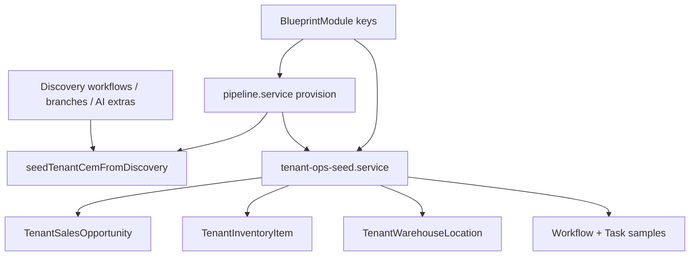
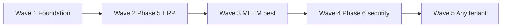

# CEM ERP roadmap — modular “best ERP” for Crow

**Purpose:** Plan how Crow delivers an enterprise-grade, **modular** ERP experience for any tenant — with **MEEM Global** as the logistics lighthouse — without hardcoding every customer in `meem-*` paths.

**Audience:** Muhanad (platform, schema, provision, ERP modules, CyberCrow); **MEEM (Omar)** (customer SAREA acceptance only — not Crow implementation).

**Related:** [`customers/MEEM_GLOBAL.md`](customers/MEEM_GLOBAL.md) · [`PHASES.md`](PHASES.md) · [`GO_LIVE_PIPELINE.md`](GO_LIVE_PIPELINE.md) · [`TEAM_OWNERSHIP.md`](TEAM_OWNERSHIP.md) · [`PLATFORM_STATUS.md`](PLATFORM_STATUS.md)

---

## 1. Vision — “best ERP” for Crow

Crow is **not** a monolithic Odoo-style clone. The “best ERP” story is:

| Principle | Meaning |
|-----------|---------|
| **Blueprint defines** | `BlueprintModule` + discovery `modules.confirmedKeys` decide which CEM modules exist for a tenant. |
| **CEM runs** | Each enabled module gets routes, services, optional sample data, and workflows scoped by `tenantId`. |
| **Chain, not bundle** | Sales → inventory → warehouse → logistics → finance form an **ERP chain** when those keys are enabled — deep links and shared reference codes, not one mega-screen. |
| **CyberCrow + SAREA wrap** | Security posture and role-adaptive UX sit on top; they do not replace ERP data models. |
| **Lighthouse proves it** | MEEM (50–250, logistics) demonstrates the chain at enterprise demo quality; the **same machinery** seeds any new tenant from industry/blueprint packs. |

**Commercial truth:** Pricing is band-based orchestration ([`PRICING.md`](PRICING.md)); ERP modules are **add-on line items** from [`CEM_MODULES`](../src/lib/constants/modules.ts), not “every tenant gets everything.”

---

## 2. Current state — any tenant vs MEEM-only

| Capability | Any tenant (generic) | MEEM-only / lighthouse today |
|------------|----------------------|------------------------------|
| Provision + CEM structure | `pipeline.service` → `seedTenantCemFromDiscovery` (depts, branches, roles, workflows from discovery) | Full pipeline via `prisma/seed-meem.ts` |
| Enabled modules | `OrganizationModule` from `BlueprintModule` | MEEM: sales, logistics, warehouse, inventory, finance, crm, hr (`MEEM_MODULE_KEYS`) |
| HR / CRM | `hr.service`, `crm.service` — CRUD any tenant | Ops samples via `meem-ops.service` |
| Workflows / tasks | DB models + tenant routes | Rich samples + MEEM-specific task titles in catalog |
| **Sales** | `TenantSalesOpportunity` + `sales.service` + `/[tenant]/sales` (module-gated) | MEEM ops seed; `ErpChainLinks` |
| **Inventory** | `TenantInventoryItem` + `inventory.service` | MEEM ops seed; chain links |
| **Warehouse** | `TenantWarehouseLocation` + `warehouse.service` | MEEM ops seed; chain links |
| **Logistics** | `/[tenant]/logistics` module-gated | MEEM OCR/AI cards + shipment pipeline (industry pack) |
| **Finance** | `TenantFinanceEntry` + `finance.service` + `/[tenant]/finance` | MEEM ops seed — **E4** done |
| **Reports** | `/[tenant]/reports` ERP KPI strip | **E6** — tenant-scoped summaries |
| **Procurement** | `TenantPurchaseRequest` + `/[tenant]/procurement` | **E9** — module-gated |
| Discovery templates | `discovery-template.service` + industry packs | MEEM hand-built in seed, not template-only |
| Ops enrichment | `tenant-ops-seed.service` + industry packs | `meem-ops` delegates to tenant-ops (logistics pack); MEEM catalog re-exports pack |
| SAREA ERP nav | Default nav keys | Persona polish incomplete ([`SAREA_OMAR_SCOPE.md`](SAREA_OMAR_SCOPE.md)) |
| Notifications | Logged; Resend deferred | MEEM audit baseline in customer doc |

**Gap in one line:** Tenant **ERP tables, services, and module-gated pages are tenant-scoped** (E1–E9 done). Remaining gaps: **SAREA ERP nav profiles (E11, MEEM acceptance)**, industry packs beyond logistics (E12), and **recorded demo script (E14)**.

---

## 3. Refactor path — `meem-ops` catalog → blueprint-driven seed

### Target architecture



| Step | Today | Target |
|------|-------|--------|
| Catalog | `src/lib/meem/meem-ops-catalog.ts` (re-exports) | `src/lib/erp/industry-packs/logistics.ts`, `retail.ts`, … + `src/lib/constants/erp-module-registry.ts` |
| Enrichment entry | `enrichMeemGlobalOps()` resolves `MEEM_REFERENCE_CODE` | `enrichTenantOps(tenantId, { industryKey, moduleKeys })` called from provision **or** `npm run db:seed:tenant:ops` |
| Provision hook | MEEM re-seed calls ops manually | `pipeline.service` after `seedTenantCemFromDiscovery`: optional `seedTenantOpsFromBlueprint(tenantId, blueprintId)` when `TENANT_OPS_SEED=true` |
| UI components | `MeemSalesHub`, `MeemInventoryHub`, … | `ErpModuleHub` + logistics pack copy; `MeemLogisticsHub` for OCR/AI cards only |
| Page guards | `isMeem = slug === MEEM_TENANT_SLUG` | `hasErpModule(tenant.modules, key)` + logistics industry / `ErpChainLinks` |

### Preserve MEEM as lighthouse

- Keep `npm run db:seed:meem` for one-command demo.
- Implement `enrichMeemGlobalOps` as `enrichTenantOps(..., { industryKey: 'logistics', moduleKeys: MEEM_MODULES })`.
- Move catalog slices into industry pack; **no** customer-specific strings in services except `referenceCode` in seed script.

### Pseudocode — ERP module registry (sketch)

```ts
// src/lib/erp/erp-module-registry.ts (planned)

export type ErpModuleKey =
  | "sales" | "inventory" | "warehouse" | "logistics"
  | "finance" | "procurement" | "crm" | "hr" | "bi";

export type ErpModuleDef = {
  key: ErpModuleKey;
  cemModuleKey: string;           // maps to CEM_MODULES / BlueprintModule
  routeSegment: string;           // sales → /[slug]/sales
  chain: { prev?: ErpModuleKey; next?: ErpModuleKey };
  seed: {
    model: "TenantSalesOpportunity" | "TenantInventoryItem" | "TenantWarehouseLocation" | null;
    packKey: string;              // industry pack slice, e.g. logistics.sales
  } | null;
  navGroup: "erp" | "core" | "security";
};

export const ERP_MODULE_REGISTRY: ErpModuleDef[] = [
  {
    key: "sales",
    cemModuleKey: "sales",
    routeSegment: "sales",
    chain: { next: "inventory" },
    seed: { model: "TenantSalesOpportunity", packKey: "logistics.sales" },
    navGroup: "erp",
  },
  {
    key: "inventory",
    cemModuleKey: "inventory",
    routeSegment: "inventory",
    chain: { prev: "sales", next: "warehouse" },
    seed: { model: "TenantInventoryItem", packKey: "logistics.inventory" },
    navGroup: "erp",
  },
  // warehouse → logistics → finance ...
];

export function enabledErpModules(moduleKeys: string[]): ErpModuleDef[] {
  return ERP_MODULE_REGISTRY.filter((m) => moduleKeys.includes(m.cemModuleKey));
}
```

---

## 4. Phase 5 completion plan — finance, reports, procurement, links

**Status (May 2026):** **Complete for MEEM demo** (M3 ~92%). E1–E9 shipped; E11–E14 remain.

| Workstream | Deliverable | Owner | Status |
|------------|-------------|-------|--------|
| **Finance v1** | `TenantFinanceEntry` + `/[tenant]/finance` | Muhanad | [x] E4 |
| **Reports v1** | ERP KPI strip on `/[tenant]/reports` | Muhanad | [x] E6 |
| **Procurement** | `TenantPurchaseRequest` + route | Muhanad | [x] E9 |
| **Cross-module links** | `ErpChainLinks` on ERP hubs | Muhanad | [x] E5 |
| **Registry + ops seed** | `erp-module-registry`, `tenant-ops-seed` | Muhanad | [x] E1–E3, E7–E8 |
| **SAREA ERP nav** | Nav profiles + executive finance widget | **MEEM (Omar)** validates · Muhanad | [ ] E11 |

**MEEM Phase 5 exit (lighthouse):** [x] Chain routes with DB data, finance/reports/procurement live, deep links registry-driven.

---

## 5. Phase 6 — CyberCrow alignment for logistics tenants

**Status (May 2026):** **~70%** (M4). E10 + core console slice shipped; Entra ops copy and GRC depth open.

| Item | Description | Owner | Status |
|------|-------------|-------|--------|
| Shipment ↔ audit | Logistics workflow → `cybercrowAuditLog` | Muhanad | [x] E10 |
| Tenant audit feed | `/[tenant]/cybercrow/audit-logs` + logistics filter | Muhanad | [x] |
| Platform `/admin/audit` | Cross-tenant log + notification strip + logistics filter | Muhanad | [x] |
| GRC shell | `/[tenant]/cybercrow/grc` data-backed summary | Muhanad | [x] |
| Auditor read-only | `auditor_readonly` + banner + CyberCrow paths | Muhanad | [x] |
| Risk widgets | Dashboard risk card from DB counts | Muhanad | [x] |
| Entra ops narrative | Settings + login copy for production SSO | Muhanad | [ ] |
| OCR compliance depth | POD/BOL retention on document model | Muhanad | [ ] P2 |
| SAREA analyst persona | MEEM (Omar) validates analyst density | MEEM acceptance | [ ] |

**Exit:** MEEM demo shows dispatch/OCR workflow → audit trail in CyberCrow — **rehearse** on live seed ([`PHASE4_MEEM_E2E.md`](PHASE4_MEEM_E2E.md)).

---

## 6. Cross-module UX — ERP nav group & deep links

### ERP navigation group

| Nav group | Keys (SAREA / tenant layout) | Visible when |
|-----------|------------------------------|--------------|
| **Core** | dashboard, tasks, users, modules | always |
| **ERP chain** | sales, inventory, warehouse, logistics, finance, procurement | `TenantModule` enabled |
| **People** | hr, crm | module enabled |
| **Insights** | reports, bi | module enabled |
| **Security** | cybercrow | security package |

Muhanad: expose `getTenantErpNav(tenantId)` from registry and SAREA runtime keys. **MEEM (Omar):** accept persona → ERP nav subset for MEEM demo.

### Deep link matrix (target)

| From | To | Link context |
|------|-----|--------------|
| Sales | Workflows | `workflowName` on opportunity |
| Sales | Logistics | quote/dispatch status |
| Sales | CRM | `crmAccountId` |
| Sales | Finance | `amountSar` → AR line (when finance live) |
| Inventory | Warehouse | `location` → bin |
| Inventory | Logistics | cold-chain / demand forecast |
| Warehouse | Inventory | SKU putaway |
| Warehouse | Workflows | warehouse intake |
| Logistics | Workflows | OCR / route AI |
| Logistics | CyberCrow | anomaly card |
| Finance | Sales / Procurement | open AR/AP |

Implement as shared `ErpChainLinks` component fed by registry `chain.prev/next`.

---

## 7. MEEM “best ERP” checklist — enterprise demo grade

Use for lighthouse rehearsal before any new tenant sales call.

| # | Criterion | Status |
|---|-----------|--------|
| 1 | Blueprint shows logistics module stack + 4 AI extras priced | [x] |
| 2 | Readiness green + tenant-live banner | [x] |
| 3 | ≥4 workflows with real `WorkflowStep` rows | [x] |
| 4 | Sales / inventory / warehouse: stat row + ≥5 rows each, SAR formatted | [x] |
| 5 | Logistics hub: 4 OCR/AI cards + shipment pipeline narrative | [x] |
| 6 | Cross-links: sales→workflows→logistics; inventory→warehouse | [x] |
| 7 | Tasks open list tied to workflow names | [x] |
| 8 | Finance: ledger-lite or AR summary (not empty shell) | [x] |
| 9 | Reports: ERP KPI dashboard strip | [x] |
| 10 | SAREA: exec vs frontline nav/widgets differ on same data | [ ] MEEM (Omar) acceptance |
| 11 | CyberCrow: anomaly/OCR events in tenant audit | [x] |
| 12 | Generic seed path documented (not “run meem script only”) | [x] `tenant-ops-seed`; CLI `db:seed:tenant:ops` |
| 13 | Live E2E without `USE_MOCK_DATA` | [~] rehearse |
| 14 | `sales` in MEEM `moduleKeys` if sold on blueprint | [x] `MEEM_MODULE_KEYS` + align on re-seed |

---

## 8. New tenant playbook — post go-live sample data

After `provisionAndInitializeTenant` succeeds:

| Trigger | Action |
|---------|--------|
| Always | CEM structure from discovery (existing) |
| Always | CyberCrow baseline + SAREA personas (existing) |
| `TENANT_OPS_SEED=true` (dev/staging) | `enrichTenantOps(tenantId)` from blueprint `moduleKeys` + request `industry` |
| Per enabled module | Insert industry-pack samples (idempotent by `tenantId` + `referenceCode`) |
| Never auto in production | Destructive re-seed; ops seed is staging/demo only unless customer opts in |

### Suggested auto-seed by module (demo/staging)

| Module key | Sample data | Pack slice |
|------------|-------------|------------|
| `sales` | 3–5 opportunities/quotes | `logistics.sales` / `retail.sales` |
| `inventory` | 4–6 SKUs | `logistics.inventory` |
| `warehouse` | 3–5 locations | `logistics.warehouse` |
| `logistics` | Feature flags from discovery `aiExtras` | workflows already seeded |
| `crm` | 1 account + 1 contact | `*.crm` |
| `hr` | 2 employees | `*.hr` |
| `finance` | 2 AR + 1 AP placeholder | `*.finance` (Phase 5b) |
| `procurement` | 2 PRs linked to low-stock SKU | `*.procurement` (optional) |
| `bi` / reports | 3 snapshot metrics | `*.reports` |

**CLI:** `npm run db:seed:tenant:ops -- --tenant=meem-global` (alias `--slug=`)

---

## 9. Priority backlog

| ID | Priority | Item | Owner |
|----|----------|------|-------|
| E1 | **P0** | `erp-module-registry` + `getEnabledErpNavItems()` / `getErpChain()` | [x] Muhanad |
| E2 | **P0** | `tenant-ops-seed.service` — extract from `meem-ops.service`; industry pack `logistics` | [x] Muhanad |
| E3 | **P0** | Remove `slug === meem-global` gates on sales/inventory/warehouse pages (module + data driven) | [x] Muhanad |
| E4 | **P0** | Finance v1 model + page (replace shell) | [x] Muhanad |
| E5 | **P0** | `ErpChainLinks` component on all ERP hubs | [x] Muhanad |
| E6 | **P1** | Reports v1 — KPI strip + `/[tenant]/reports` data | [x] Muhanad |
| E7 | **P1** | Provision hook `seedTenantOpsFromBlueprint` (env-gated) | [x] Muhanad |
| E8 | **P1** | Add `sales` to MEEM blueprint modules + seed alignment | [x] Muhanad |
| E9 | **P1** | Procurement route + lite PR model (optional module) | [x] Muhanad |
| E10 | **P1** | CyberCrow logistics audit events (OCR/anomaly) | [x] Muhanad |
| E11 | **P1** | SAREA ERP nav profiles + executive finance widget | **MEEM (Omar)** acceptance · Muhanad implements |
| E12 | **P2** | Retail / healthcare industry packs | Muhanad |
| E13 | **P2** | Update [`PLATFORM_STATUS.md`](PLATFORM_STATUS.md) ERP rows (sales/inventory live) | [x] Muhanad |
| E14 | **P2** | Recorded MEEM ERP demo script in [`DEMO_SCRIPT.md`](DEMO_SCRIPT.md) | Muhanad |

---

## 10. Timeline — ordered waves (no calendar dates)



| Wave | Focus | Outcome |
|------|--------|---------|
| **1 — Foundation** | Registry, tenant-ops-seed, de-MEEM-gate | [x] E1–E3, E7 |
| **2 — Phase 5 ERP** | Finance, reports, procurement, chain links | [x] E4–E6, E8–E9 |
| **3 — MEEM “best”** | Checklist 8–14, live E2E, SAREA acceptance | [~] E11 Omar · E14 demo script |
| **4 — Phase 6 CyberCrow** | E10, dashboard, GRC, auditor UI | [~] ~70% — Entra copy open |
| **5 — Any tenant** | Retail pack, second-customer playbook | [ ] E12 |

**Parallel track (MEEM / Omar):** SAREA ERP nav + persona acceptance — starts Wave 2, completes Wave 3. **Muhanad** ships Crow runtime/config.

**Deferred (unchanged):** Resend / Phase Cloud; Stripe Phase 10.

---

## Cross-references

| Topic | Document |
|-------|----------|
| MEEM lighthouse | [`customers/MEEM_GLOBAL.md`](customers/MEEM_GLOBAL.md) |
| Delivery phases | [`PHASES.md`](PHASES.md) § Phase 5–7 |
| Go-live order | [`GO_LIVE_PIPELINE.md`](GO_LIVE_PIPELINE.md) |
| Omar scope | [`SAREA_OMAR_SCOPE.md`](SAREA_OMAR_SCOPE.md) |
| Module catalog | [`PRICING.md`](PRICING.md), `src/lib/constants/modules.ts` |

---

*Planning doc — May 2026. Milestones: [`MILESTONES.md`](MILESTONES.md). E1–E10 done; E11–E14 + Phase 6 remainder tracked in Phase 5–7 checkboxes.*
