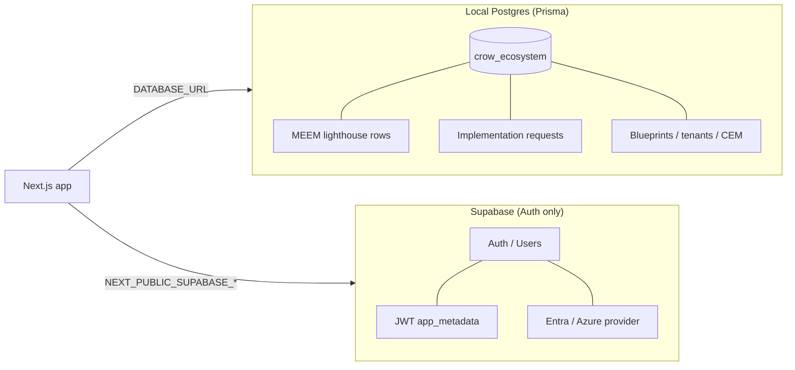

# Hybrid setup: local Postgres + Supabase Auth (Option B)

**Recommended for day-to-day development:** organizational data lives in **local PostgreSQL** (`crow_ecosystem`); **Supabase** handles **identity only** (login, sessions, JWT roles, Entra SSO). Prisma never points at Supabase Postgres in this mode.

**Related:** [`LOCAL_POSTGRES_SETUP.md`](LOCAL_POSTGRES_SETUP.md) · [`PRISMA_DB_PUSH.md`](PRISMA_DB_PUSH.md) · [`BASELINE.md`](BASELINE.md) · [`.env.example`](../.env.example)

---

## Two systems (mental model)



| System | Role | What it stores |
|--------|------|----------------|
| **Local Postgres** | Organizational memory | ~74 Prisma tables: requests, discovery, blueprints, tenants, CEM, CyberCrow, SAREA, MEEM seed data |
| **Supabase** | Identity & session | Users, passwords, OAuth identities, `app_metadata.crow_role`, `tenant_slugs` |

There is **no** shared user table between them. A row in `profiles` (Prisma) is not the same as a Supabase Auth user. Login validates against Supabase; business logic reads/writes Prisma against local `crow_ecosystem`.

---

## What each layer uses

| Layer | Package / client | Environment | Connects to |
|-------|------------------|-------------|-------------|
| **Prisma** | `@prisma/client` via `src/lib/db.ts` | `DATABASE_URL`, `DIRECT_URL` | Local `localhost:5432/crow_ecosystem` |
| **App auth (browser + server)** | `@supabase/ssr` — `src/lib/supabase/client.ts`, `server.ts`, `middleware.ts` | `NEXT_PUBLIC_SUPABASE_URL`, `NEXT_PUBLIC_SUPABASE_ANON_KEY` (or publishable key) | Supabase Auth API only |
| **Admin scripts** | `@supabase/supabase-js` (service role) | `SUPABASE_SERVICE_ROLE_KEY` + URL | Supabase Auth Admin API (`auth:bootstrap`, `auth:grant-role`, etc.) |

Prisma schema (`prisma/schema.prisma`) binds the datasource to `env("DATABASE_URL")` and `env("DIRECT_URL")`. It does not use Supabase client libraries.

---

## `.env` variable map (Option B)

Copy from [`.env.example`](../.env.example) — **Option B (recommended hybrid)** block.

| Variable | Purpose | Points to |
|----------|---------|-----------|
| `DATABASE_URL` | Prisma runtime queries | **Local** `localhost:5432/crow_ecosystem` |
| `DIRECT_URL` | `prisma db push`, migrations, transactions | Same local database |
| `NEXT_PUBLIC_SUPABASE_URL` | Auth client (browser + server) | `https://<project-ref>.supabase.co` |
| `NEXT_PUBLIC_SUPABASE_ANON_KEY` | Public anon/publishable key | Supabase Dashboard → API |
| `SUPABASE_SERVICE_ROLE_KEY` | **Server/scripts only** — never expose to browser | Bootstrap, grant-role, list-users |
| `AUTH_DISABLED` | `false` for real login; `true` only for UI-only demos | — |
| `USE_MOCK_DATA` | Optional pipeline mocks (independent of DB host) | — |
| `AZURE_SSO_ENABLED` | Optional Entra button + OAuth | Requires Azure provider in Supabase Dashboard |
| `NEXT_PUBLIC_AZURE_TENANT_ID` | Entra tenant hint for OAuth | Azure directory ID (sample `TENANT_ID`) |
| Azure redirect in Portal | **Not** `localhost/auth/callback` | `https://<ref>.supabase.co/auth/v1/callback` — see [`ENTRA_SSO.md`](ENTRA_SSO.md) |

**Do not** set `DATABASE_URL` to a `*.supabase.co` host when using Option B. That would send Prisma to cloud Postgres while you maintain data locally — two databases, easy confusion.

---

## Daily workflow

1. **Schema & data (local)** — from repo root, with local URLs in `.env`:
   ```bash
   npm run db:validate
   npm run db:push
   npm run db:seed
   npm run db:seed:meem    # optional MEEM lighthouse on local DB
   ```
2. **Auth (Supabase)** — `AUTH_DISABLED=false`, real Supabase keys in `.env`:
   ```bash
   npm run auth:bootstrap   # first platform admin
   npm run dev
   ```
   Sign in at `http://localhost:3000/login`.
3. **Inspect organizational data** — pgAdmin → **Crow Local** → `crow_ecosystem` → Tables, or `npm run db:studio`.
4. **Inspect users & SSO** — [Supabase Dashboard](https://supabase.com/dashboard) → Authentication → Users; Providers (Email, Azure); URL configuration (`http://localhost:3000/auth/callback`).

**Health check:** `GET http://localhost:3000/api/health` → expect `"db":"ok"` and `"auth":"configured"` (or `"disabled"` if demo mode).

**Env sanity:** `npm run env:check` — prints hosts only, no secrets; warns if `DATABASE_URL` looks like Supabase while using hybrid.

---

## Task → where to do it

| Task | Where |
|------|--------|
| Create / alter tables (schema) | Local: `npm run db:push` or migrations — [`PRISMA_DB_PUSH.md`](PRISMA_DB_PUSH.md) |
| Seed demo pipeline / MEEM | Local: `npm run db:seed`, `npm run db:seed:meem` |
| Browse implementation requests, blueprints | pgAdmin or Prisma Studio (`npm run db:studio`) |
| Create login user, reset password | Supabase Dashboard → Authentication → Users, or `npm run auth:bootstrap` |
| Set `crow_role` / `tenant_slugs` | `npm run auth:grant-role` / `auth:bootstrap` (service role) |
| Enable Email / Azure SSO | Supabase Dashboard → Authentication → Providers |
| Fix redirect / callback errors | Supabase → URL configuration; app route `/auth/callback` |
| UI-only demo (no login) | `.env`: `AUTH_DISABLED=true` — see [`BASELINE.md`](BASELINE.md) |
| Verify config without leaking secrets | `npm run env:check` |

---

## MEEM on local DB + roles via bootstrap

MEEM lighthouse data is **Prisma-only** (local `crow_ecosystem`):

```bash
npm run db:push
npm run db:seed:meem
```

That does **not** create a Supabase login. For a real MEEM admin session:

```powershell
$env:PLATFORM_ADMIN_EMAIL="admin@yourorg.com"
$env:PLATFORM_ADMIN_PASSWORD="choose-a-strong-password"
npm run auth:bootstrap
```

Or grant an existing Entra user after first sign-in:

```powershell
$env:USER_EMAIL="you@org.com"
$env:CROW_ROLE="platform_admin"
npm run auth:grant-role
```

See [`customers/MEEM_GLOBAL.md`](customers/MEEM_GLOBAL.md) for mock IDs when `USE_MOCK_DATA=true`.

---

## Troubleshooting

### Invalid login credentials (email/password)

- User does not exist in **Supabase Auth**, or password is wrong.
- Prisma seed users are **not** login accounts.
- Fix: Supabase Dashboard → add user, or `npm run auth:bootstrap` with `PLATFORM_ADMIN_EMAIL` / `PLATFORM_ADMIN_PASSWORD`.

### Sign-in could not be completed (`?error=auth_callback`)

- OAuth code exchange failed, IdP returned an error, or redirect URLs do not match.
- **Azure App Registration** redirect URI must be `https://<PROJECT_REF>.supabase.co/auth/v1/callback` (not the app URL, not the ms-identity sample's `/auth/redirect`).
- **Supabase** → URL configuration — Site URL `http://localhost:3000`; Redirect URLs include exactly `http://localhost:3000/auth/callback` (Crow stores `next` in a cookie so `redirectTo` has no query string).
- Enable Azure provider with client ID/secret from the same app registration — [`ENTRA_SSO.md`](ENTRA_SSO.md), reference sample [`archive/ms-identity-node-main/README-CYBERCROW.md`](../archive/ms-identity-node-main/README-CYBERCROW.md).

### No Crow access (`?error=no_role`)

- User exists in Supabase but JWT lacks `app_metadata.crow_role`.
- Fix: `npm run auth:grant-role` or `auth:bootstrap` for that email.

### `db: ok` but login fails

- Common hybrid mistake: local DB healthy, Supabase keys missing or still `[PROJECT_REF]` placeholders.
- Run `npm run env:check` and confirm `AUTH_DISABLED=false` for real auth.

### Prisma errors but login works

- `DATABASE_URL` not local, Postgres service stopped, or schema not pushed — see [`LOCAL_POSTGRES_SETUP.md`](LOCAL_POSTGRES_SETUP.md).

More detail: [Login troubleshooting in LOCAL_POSTGRES_SETUP.md](LOCAL_POSTGRES_SETUP.md#login-troubleshooting).

---

## Path to production (optional)

You can **later** move Prisma to Supabase Postgres **without changing** the auth integration:

1. In Supabase Dashboard → Database → connection strings, set pooler URL on `DATABASE_URL` and session URL on `DIRECT_URL` ([`.env.example`](../.env.example) Supabase block).
2. Run `npm run db:migrate:deploy` or `db push` against the cloud database.
3. Keep the same `NEXT_PUBLIC_SUPABASE_*` project — users and roles stay in Supabase Auth.

Auth URLs and middleware stay the same; only Prisma connection strings change.

---

## Architecture guarantees (read-only)

Verified in codebase:

- **Prisma** uses only `DATABASE_URL` / `DIRECT_URL` from `prisma/schema.prisma` and `src/lib/db.ts`.
- **Supabase SSR** uses only `NEXT_PUBLIC_SUPABASE_*` (and optional publishable key alias) in `src/lib/supabase/*`.
- **No dual-write:** services use Prisma for domain data; Supabase clients are used for `getUser()`, sign-in/out, and admin user metadata — not for storing implementation requests or blueprints in Supabase Postgres from app code.
- **Service role** is confined to scripts (`scripts/bootstrap-platform-admin.ts`, `grant-crow-role.ts`, etc.) and server-side admin helpers that call Supabase Auth Admin API — not for routine page loads.
