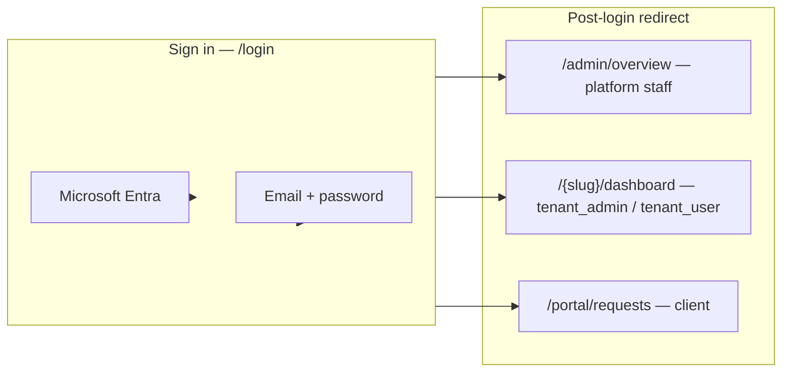

# Identity model — one login, three hallways

**Audience:** Product, engineering, and customer success.

Crow uses **one Supabase Auth user per person** (Microsoft Entra SSO or issued email/password). The same account can move from **client** (track implementation requests) to **tenant member** (live workspace) without creating a second login.

---

## Three hallways after sign-in



| Hallway | `crow_role` | Landing route | Who |
|---------|-------------|---------------|-----|
| **Crow platform** | `platform_admin`, `implementer` | `/admin/overview` | Delivery team |
| **Tenant workspace** | `tenant_admin`, `tenant_user` + `tenant_slugs[]` | `/{firstSlug}/dashboard` | Customer employees after go-live |
| **Client portal** | `client` (or email-linked requests) | `/portal/requests` | Request submitters before / beside tenant access |

Resolution lives in `src/lib/auth/post-login-redirect.ts` and runs from `/auth/callback` and the email sign-in action.

---

## First-time customer flow

1. Submit **`/request`** (public) with work email on the contact record.
2. **Sign in with Microsoft** using the **same email** (or use issued credentials).
3. On first successful auth, `linkRequestsForUser()` matches `user.email` to `RequestContact.email` (primary, case-insensitive) and sets `ImplementationRequest.submittedByUserId`.
4. If no `crow_role` was assigned yet but matching requests exist, metadata is upgraded to **`client`** (when `SUPABASE_SERVICE_ROLE_KEY` is set) and the user lands on **`/portal/requests`**.

Confirmation on `/request` includes **Sign in to track** → `/login?next=/portal/requests`.

---

## Promotion to tenant user (no second account)

When a tenant is provisioned, platform staff use **Invite as tenant user** on the admin request detail (when a blueprint has a linked tenant):

- Calls `promoteClientToTenantUserByEmail()` → `grantTenantAccess()` pattern.
- Updates `app_metadata`: `crow_role` → `tenant_admin` or `tenant_user`, adds `tenant_slugs`.
- Same Supabase user id; client portal access is superseded by tenant workspace routes.

Manual bootstrap:

```bash
USER_EMAIL=sponsor@customer.com CROW_ROLE=client npm run auth:grant-client
# After go-live:
USER_EMAIL=sponsor@customer.com CROW_ROLE=tenant_user TENANT_SLUG=acme-demo npm run auth:grant-role
```

---

## Metadata contract (`app_metadata` only)

| Field | Purpose |
|-------|---------|
| `crow_role` | `platform_admin` \| `implementer` \| `tenant_admin` \| `tenant_user` \| **`client`** |
| `tenant_slugs` | Workspace slugs for tenant roles |
| `linked_request_ids` | Optional cache; requests are also resolved by contact email |

Never authorize from `user_metadata` (user-editable). See Supabase security guidance in [`PHASE2_AUTH.md`](PHASE2_AUTH.md).

---

## Dev modes

| Env | Behavior |
|-----|----------|
| `AUTH_DISABLED=true` | Synthetic user; set `AUTH_DEV_ROLE=client` for portal demos |
| `USE_MOCK_DATA=true` | Portal lists `mock-req-001` for any signed-in / bypass session |
| `SUPABASE_SERVICE_ROLE_KEY` | Required to auto-grant `client` on email link |

---

## Related docs

- [`ROLES_AND_WORKFLOW.md`](ROLES_AND_WORKFLOW.md) — route guard table
- [`PHASE2_AUTH.md`](PHASE2_AUTH.md) — Entra + bootstrap
- [`PAGE_DESIGNS.md`](PAGE_DESIGNS.md) — portal wireframes
- [`PHASES.md`](PHASES.md) — Phase 7b delivery checklist
