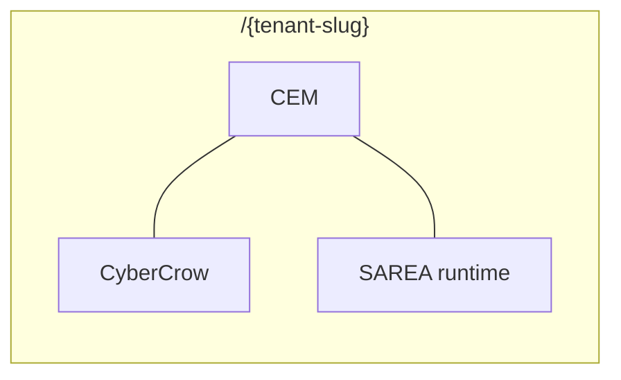

# Multi-tenant architecture

**Crow Ecosystem** — reference multi-tenant platform built to demonstrate SecDevOps and governed AI in a real application shape.

---

## Model

```text
Platform layer          /admin  /discovery  /blueprints  /sarea
        │
        ├── Tenant A    /acme-corp/*
        ├── Tenant B    /meem-global/*
        └── Tenant C    /{slug}/*
```

Each tenant is an **organization workspace** with:

- CEM modules (blueprint-selected)
- CyberCrow console (`/{slug}/cybercrow/*`)
- SAREA runtime on dashboard (persona-adapted)

---

## Isolation principles

| Concern | Approach |
|---------|----------|
| Routing | Tenant slug in URL path |
| Data | PostgreSQL rows scoped by tenant / org IDs |
| Auth | Membership + `tenant_slugs` in app metadata |
| RBAC | Platform roles vs tenant roles |
| Audit | Platform audit vs tenant CyberCrow logs |

Detailed schema and service isolation patterns are implementation details — public readers see **boundaries**, private repo holds **full Prisma models**.

---

## Three engines, one slug

Multi-tenancy is not three separate apps. After go-live:



---

## Provisioning lifecycle (conceptual)

Tenants are born from a **governed pipeline**, not manual SQL:

```text
Request → Discovery → Blueprint → Proposal → Go-live → /{slug}/dashboard
```

Readiness gates validate modules, RBAC baseline, CyberCrow seed intent, and SAREA mappings before provision. **Internal provision order is private.**

See [`LIFECYCLE.md`](LIFECYCLE.md).

---

## Demo paths

| Mode | Command | Notes |
|------|---------|-------|
| Mock multi-tenant UI | `USE_MOCK_DATA=true` | No Postgres |
| Live tenant | `db:seed` + lighthouse seed | Local Postgres |

Public demos use **mock IDs** (`mock-req-meem`, `meem-global`) — not production customer data.

---

## Stack

- **Next.js 15** App Router — route groups for public, admin, tenant
- **Prisma** — ~74 models, PostgreSQL
- **Supabase Auth** — sessions; Entra for enterprise SSO

---

## Why multi-tenant matters for this portfolio

SecDevOps and AI only matter at scale when **isolation, audit, and role boundaries** are real. This project is the proof — not a single-tenant demo app with a `tenantId` comment.

---

## Related

- [`SECDEVOPS.md`](SECDEVOPS.md)
- [`AI_PLATFORM.md`](AI_PLATFORM.md)
- [`ARCHITECTURE.md`](ARCHITECTURE.md)
- [`PLATFORM_ENGINES.md`](PLATFORM_ENGINES.md)
