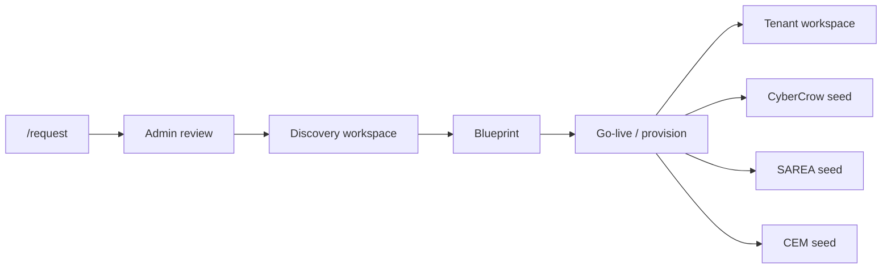

# Crow Ecosystem — platform status

**Last updated:** May 2026  
**Golden rule:** Discovery understands → Blueprint defines → CEM runs → CyberCrow protects → SAREA adapts.

This document is the single source of truth for **what is built today** vs **what is still a shell**. Phase-by-phase detail: [`archive/PHASE1_PIPELINE.md`](archive/PHASE1_PIPELINE.md) … [`PHASE8.md`](archive/PHASE8.md). Forward plan: [`PHASES.md`](PHASES.md) · milestones: [`MILESTONES.md`](MILESTONES.md) · progress: [`PROJECT_STATUS.md`](PROJECT_STATUS.md).

**ERP (May 2026):** Sales, inventory, warehouse, logistics, finance, reports, procurement are **data-backed** when modules enabled + ops seed ([`ERP_ROADMAP.md`](ERP_ROADMAP.md) E1–E9). CyberCrow logistics audit (E10), GRC summary, `auditor_readonly` UI shipped (M4 ~70%).

---

## Stack (production path)

| Layer | Technology |
|-------|------------|
| App | Next.js 15 App Router, React 19, TypeScript |
| Styling | Tailwind CSS (CyberCrow tokens) |
| Database | PostgreSQL (Supabase), Prisma ORM |
| Auth | Supabase Auth — email/password + **Entra ID** (`AZURE_SSO_ENABLED`); roles in `app_metadata` |
| Dev (DB paused) | [`DEV_WITHOUT_DB.md`](DEV_WITHOUT_DB.md) — `AUTH_DISABLED`, local Postgres, safe backlog |
| Billing | Stripe **scaffold** only — [`STRIPE_BILLING.md`](STRIPE_BILLING.md), `billing.service.ts` |
| UI / theme | **North-star Crow** design system — [`DESIGN_SYSTEM.md`](DESIGN_SYSTEM.md), `AreaShell`, public site |
| Validation | Zod (API + forms) |

**Environment:** see [`.env.example`](../.env.example) and [`SUPABASE_SETUP.md`](SUPABASE_SETUP.md).

**Windows dev note:** `npm run dev` / `build` use `node --use-system-ca` to avoid Supabase TLS `UNABLE_TO_VERIFY_LEAF_SIGNATURE`. Use the project base URL for Supabase (`https://<ref>.supabase.co`), not `/rest/v1/`.

**Schema workflow today:** `npx prisma db push` (prototyping). Production should move to `prisma migrate` — see roadmap.

---

## Phase completion

| Phase | Focus | Status | Doc |
|-------|--------|--------|-----|
| 1 | Implementation pipeline (request → discovery → blueprint → tenant) | **Done** | [`archive/PHASE1_PIPELINE.md`](archive/PHASE1_PIPELINE.md) |
| 2 | Supabase authentication & route guards | **Done** | [`archive/PHASE2_AUTH.md`](archive/PHASE2_AUTH.md) |
| 3 | Admin hubs, tenant dashboard polish, scoped services | **Done** | [`archive/PHASE3.md`](archive/PHASE3.md) |
| 4 | CEM identity, membership, discovery → tenant seed | **Done** | [`archive/PHASE4.md`](archive/PHASE4.md) |
| 5 | SAREA studio, HR/CRM modules, invites, blueprint tabs | **Done** | [`archive/PHASE5.md`](archive/PHASE5.md) |
| 6 | Migrations, notifications, admin/discovery shells, CyberCrow modules | **Done** | [`archive/PHASE6.md`](archive/PHASE6.md) |
| 7 | Diagram alignment: readiness, SAREA runtime, CyberCrow enforce, commercial, health | **Complete** | [`archive/PHASE7.md`](archive/PHASE7.md) |
| 8 | CI/CD, readiness gate, retail template | **Partial** | [`archive/PHASE8.md`](archive/PHASE8.md) |

**North star:** [`ARCHITECTURE_DIAGRAM.md`](ARCHITECTURE_DIAGRAM.md)

---

## End-to-end pipeline (what works)

1. **Public** — `POST /api/implementation-requests` or `/request` form → `PENDING_REVIEW`
2. **Admin** — approve, start discovery
3. **Discovery** — organization, modules, departments, branches, roles, workflows, security, summary → complete
4. **Blueprint** — auto-created; overview syncs modules; approve + provision
5. **Provision** — `pipeline.service.ts`: tenant org, modules, CyberCrow baseline, SAREA personas, CEM structure from discovery
6. **Access** — platform staff via Supabase role; tenant users via `tenant_memberships` + `auth:grant-tenant`

Automated check: `npm run smoke:phase1`

---

## Routes with real data (implemented)

### Public portal

| Route | Notes |
|-------|--------|
| `/` | Marketing home |
| `/modules`, `/pricing`, `/security` | Product pages |
| `/request` | Implementation request wizard + API |

Shell only: `/about`, `/architecture`, `/services`, `/clients`, `/industries`, `/case-studies`, `/loyalty-programs`

### Auth

| Route | Notes |
|-------|--------|
| `/login` | Email/password + optional **Microsoft Entra ID** (`AZURE_SSO_ENABLED`) |
| `/auth/callback`, `/auth/signout` | Session handling |

### Crow Admin (`requirePlatformStaff`)

| Route | Notes |
|-------|--------|
| `/admin/overview` | Platform identity cards |
| `/admin/requests` | DB-backed list (fallback UI on DB error) |
| `/admin/requests/[id]` | Detail, approve/reject, start discovery |
| `/admin/discovery` | Active discovery requests |
| `/admin/blueprints` | Enterprise blueprints list |
| `/admin/tenants` | Provisioned tenants |
| `/admin/tenants/[id]` | Detail, modules, memberships, **grant access** form |

| `/admin/domains` | Platform engine catalog |
| `/admin/audit` | CyberCrow logs + email notification log |
| `/admin/integrations` | Integration connections |
| `/admin/subscriptions` | Plans + tenant subscriptions |
| `/admin/security-baselines` | Security package catalog |

### Discovery workspace

| Route | Notes |
|-------|--------|
| `/discovery/[id]/organization` | Save org profile |
| `/discovery/[id]/modules` | Module selection |
| `/discovery/[id]/departments`, `/branches`, `/roles`, `/workflows` | Structure CRUD |
| `/discovery/[id]/security` | Security requirements |
| `/discovery/[id]/summary` | Complete discovery → blueprint |

| `/discovery/[id]/identity` | IdP / MFA preferences |
| `/discovery/[id]/integrations` | Integration CRUD |
| `/discovery/[id]/experience` | SAREA persona requirements |

### Enterprise Blueprint

| Route | Notes |
|-------|--------|
| `/blueprints/[id]/overview` | Status, modules, approve, go-live |

| `/blueprints/[id]/cem`, `/cybercrow`, `/sarea`, `/go-live` | Dedicated tabs with live data / provision |
| `/blueprints/[id]/readiness` | **Diagram go-live checklist** — automated + manual checks |

Shell only: `/blueprints/[id]/identity`, `/integrations`

### CEM tenant workspace (`requireTenantAccess`)

| Route | Notes |
|-------|--------|
| `/[tenant]/dashboard` | Workspace summary — **SAREA-adaptive** widgets by persona |
| `/[tenant]/modules` | Enabled modules |
| `/[tenant]/users` | Profiles, **invite**, **CEM role assign/remove** (`cem.roles.manage`) |
| `/[tenant]/departments`, `/roles`, `/workflows` | CEM structure |
| `/[tenant]/hr` | Employee list, add, inline edit |
| `/[tenant]/crm` | Accounts + contacts CRUD |
| `/[tenant]/cybercrow/dashboard` | Security summary counts |

| `/[tenant]/branches` | Branch list |
| `/[tenant]/cybercrow/incidents`, `/risk`, `/compliance`, `/grc`, `/audit-logs` | CyberCrow data — **GRC** summary from DB counts; **audit-logs** logistics filter |
| `/[tenant]/sales`, `/inventory`, `/warehouse`, `/logistics`, `/finance` | ERP modules — `*.service` + ops seed; `ErpChainLinks` when enabled |
| `/[tenant]/procurement` | Purchase requests (module-gated) — **E9** |
| `/[tenant]/reports` | ERP KPI strip — **E6** |
| `/[tenant]/tasks` | DB task list linked to workflows (MEEM ops seed) |

Partial / polish: deeper `/cybercrow/*` analytics; Entra ops copy on **Settings** `/[tenant]/settings` (MFA/IdP from discovery)

### SAREA Experience Studio (`requirePlatformStaff`)

| Route | Notes |
|-------|--------|
| `/sarea/overview` | Studio metrics + persona breakdown |
| `/sarea/profiles` | All experience profiles |
| `/sarea/layouts`, `/role-mapping`, `/widgets`, `/rules`, `/device-rules` | List + inline edit |
| `/sarea/navigation` | Read navigation configs |
| `/sarea/preview` | Aggregate preview |

---

## Services layer (`src/lib/services/`)

| Service | Responsibility |
|---------|----------------|
| `implementation-request.service` | Create, list, get, reject requests |
| `discovery.service` | Discovery context, answers, dept/branch/role/workflow/security CRUD |
| `discovery-template.service` | Industry templates: logistics, retail, healthcare |
| `pricing.service` | Monthly SAR estimate from plan + modules + security |
| `commercial.service` | Proposal token, send/approve, estimate refresh |
| `tenant-health.service` | Admin workspace health (incidents, audit, members) |
| `tenant-security-settings.service` | MFA/IdP display from discovery on tenant settings |
| `tenant-role.service` | CEM profile ↔ role assign/remove + audit log |
| `blueprint.service` | Get/list blueprints |
| `pipeline.service` | Start discovery, complete → blueprint, provision tenant, CyberCrow + SAREA init |
| `tenant.service` | Slug lookup, list tenants, workspace summary |
| `tenant-identity.service` | Tenant-scoped CEM reads (depts, roles, profiles, workflows) |
| `tenant-cem-seed.service` | Copy discovery → tenant on provision |
| `membership.service` | `TenantMembership`, grant access (UI + email helper) |
| `sarea.service` | Platform SAREA lists, studio summary, inline updates |
| `sarea-seed.service` | Default SAREA children on provision; backfill script |
| `sarea-runtime.service` | Tenant nav/widgets/density per role + persona |
| `cybercrow-policy.service` | Policy enforcement + `POLICY_DENIED` audit |
| `readiness.service` | Blueprint go-live checklist |
| `hr.service` | Tenant-scoped employee CRUD |
| `crm.service` | Tenant-scoped accounts and contacts CRUD |

All exported from `src/lib/services/index.ts`.

---

## Auth & tenancy model

| `crow_role` (app_metadata) | Access |
|----------------------------|--------|
| `platform_admin` | Full platform + all tenants |
| `implementer` | Same as platform admin |
| `tenant_admin` / `tenant_user` | Slugs in `tenant_slugs` + row in `tenant_memberships` |

**Bootstrap platform admin:** `npm run auth:bootstrap`  
**Grant tenant access:** admin tenant page or `npm run auth:grant-tenant`  
**Local bypass (dev only):** `AUTH_DISABLED=true`

Details: [`PHASE2_AUTH.md`](PHASE2_AUTH.md)

---

## NPM scripts (operational)

| Script | Purpose |
|--------|---------|
| `npm run dev` | Dev server (system CA for TLS) |
| `npm run build` / `typecheck` / `lint` | CI-quality checks |
| `npm run smoke:phase1` | E2E pipeline smoke (creates test tenant) |
| `npm run auth:bootstrap` | First platform admin |
| `npm run auth:grant-tenant` | Link Supabase user to tenant |
| `npm run cem:backfill-seed` | Seed CEM for tenants provisioned before Phase 4 |
| `npm run sarea:backfill-seed` | Seed SAREA layouts/rules for older tenants |
| `npm run audit:src` / `fix:src` | JSX hygiene (invalid tag audit) |

---

## Database

- **Schema:** `prisma/schema.prisma` — request, discovery, blueprint, tenant/CEM, CyberCrow, SAREA, subscriptions, integrations
- **Apply:** `npx prisma db push` (current); migrate for production later
- **Transactions:** `prismaTransaction()` in `src/lib/db.ts` uses `DIRECT_URL` (port 5432) for interactive transactions through PgBouncer

---

## Legacy prototype

[`archive/HTML_proc/`](../archive/HTML_proc/) — original static HTML/CSS/JS MVP (design reference, localStorage demo). The Next.js app is the active platform; not wired to Supabase.

---

## Related docs

| Document | Purpose |
|----------|---------|
| [`ROADMAP.md`](ROADMAP.md) | What to build next (prioritized) |
| [`GAP_AUDIT.md`](GAP_AUDIT.md) | Spec vs implementation gaps |
| [`CROW_ECOSYSTEM.md`](CROW_ECOSYSTEM.md) | Architecture & domain map |
| [`SUPABASE_SETUP.md`](SUPABASE_SETUP.md) | Project setup, keys, SSL |
| [`DISCOVERY_ENGINE.md`](DISCOVERY_ENGINE.md) | Discovery domain design |
| [`DEMO_SCRIPT.md`](DEMO_SCRIPT.md) | Demo walkthrough |
