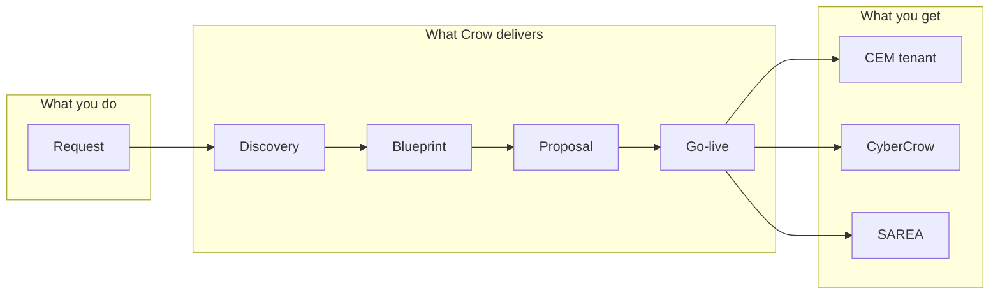

# Crow Ecosystem — Customer product narrative

**Purpose:** Single source for **customer-facing** story vs **internal** architecture. Guides public pages (`/`, `/about`, `/modules`, `/architecture`) and discovery/blueprint copy tone.

**Related:** [`ARCHITECTURE_DIAGRAM.md`](ARCHITECTURE_DIAGRAM.md) (10 layers, 13 steps — internal) · [`CORE_PRODUCT_FLOW.md`](CORE_PRODUCT_FLOW.md) · [`ROLES_AND_WORKFLOW.md`](ROLES_AND_WORKFLOW.md) · [`PAGE_DESIGNS.md`](PAGE_DESIGNS.md) § Customer narrative constraints

---

## Customer-simple architecture

Customers see **three engines** and **one delivery pipeline** — not the ten internal architecture layers.

| Engine | Customer promise | Color |
|--------|------------------|-------|
| **CEM** | Runs the organization — HR, CRM, finance, logistics, and operational modules | Cyan |
| **CyberCrow** | Protects the organization — NCA-aware security, compliance, audit, identity | Violet |
| **SAREA** | Adapts the experience — role-appropriate dashboards and navigation | Rose |

**Delivery pipeline (customer language):**

**One sentence:** Submit a **Request** → we run **Discovery** and build your **Blueprint** (with transparent pricing) → you approve the **Proposal** → **Go-live** activates CEM, CyberCrow, and SAREA on your tenant.

Code constants: `PLATFORM_IDENTITIES` (cem, cybercrow, sarea), `FULL_PLATFORM_LIFECYCLE` (condensed public strip), `PLATFORM_LIFECYCLE` (internal checklist).

---

## Internal vs customer-facing content

| Topic | Customer-facing (public / proposal) | Internal only (engineering / sales engineering) |
|-------|-------------------------------------|---------------------------------------------------|
| Architecture depth | 3 engines + Request → Blueprint → Go-live | 10 layers in [`ARCHITECTURE_DIAGRAM.md`](ARCHITECTURE_DIAGRAM.md) |
| Engine numbering | None, or “three engines” | `PLATFORM_ENGINES` 01–10 |
| Lifecycle length | 5–8 milestone labels (request, discovery, blueprint, pricing, go-live) | 13-step diagram + `PLATFORM_LIFECYCLE` (10 items) |
| Discovery / blueprint | “We learn your org and define digital DNA” | Step keys, Prisma models, `discovery.service.ts` |
| Modules catalog | Module names, talent profiles, optional add-ons | `CEM_MODULES[].key` — **stable keys** for provisioning |
| AI | Optional **extra services** — scoped statements | Implementation backlog, not core SLA |
| Departments | Crow CyberCrow · SAREA · Platform delivery teams | `DeptChips`, `assignedDepts`, pipeline ownership |
| NCA / cyber | “NCA-aligned packages” on `/security` | Control keys `NCA-ECC-*`, auditor routes |

**Rule:** If copy appears on `/architecture` or homepage hero, it must pass the **three engines + pipeline** test. Link engineers to `ARCHITECTURE_DIAGRAM.md` from docs index, not from public footer as primary story.

---

## Models & talent profiles matrix

**Models** = CEM modules (`CEM_MODULES`) plus security packages and SAREA experience tiers. **Talent profiles** = who benefits most (workshop personas + SAREA keys). Modules are **talent-adaptive** via SAREA at runtime; the table below is **marketing positioning** until research backlog completes.

| Module (`key`) | Talent profiles (primary) | Optional extra |
|----------------|---------------------------|----------------|
| `iam` | Operations manager · Security / IT | Entra SSO setup (service) |
| `hr` | HR · Operations manager | — |
| `finance` | Finance · Executive | AI assist — reporting (extra) |
| `inventory` | Operations · Warehouse | — |
| `warehouse` | Warehouse · Operations | — |
| `logistics` | Logistics · Operations | — |
| `sales` | Sales · Executive | — |
| `crm` | Sales · Customer success | — |
| `procurement` | Procurement · Finance | — |
| `projects` | Project manager · Operations | — |
| `bi` | Executive · Finance | AI insights pack (extra) |
| `documents` | All roles · Compliance | — |
| `approvals` | Manager · Executive | — |

**Security packages** (`SECURITY_PACKAGES`): position for **Security / IT**, **Compliance**, **Executive** (posture summary).

**SAREA packages** (`sarea-packages.ts`): position by **persona count** — executive / manager / frontline density.

**More models as add-ons:** Additional CEM modules or industry packs can be sold as **extra services** without changing core tier promise on `/pricing`.

Implementation reference: `src/lib/constants/module-talent-profiles.ts` (used on `/modules`).

---

## AI as extra services

**Positioning**

- Core promise on homepage and `/request`: **orchestrated enterprise platform** (CEM + CyberCrow + SAREA), not “AI-first ERP.”
- AI capabilities are **optional extra services** — workflow assist, document intelligence, executive summaries, discovery assist — quoted in blueprint commercial, not implied in base subscription alone.

**Disclaimers (public-safe)**

- Outputs are assistive; human approval remains for financial, HR, and compliance actions.
- Data residency and tenant isolation follow existing CyberCrow / tenant boundaries.
- Features vary by package and discovery scope.

**NCA / cyber alignment**

- AI extras that touch security or compliance content must stay **inside CyberCrow policy** and audit trails — no shadow IT copilots bypassing `cybercrow-policy.service.ts`.
- Marketing may say “NCA-aware ecosystem”; detailed control mapping stays on `/security` and CyberCrow console, not overstated on homepage.

Constants: `src/lib/constants/extra-services.ts`.

---

## Research backlog

| ID | Task | Owner | Output |
|----|------|-------|--------|
| RES-01 | **Research all marketable models** — map every `CEM_MODULES` + security + SAREA tier to **multiple talent profiles** (≥2 per module where credible) | Product | Update matrix above + `/modules` tags |
| RES-02 | Competitive positioning per industry template (logistics, retail, healthcare, holding, public, energy) | Product | [`MARKETING_INDUSTRIES`](../../src/lib/constants/marketing.ts) refresh |
| RES-03 | Extra-services SKU list (AI + implementation accelerators) with SAR bands | Commercial | `extra-services.ts` + `pricing.service.ts` hooks |
| RES-04 | Customer-facing glossary: Request vs Discovery vs Blueprint vs Proposal | Content | Tooltips on `/request` stepper |
| RES-05 | Validate discovery `modules` step keys === `CEM_MODULES[].key` (no marketing-only aliases) | Engineering | Phase 3 discovery QA |

---

## Public page alignment

| Route | Narrative focus |
|-------|-----------------|
| `/` | Three engines; lifecycle strip; **talent-adaptive** modules mention; **optional AI extras** (footer band, not hero) |
| `/about` | Crow departments + customer promise |
| `/modules` | CEM catalog + talent profile chips + extra services band |
| `/architecture` | 3 engines + pipeline diagram; CTA `/request` — **no 10-layer stack** |

---

## Cross-references

| Document | Role |
|----------|------|
| [`ARCHITECTURE_DIAGRAM.md`](ARCHITECTURE_DIAGRAM.md) | Internal 10 layers + 13 steps |
| [`PHASES.md`](PHASES.md) | Phase 1b narrative todos; Phase 3 prerequisites |
| [`PAGE_DESIGNS.md`](PAGE_DESIGNS.md) | Wireframes + customer narrative constraints |

*Last updated: May 2026 — narrative capture before Phase 3 discovery depth.*
