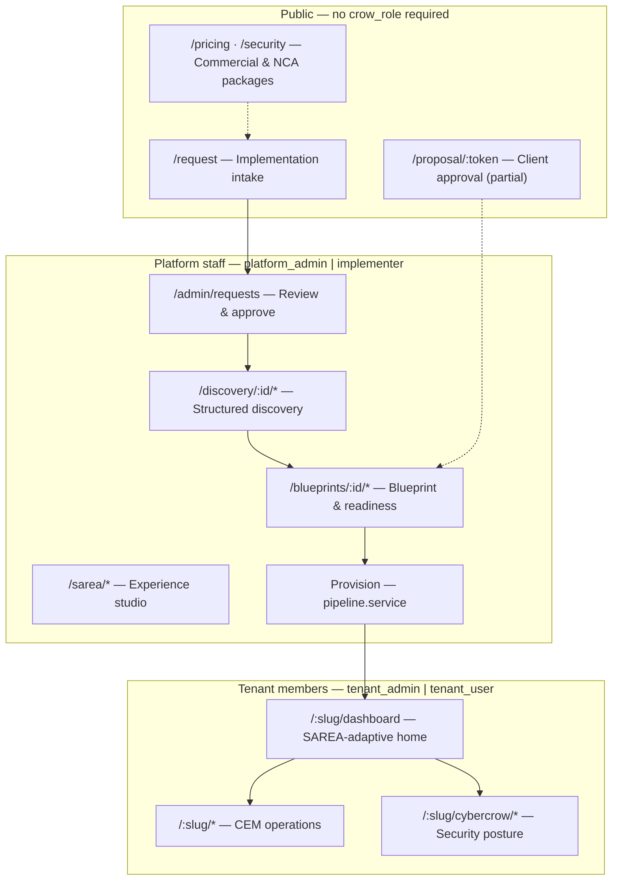
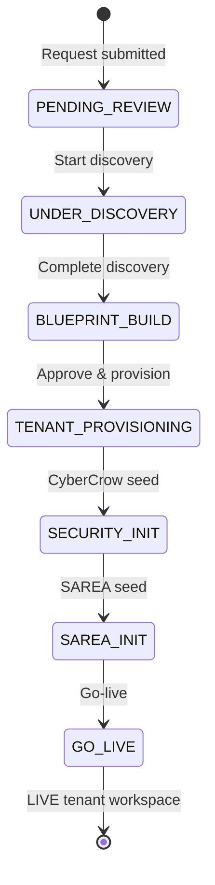
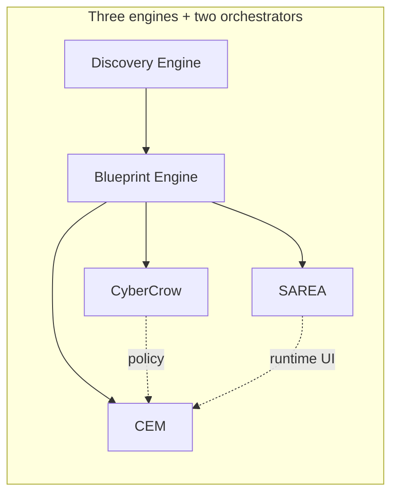
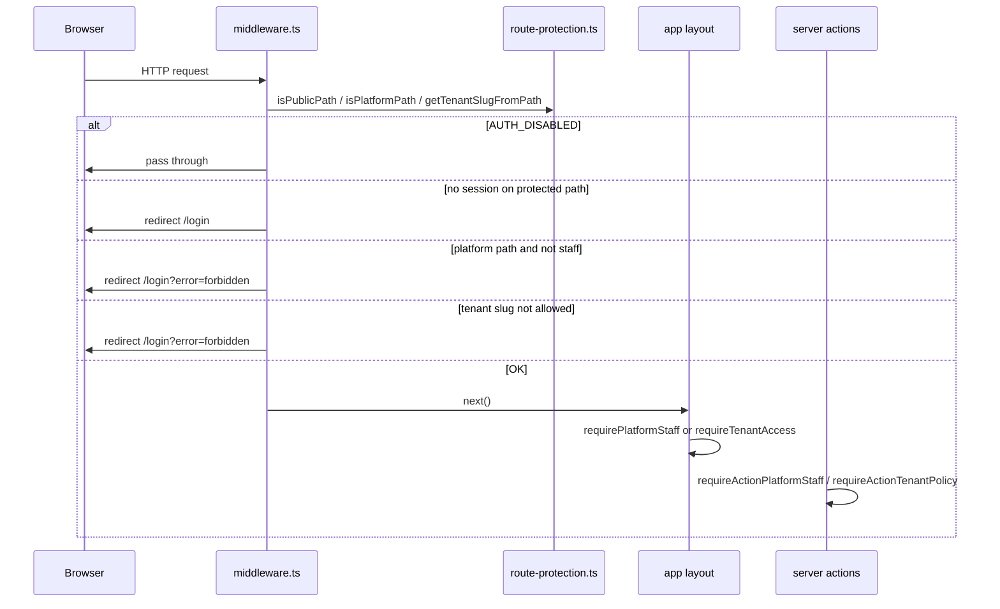

# Crow Ecosystem — Roles, Routes & Delivery Workflow

**Audience:** Product owner, delivery leads, and stakeholders who need one place to understand *who does what*, *which URLs they may open*, and *how that maps to the running Next.js application*.

**Related documentation:**

| Document | Use when you need… |
|----------|-------------------|
| [`TEAM_OWNERSHIP.md`](TEAM_OWNERSHIP.md) | **Muhanad** (platform/pipeline/go-live) vs **Omar** (SAREA/RBUX only — not general frontend) |
| [`DESIGN_SYSTEM.md`](DESIGN_SYSTEM.md) | North-star UI tokens, entity colors (CEM · CyberCrow · SAREA), shells |
| [`DEV_WITHOUT_DB.md`](DEV_WITHOUT_DB.md) | Working without Supabase Postgres or with `AUTH_DISABLED` |
| [`PLATFORM_STATUS.md`](PLATFORM_STATUS.md) | What is built vs shell today |
| [`PHASE2_AUTH.md`](PHASE2_AUTH.md) | Supabase bootstrap, Entra SSO, `app_metadata` |
| [`DISCOVERY_ENGINE.md`](DISCOVERY_ENGINE.md) | Discovery workspace design |
| [`ARCHITECTURE_DIAGRAM.md`](ARCHITECTURE_DIAGRAM.md) | Founder diagram → code mapping |
| [`CORE_PRODUCT_FLOW.md`](CORE_PRODUCT_FLOW.md) | **System heart** — Request → Discovery → Blueprint (pricing) → CEM launch |
| [`PAGE_DESIGNS.md`](PAGE_DESIGNS.md) | Wireframe-level page specs (no code) |

**Canonical route builders:** `src/lib/routes.ts`  
**Route classification & guards:** `src/lib/auth/route-protection.ts`, `src/lib/auth/roles.ts`, `src/lib/supabase/middleware.ts`, layout-level `requirePlatformStaff()` / `requireTenantAccess()` in `src/lib/auth/session.ts`

**Golden rule (product north star):** SAREA understands&adapts → Blueprint defines → CEM runs → CyberCrow protects .

---

## 1. Role → allowed routes (summary table)

This table is the **authorization contract** as implemented today. “Allowed” means the middleware and layout guards permit navigation after a valid Supabase session (or dev bypass). It does **not** guarantee every page has live database content—see [§10 Database vs design-only work](#10-database-vs-design-only-work).

| Role / actor | `crow_role` or auth mode | Public & marketing | Crow Admin `/admin/*` | Discovery `/discovery/*` | Blueprint `/blueprints/*` | SAREA Studio `/sarea/*` | Tenant workspace `/{slug}/*` | Tenant CyberCrow `/{slug}/cybercrow/*` | API (non-public) |
|--------------|--------------------------|--------------------|------------------------|----------------------------|---------------------------|-------------------------|----------------------------|----------------------------------------|------------------|
| Anonymous visitor | *(no session)* | Yes | No → `/login` | No | No | No | No | No | `POST /api/implementation-requests` only |
| Signed-in, no `crow_role` | `null` | Yes | No → `forbidden` | No | No | No | No | No | 403 |
| **Platform Admin** | `platform_admin` | Yes | Yes | Yes | Yes | Yes | **All tenants** | Yes (all slugs) | Yes (platform staff) |
| **Implementer** | `implementer` | Yes | Yes | Yes | Yes | Yes | **All tenants** | Yes (all slugs) | Yes (platform staff) |
| **Tenant Admin** | `tenant_admin` + slug in `tenant_slugs` | Yes | No | No | No | No | **Listed slugs only** | Yes (own slug) | No (unless also platform staff) |
| **Tenant User** | `tenant_user` + slug in `tenant_slugs` | Yes | No | No | No | No | **Listed slugs only** | Yes (own slug) | No |
| **Client** | `client` (or email-matched requests) | Yes | No | No | No | No | No | No | No |
| **Microsoft Entra user** | Any `crow_role` after SSO | Same as row for assigned role | Same | Same | Same | Same | Same | Same | Same |
| **Dev bypass** | `AUTH_DISABLED=true` → synthetic `platform_admin` | Yes | Yes *(layouts)* | Yes *(layouts)* | Yes *(layouts)* | Yes *(layouts)* | Yes *(layouts)* | Yes *(layouts)* | Skipped in middleware |
| **Proposal recipient** | Token on `/proposal/[token]` | Public route (token-scoped) | — | — | — | — | — | — | — |

**Platform staff** = `platform_admin` **or** `implementer` (`isPlatformStaff()` in `src/lib/auth/roles.ts`).

**Tenant access** = platform staff **or** (`tenant_admin` | `tenant_user`) with `tenant_slugs` containing the path slug (`canAccessTenant()`).

---

## Crow departments vs tenant engines

Crow organizes **delivery** by department; each **tenant** receives three **engines** at go-live. Full flow, pricing model, and redesign notes: **[`CORE_PRODUCT_FLOW.md`](CORE_PRODUCT_FLOW.md)**. Page wireframes: **[`PAGE_DESIGNS.md`](PAGE_DESIGNS.md)**.

| Crow department (people) | Lead | Delivers in pipeline | Becomes on tenant (engine) |
|--------------------------|------|----------------------|----------------------------|
| **CyberCrow** | You — NCA-aligned security delivery, audits, Microsoft/Entra, tenant posture | Discovery **security**, blueprint **CyberCrow** tab, `/admin/security-baselines` | `/{slug}/cybercrow/*` (violet) |
| **SAREA** | **Omar** — SAREA/RBUX only (personas, layouts, adaptive UI); not general frontend | Discovery **experience**, `/sarea/*` studio, blueprint **SAREA** tab | SAREA **runtime** on `/{slug}/dashboard` (rose) |
| **Platform / product owner** | **Muhanad** — architecture, Prisma, pipeline, go-live; **CyberAdmin** on CEM tenant after go-live | `/admin/requests`, blueprint overview, go-live, commercial proposal | `/{slug}/*` CEM ops + full `/admin/*` (cyan) |

**Core flow (system heart):** Customer **Request** → Crow **Discovery** → **Blueprint** (pricing engine, not afterthought) → **Proposal** → **Go-live** provisions **CEM** tenant with CyberCrow and SAREA seeded as siblings under one slug.

**Pricing today:** `pricing.service.ts` + `BlueprintProposalPanel` on `/blueprints/:id/overview`; proposal at `/proposal/:token`. **GREENFIELD:** SAREA package line items, dedicated blueprint pricing tab — see [`CORE_PRODUCT_FLOW.md`](CORE_PRODUCT_FLOW.md) § Pricing in the Blueprint.

**Persona naming:** Workshop **Omar** = **SAREA department lead** (see [`TEAM_OWNERSHIP.md`](TEAM_OWNERSHIP.md)) — not the client executive, not platform implementer. Client sponsor submits `/request`; executives use SAREA `executive` **persona** on the tenant dashboard.

### 1.1 Route prefix reference (from `routes.ts`)

| Prefix | Builder / pattern | Guard |
|--------|-------------------|-------|
| **Auth** | `/login`, `/auth/callback`, `/auth/signout`, `/auth/entra` | Public (callback establishes session) |
| **Client portal** | `/portal`, `/portal/requests`, `/portal/requests/:id` | Session required; `requireClientAccess()` in layout |
| **Public** | `/`, `/modules`, `/loyalty-programs`, `/security`, `/pricing`, `/request`, `/proposal/:token` | `isPublicPath()` |
| **Admin** | `/admin/overview`, `requests`, `discovery`, `blueprints`, `tenants`, `domains`, `integrations`, `subscriptions`, `security-baselines`, `audit` | `isPlatformPath()` + `requirePlatformStaff()` |
| **Discovery** | `/discovery/:requestId` + steps (organization, departments, branches, roles, workflows, modules, security, identity, integrations, experience, summary) | Platform path + staff |
| **Blueprint** | `/blueprints/:id/overview`, `cem`, `cybercrow`, `sarea`, `identity`, `integrations`, `go-live`, `readiness` | Platform path + staff |
| **SAREA** | `/sarea/overview`, `profiles`, `layouts`, `role-mapping`, `rules`, `widgets`, `navigation`, `device-rules`, `preview` | Platform path + staff |
| **Tenant CEM** | `/:slug/dashboard`, `workflows`, `tasks`, `users`, `roles`, `departments`, `branches`, `modules`, `reports`, `settings`, `hr`, `crm`, `sales`, `inventory`, `warehouse`, `logistics`, `finance` | `requireTenantAccess(slug)` |
| **Tenant CyberCrow** | `/:slug/cybercrow/dashboard`, `audit-logs`, `security-events`, `risk`, `incidents`, `compliance`, `identity`, `sessions`, `grc`, `evidence` | Same tenant guard |

Reserved first path segments (never treated as tenant slugs): `admin`, `api`, `discovery`, `blueprints`, `sarea`, `portal`, `modules`, `loyalty-programs`, `security`, `pricing`, `request`, `login`, `auth`, `unauthorized` — see `RESERVED_PATH_SEGMENTS` in `route-protection.ts`.

**Unified identity:** One Entra login per person; clients track requests at `/portal/*`; the same user can be promoted to `tenant_user` without a second account. See [`IDENTITY_AND_PORTALS.md`](IDENTITY_AND_PORTALS.md).

Additional **marketing shells** (public, no extra guard): `/about`, `/architecture`, `/services`, `/clients`, `/industries`, `/case-studies` — not all listed in `routes.ts` but behave as public paths via `/` prefix rules or static segments.

---

## 2. Phase diagram — delivery lifecycle

The platform implements a **single orchestration pipeline** from first client touch through governed go-live. States in the database use `ImplementationRequestStatus` (Prisma); the diagram below uses product language aligned with `PLATFORM_LIFECYCLE` and `FULL_PLATFORM_LIFECYCLE` in `src/lib/constants/platform.ts`.

### 2.1 Phase table (who acts, primary routes)

| Phase | Product label | Typical actor | Primary routes | Persisted when |
|-------|---------------|---------------|----------------|--------------|
| 0 | Awareness | Visitor | `/`, `/modules`, `/security`, `/pricing` | N/A |
| 1 | Implementation request | Client sponsor (“Omar” persona) | `/request`, `POST /api/implementation-requests` | Postgres + optional email |
| 2 | Expert review | Crow operator (“Hasheer” / admin) | `/admin/requests`, `/admin/requests/[id]` | Status → discovery |
| 3 | Discovery | Platform staff (Muhanad) | `/discovery/[id]/*` | Discovery answers, structure, security package |
| 4 | Blueprint | Platform staff (Muhanad) | `/blueprints/[id]/overview`, tabs | `EnterpriseBlueprint` |
| 5 | Commercial / pricing | Admin + client | `/pricing`, `/admin/subscriptions`, proposal token | Plans, estimates |
| 6 | Readiness & go-live | Platform staff (Muhanad) | `/blueprints/[id]/readiness`, `go-live` | Checklist, provision |
| 7 | Tenant operations | Tenant admin / users | `/{slug}/*` | CEM + memberships |
| 8 | Security operations | Auditor, tenant admin, platform staff | `/{slug}/cybercrow/*`, `/admin/audit` | CyberCrow tables |
| 9 | Experience adaptation | **Omar** (SAREA studio + runtime UX), Muhanad (provision seed) | `/sarea/*`, runtime on `/{slug}/dashboard` | SAREA profiles |

For enum-level mapping and future pipeline vocabulary, see `src/lib/constants/lifecycle-states.ts` and [`ARCHITECTURE_DIAGRAM.md`](ARCHITECTURE_DIAGRAM.md) § Thirteen lifecycle steps.

---

## 3. Workflow narrative (product owner view)

### 3.1 Why roles are split the way they are

Crow is a **B2B implementation platform**, not a self-serve SaaS signup. Clients submit intent publicly; **Crow delivery staff** run discovery and blueprinting on privileged routes; **tenant users** only see their provisioned workspace after go-live. That separation keeps discovery data, pricing, and cross-tenant admin out of client tenants while still allowing platform staff to support any customer.

Authorization is intentionally **coarse at the route layer** (`crow_role` + `tenant_slugs`) and **finer inside tenant actions** (CyberCrow policy actions on server actions). This matches Saudi enterprise expectations: strong perimeter, audited denials, NCA-oriented compliance surfaces without exposing other tenants.

### 3.2 Happy-path story (Next.js app)

1. **A prospect** visits the public site (`routes.public.*`), reads NCA-aware security packages on `/security`, and submits `/request` with modules and a CyberCrow tier (`SECURITY_PACKAGES` in `src/lib/constants/security-packages.ts`).

2. **Crow platform staff** sign in at `/login` (email/password or Microsoft Entra when `AZURE_SSO_ENABLED`). With `platform_admin` or `implementer`, they open `/admin/requests`, approve, and **start discovery**.

3. **Discovery** captures organization truth: departments, branches, roles, workflows, security requirements, identity (native vs Entra), integrations, and SAREA experience requirements (`/discovery/[id]/experience`). Industry templates (logistics, retail, healthcare) accelerate defaults; the client validates.

4. **Completing discovery** creates or updates the **Enterprise Blueprint**. Staff use `/blueprints/[id]/overview` to sync modules, review CyberCrow and SAREA tabs, and run **readiness** before go-live.

5. **Provision** (`pipeline.service.ts`) creates the tenant org, enables modules, runs `initializeCyberCrow`, `initializeSarea` (default personas: `executive`, `manager`, `frontline`), and seeds CEM structure from discovery.

6. **Tenant access** is granted via admin tenant page or `npm run auth:grant-tenant`, setting Supabase `app_metadata` (`crow_role`, `tenant_slugs`) and `tenant_memberships`.

7. **Tenant users** land on `/{slug}/dashboard` where **SAREA runtime** picks layout, widgets, and nav density by persona/role. **CyberCrow** exposes posture, compliance controls (NCA-ECC style keys in mock/demo data), audit logs, risk, and incidents.

Throughout, **Microsoft personnel** authenticate through Entra like any other user; their effective routes depend on the `crow_role` an administrator assigns after first login (see [`ENTRA_SSO.md`](ENTRA_SSO.md)).

### 3.3 Legacy HTML prototype (`HTML_proc/`)

The static prototype uses **browser-only demo roles** (`client_user`, `cybercrow_admin`, `security_analyst`, `executive`, etc.) documented in [`HTML_proc/docs/USER_ROLES.md`](../HTML_proc/docs/USER_ROLES.md). Those roles **do not** map 1:1 to Supabase `crow_role` values—they informed UX but production authorization is **`platform_admin` | `implementer` | `tenant_admin` | `tenant_user`** only.

---

## 4. Engine responsibilities in the workflow

Each engine owns a slice of the lifecycle. Routes and services should stay within these boundaries when scoping new work.

| Engine | Tagline (product) | When it leads | Key routes | Primary services |
|--------|-------------------|---------------|------------|------------------|
| **Discovery** | Discovery understands | Phases 2–3 | `/discovery/*`, `/admin/discovery` | `discovery.service.ts`, `discovery-template.service.ts` |
| **Blueprint** | Blueprint defines | Phase 4–6 | `/blueprints/*`, `/admin/blueprints` | `blueprint.service.ts`, `readiness.service.ts`, `pipeline.service.ts` |
| **CEM** | CEM runs | Phase 7+ | `/{slug}/*` (non-cybercrow) | `tenant-identity.service.ts`, `hr.service.ts`, `crm.service.ts`, `tenant-role.service.ts` |
| **CyberCrow** | CyberCrow protects | Discovery security step, provision, ongoing ops | `/security`, `/{slug}/cybercrow/*`, `/admin/security-baselines`, `/admin/audit` | `cybercrow-policy.service.ts`, `cybercrow-tenant.service.ts`, seed via pipeline |
| **SAREA** | SAREA adapts | Discovery experience, provision, daily UX | `/sarea/*`, `/{slug}/dashboard` | `sarea.service.ts`, `sarea-seed.service.ts`, `sarea-runtime.service.ts` |
| **Platform ops** | Enterprise operations | Cross-tenant governance | `/admin/*` (domains, subscriptions, integrations) | `platform-admin.service.ts`, `tenant-health.service.ts` |

**Ten platform engines** (marketing numbering 01–10) are enumerated in `PLATFORM_ENGINES` — use that list when aligning slides with [`ARCHITECTURE_DIAGRAM.md`](ARCHITECTURE_DIAGRAM.md).

---

## 5. Stakeholder personas (Omar, Hasheer, auditor, Microsoft, CyberAdmin)

These names describe **delivery and client stakeholders** in workshops and demos. They are **not** separate Supabase roles in code today; map them to `crow_role`, SAREA `personaKey`, or CEM role slugs below.

| Persona | Typical job | Goals in the product | Maps to (code / UX) | Primary routes |
|---------|-------------|----------------------|---------------------|----------------|
| **Omar (SAREA lead)** | Crow SAREA department — adaptive UX only | Personas, layouts, nav, widgets for tenant runtime | Studio routes `/sarea/*`; not `implementer` for pipeline | `/sarea/*`, polish on `/{slug}/dashboard` |
| **Client executive (sponsor)** | Customer business sponsor | Executive KPIs, compliance posture | SAREA `executive` persona; `tenant_admin` / `tenant_user` | `/{slug}/dashboard`, CyberCrow compliance |
| **Hasheer** | Crow implementer / discovery lead (legacy label) | Run discovery, blueprint with platform owner | `implementer` (or `platform_admin`) | `/admin/*`, `/discovery/*`, `/blueprints/*` |
| **Auditor** | Internal or external auditor | Read-only evidence, audit trail, control status | No dedicated `crow_role` yet — use `tenant_user` with narrow membership or platform staff read-only process | `/{slug}/cybercrow/audit-logs`, `compliance`, `evidence`, `grc`; `/admin/audit` (platform) |
| **Microsoft personnel** | Client IdP users (Entra) | SSO login, MFA via corporate policy | Supabase Auth Azure provider; same route matrix as assigned `crow_role` | `/login` → Entra; then tenant or admin routes per metadata |
| **CyberAdmin** | Crow platform operator | All requests, tenants, baselines, cross-tenant audit | `platform_admin` (legacy HTML: `cybercrow_admin`) | Full `/admin/*`, all tenants |
| **CyberAdmin “user”** | Client-side IT / tenant admin | Users, invites, modules, settings | `tenant_admin` + `tenant_slugs` | `/{slug}/users`, `settings`, `modules`; invites need `cem.users.invite` policy |
| **Client user** (HTML demo) | Submits implementation request | Intake only | Public + optional future client portal | `/request` (HTML: `client_user`) |
| **Client manager** (HTML demo) | Tracks request status | Dashboard (future) | Not fully ported — target `tenant_admin` | HTML `dashboard`; Next: `/{slug}/dashboard` |
| **Security analyst** (HTML demo) | Audit visibility | Read-only security events | Partial — CyberCrow subroutes | `/{slug}/cybercrow/audit-logs` |
| **Executive** (HTML demo) | Summary KPIs | Executive summary | SAREA `executive` + dashboard widgets | `/{slug}/dashboard` |

### 5.1 SAREA personas (experience layer)

At provision, default persona keys are **`executive`**, **`manager`**, **`frontline`** (`pipeline.service.ts`). They map to CEM role slugs in `sarea-seed.service.ts`:

| personaKey | CEM role slug | UX intent |
|------------|---------------|-----------|
| `executive` | `tenant-admin` | Spacious layout, reports visible, alerts prominent |
| `manager` | `manager` | Balanced dashboard, approvals |
| `frontline` | `employee` | Mobile-first, compact nav, minimal reports |

Runtime resolution: `sarea-runtime.service.ts` drives tenant shell badges and dashboard widgets on `/{slug}/dashboard`.

### 5.2 CEM roles inside a tenant (application RBAC)

Distinct from Supabase `crow_role`, **tenant CEM roles** (e.g. Tenant Admin, Manager, Employee) live in Postgres and are assigned on `/{slug}/users`. Seeded permissions examples in `tenant-cem-seed.service.ts` (`cem.dashboard.view`, `cem.workflows.manage`, …). Platform staff bypass tenant policy checks.

---

## 6. Code roles — `crow_role` reference

Defined in `src/lib/auth/roles.ts` and stored in Supabase **`app_metadata` only** (never `user_metadata` for authorization).

| `crow_role` | Label | Route access | Tenant slug rule | Server action policy |
|-------------|-------|--------------|------------------|----------------------|
| `platform_admin` | Platform Admin | All platform paths + all tenants | Ignored (staff sees every slug) | All `CybercrowPolicyAction` |
| `implementer` | Implementer | Same as platform admin | Same | Same |
| `tenant_admin` | Tenant Admin | Public + own tenant(s) | Must list slug in `tenant_slugs` | Full tenant admin actions |
| `tenant_user` | Tenant User | Public + own tenant(s) | Must list slug in `tenant_slugs` | Limited (`cem.hr.write` only among policy actions) |

### 6.1 CyberCrow policy actions (tenant server actions)

From `cybercrow-policy.service.ts`:

| Action | `tenant_admin` | `tenant_user` | Platform staff |
|--------|----------------|---------------|----------------|
| `cem.users.invite` | Yes | No | Yes |
| `cem.hr.write` | Yes | Yes | Yes |
| `cem.crm.write` | Yes | No | Yes |
| `cem.roles.manage` | Yes | No | Yes |
| `cem.workflows.manage` | Yes | No | Yes |

Denied actions write `POLICY_DENIED` to `cybercrowAuditLog` — important for auditor narratives and NCA control evidence.

### 6.2 Bootstrap and grant commands

| Task | Command / UI |
|------|----------------|
| First platform admin | `npm run auth:bootstrap` |
| Link user to tenant | Admin tenant page or `npm run auth:grant-tenant` |
| Inspect users | `npm run auth:list-users` |

---

## 7. Route protection — how enforcement works

Authorization uses **defense in depth**:

### 7.1 Middleware (`src/lib/supabase/middleware.ts`)

- Refreshes Supabase session cookies on matched routes.
- **Public:** `isPublicPath()` — includes `/`, marketing pages, `/request`, `/login`, `/auth/callback`, `/proposal/*`, `/unauthorized`.
- **Platform:** `isPlatformPath()` — `/admin`, `/discovery`, `/blueprints`, `/sarea`.
- **Tenant:** first segment not in `RESERVED_PATH_SEGMENTS` → tenant slug; requires `canAccessTenant()`.
- **API:** non-public API requires platform staff (except `POST /api/implementation-requests`).
- **`AUTH_DISABLED`:** middleware skips auth checks entirely; layouts still call guards that return `DEV_BYPASS_USER` as `platform_admin`.

### 7.2 Layout guards

| Layout file | Guard |
|-------------|-------|
| `src/app/admin/layout.tsx` | `requirePlatformStaff()` |
| `src/app/discovery/[requestId]/layout.tsx` | `requirePlatformStaff()` |
| `src/app/blueprints/[blueprintId]/layout.tsx` | `requirePlatformStaff()` |
| `src/app/sarea/layout.tsx` | `requirePlatformStaff()` |
| `src/app/[tenant]/layout.tsx` | `requireTenantAccess(slug)` |

### 7.3 Public vs protected quick reference

| Path pattern | Middleware | Layout |
|--------------|------------|--------|
| `/`, `/modules`, `/security`, `/pricing`, `/request` | Public | None |
| `/login`, `/auth/*` | Public (API auth paths pass through) | — |
| `/admin/**` | Platform staff | `requirePlatformStaff` |
| `/discovery/**` | Platform staff | `requirePlatformStaff` |
| `/blueprints/**` | Platform staff | `requirePlatformStaff` |
| `/sarea/**` | Platform staff | `requirePlatformStaff` |
| `/{slug}/**` | Tenant access | `requireTenantAccess` |
| `/api/**` (except public POST) | Platform staff | Per-route |

---

## 8. NCA alignment & cyber security posture (product framing)

The repository does **not** implement a certified NCA ECC assessment tool. It **frames** CyberCrow as **NCA-aware** and seeds **control identifiers** suitable for Saudi & GCC enterprise conversations.

### 8.1 Where NCA / posture language appears

| Surface | Reference |
|---------|-----------|
| Public hero | `cc-star-badge` — “NCA-aligned · Enterprise-grade” (`hero-section.tsx`) |
| Public home stats | “NCA-aware CyberCrow” + `SECURITY_PACKAGES.length` (`page.tsx`) |
| `/security` | Package tiers with enterprise copy citing NCA-aligned posture (`security-packages.ts`) |
| `/pricing` | “NCA-aware packages with optional Entra ID SSO” |
| Implementation request form | Hint: “NCA-aware packages — seeded at tenant provision” |
| Discovery security step | “Align CyberCrow packages with NCA-oriented controls” (`discovery-security-form.tsx`) |
| Tenant CyberCrow dashboard | “NCA-aligned baseline · real-time posture” |
| Compliance page | “NCA-aligned control baseline for this tenant” |
| Mock / demo controls | Keys like `NCA-ECC-1.1`, `NCA-ECC-2.3` (`workspace-summary.ts`) |
| Public footer | “NCA-aligned” positioning (`public-footer.tsx`) |
| Design system | `cc-nca-badge` token ([`DESIGN_SYSTEM.md`](DESIGN_SYSTEM.md)) |

### 8.2 Security packages (commercial → technical seed)

| Key | Name | Monthly add-on (SAR) | Posture level |
|-----|------|----------------------|---------------|
| `crow_shield` | Crow Shield | 499 | RBAC, password policy, foundational audit |
| `crow_sentinel` | Crow Sentinel | 1299 | Alerts, suspicious sign-in, risk summaries |
| `crow_fortress` | Crow Fortress | 2499 | Incidents, compliance evidence, NCA-aligned posture |

Selected package on `/request` flows into discovery security answers and informs CyberCrow initialization at provision (`initializeCyberCrow` in pipeline). Admin catalog: `/admin/security-baselines`.

### 8.3 Auditor-facing narrative

For **auditor** personas, the intended read-only journey is: **audit logs** → **compliance controls** → **evidence / GRC** → platform **`/admin/audit`** for cross-tenant operator view. Future work: dedicated `auditor` `crow_role` with enforced read-only policy (see [§12 Gaps](#12-gaps-for-future-code-work)).

---

## 9. Detailed route catalogs by area

### 9.1 Public portal (`routes.public` + auth)

| Route | Purpose | Data dependency |
|-------|---------|-----------------|
| `/` | Platform home, engine map | Mostly static constants |
| `/modules` | Module catalog marketing | Static / catalog |
| `/loyalty-programs` | Shell | — |
| `/security` | CyberCrow packages | `SECURITY_PACKAGES` |
| `/pricing` | Plans, Entra mention | DB for plans when live |
| `/request` | Implementation wizard | **Postgres** on submit |
| `/proposal/[token]` | Client proposal view | **Postgres** token |
| `/login` | Email + optional Entra | Supabase Auth |
| `/auth/callback`, `/auth/signout` | Session | Supabase |
| `/auth/entra` | Start OAuth | Supabase + Azure |

### 9.2 Crow Admin (`routes.admin`)

| Route | Purpose |
|-------|---------|
| `/admin/overview` | Platform identity cards |
| `/admin/requests` | Request queue |
| `/admin/requests/[id]` | Approve, reject, start discovery |
| `/admin/discovery` | Active discoveries hub |
| `/admin/blueprints` | Blueprint list |
| `/admin/tenants` | Provisioned tenants |
| `/admin/tenants/[id]` | Detail, grant access, modules |
| `/admin/domains` | Engine / domain catalog |
| `/admin/integrations` | Integration connections |
| `/admin/subscriptions` | Plans & subscriptions |
| `/admin/security-baselines` | Security package catalog |
| `/admin/audit` | CyberCrow + notification logs |

### 9.3 Discovery workspace (`routes.discovery(requestId)`)

| Step route | Captures |
|------------|----------|
| `.../organization` | Org profile, templates |
| `.../departments` | Department structure |
| `.../branches` | Branch structure |
| `.../roles` | Roles → permissions / SAREA |
| `.../workflows` | Workflow definitions |
| `.../modules` | Enabled modules |
| `.../security` | Security package & NCA-oriented posture |
| `.../identity` | Native vs Entra, MFA preferences |
| `.../integrations` | Integration requirements |
| `.../experience` | SAREA persona requirements |
| `.../summary` | Complete → blueprint |

### 9.4 Enterprise Blueprint (`routes.blueprint(blueprintId)`)

| Tab | Purpose |
|-----|---------|
| `.../overview` | Status, modules, approve, provision entry |
| `.../cem` | CEM provisioning preview |
| `.../cybercrow` | Security baseline preview |
| `.../sarea` | Experience profiles preview |
| `.../identity` | Shell / IdP summary |
| `.../integrations` | Shell |
| `.../go-live` | Provision actions |
| `.../readiness` | Go-live checklist (diagram alignment) |

### 9.5 SAREA Experience Studio (`routes.sarea`)

| Route | Purpose |
|-------|---------|
| `/sarea/overview` | Studio metrics |
| `/sarea/profiles` | Experience profiles (platform + tenant) |
| `/sarea/layouts` | Dashboard layouts |
| `/sarea/role-mapping` | Role ↔ experience maps |
| `/sarea/rules` | Widget rules |
| `/sarea/widgets` | Widget catalog per profile |
| `/sarea/navigation` | Nav configs |
| `/sarea/device-rules` | Device-specific rules |
| `/sarea/preview` | Aggregate preview |

### 9.6 CEM tenant workspace (`routes.tenant(slug)`)

| Route | Maturity (see PLATFORM_STATUS) |
|-------|-------------------------------|
| `/{slug}/dashboard` | Live — SAREA widgets |
| `/{slug}/modules` | Live |
| `/{slug}/users` | Live — invite, CEM roles |
| `/{slug}/departments`, `/roles`, `/workflows`, `/branches` | Live |
| `/{slug}/hr`, `/crm` | Live CRUD |
| `/{slug}/settings` | MFA/IdP from discovery |
| `/{slug}/tasks`, `/reports`, `/sales`, `/inventory`, `/warehouse`, `/logistics`, `/finance` | Shell / placeholder |

### 9.7 CyberCrow tenant console (`routes.tenant(slug).cybercrow`)

| Route | Maturity |
|-------|----------|
| `.../dashboard` | Live summary |
| `.../audit-logs` | Live data |
| `.../risk` | Live |
| `.../compliance` | Live — NCA-aligned controls |
| `.../incidents`, `/grc` | Live / partial |
| `.../security-events`, `/identity`, `/sessions`, `/evidence` | Shell or early |

---

## 10. Database vs design-only work

| Work type | Needs Postgres | Needs Supabase Auth | `AUTH_DISABLED` useful? |
|-----------|----------------|---------------------|-------------------------|
| Marketing UI, design tokens | No | No | Yes |
| Public `/security`, `/pricing` static | No | No | Yes |
| `/request` submit, admin, discovery, blueprint | **Yes** | Yes (except bypass) | Layouts only — **queries fail** |
| Tenant HR/CRM/CyberCrow | **Yes** | Yes | Layouts only — **queries fail** |
| `npm run smoke:phase1` | **Yes** | **Yes** | No |
| Entra SSO testing | Optional DB | **Yes** | No |

Full guidance: [`DEV_WITHOUT_DB.md`](DEV_WITHOUT_DB.md).

**Demo day checklist (abbreviated):**

1. Restore Supabase Postgres; remove `AUTH_DISABLED`.
2. Bootstrap or verify `platform_admin` / implementer accounts.
3. Grant tenant users via admin or `auth:grant-tenant`.
4. Run `npm run smoke:phase1` optional E2E.

**Design-only session:** set `AUTH_DISABLED=true`, iterate on shells and [`DESIGN_SYSTEM.md`](DESIGN_SYSTEM.md) components—accept Prisma errors on data pages.

---

## 11. Role × phase matrix (planning aid)

| Phase | platform_admin | implementer | tenant_admin | tenant_user | auditor (target) |
|-------|----------------|-------------|--------------|-------------|------------------|
| Public intake | ○ | ○ | ○ | ○ | ○ |
| Admin review | ● | ● | — | — | ○ read? |
| Discovery | ● | ● | — | — | — |
| Blueprint / readiness | ● | ● | — | — | ○ read? |
| SAREA studio | ● | ● | — | — | — |
| Provision | ● | ● | — | — | — |
| Tenant CEM ops | ● all | ● all | ● own | ● own | ○ |
| CyberCrow console | ● all | ● all | ● own | ● own | ● read-only |
| Grant users | ● | ● | ● invite | — | — |

Legend: ● full access · ○ observer/public · — not applicable

---

## 12. Gaps for future code work

Items below are **documented intent** not missing typos—track in [`GAP_AUDIT.md`](GAP_AUDIT.md) and [`ROADMAP.md`](ROADMAP.md).

| Gap | Impact | Suggested direction |
|-----|--------|---------------------|
| No `auditor` `crow_role` | Auditors rely on admin or broad tenant roles | Add read-only role + policy matrix for CyberCrow routes |
| Omar / Hasheer not in code | Personas are workshop labels only | Optional: seed display names in demo script docs only |
| Client portal roles (HTML `client_user`) | Clients cannot track request in-app | Post-login client role scoped to own `implementationRequestId` |
| `tenant_user` vs CEM Employee | Two layers can confuse PO | Document in onboarding; UI role labels on `/{slug}/users` |
| CyberCrow enforcement depth | Policy denies writes; not full MFA/anomaly | Phase 7+ enforcement per [`ARCHITECTURE_DIAGRAM.md`](ARCHITECTURE_DIAGRAM.md) |
| Proposal / client approval | Token route exists; lifecycle partial | Wire `CLIENT_APPROVAL_PENDING` to client-safe role |
| Commercial proposal engine | Step 5 in diagram | `/proposal/[token]` expansion |
| Shell ERP modules | sales, inventory, finance, … | CEM module roadmap |
| `cem.workflows.manage` for `tenant_user` | Only admin-level today | Product decision for frontline workflow participants |
| Separate `security_analyst` platform role | HTML demo only | Map to auditor + cross-tenant scope policy |
| RBAC at page level inside CyberCrow | All subroutes share tenant guard | Fine-grained read-only for compliance vs incidents |
| NCA ECC automation | Marketing alignment only | Integrate real control framework IDs from customer GRC |

---

## 13. Quick links for demos

| Scenario | Start here | Role |
|----------|------------|------|
| New client intake | `/request` | Public |
| Hasheer discovery day | `/admin/requests` → `/discovery/...` | `implementer` |
| Omar executive review | `/{slug}/dashboard` | `tenant_admin` + executive persona |
| Auditor walkthrough | `/{slug}/cybercrow/compliance` → `audit-logs` | `tenant_user` or staff |
| Microsoft SSO | `/login` → Entra | Any assigned `crow_role` |
| Studio tuning | `/sarea/profiles` | `platform_admin` |

Next.js demo continuation: [`DEMO_SCRIPT.md`](DEMO_SCRIPT.md) (includes legacy HTML_proc and Phase 7 paths).

---

## 14. File index (authorization source of truth)

| Concern | Path |
|---------|------|
| Route builders | `src/lib/routes.ts` |
| Path classification | `src/lib/auth/route-protection.ts` |
| Roles & tenant access helpers | `src/lib/auth/roles.ts` |
| Server session guards | `src/lib/auth/session.ts` |
| Middleware entry | `src/middleware.ts` → `src/lib/supabase/middleware.ts` |
| Server action guards | `src/lib/auth/action-guard.ts`, `tenant-policy-guard.ts` |
| Policy enforcement | `src/lib/services/cybercrow-policy.service.ts` |
| Platform copy & engines | `src/lib/constants/platform.ts` |
| Security packages | `src/lib/constants/security-packages.ts` |
| Provision orchestration | `src/lib/services/pipeline.service.ts` |

---

*This document is standalone product-owner reference material. For implementation status of each route, prefer [`PLATFORM_STATUS.md`](PLATFORM_STATUS.md); for visual and UX standards, prefer [`DESIGN_SYSTEM.md`](DESIGN_SYSTEM.md).*
