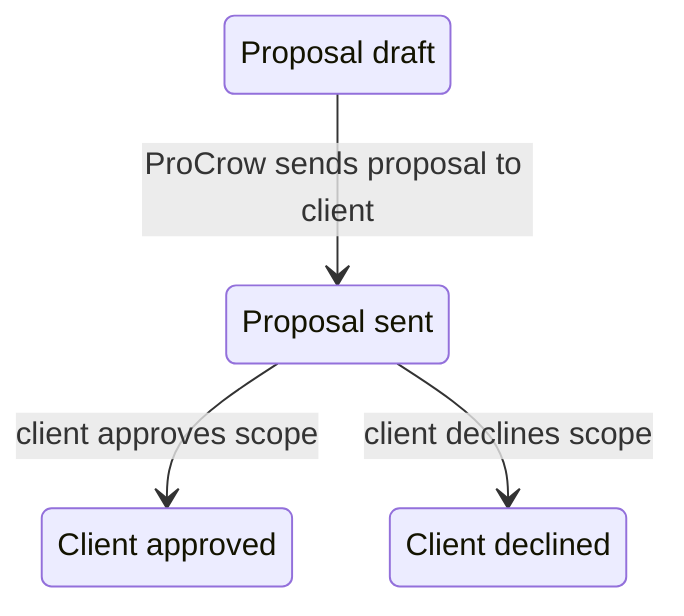

# I2 — Client / Proposal Portal requirements & auth-flow design (no paid infra)

**Last updated:** 27 May 2026  
**Audience:** Internal delivery / engineering  

## Scope & non-goals (I2 is documentation-only)

This phase defines the *Client / Proposal Portal* requirements and the *authentication / authorization boundaries* that the implementation must follow later.

Non-goals:
- No code changes that modify auth behavior (unless explicitly framed as a future required change).
- No new database migrations in I2.
- No payments, no external integrations, and no production launch.
- No schema writes beyond what already exists.

Constraints:
- No paid infrastructure.
- No production launch.
- No live payments.
- No external APIs.
- No fake customer/compliance/AI claims.

---

## PART 1 — Current client / proposal surface audit (what exists today)

### 1. Route inventory (by surface)

#### A) Public portal entry (visitor → request)
- `GET /request` (public): shows the `ImplementationRequestForm` for submitting a public intake request.
- `POST /api/implementation-requests` (public, guarded): validates input and blocks abuse via `public-intake-guard` (honeypot, Turnstile, rate limiting, payload size, schema validation).
  - If the visitor is logged in (Supabase auth present), the API attempts to set `submittedByUserId`.
  - If not logged in, the request is still created (auth is not required to submit).

#### B) Authenticated client portal (client workspace)
- `GET /portal` redirects to `GET /portal/requests`.
- `GET /portal/requests` requires authentication and client access.
  - The *portal layout* enforces `requireClientAccess()` at the layout level.
  - Users can see only requests linked to their account (by email matching + linked requests).
- `GET /portal/requests/[requestId]` requires authentication and client access.
  - The page also calls `clientCanAccessRequest(userId, email, requestId)` and returns `notFound()` when the user is not linked to that request.
  - If a proposal token exists for the request’s blueprint, the page provides an **“Open proposal”** link to the public proposal route.

#### C) Token-based proposal view (public by design today)
- `GET /proposal/[token]` is public (no login required).
  - The page renders proposal content by looking up the blueprint via `proposalToken`.
  - The page shows approval controls when `blueprint.proposalStatus === "SENT"`.

#### D) Login + identity linking
- `GET /login` renders the sign-in UI (email/password, Google, Microsoft).
  - “Track my request” links to `/login?next=/portal/requests`.
- `GET /auth/callback` (OAuth callback) exchanges the OAuth code for a session.
  - After exchanging the session, it attempts `linkRequestsForUser(user)` which links matching request contact emails to the Supabase user.
  - If the user has *no role*, but matches at least one request contact email, the callback routes them to the post-login destination with a client role constraint.
- `GET /auth/google` and `GET /auth/entra` start the supported OAuth flows.
- `POST signIn` server action (email/password sign-in) also links matching requests and assigns a client role when appropriate.

#### E) Global route protection (middleware)
- `src/lib/supabase/middleware.ts` enforces authentication *for platform and portal paths*.
- `/proposal` is explicitly treated as public by the route-protection allowlist.

### 2. Classification: what is public, token-based, auth-required, missing

#### Exists today (classified)
- **Public**
  - `/request`
  - `POST /api/implementation-requests`
  - `/proposal/[token]` (token-based but rendered publicly)
- **Token-based**
  - `/proposal/[token]` (proposal token selects the blueprint record)
- **Authenticated (client portal)**
  - `/portal/requests`
  - `/portal/requests/[requestId]`
  - (and all routes under `/portal` via portal layout + middleware)
- **Authenticated (platform / admin / ProCrow)**
  - `/admin/*`
  - `/blueprints/*`
  - `/discovery/*`
  - `/sarea/*`
  - Tenant runtime paths under `/${tenantSlug}/*`

#### Missing (for an actual “Client / Proposal Portal” experience)
1. **Authenticated proposal review inside the client portal**
   - Today, proposal review happens on a *public* token page (`/proposal/[token]`), not inside an authenticated client surface.
2. **Authenticated blueprint review inside the client portal**
   - There is no `/client/blueprints/[blueprintId]` route today; current blueprint surfaces are primarily platform/admin.
3. **Scope approval and reject actions gated by client identity**
   - Approval controls exist on the public proposal page, and the approval server actions currently rely primarily on the token + proposal status (see unsafe section below).
4. **Onboarding tracker UI + status workflow**
   - There are admin-side readiness / go-live workflows, but there is no dedicated client onboarding tracker page in `/portal` today.
5. **Client profile / company profile completion screens**
   - The current system has intake contact rows and request selections, but lacks a client/company “profile completion” surface in the client portal.
6. **Missing information checklist + future notes/messages UI**
   - Not implemented as client-specific UI in the current portal surfaces.

### 3.1 What should move into authenticated Client / Proposal Portal later

These surfaces must be behind authenticated client access (email/request-linked):
- The proposal view (today: public `/proposal/[token]`).
- The blueprint review summary (today: primarily platform/admin).
- The approve/decline actions (today: token-based server actions without explicit ownership/auth guard).
- Onboarding tracking and any “missing information” checklist.

### 3. What is unsafe to expose (critical trust issues)

The current security/trust gap is centered around token-based proposal approval:

1. **`/proposal/[token]` is public**
   - Middleware does not require authentication for `/proposal`.
2. **Approval buttons are shown based only on `proposalStatus`**
   - The proposal page enables approve/decline when the blueprint is in `SENT`.
3. **Client approval/decline server actions do not enforce client authentication or ownership**
   - The client approval actions (`clientApproveProposalAction`, `clientDeclineProposalAction`) accept a `token` and directly call service functions (`approveProposalByToken`, `declineProposalByToken`) that update the blueprint status based on the token.
   - There is no explicit `requireClientAccess()` / ownership check inside the server action layer today.

**Resulting risk:**  

1. Anyone who can obtain/guess a valid `proposalToken` can potentially view the proposal and (because `/proposal` is public) attempt approval/decline.
2. Because the approval/decline server actions accept only `token` and perform the update solely based on blueprint status, approval is not currently constrained to “the authenticated client who owns this request”.
3. This violates the I2 auth rule of: *“approval requires login + authenticated user must be linked to the request/company.”*

### 4. Token handling & approval control points (what code does today)

#### Public token page
- `/proposal/[token]` resolves a blueprint by `proposalToken` and renders:
  - blueprint + request info (organization, reference code, commercial estimate breakdown, selected modules/security entries)
  - an approval control surface when `proposalStatus === "SENT"`.

#### Client approval actions (server actions)
- The client approval/decline actions accept a `token` and update `enterpriseBlueprint.proposalStatus`:
  - approve: `SENT → CLIENT_APPROVED` and sets `clientApprovedAt`
  - decline: sets `proposalStatus = DECLINED`.
- These actions currently have no explicit client authentication guard and no request ownership validation by the acting user.

### 5. Public intake guards (what is already safe)

Public intake is guarded and is not part of the I2 auth gap:
- `POST /api/implementation-requests` runs `runPublicIntakeGuards()`, which includes:
  - payload size limits
  - honeypot validation
  - Turnstile verification
  - rate limiting
  - Zod schema validation
- If the visitor is logged in, the API attempts to record `submittedByUserId`; otherwise it creates the request without auth.

---

## PART 2 — Client portal user types (what we need later)

This section defines “client-side user types” as *experience roles*, while the system still enforces access via `CrowRole` + request/email linking.

### 1. Suggested client user types

1. **Request Submitter**
   - Submits a public request via `/request`
   - May not have an existing account yet
   - After sign-in with the matching email, they become a **Client Account Owner** (via email/request linking).

2. **Client Account Owner**
   - Owns the “company profile” experience
   - Can review proposal/blueprint
   - Can approve/reject scope

3. **Client Reviewer**
   - Can view proposal/blueprint
   - May review summaries / request clarifications
   - Cannot approve unless the system later grants a “reviewer-to-approve” capability.

4. **Client Operations Contact**
   - Future onboarding participant
   - Can see onboarding tasks/checklist and status
   - Typically cannot approve scope.

5. **ProCrow Operator (internal)**
   - Platform staff who manages the request → blueprint → proposal → approval → onboarding chain
   - This is *not* a client user type in auth terms; it exists to document counterpart screens.

### 2. Current RBAC baseline (what exists today)

Current `CrowRole` values include:
- `client`
- `platform_admin`
- `implementer`
- `sales`
- `auditor_readonly`
- `tenant_admin`
- `tenant_user`

Current portal gating:
- The portal routes under `/portal/*` use `requireClientAccess()` and `portal` route middleware.
- `client` roles are granted `portal.requests.view` permission today.
- There is *not* (yet) a distinct “client approval” permission used to gate approve/decline.

### 3. Access boundary rules for the future client portal

For the Client / Proposal Portal, the auth boundaries must be:
- The authenticated user must be **linked to the correct implementation request** (by request contact email + linked request IDs).
- The authenticated user must only see **their** company/request/proposal chain.
- No client user should access platform admin paths, blueprint admin paths, discovery write paths, or any tenant runtime that they are not provisioned to.

---

## PART 3 — Client account & company profile requirements (I2 doc: reuse today, plan for later)

This section documents *future requirements* while explicitly avoiding schema changes in I2.

### 1. What we already have (usable today)

Client-ish identity data today is captured across these models:

#### A) `ImplementationRequest` (request-level company context)
- `organizationName`
- `industry`
- `employeeBand`
- `countryCode`
- `notes`
- `status` (implementation request lifecycle)
- `submittedByUserId` (set when the visitor is logged in at intake time)

Model: `ImplementationRequest`

#### B) `RequestContact` (contact person row(s))
- `fullName`
- `email` (used as the linking key)
- `phone` (optional)
- `jobTitle` (optional)
- `isPrimary`

Model: `RequestContact`

#### C) `EnterpriseBlueprint` (proposal/blueprint approval context)
- `proposalStatus`
- `proposalToken` (token-based access key)
- `proposalSentAt`
- `clientApprovedAt`
- `requestId` link back to the implementation request

Model: `EnterpriseBlueprint`

### 2. What the future client portal likely needs (not implemented in I2)

Client account (experience level) requirements:
- Client name (derived from contact rows today; later from a real profile)
- Client email (auth identity + request contact email linking key)
- Optional phone
- Optional role/title
- Preferred language (future UX field)
- Auth provider (derived from Supabase/OAuth provider metadata; future display field)
- Created date (future)
- Linked company profile (future)

Company profile requirements (experience level):
- Company name
- Industry
- Size / employee band
- Location / region
- Contact person(s)
- Business email
- Selected modules
- Security/advisory requirements
- Request history timeline
- Proposal status
- Onboarding status

### 3. Likely schema gap (document only)

I2 does **not** add schema. We document gaps instead:
- There is no dedicated `ClientProfile` / `CompanyProfile` table today for pre-tenant client portal.
- Client identity is currently represented by:
  - request contact rows (`RequestContact`)
  - request/company fields on `ImplementationRequest`
  - proposal fields on `EnterpriseBlueprint`
- A later schema design likely needs:
  - a dedicated “client” identity table for stable UI and access control
  - a company profile snapshot table for onboarding progress and completion

---

## PART 4 — Client portal route model (future routes; do not rename in I2)

I2 documents a *future target route model*.

### 1. Target route model (proposed)
- `/client` (client home / dashboard)
- `/client/profile`
- `/client/company`
- `/client/requests`
- `/client/requests/[requestId]`
- `/client/proposals`
- `/client/proposals/[proposalId]`
- `/client/blueprints/[blueprintId]`
- `/client/onboarding`
- `/client/settings`

### 2. Current bridging (what exists today)
Current app uses `/portal/*` for the authenticated client experience:
- `/portal` → redirects to `/portal/requests`
- `/portal/requests` → list client requests
- `/portal/requests/[requestId]` → client request detail

Proposal currently lives at:
- `/proposal/[token]` (public token page)

### 3. Route-by-route design notes (auth, purpose, data)

#### `/client/requests` (today: `/portal/requests`)
- Purpose: list request history for the authenticated client
- Auth: required
- Data needed:
  - `ImplementationRequest` rows (status + updatedAt)
  - `EnterpriseBlueprint.proposalToken` presence to show proposal availability
- ProCrow counterpart: `/admin/requests/*` (platform staff reviews and initiates proposal sending)

#### `/client/requests/[requestId]` (today: `/portal/requests/[requestId]`)
- Purpose: request detail + “open proposal” CTA (future: move proposal view into authenticated client surface)
- Auth: required
- Data needed:
  - request contacts (primary contact for display)
  - request commercial estimate snapshot / SAR estimate
  - blueprint proposal token presence
- ProCrow counterpart: `/admin/requests/[requestId]`

#### `/client/proposals/[proposalId]` (today: `/proposal/[token]`)
- Purpose: authenticated proposal review + approve/reject actions
- Auth: required
- Data needed:
  - blueprint/proposal content by proposal identity
  - request contact + client link validation
- ProCrow counterpart:
  - blueprint overview/pricing pages + request detail surfaces.

---

## PART 5 — Proposal / blueprint approval flow (target, with current gaps documented)

### 1. Target flow
1. Visitor submits request via `/request` (public intake)
2. ProCrow reviews request and prepares discovery/blueprint
3. ProCrow sends proposal to client (`proposalStatus = SENT`, `proposalToken` created/updated)
4. Client signs in (email/password, Google, or Microsoft)
5. Client reviews proposal + blueprint summary in authenticated client portal
6. Client approves or rejects scope
7. ProCrow/admin sees updated status and begins onboarding readiness + tenant runtime prep

### 2. Status model (client-facing view)
Suggested client statuses:
- Request submitted
- Under review
- Discovery in progress
- Blueprint ready
- Proposal ready (awaiting client approval)
- Approved
- Changes requested (future)
- Onboarding in progress
- Tenant runtime pending
- Tenant runtime ready

### 3. Current implementation (documented for gap analysis)
- Today, approval state transitions are driven by token-based `proposalToken` actions:
  - approve/decline directly updates `enterpriseBlueprint.proposalStatus`
- Today, client approval controls are available on the public proposal page when `proposalStatus === "SENT"`.

### 4. State transition diagram (conceptual)

### 5. Future “ownership validation” requirement (I2 security rule)
Approval transitions must be *refused* unless:
- the acting user is authenticated
- the acting user is linked to the underlying request/company
- the token/identity maps to that request

---

## PART 6 — ProCrow / Admin counterparts (what ProCrow owns)

ProCrow owns every “server-controlled” step that changes system state or creates/validates the readiness path.

### 1. Client screen → ProCrow/Admin counterpart mapping

- Client requests list (`/client/requests`, today `/portal/requests`)
  ↔ Admin requests list/detail (`/admin/requests`, `/admin/requests/[requestId]`)

- Client request detail (`/client/requests/[requestId]`, today `/portal/requests/[requestId]`)
  ↔ Admin request detail (`/admin/requests/[requestId]`)

- Client proposal review/approval (`/client/proposals/[proposalId]`)
  ↔ Admin blueprint proposal controls (`/blueprints/[blueprintId]/overview` and related proposal sending UI)

- Client onboarding tracker (`/client/onboarding`)
  ↔ Admin onboarding control / tenant readiness workflow (`/admin/tenants/*` plus blueprint readiness checklist)

### 2. Client → tenant promotion step (future stage after approval)

When a client is approved and is ready to participate in tenant runtime onboarding, ProCrow/Admin must promote them into tenant membership.

This promotion exists today in *admin* actions:
- `promoteClientToTenantAction` is an internal staff action that promotes the same Supabase login into `tenant_user` / `tenant_admin` membership on a tenant workspace.

---

## PART 7 — Security / trust model (I2 rules + current gap)

### 1. Public vs authenticated rules (must be documented and enforced later)

I2 auth boundary rule:
- Public request submission can start without login (`/request` + `POST /api/implementation-requests`).
- The following actions require authentication:
  - viewing full proposal
  - reviewing blueprint in client portal
  - approving scope
  - tracking onboarding
  - submitting official company profile details
  - accessing client dashboard/history

### 2. Token-based link rules (must be safe by design)
Token-based links must be treated as:
- *identity locators*, not authorization.

For the proposal token:
- `proposalToken` can be used to fetch proposal content.
- It must **not** be sufficient to authorize approval/decline.
- Approval must require:
  - the user is authenticated
  - and the user is linked to the request/company behind that proposal.

### 3. No privileged role escalation
Must document:
- New OAuth/client users must not automatically become platform admins.
- Client role/profile must be constrained to client access paths and must not unlock ProCrow/admin routes.

### 4. Current critical gap (must be carried into I3)
Today:
- `/proposal/[token]` is public.
- Approval server actions are token-only updates without an explicit auth/ownership check.

This is the core item that I3 must correct by moving proposal approval into authenticated client routes and enforcing ownership validation in server action guards.

### 5. Audit/evidence expectations (later)
Future approval/audit events should be recorded using existing audit-capable tables:
- `CybercrowAuditLog` (tenant-scoped audit events: actorId, action, entityType, entityId, metadata, createdAt)
- `Approval` (tenant-scoped generic approval records: entityType, entityId, status, createdAt)

---

## PART 8 — UX / design requirements (client portal should feel premium)

The Client / Proposal Portal should feel:
- premium, trustworthy, and less technical than admin
- simple and mobile-readable
- proposal-centered with clear next action
- explicit stepper/timeline for status tracking

Main UX sections:
- Welcome / dashboard
- Company profile completion
- Request status card
- Proposal card
- Blueprint summary (high-level, not architecture dump)
- Scope approval action (approve/reject)
- Onboarding tracker (tasks/checklist)
- Support/contact note

Wording rules:
- Avoid exposing internal tokens or internal ProCrow workflows in client UI.
- Use client-friendly phrasing: “Approve scope” / “Request changes” / “Continue onboarding”.

---

## PART 9 — Future data / schema gap analysis (no migrations in I2)

### 1. Existing support (reusable in I2 implementation later)
- `ImplementationRequest` supports organization name, industry, employeeBand, notes, lifecycle status.
- `RequestContact` supports the identity/email linking key and primary contact display.
- `EnterpriseBlueprint` supports:
  - `proposalStatus`
  - `proposalToken`
  - `clientApprovedAt`
- `Tenant` has:
  - `approvals`
  - `documents`
  - `cybercrowAuditLogs`

### 2. Missing items (document-only)

Client profile / company profile:
- missing dedicated “client profile” stable entity for pre-tenant onboarding
- missing normalized “company profile snapshot” store separate from request contacts

Proposal identity for client portal routes:
- current proposal view uses `proposalToken`
- future authenticated portal route needs a proposal identifier that can be validated against the authenticated user linkage

Onboarding tracker UI:
- no client-facing onboarding tracker page exists yet
- likely needs a structured “onboarding stage” view that aggregates blueprint readiness + tenant readiness

Evidence/audit display:
- likely requires linking the client approval to:
  - CybercrowAuditLog entries (or future dedicated approval log)
  - tenant-scoped approval status entities

Privacy/security considerations:
- tokens must not be exposed as authorization.
- sensitive commercial estimate details should be tied to authorized user sessions.

---

## PART 10 — Implementation roadmap (what comes next after I2)

Recommended next phases:
- **I3 — Client Portal Data Contract & Route Skeleton**
  - Define authenticated client route shape and data contracts
  - Start moving the proposal/blueprint surfaces under `/client/*`

- **I4 — Client Profile + Company Profile MVP**
  - Add client profile completion UX (doc-only planning here)
  - Ensure email linking remains the key auth boundary

- **I5 — Proposal / Blueprint Authenticated Review**
  - Move `/proposal/[token]` experience into authenticated portal routes
  - Enforce ownership validation

- **I6 — Scope Approval + ProCrow Status Sync**
  - Enforce auth in approval/decline actions
  - Ensure ProCrow/admin sees consistent state transitions

- **I7 — Onboarding Tracker MVP**
  - Build onboarding stage UX that aggregates readiness checklists

- **I8 — Client Portal Polish & Demo Rehearsal**
  - Premium UX tuning + scripted client journey

---

## PART 11 — Recommended next documentation / design outputs

Deliverables to be produced after this I2 doc:
- `docs/internal/I3_CLIENT_PORTAL_DATA_CONTRACT_AND_ROUTE_SKELETON.md` (or equivalent)
- Updated `docs/internal/PROJECT_STATUS.md` and `docs/internal/MILESTONES.md` with I2 completion + validation evidence.

---

## Part 12 — Acceptance checklist for I2 (design phase pass)

This I2 document is considered “passed” when:
- The current audit is documented (public/token/auth-required, unsafe items called out).
- Client user types are defined.
- Auth flow rules are documented (public intake vs authenticated actions; no privileged role escalation).
- Profile requirements are documented (reuse today, document schema gaps only).
- The future route model is documented.
- The proposal/blueprint approval flow is documented (with current gap and future enforcement requirements).
- ProCrow/admin counterparts are documented.
- Security/trust model is documented (including token safety + approval ownership validation requirement).
- UX/design requirements are documented.
- Implementation roadmap exists.

