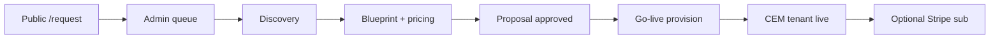

# M8 — Paid customer & SaaS operations

**Purpose:** How Crow onboards **paying customers** after the MEEM lighthouse — without a second `meem-*` codebase fork.

**Prerequisite:** M7 staging/prod deployed ([`M7_CLOUD_DEPLOY.md`](M7_CLOUD_DEPLOY.md)). MEEM remains the **demo proof**; M8 is the **repeatable commercial path**.

**Owner:** Muhanad (platform, provision, CyberCrow, billing hooks). SAREA acceptance stays with **MEEM (Omar)** per customer.

---

## What M8 is / is not

| M8 is | M8 is not |
|-------|-----------|
| Blueprint-driven modules for any org | MEEM-only hardcoded routes |
| Provision + optional ops seed from industry pack | Full ERP before payment |
| Stripe-ready subscription scaffold | Live charges without keys |
| Tenant-scoped RBAC + CyberCrow baseline | Omar building in Crow repo |

---

## Customer lifecycle



| Stage | Crow artifact | Paid gate |
|-------|---------------|-----------|
| Intake | `ImplementationRequest` | — |
| Discovery | `DiscoveryProfile` + answers | — |
| Commercial | `EnterpriseBlueprint` + `BlueprintModule` | Proposal approved |
| Runtime | `Tenant` + `OrganizationModule` | Go-live + modules enabled |
| Billing | `TenantSubscription` (optional) | Stripe configured (M8) |

---

## Onboarding a new paying customer (Muhanad)

### 1. Commercial intake

- Customer completes `/request` or admin creates request.
- Assign modules + security packages → SAR estimate on request/blueprint.

### 2. Discovery & blueprint

- Run discovery (or import template by `industry`).
- `modules.confirmedKeys` drives **BlueprintModule** — same as MEEM pattern.

### 3. Go-live provision

```bash
# After blueprint approved in UI or seed script:
# pipeline.service → provisionAndInitializeTenant
```

| Env | Staging | Production customer |
|-----|---------|---------------------|
| `TENANT_OPS_SEED` | `true` — sample ERP rows | `false` unless contract includes demo data |
| CyberCrow | Always baseline + logistics audit if module enabled | Same |
| SAREA | Personas from discovery | MEEM customer validates layout |

### 4. CLI — second tenant (non-MEEM)

```bash
npm run onboard:tenant -- --slug=acme-logistics --name="ACME Logistics" --industry=logistics --modules=sales,logistics,warehouse,inventory,finance
```

See `scripts/onboard-tenant-from-blueprint.ts` (idempotent where possible).

### 5. Access grants

```bash
USER_EMAIL=admin@customer.com CROW_ROLE=tenant_admin npm run auth:grant-role
USER_EMAIL=admin@customer.com TENANT_SLUG=acme-logistics npm run auth:grant-tenant
```

---

## Module depth vs payment

| Tier | ERP depth |
|------|-----------|
| **Lighthouse (MEEM)** | Full chain demo; optional procurement; rehearsal scripts |
| **Paid starter** | Modules on blueprint only; ops seed optional |
| **Paid enterprise** | All purchased modules + industry pack + CyberCrow tier |

Do **not** enable modules on tenant that were not sold on blueprint.

---

## Stripe (scaffold → live)

| Step | Doc / code |
|------|------------|
| Env keys | [`.env.production.example`](../.env.production.example), [`STRIPE_BILLING.md`](STRIPE_BILLING.md) |
| Config check | `GET /api/billing/status` (`checkoutReady` when keys + `stripe` package) |
| Checkout | `POST /api/billing/checkout` + `billing.service` (Stripe Checkout subscription) |
| Webhook | `POST /api/billing/webhook` — `checkout.session.completed`, subscription updated/deleted |
| Admin | `/admin/subscriptions` — Stripe banner + customer id when present |

Billing is **post-provision** — tenant exists first, subscription records in `tenant_subscriptions`.

---

## MEEM vs customer #2

| | MEEM (lighthouse) | Customer #2+ |
|---|-------------------|--------------|
| Seed | `npm run db:seed:meem` | `onboard:tenant` or full pipeline |
| Slug | `meem-global` | Customer-chosen slug |
| SAREA | Omar @ MEEM | Customer UX owner |
| Full ERP polish | After M8 revenue | Per contract |

---

## M8 checklist

- [ ] M7 staging URL + health green
- [ ] Second tenant provisioned without `meem-global` slug
- [ ] Modules match blueprint only
- [ ] `tenant_admin` can access `/{slug}/dashboard`
- [ ] CyberCrow baseline visible
- [ ] Stripe keys + webhook secret in Vercel/Azure (when billing live)
- [x] Checkout + webhook routes (requires live keys to charge)
- [ ] MEEM E2E deferred until M7+M8 rehearsal window ([`PHASE4_MEEM_E2E.md`](PHASE4_MEEM_E2E.md))

---

## Related

| Doc | Use |
|-----|-----|
| [`ERP_ROADMAP.md`](ERP_ROADMAP.md) | E12 retail pack for non-logistics |
| [`GO_LIVE_PIPELINE.md`](GO_LIVE_PIPELINE.md) | Provision order |
| [`RBAC.md`](RBAC.md) | Roles |
| [`customers/MEEM_GLOBAL.md`](customers/MEEM_GLOBAL.md) | Lighthouse only |

*May 2026 — M8 foundation; full MEEM ERP depth remains revenue-gated.*
