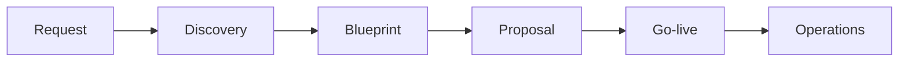

# Lifecycle — the product pipeline

The **lifecycle is the product**. Dashboards, modules, and consoles are outputs of a governed delivery path.

---

## Customer-visible pipeline

```text
Request  →  Discovery  →  Blueprint  →  Proposal  →  Go-live  →  Continuous Improvement
```



**One sentence:** Submit a Request → Crow runs Discovery and builds your Blueprint (transparent pricing) → you approve the Proposal → Go-live activates CEM, CyberCrow, and SAREA on your tenant.

---

## Stage definitions

| Stage | Actor | Outcome |
|-------|-------|---------|
| **Request** | Customer sponsor | Implementation intent — plan, modules, security interest |
| **Discovery** | Crow delivery team | Structured org truth — structure, modules, security, identity, experience |
| **Blueprint** | Crow commercial + engineering | Digital DNA + **SAR estimate** + engine configuration |
| **Proposal** | Client approval | Commercial sign-off on Blueprint package |
| **Go-live** | Crow provision (governed) | Tenant workspace live — three engines seeded |
| **Operations** | Tenant users + admins | Day-to-day CEM, CyberCrow visibility, SAREA-adapted UX |

---

## Why this is the moat

Most ERP vendors start at:

```text
"Here are modules — configure them."
```

Crow starts at:

```text
"We understand and architect your organization first."
```

That produces:

- Fewer surprise scope changes
- Transparent pricing before build
- Readiness gates before provision
- Audit trail of pipeline events (request received → tenant live)

---

## Blueprint = contract

The Blueprint is not a PDF appendix. It is the **contract for what to build**:

| Dimension | Blueprint holds |
|-----------|-----------------|
| Commercial | Line items, bands, VAT policy, AI extras |
| Technical | Module keys, security packages, integration intent |
| Identity | SSO / Entra expectations |
| Experience | SAREA persona scope |
| Readiness | Grouped checks before go-live |
| Provision | Intent to create tenant + engine seeds |

---

## Readiness & go-live (conceptual)

Before go-live, grouped readiness checks validate:

- Modules and workflows defined
- RBAC baseline present
- CyberCrow baseline configured
- SAREA mappings present
- Integrations and org structure captured

Go-live transitions request status to live tenant operations. **Detailed provisioning mechanics are private** — public readers should know *that* governance exists, not internal service call order.

---

## Notifications

Pipeline milestones emit events (conceptual types):

- `request_received`
- `discovery_started`
- `blueprint_ready`
- `tenant_provisioned`

Events are logged for audit; email delivery is optional via Resend in configured environments.

---

## Local-first strategy

```text
Earn the cloud — truth before scale
```

Prove pipeline, seeds, and end-to-end rehearsal on local PostgreSQL before Azure or production URLs. Cloud deployment is wiring once the product earned it.

---

## Related

- [`ARCHITECTURE.md`](ARCHITECTURE.md)
- [`PLATFORM_ENGINES.md`](PLATFORM_ENGINES.md)
- [`ROADMAP.md`](ROADMAP.md)
