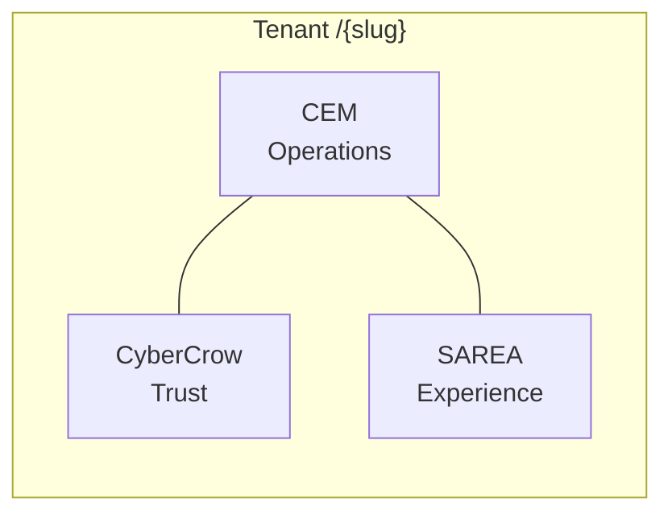

# Platform engines

Crow Ecosystem delivers **three engines** on one tenant after go-live. They are siblings under a single organization slug — not three separate products.

---

## Overview

| Engine | Name | Customer promise | Visual identity |
|--------|------|------------------|-----------------|
| **CEM** | Crow Enterprise Manager | Runs the organization | Cyan / teal |
| **CyberCrow** | Security & trust orchestration | Protects the organization | Violet |
| **SAREA** | Smart Adaptive Role Experience Architecture | Adapts the experience to each role | Rose |

Deep dives: [`CEM.md`](CEM.md) · [`CYBERCROW.md`](CYBERCROW.md) · [`SAREA.md`](SAREA.md)

---

## How engines relate



- **CEM** owns day-to-day operations (modules, workflows, tasks, org structure).
- **CyberCrow** owns security narrative, audit visibility, identity posture, compliance framing.
- **SAREA** owns how authorized users *experience* CEM and CyberCrow surfaces — dashboards, nav density, widgets.

---

## Sharper commercial model

Traditional stacks often charge:

- ERP per seat
- Security as a separate project
- UX customization as consulting

Crow bundles **operations + NCA-aware security + adaptive UX** in a **band-based SAR model** (employee count bands, not unlimited per-user multiplication). For mid-market logistics/holding profiles, illustrative positioning targets **lower monthly SAR** than comparable Odoo or Zoho One stacks with security uplift — with a single Blueprint total instead of three vendor negotiations.

*Illustrative only. Binding pricing is always in the customer Blueprint.*

---

## Roles: easing auth and UI

### Authorization (RBAC)

- Platform roles: admin, implementer, sales, auditor
- Tenant roles: tenant admin, tenant user, module-specific roles (e.g. hub manager, dispatcher)
- **Microsoft Entra** for SSO — one identity, multiple hats via metadata and grants

**RBAC answers:** *May this person open this route or perform this action?*

### Experience (SAREA)

- Personas: executive, operations, logistics, frontline, analyst
- Layouts, navigation groups, widget density
- Runtime applied on tenant dashboard and module entry points

**SAREA answers:** *Given they may act, what should they see first?*

This separation is deliberate architecture — not a styling afterthought.

---

## Engine selection in Discovery

During Discovery, Crow captures:

- **Modules** (CEM keys) — finance, logistics, HR, CRM, …
- **Security packages** (CyberCrow tiers)
- **Experience scope** (SAREA persona density)
- **Optional AI extras** — assistive capabilities quoted in Blueprint, not implied in base tier alone

All three engines are configured **before** go-live — not discovered in production chaos.

---

## Founder engineering scope (public)

**Crow engineering** owns the cross-engine orchestration:

- Discovery and Blueprint engines
- Commercial pricing integration
- CEM tenant runtime and modular ERP surfaces
- CyberCrow trust layer and audit narrative
- SAREA studio hooks and runtime wiring
- Entra identity story and client portal
- Lighthouse demo quality and local-first discipline

Customer-side persona acceptance (e.g. MEEM SAREA liaison) validates experience; platform runtime is Crow engineering.

---

## Golden rule

```text
Discovery understands.
Blueprint defines.
CEM runs.
CyberCrow protects.
SAREA adapts.
```
