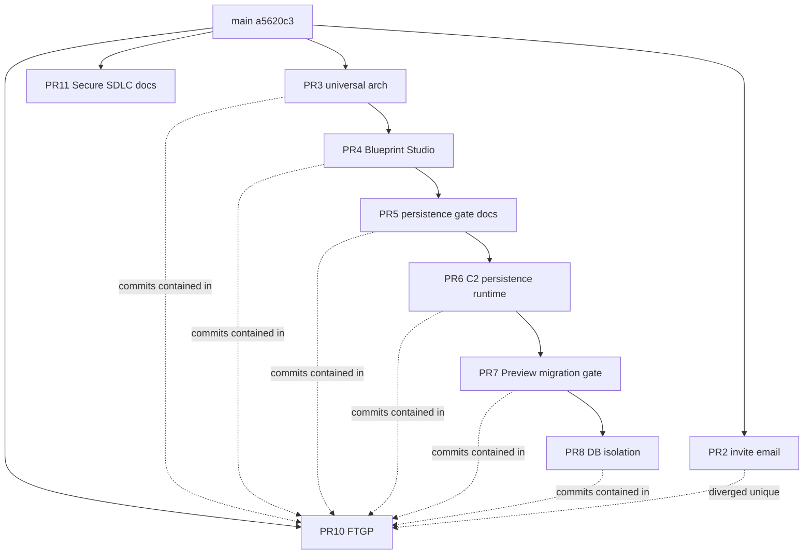

# Crow Open-PR Triage — MGH.PORTFOLIO.REVIEW.1

**Verified Crow repository:** `MuhanadGhurab/crow-ecosystem-platform`  
**Main HEAD:** `a5620c3` — `docs(release): record R2 production stabilization`  
**Review date:** 2026-07-17

## 1. Verified Crow repository

Confirmed by public listing and installation access: **`MuhanadGhurab/crow-ecosystem-platform`**.

## 2. Main branch and HEAD

| Field | Value |
|---|---|
| Default branch | `main` |
| HEAD | `a5620c39f589dc4e4873ada46e07abec573cc154` (`a5620c3`) |

## 3. Open-PR inventory

| PR | Title | Draft (after triage) | Base | Head | Head SHA | Changed files | Commits | Mergeable | CI (current head) |
|---|---|---|---|---|---|---|---|---|---|
| #2 | feat(tenant): add Business Portal invite email delivery | **draft** (converted) | main | feat/m4d-invite-email-delivery | `69cfe0c` | 18 | 1 | true / unstable | verify+postgres-smoke+production-gate success; Vercel hsod failure |
| #3 | feat(core): establish Crow universal operating architecture | **draft** (converted) | main | feat/c0-universal-operating-architecture | `8426f12` | 40 | 3 | true / unstable | same pattern |
| #4 | feat(core): add Enterprise Blueprint Studio | **draft** (converted) | feat/c0-… | feat/c1-enterprise-blueprint-studio | `12edf8d` | 57 | 3 | true / unstable | limited checks; Vercel hsod failure |
| #5 | docs(architecture): approve Blueprint persistence architecture | **draft** (converted) | feat/c1-… | feat/c1-1-blueprint-persistence-gate | `e591344` | 11 | 1 | true / unstable | limited checks |
| #6 | feat(blueprint): C2 persistence runtime (Hybrid Path C) | **draft** (converted) | feat/c1-1-… | feat/c2-blueprint-persistence-runtime | `48e372f` | 59 | 1 | true / unstable | includes Prisma migration |
| #7 | docs(operations): add C2 Preview migration readiness gate | **draft** (converted) | feat/c2-… | feat/c2-1-preview-migration-readiness | `2e4ab29` | 17 | 1 | true / unstable | Preview/migration docs |
| #8 | fix(platform): add database isolation and controlled migration delivery | **draft** (converted) | feat/c2-1-… | feat/c2-2-database-isolation-migration-control | `f0d5bb4` | 451 | 142 | true / unstable | DB isolation + broad C3/auth surface |
| #10 | FTGP foundation… | **draft** (unchanged) | main | feat/first-tenant-golden-path | `8367d95` | 1277 | 385 | true / clean | verify+postgres-smoke+production-gate+Vercel success |
| #11 | docs: ENGINEERING.1 secure SDLC evidence pack | **draft** (unchanged) | main | feat/secure-sdlc-evidence-1 | `09fd257` | 6 | 1 | true / clean | verify+postgres-smoke+production-gate+Vercel success |

## 4. PR classification matrix

| PR | Category | Rationale |
|---|---|---|
| #2 | **G. NEEDS-OWNER-DECISION** (leaning **D** if owner accepts FTGP email stack as replacement) | Unique vs #10 (diverged; invite email paths absent on #10/`main`); runtime email+tenant coupling; not portfolio-wave merge-ready |
| #3 | **D. SUPERSEDED-CLOSE-RECOMMENDED** | Tip is **fully contained** in PR #10 (`compare #10...#3` → ahead_by 0) |
| #4 | **D. SUPERSEDED-CLOSE-RECOMMENDED** | Contained in #10; stacked on #3 |
| #5 | **D. SUPERSEDED-CLOSE-RECOMMENDED** | Contained in #10; docs gate for superseded stack |
| #6 | **D. SUPERSEDED-CLOSE-RECOMMENDED** (+ **F** historically) | Contained in #10; Prisma migration + auth/runtime |
| #7 | **D. SUPERSEDED-CLOSE-RECOMMENDED** | Contained in #10; Preview migration gate |
| #8 | **D. SUPERSEDED-CLOSE-RECOMMENDED** (+ **F**) | Contained in #10; 451 files incl. DB isolation/auth/C3 |
| #10 | **C. BLOCKED-BY-PR-10** (self) / protected FTGP | Must remain OPEN + DRAFT + UNMERGED |
| #11 | **A. MERGE-READY-INDEPENDENT** (portfolio classification: READY-FOR-OWNER-MERGE-AFTER-SECURESKIES) | Documentation-only under `docs/`; no runtime/DB/auth/deploy |

## 5. PR dependency graph

## 6. PR overlap matrix

| | #2 | #3 | #4 | #5 | #6 | #7 | #8 | #10 | #11 |
|---|---|---|---|---|---|---|---|---|---|
| #2 | — | low | low | none | low | none | email/auth themes | **diverged** | none |
| #3–#8 stack | | stacked | stacked | stacked | stacked | stacked | stacked | **fully superseded** | none |
| #10 | unique invite paths | contains | contains | contains | contains | contains | contains | — | none |
| #11 | none | none | none | none | none | none | none | none | — |

## 7. PR #10 protected state

| Check | Status |
|---|---|
| Open | Yes |
| Draft | Yes |
| Unmerged | Yes |
| Head | `8367d95` |
| CI | Green on current head |
| Production relationship | Broad FTGP; roles, Preview protection, request lifecycle, DB/auth surface — **do not merge** in this milestone |
| Older PRs potentially superseded | #3, #4, #5, #6, #7, #8 |
| Owner decision | When/whether to continue FTGP on this branch; whether to close superseded stack |

## 8. PR #11 isolation result

| Check | Result |
|---|---|
| Changed files | `docs/README.public.md`, `docs/secure-sdlc/*` only (6 files) |
| Runtime | None |
| Prisma / migrations / DB client | None |
| Auth / middleware / tenant isolation | None |
| Deployment | None |
| Confidential ops details | Not observed in PR file set |
| CI | Green |
| Classification | READY-FOR-OWNER-MERGE-AFTER-SECURESKIES |

## 9–11. Coupling findings

| Area | Findings |
|---|---|
| Runtime | #2 email send path; #3–#4 studio/lab UI; #6 blueprint runtime services; #8 large platform surface; #10 FTGP |
| Database / migration | #6 Prisma migration + schema; #8 isolation/migration control; #10 FTGP migrations — **do not run** |
| Auth / authorization | #2 invite acceptance; #6 blueprint auth guards; #8 C3 auth docs/code; #10 authoritative roles |

## 12–13. Superseded work and closure recommendations

**Recommend owner close (do not auto-close):** #3, #4, #5, #6, #7, #8  

Evidence: `gh api compare/8367d95...<tip>` → `ahead_by: 0` for each tip.

**#2:** Do not close without owner decision — unique invite-email delivery may still be valuable as cherry-pick or separate milestone.

## 14. Draft-conversion actions

Performed 2026-07-17 by Cursor integration:

- Converted to draft: **#2, #3, #4, #5, #6, #7, #8**
- Left draft: **#10, #11**
- Governance comments: **not posted** (API 403) — owner script provided

## 15. Owner decisions

See owner-decision issue (Portfolio OS) and MERGE-WAVE-1-CHECKLIST.

## 16. Recommended future Crow review order

1. Owner approve closure set for #3–#8  
2. Owner decide #2 (keep for cherry-pick vs close)  
3. Keep #10 draft until dedicated FTGP milestone  
4. Merge #11 only after SecureSkies in portfolio wave (docs-only)

## 17. Audit documentation PR

| PR | Title | State | Purpose |
|---|---|---|---|
| #13 | docs: MGH.PORTFOLIO.REVIEW.1 Crow triage and merge-readiness package | draft | Publishes this review package under `docs/reviews/` on Crow; not a runtime change |

PR #13 is documentation-only for this review. Preferred long-term home remains Portfolio OS `docs/reviews/`.
