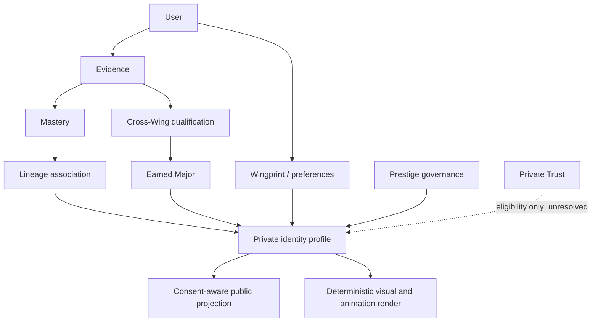
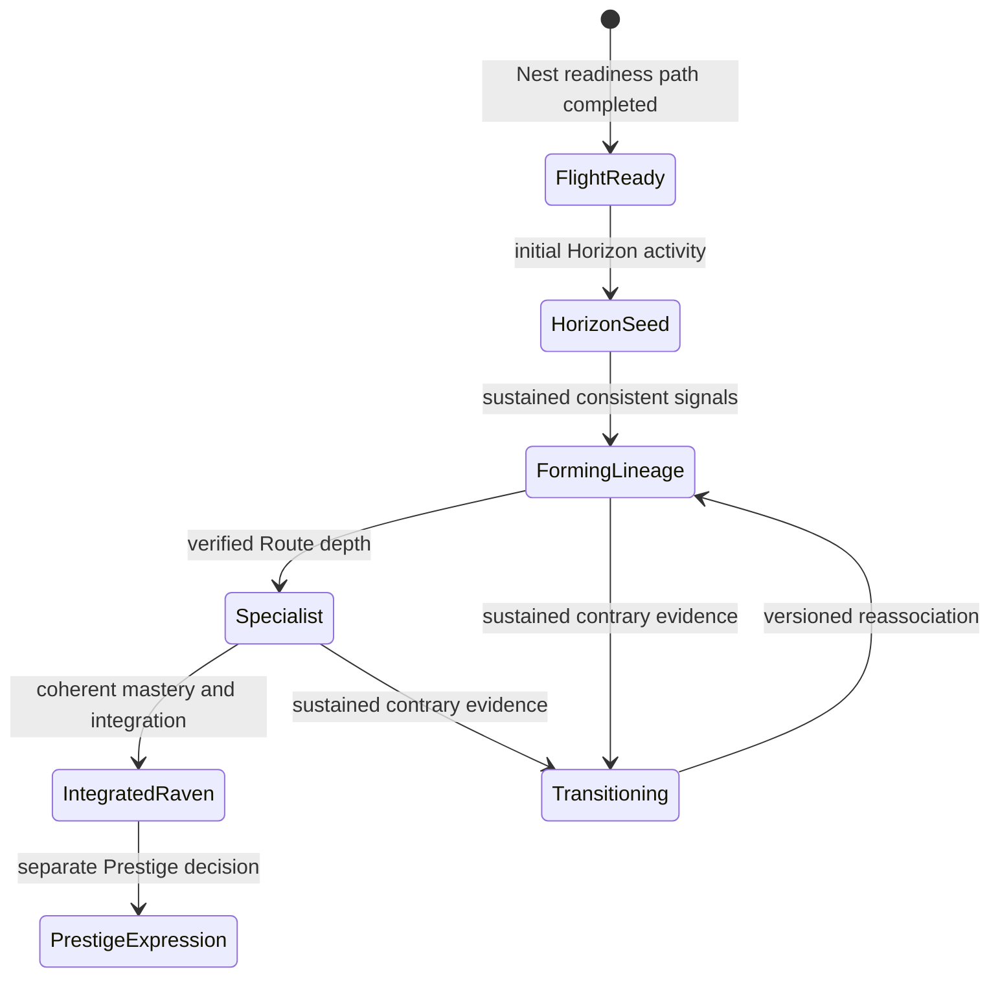
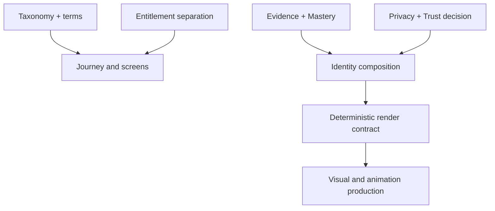

# GHURAVIA CROW IDENTITY SYSTEM
# COMPLETE REPOSITORY IMPORT AND GOVERNANCE HANDOFF PACKAGE

**Package version:** Candidate Intake v0.1  
**Prepared:** 2026-07-22  
**Authority:** Governance candidate; not repository baseline until an approved Gate imports it  
**Product-code authority:** None  
**Repository writes performed:** None  

> **The Crow a user chooses is not automatically the Crow their evidence proves they have become.**

---

## Package map

1. Source inventory
2. Executive system baseline
3. Foundational glossary and identity architecture
4. Five-Horizon structure
5. Complete 5 × 5 matrix
6. Universal registry rules
7. Complete 25-Crow registry
8. Role and Evolved-Role model
9. Cross-Wing and Hybrid grammar
10. Fifty Anchor-Major candidate catalogue
11. Identity modelling
12. Chosen, suggested, and earned identity
13. Identity boundary rules
14. Visual-system manifest
15. Animation priority matrix
16. Acceptance-test catalogue
17. Product and technical impact
18. Recommended governance sequence
19. Repository import manifest
20. Source traceability and decision ledger
21. Contradiction and gap register
22. Final decision registers
23. Executive handoff and required closing blocks

---

## 0. How to read this package

This document is a complete intake candidate for the GHURAVIA Crow Identity System. It preserves explicit approvals, assistant-authored specifications, prototype findings, integration constraints, contradictions, and missing decisions without silently promoting them to the same authority level.

### Decision-status vocabulary

| Status | Meaning in this package |
|---|---|
| `LOCKED` | The founder explicitly approved or instructed that the decision be locked, or it is an explicitly carried GHURAVIA constitutional constraint. |
| `LOCK-READY` | Detailed enough for a governance decision, but no later founder acceptance of that exact detail was found. |
| `CANDIDATE` | A viable proposed choice requiring review. |
| `PROVISIONAL` | Usable for continued design but expected to change. |
| `EXPLORATORY` | Concept or experiment, not a product requirement. |
| `CONFLICTING` | Two source-established positions cannot both govern the same behavior. |
| `OPEN` | A decision is required; the available sources do not settle it. |
| `DEFERRED` | Intentionally postponed without blocking the current baseline. |
| `REJECTED` | Explicitly disallowed or superseded. |

### Claim provenance

- **SOURCE-ESTABLISHED** — directly present in the supplied conversation, prior canon, prototype notes, or carried project constraints.
- **SYNTHESIS** — organized interpretation of source-established material; it adds no new governing rule.
- **RECOMMENDATION — NOT YET AUTHORIZED** — a new proposed resolution or implementation direction.
- **NOT SPECIFIED** — the requested field is absent from the available sources.

### Authority correction applied during intake

The local `GHURAVIA_CROW_IDENTITY_CANON_v1.0.md` calls itself “locked.” The founder's explicit “Please lock this in” followed the 25-Lineage and Cross-Wing study, so the 25 names, capability meanings, Lineage/Major separation, Major qualification grammar, and unique Fusion Signature requirement are treated as `LOCKED`. The exact per-Lineage silhouettes, glyphs, materials, and detailed animation sentences were delivered after that instruction and no later founder acceptance of those exact specifications is available. Those detailed art rules are therefore `LOCK-READY`, despite the source file's self-label. This is a governance classification, not a rejection of the work.

---

# 1. Source inventory

## 1.1 Available project sources

| Source ID | Source | Contents used | Evidentiary limitation |
|---|---|---|---|
| `SRC-001` | Supplied conversation phase: Living Profile World | Crow anatomy versus current activity; Crow Genome; Habitat Genome; environment as portfolio; five feasibility profiles; three-scale rendering conclusion | Message excerpts are available for the later phase, not the entire original project conversation. |
| `SRC-002` | Supplied conversation phase: 5 × 5 Lineages and Crow Signal Language | Five Lineages per Horizon; capability centers; evolution shorthand; motion signatures; accessibility principles; deterministic-production direction | Exact art assets for the 25 were not produced in this phase. |
| `SRC-003` | Supplied conversation phase: Cross-Wing study | Lineage versus Major separation; 50 Anchor-Major structure; 50 working Major candidates; Fusion Signatures; two- and three-Horizon concepts | Major names and curricula were explicitly described as working candidates. |
| `SRC-004` | Founder instruction, “Please lock this in” | Explicitly locks the preceding 25-Lineage/Cross-Wing architecture | It precedes the assistant's full detailed 25-style specification, so it does not automatically ratify every later art detail. |
| `SRC-005` | `GHURAVIA_CROW_IDENTITY_CANON_v1.0.md`, SHA-256 `7f52627d2f1006d0186961eaaf7736d870351264ba6cdc83e83bc648ba1b52dc` | Species invariants; anatomical grammar; 25 detailed visual identities; evolution; three scales; hybrid-safe styling; deterministic state; animation priority; acceptance gates | Assistant-authored baseline; exact post-lock details require founder/governance ratification. |
| `SRC-006` | Five Living Profile PNG prototypes and README | Feasibility evidence for one species across Nest, Operate, Protect, Build × Analyze, and Lead profiles | Concept art only. It does not validate the full 25, thumbnail differentiation, deterministic rendering, accessibility, or production performance. |
| `SRC-007` | `Pasted markdown(1).md`, SHA-256 `d6a059914c698174263596a04655b3adc016293a854aa5506898fbf2a3a1e0bd` | Required output structure, status discipline, integration constraints, governance expectations | It is an extraction brief, not proof that every term named in it was previously defined or approved. |
| `SRC-008` | Supplied GHURAVIA project context | World → Horizon → Route → Stage → Mission; The Nest; access/payment separation; Prestige Classes; environmental/cultural Crow varieties; Arabic-first direction | Context is summarized rather than a verbatim decision log. Used only where clearly identified as a carried integration constraint. |

## 1.2 Prototype inventory

All five images are PNG, 1254 × 1254. Hashes are SHA-256.

| ID | Source asset / hash | Intended state | What it demonstrates | What it does not demonstrate |
|---|---|---|---|---|
| `ART-001` | `01-dune-signal-initiate.png` — `c46167ae9dea4998fd721bc03e7f5f10de7b53f84125212f963876b7afb5193d` | Emerging / The Nest | Sparse cybernetics, origin atmosphere, unfinished ambition | Any one of the 25 Lineages |
| `ART-002` | `02-iron-roost-operator.png` — `c89cef44d556591c063f01a53473ef668af8b37db409f5d1919c0ae27f5e01a7` | Elite / Operate / recovery | Stable technical posture and environment-led operational story | Which Operate Lineage it deterministically represents |
| `ART-003` | `03-crimson-fault-seeker.png` — `9b2ec7ea97791a7d6bb7dc7922ed7361236182957cb0573de4c76994ffe3b427` | Elite / Protect / authorized validation | Crimson can mean controlled testing rather than evil | Full P5 silhouette/glyph compliance or small-size safety |
| `ART-004` | `04-cross-wing-pathfinder.png` — `4d655e462a3028095033f5a4edf4da3e6171ef643448c99f29fb8312afb93f2e` | Prime / Build × Analyze | Two-Horizon narrative and completed/unfinished landmarks | Unique Major identification at token size |
| `ART-005` | `05-obsidian-formation-guide.png` — `9522177eb8cc39a6286ea8ccc43386650c106177d2f6918050aa908dbd37f52f` | Obsidian / Lead / mentorship | Prestige through restraint and flock response | A formal Prestige qualification or private Trust display rule |

Prototype README hash: `e17dfe6b608f8260052f53a90cc49cf3c9f5e97022d98dc28aae33b252015781`.

**Prototype finding — SOURCE-ESTABLISHED, `CANDIDATE` evidence:** The species remained visually coherent and full-scene journeys were distinguishable. The contact-sheet review also shows that color and habitat carry much of the distinction; the prototypes do not yet prove black-silhouette separation or 25-way readability. No prototype is final art.

## 1.3 External contextual references

The following official references support the feasibility of competency composition, professional hybrids, and accessible state-driven animation. They do **not** define GHURAVIA's taxonomy or confer approval:

- ACM/IEEE-CS, *Computing Curricula 2020*: computing is a family/meta-discipline and includes “Computing + X” combinations — <https://www.acm.org/binaries/content/assets/education/curricula-recommendations/cc2020.pdf>
- SFIA 9 skills and responsibility framework — <https://sfia-online.org/en/sfia-9/skills>
- NIST NICE Framework Components v2.2.0, including the DevSecOps Competency Area — <https://www.nist.gov/news-events/news/2026/04/nice-releases-nice-framework-components-v220>
- Google SRE definition and Platform Engineering/golden-path context — <https://sre.google/sre-book/introduction/> and <https://cloud.google.com/blog/products/application-development/golden-paths-for-engineering-execution-consistency>
- Google Cloud MLOps context — <https://docs.cloud.google.com/architecture/mlops-continuous-delivery-and-automation-pipelines-in-machine-learning>
- NIST DevSecOps practices — <https://csrc.nist.gov/pubs/other/2026/03/24/devsecops-practices/iprd>
- W3C WCAG 2.2 flash and interaction-animation guidance — <https://www.w3.org/WAI/WCAG22/Understanding/three-flashes-or-below-threshold.html> and <https://www.w3.org/WAI/WCAG22/Understanding/animation-from-interactions.html>
- Rive and dotLottie state/data-driven animation feasibility — <https://rive.app/docs/getting-started/introduction> and <https://docs.lottiefiles.com/en/format/dotlottie/interactivity>

## 1.4 Known source gap

The conversation-recovery mechanism did not return a reliable complete transcript older than the supplied excerpts. Consequently:

- Alternative and rejected Crow names are `NOT SPECIFIED` unless visible in the supplied material.
- No named Evolved Roles were recovered.
- Wingprint and Flight Signature were named in the intake brief but not fully defined in the evidence sources.
- Exact Route syllabi, mastery thresholds, identity decay, dispute workflow, and deletion behavior remain open.

No missing field is backfilled as an approved decision.

---

# 2. Executive system baseline

## 2.1 What the system is

The GHURAVIA Crow Identity System is a deterministic, evidence-aware identity and presentation system built on five Horizons and 25 Core Crow Lineages. It visually communicates how a person tends to develop and apply capabilities while keeping exact facts in structured data.

```text
5 Horizons × 5 Core Crow Lineages = 25 fixed foundational Lineages
                                      +
                     dynamic evidence-backed Cross-Wing composition
```

**Status:** `LOCKED` for the 5 × 5 foundation and dynamic Cross-Wing principle. The preferred formal noun—“Core Crow,” “Core Crow Archetype,” or “Core Crow Lineage”—remains a terminology decision; this package uses **Core Crow Lineage** to avoid implying a job or selectable skin (`LOCK-READY` synthesis).

## 2.2 Canonical identity layers

| Layer | Meaning | Authority |
|---|---|---|
| GHURAVIA species | Shared realistic cyber-corvid anatomy and material family | `LOCK-READY`; coherent species intent is source-established, exact art standard awaits ratification |
| Core Crow Lineage | One of 25 stable ways of repeatedly practicing a capability | `LOCKED` |
| Developmental state | Flight-Ready → Horizon Seed → Forming Lineage → Specialist → Integrated Raven → Prestige Expression | `LOCK-READY`; the progression shape is source-established, qualification thresholds are open |
| Earned capability | Route-level competence supported by verified Evidence and Mastery | `LOCKED` integration boundary |
| Cross-Wing Major | Earned integration of competencies from two Horizons, bridge competency, capstone, and Evidence | `LOCKED` |
| Fusion Signature | Major-specific visual bridge that distinguishes different Majors using the same Horizons | `LOCKED` requirement; exact signatures `PROVISIONAL` |
| Living Profile World | Full environment representing portfolio, background, relationships, accomplishments, ambitions, and current activity | `LOCKED` concept; implementation details `LOCK-READY` |
| Adaptive Crow Token | Portrait-scale identity view showing Lineage, maturity, one active Major, and current state | `LOCKED` concept; exact renderer `OPEN` |
| Compact Crow Mark | Small-size species mark plus unique Lineage glyph and at most one state signal | `LOCK-READY` |
| Structured profile data | Exact XP, Evidence, Mastery, dates, credentials, and other facts | `LOCKED` separation from artwork |

## 2.3 Crow Genome and Habitat Genome

**Crow Genome — SOURCE-ESTABLISHED, `LOCKED` concept:** capability, development, behavior, contribution, mastery, and identity expressed through anatomy, feathers, markings, modules, posture, and stable motion language.

**Habitat Genome — SOURCE-ESTABLISHED, `LOCKED` concept:** origin, background, portfolio, relationships, accomplishments, and ongoing ambitions expressed through completed landmarks, active construction, unfinished distant structures, weather, signals, and environmental activity.

Long-term identity and present activity must remain distinct:

| Persistent/earned | Current/temporary |
|---|---|
| Anatomy, feather topology, authenticated markings, completed landmarks | Lighting, weather, active machinery, signals, flight trails, active-mission path |
| Verified completed structures | New construction representing work in progress |
| Historical portfolio landmarks | Distant unfinished structures representing ambitions or incomplete Routes |

> **Rank tells where a person stands. The Crow tells how they developed. The environment tells what they built, influenced, and lived through.**

## 2.4 Binding boundaries

| Rule | Source/status | Consequence |
|---|---|---|
| Visual identity ≠ Skill | Carried integration constraint, `LOCKED` | Selecting or buying a visual cannot award capability. |
| Chosen identity ≠ Proven capability | Source-established, `LOCKED` | User preference and declared interest remain separate from evidence-backed identity. |
| Payment ≠ Progression, Mastery, Evidence, Trust, Prestige | Source-established monetization rule, `LOCKED` | Entitlements may open Routes or services, never award outcomes. |
| Evidence precedes Mastery | Carried integration constraint, `LOCKED` | Mastery cannot be minted from time, access, or cosmetics alone. |
| Trust remains private and non-numeric | Carried integration constraint, `LOCKED` | No public Trust score, color, ornament, or leaderboard. |
| Prestige remains separately governed | Source-established, `LOCKED` | Lineage, Major, Rank, payment, or Trust cannot automatically grant Prestige. |
| Origin/habitat/style ≠ capability | Source-established, `LOCKED` | Desert, city, forest, farm, outskirts, pirate, hooded, mechanical, cyber, or digital styling cannot imply earned skill. |
| No permanent career prison | Source-established, `LOCKED` | Users may grow across Horizons; sustained evidence may shift emphasis without deleting history. |

## 2.5 User influence versus system proof

Users may influence their identity through decisions and sustained activity and may personalize harmless presentation preferences such as atmosphere, viewing angle, reduced motion, or selected portfolio showcase. They cannot manually equip a profession, Evidence seal, Prestige response, Trust indicator, achievement landmark, or Fusion Signature.

```text
User choice → interest and presentation
Verified action → capability and Mastery
Integrated capstone → Cross-Wing Major
Governed review → Prestige when applicable
Entitlement → access only
```

**Status:** `LOCKED` at the boundary level. Exact override, rejection, correction, and hiding controls are `OPEN`.

---

# 3. Foundational glossary and identity architecture

| Term | Arabic naming candidate | English name | Exact working definition | Creation mode | Static/dynamic | Evidence-backed | Relationships | Status / unresolved question |
|---|---|---|---|---|---|---|---|---|
| Wingprint | بصمة الجناح | Wingprint | `RECOMMENDATION — NOT YET AUTHORIZED`: user-owned presentation and declared-interest profile used during onboarding and personalization; it must not assert proven capability. | Chosen/declarative | Dynamic | No | May seed recommendations; must remain separate from earned Lineage, Evidence, Mastery, Trust, and Prestige. | `OPEN`; prior exact definition not recovered. |
| Core Crow Archetype | نموذج الغراب الجوهري | Core Crow Archetype | Governance record for one of the fixed 25. Proposed as the repository entity behind the user-facing Lineage. | Governed | Versioned/static per version | Meaning is fixed; user association is evidence-informed | Belongs to one Horizon; defines protected capability meaning and differentiation. | `LOCK-READY` mapping; term itself not explicitly selected. |
| Core Crow Lineage | سلالة الغراب الجوهرية | Core Crow Lineage | One of 25 stable visual-behavioral expressions of how a person repeatedly practices a capability; not a job, rank, course, skin, or static image. | Inferred from sustained journey; governed model | Stable but revisable through sustained contrary evidence | Association must be evidence-informed, not granted by selection | One per Horizon model; may be primary or secondary in Cross-Wing composition. | Meaning and roster `LOCKED`; Arabic and formal noun `OPEN`. |
| Role | الدور | Role | Functional contribution represented by a Lineage; not an employment guarantee or permission bundle. | Governed descriptor | Static in taxonomy | User claim requires evidence | Sits under Horizon; informs Routes and team contribution. | `LOCK-READY`; must not be confused with NICE/SFIA job roles. |
| Specialty | التخصص الدقيق | Specialty | Narrower capability center inside a Lineage, used to distinguish it from neighbors. It does not replace Route competency. | Governed descriptor | Static in taxonomy | User expression requires evidence | Helps map Routes, Missions, and Cross-Wing affinities. | `LOCK-READY`. |
| Evolved Role | الدور المتطور | Evolved Role | A named functional identity beyond a base role. No named or qualification model was recovered. It must not be assumed to equal Specialist, Integrated Raven, Rank, or Prestige. | NOT SPECIFIED | NOT SPECIFIED | Must be evidence-backed if adopted | Could coexist with Lineage and Cross-Wing Major, but relationship is open. | `OPEN`; no list exists. |
| Flight Signature | توقيع التحليق | Flight Signature | `RECOMMENDATION — NOT YET AUTHORIZED`: versioned, computed presentation signature combining primary Lineage, active Major, maturity, current state, and allowed preferences. | Computed | Dynamic/versioned | Partly | Candidate public projection of identity state; not a new Crow. | `OPEN`; term named but not defined in sources. |
| Cross-Wing Profile | ملف عابر الأجنحة | Cross-Wing Profile | Evidence-backed profile showing validated capability across Horizons, including historical Majors and current emphasis. | Earned/computed | Dynamic/versioned | Yes | Contains active and historical Cross-Wing components; only one Major needs to dominate the Crow at a time. | Concept `LOCKED`; exact public/private fields `OPEN`. |
| Hybrid Identity | هوية تكاملية | Hybrid Identity | Descriptive concept for an integrated multi-Horizon identity. It does not create a 26th+ fixed Core Crow. “Cross-Wing” is preferred product language. | Earned | Dynamic/versioned | Yes | Expressed through primary chassis, secondary architecture, Fusion Signature, and capstone landmark. | Mechanism `LOCKED`; “Hybrid Crow” as a fixed species `REJECTED`. |
| Visual Form | الهيئة البصرية | Visual Form | Deterministic rendered output of governed identity state at world, portrait, or compact scale. | Computed | Dynamic | Must not overclaim evidence | Uses versioned assets; exact facts stay structured. | `LOCKED` concept; stack `OPEN`. |
| Earned Capability Identity | هوية القدرة المكتسبة | Earned Capability Identity | Private canonical capability state derived from validated Evidence and Mastery, distinct from declared interest and visual preference. | Earned/computed | Dynamic/versioned | Yes | May inform Lineage and Cross-Wing projection; cannot be bought. | `LOCKED` boundary; exact algorithm `OPEN`. |
| Major | تخصص تكاملي | Cross-Wing Major | Curated integrated learning outcome requiring Route Cluster A + Route Cluster B + integration competency + capstone + verified Evidence. | Earned | Historical record stable; active selection dynamic | Yes | Has unique Fusion Signature; access entitlement cannot confer it. | Formula `LOCKED`; exact curricula and final names `OPEN/PROVISIONAL`. |
| Fusion Signature | بصمة الاندماج | Fusion Signature | Major-specific bridge mechanism and motion sentence that distinguishes different integrated outcomes even within the same Horizon pair. | Earned through Major | Stable per Major version; active visibility dynamic | Yes | Appears at sternum/wing root/semantic bridge and in environment. | Requirement `LOCKED`; designs `PROVISIONAL`. |
| Prestige Class | فئة الهيبة | Prestige Class | Separately governed recognition class; accepted top classes are Elite Raven, Prime Raven, and Obsidian Raven, with Obsidian highest. | Governed/earned; review model not specified here | Versioned | Not automatically; criteria separate | Affects restrained presence/environment, not capability taxonomy or Trust publication. | Separation and names `LOCKED`; qualification and revocation `OPEN`. |
| Rank | الرتبة | Rank | Progress coordinate indicating where a user stands; it does not explain capability pattern. | Progression system | Dynamic | Per progression rules | Separate from Lineage, Major, Mastery, Trust, and Prestige. | Separation `LOCKED`; formula outside this package. |
| Evidence | الدليل الموثق | Evidence | Verified artifact, performance, observation, or outcome supporting a capability claim. | Submitted/captured and verified | Versioned/audited | It is the proof basis | Precedes Mastery and Cross-Wing award; may become authenticated mark/landmark. | `LOCKED` principle; verification taxonomy `OPEN`. |
| Mastery | الإتقان | Mastery | Evidence-backed degree of demonstrated capability; not a visual choice, XP total, or entitlement. | Computed/governed | Dynamic/versioned | Yes | Drives integration depth; does not itself grant Prestige or Trust. | `LOCKED` boundary; thresholds `OPEN`. |
| Trust | الثقة | Trust | Private, non-numeric assurance construct governed separately from capability and prestige. | Governed/computed outside this package | Dynamic/private | Basis NOT SPECIFIED | May gate high-risk/high-trust actions; must not be publicly visualized as a score. | Privacy rule `LOCKED`; Canon visual-input use is `CONFLICTING`. |

### Preferred terminology decision

`Cross-Wing` is the preferred user-facing term for integrated multi-Horizon development. `Hybrid` may appear in technical explanation, but **Hybrid Crow** must not imply a newly fixed archetype. `Cross-skilled Crow`, `Cross-Horizon Crow`, and `Composite Identity` were not approved as primary names. `Flight Signature` remains undefined rather than rejected.

---

# 4. Five-Horizon structure

## 4.1 Horizon matrix

| Horizon | Arabic candidate | Purpose and philosophy | Problems/capabilities | Boundaries and overlap | Visual/environment/motion language | Cross-Wing affinities | Prohibited stereotypes | Status |
|---|---|---|---|---|---|---|---|---|
| Operate | التشغيل | Keep technology and services healthy, usable, recoverable, and flowing. Reliability is practiced through observation, response, continuity, automation, and service care. | Availability, performance, routing, incident/problem work, recovery, automation, ITSM/support | Operates paths that Build creates; restores service while Protect contains cyber harm; measures live systems while Analyze interprets deeper patterns; does not own governance. | Repeating bands, live channels, loops, lanes, status nodes, repaired seams; operational habitats and rhythmic pulses. | Build, Analyze, Protect, Lead through reliability, observability, resilience, service, and transformation Majors. | “IT janitor,” low-status helpdesk caricature, uncontrolled machinery, or equating uptime with leadership. | Horizon and five-Lineage membership `LOCKED`; Arabic/details `LOCK-READY`. |
| Build | البناء | Create dependable structures, systems, interfaces, products, and precise implementations. Construction includes experimentation and integration, not only coding. | Architecture, requirements, product prototyping, infrastructure/cloud/hardware, APIs/distributed systems, quality/performance | Creates systems; does not claim operational reliability without Operate, validated security without Protect, evidence-based insight without Analyze, or authority/governance without Lead. | Trusses, plates, couplers, scaffolds, interlocks, workshops, towers, bridges; assemble/test/lock verbs. | Strong across all pairs, including SRE/platform, AI/data, secure systems, and architecture/delivery. | Construction-worker costumes, tool belts, “developer only,” blueprints as rank, or polished hardware as proof. | `LOCKED` structure; art details `LOCK-READY`. |
| Analyze | التحليل | Discover patterns, causes, maps, provenance, and useful synthesis. Inquiry must remain traceable and decision-relevant. | Analytics, statistics, research, root cause, topology/modeling, data quality/provenance, BI/decision support | Does not operate traffic, create interfaces, police boundaries, or govern controls merely because it observes them. General analysis is not threat hunting. | Lenses, micro-etching, contour films, trace filaments, spectral layers; observatories, archives, living maps; focus/trace/synthesize verbs. | Observability, AI/product, security analytics/forensics, strategy/data governance. | Spying, suspicion, omniscience, “genius scientist” costume, or treating all anomalies as malicious. | `LOCKED` structure; art details `LOCK-READY`. |
| Protect | الحماية | Detect, constrain, investigate, validate, contain, and recover from authorized security risks without moralizing technical roles. | Monitoring/detection, security architecture/IAM, hunting/forensics, incident containment/resilience, adversarial validation | Security validation is authorized; Protect does not own all reliability, all evidence, all analysis, or all governance. Crimson is a test/fault signal, not evil. | Dense overlaps, sensor apertures, boundary arcs, segmented containment surfaces; ranges, gates, protected zones; scan/close/follow/contain/probe verbs. | SecOps, secure architecture, forensics, cyber leadership, and every technical Horizon. | Weapons, militarized aggression, villain/hero color coding, police imagery, “red equals bad,” or unauthorized hacking glamour. | `LOCKED` structure; art details `LOCK-READY`. |
| Lead | القيادة | Develop people, direct missions, coordinate dependencies, govern systems, and choose future direction. Leadership is relational and accountable, not ornamental status. | Mentoring, delivery/program command, product/service coordination, GRC/assurance, strategy/innovation | Does not acquire technical competence by authority. Governance is not evidence provenance; coordination is not interface engineering; mentoring is not service support. | Long directional vanes, navigation filaments, formation vectors, restrained orbitals; flock/environment responds; signal/synchronize/assure/pathfind verbs. | Delivery, operations transformation, architecture, decision intelligence, security governance/crisis. | Crowns, thrones, dominance poses, gender coding, executive clothing, followers bowing, or Prestige-by-title. | `LOCKED` structure; art details `LOCK-READY`. |

## 4.2 Exactly 5 × 5

The fixed foundation is exactly:

```text
Operate: 5
Build:   5
Analyze: 5
Protect: 5
Lead:    5
Total:  25 Core Crow Lineages
```

No alternative count is present in the available source. The earlier “starter family” framing and later “Core Crows” framing refer to the same 25-model foundation; whether the repository noun is Archetype or Lineage remains open.

---

# 5. Complete 5 × 5 Core Crow matrix

Arabic names below are `CANDIDATE` translations and are not locked.

| Horizon | Core Crow 1 | Core Crow 2 | Core Crow 3 | Core Crow 4 | Core Crow 5 |
|---|---|---|---|---|---|
| Operate | `CRW-OPR-01` **حافظ الإيقاع / Rhythm Keeper** — technical reliability and observability (`LOCKED`) | `CRW-OPR-02` **ملاح التدفق / Flow Navigator** — networks, routing, traffic (`LOCKED`) | `CRW-OPR-03` **صانع التعافي / Recovery Smith** — incidents, continuity, recovery (`LOCKED`) | `CRW-OPR-04` **قائد الأتمتة / Automation Conductor** — scripting, orchestration, IaC (`LOCKED`) | `CRW-OPR-05` **راعي الخدمة / Service Steward** — ITSM, support, service experience (`LOCKED`) |
| Build | `CRW-BLD-01` **باحث الأُطر / Framework Seeker** — architecture and foundations (`LOCKED`) | `CRW-BLD-02` **شرارة النماذج / Prototype Spark** — experimentation and product validation (`LOCKED`) | `CRW-BLD-03` **صانع الأنظمة / Systems Crafter** — infrastructure, hardware, integration (`LOCKED`) | `CRW-BLD-04` **ناسج الشبكات / Network Weaver** — APIs, interfaces, distributed ecosystems (`LOCKED`) | `CRW-BLD-05` **المعماري الصامت / Silent Architect** — precision, quality, performance (`LOCKED`) |
| Analyze | `CRW-ANL-01` **باحث الأنماط / Pattern Seeker** — analytics, anomaly, prediction (`LOCKED`) | `CRW-ANL-02` **المراقب العميق / Deep Observer** — research, experiment, root cause (`LOCKED`) | `CRW-ANL-03` **رسّام الإشارات / Signal Cartographer** — maps, topology, models (`LOCKED`) | `CRW-ANL-04` **متتبّع الأدلة / Evidence Tracker** — provenance, validation, traceability (`LOCKED`) | `CRW-ANL-05` **واصل الرؤى / Insight Connector** — synthesis, BI, decision support (`LOCKED`) |
| Protect | `CRW-PRT-01` **الرقيب اللازوردي / Azure Watcher** — monitoring and detection (`LOCKED`) | `CRW-PRT-02` **حارس الحدود / Boundary Warden** — security architecture, IAM, hardening (`LOCKED`) | `CRW-PRT-03` **صائد الأثر / Trace Hunter** — threat hunting and investigation (`LOCKED`) | `CRW-PRT-04` **حارس الأزمات / Crisis Guardian** — containment, response, cyber resilience (`LOCKED`) | `CRW-PRT-05` **المُحقّق القرمزي / Crimson Validator** — authorized adversarial validation (`LOCKED`) |
| Lead | `CRW-LED-01` **دليل السرب / Formation Guide** — mentoring and capability development (`LOCKED`) | `CRW-LED-02` **قائد المهمة / Mission Commander** — project/program/delivery command (`LOCKED`) | `CRW-LED-03` **المنسّق الهادئ / Quiet Coordinator** — stakeholders and dependency coordination (`LOCKED`) | `CRW-LED-04` **ناظر الأنظمة / Systems Governor** — governance, risk, quality, assurance (`LOCKED`) | `CRW-LED-05` **مستكشف الآفاق / Horizon Pathfinder** — strategy, innovation, future direction (`LOCKED`) |

## 5.1 Twenty-five-way comparison matrix

| ID | Purpose/scope | Primary capability | Dominant visual motif (`LOCK-READY`) | Animation priority | Closest overlap / exact guard | Strong affinities |
|---|---|---|---|---|---|---|
| O1 | Sustain measurable reliability | Availability, performance, observability | Paired spinal pulse bands | Internal health rhythm | L3 coordinates people, not system health | B5, A1, P1, L2 |
| O2 | Keep traffic and connectivity flowing | Routing, networks, traffic | Branching feather lanes | Reroute | B4 builds interfaces; A3 maps topology | B4, A3, P2, L3 |
| O3 | Restore and improve after failure | Incident/problem/continuity | Repaired seam and fallback plates | Restore | P4 contains cyber crisis; B3 builds mechanisms | B3, A4, P4, L4 |
| O4 | Replace repeat work with governed automation | Scripting, orchestration, IaC | Stepped programmable modules | Cascade/confirm | B1 designs structure; L5 directs transformation | B1, A2, P5, L5 |
| O5 | Maintain usable supported services | ITSM, support, service experience | Receiver/acknowledgement nodes | Resolve/acknowledge | L1 develops people; L3 coordinates stakeholders | B2, A5, P3, L1 |
| B1 | Establish architectural foundation | Architecture, requirements, frameworks | Exposed scaffold/truss | Draft/lock | B5 perfects implementation | O4, A3, P2, L5 |
| B2 | Validate ideas through iteration | Prototyping, product experiment | Asymmetric replaceable modules | Test/revise | A2 studies causes; O5 supports live service | O5, A1, P5, L3 |
| B3 | Integrate practical technical systems | Infrastructure, cloud, hardware | Dense couplers/mechanics | Fit/engage | O3 repairs; P4 contains | O3, A4, P4, L2 |
| B4 | Create dependable technical connections | APIs, interfaces, distributed systems | Woven bridges/nodes | Connect/exchange | O2 routes; A5 synthesizes information | O2, A5, P1, L1 |
| B5 | Deliver high-assurance implementation | Quality, precision, performance | Hidden micro-lattice | Refine | B1 structures; A2 researches | O1, A2, P3, L4 |
| A1 | Reveal regularities and anomalies | Analytics, statistics, prediction | Repetition plus outlier | Align/reveal | P1 detects security events | O1, B2, P1, L2 |
| A2 | Reach deep causal understanding | Research, experiment, root cause | Layered spectral optic | Focus/resolve | P3 pursues threats; B5 implements | O4, B5, P5, L5 |
| A3 | Model relationships and topology | Visualization, maps, digital twins | Contours/routes | Trace/map | O2 routes live traffic; B1 architects | O2, B1, P2, L1 |
| A4 | Establish provenance and traceability | Data quality, validation, evidence chain | Ledger segments/seals | Verify/seal | L4 governs controls; P3 investigates threats | O3, B3, P3, L4 |
| A5 | Turn sources into decision insight | BI, synthesis, communication | Converging channels/lens | Synthesize/emit | B4 connects systems; L3 coordinates decisions | O5, B4, P4, L3 |
| P1 | Maintain defensive awareness | Monitoring, detection | Distributed sensor apertures | Sweep/flag | A1 general pattern analysis | O1, B4, A1, L2 |
| P2 | Design and enforce authorized boundaries | IAM, hardening, security architecture | Layered boundary arcs | Admit/close | B1 architectures generally; L4 governs | O2, B1, A3, L4 |
| P3 | Follow security-relevant traces | Hunting, investigation, forensics | Directional optic/trail | Lock/follow | A2 investigates meaning; A4 provenance | O5, B5, A4, L5 |
| P4 | Contain and recover from cyber crisis | Response, containment, resilience | Expandable containment zones | Contain/recover | O3 technical restoration | O3, B3, A5, L3 |
| P5 | Safely test defenses and assumptions | Authorized adversarial testing | Articulated probe/proof junction | Probe/confirm | B2 experiments; never unauthorized attack | O4, B2, A2, L1 |
| L1 | Grow people and community capability | Mentoring, learning, enablement | Guidance arcs/open formation | Align/strengthen | O5 service support | O5, B4, A3, P5 |
| L2 | Direct accountable delivery | Project/program/mission command | Ordered mission vectors | Sequence/confirm | L5 chooses future; O1 runs health | O1, B3, A1, P1 |
| L3 | Coordinate dependencies and stakeholders | Product/service coordination | Quiet node web | Synchronize | B4 technical interfaces; O1 technical rhythm | O2, B2, A5, P4 |
| L4 | Govern risk, control, quality, assurance | GRC and governance | Assurance orbit/seals | Review/assure | A4 verifies facts; P2 enforces boundaries | O3, B5, A4, P2 |
| L5 | Choose and adapt strategic direction | Strategy, innovation, foresight | Compass tail/future branches | Evaluate/commit | L2 executes mission | O4, B1, A2, P3 |

---

# 6. Universal Core Crow registry rules

The 25 detailed records in the next section inherit these constraints. Repetition here does not remove the requirement to assess each Crow individually.

## 6.1 Universal functional boundaries

- Selecting a Crow, declaring interest, buying access, accumulating time, or gaining XP alone does not prove capability.
- Expected Routes and Missions are `NOT SPECIFIED` until curriculum governance maps them.
- Listed tools/technologies are contextual examples, not locked curricula or employment guarantees.
- Valid Evidence may include reviewed artifacts, observed performance, reproducible lab results, authenticated project outcomes, traceable decisions, or capstones appropriate to the capability.
- Invalid proof includes a cosmetic selection, payment receipt, attendance alone, self-description, unverified upload, popularity, or leaderboard position.
- A Lineage grants no permission, tenant role, security authorization, Trust status, Prestige, or real-world license.

## 6.2 Universal identity development

| State | Meaning | Evidence boundary |
|---|---|---|
| Flight-Ready | Completed/cleared The Nest baseline; no professional claim | Readiness outcome only |
| Horizon Seed | First small Horizon trait | Initial activity; not enough to claim a Lineage |
| Forming Lineage | Sustained pattern reveals one of five styles | Multiple consistent signals; threshold open |
| Specialist | Route depth transforms a major region | Verified Route Evidence and Mastery required |
| Integrated Raven | Capability, Evidence, and Cross-Wing development integrate coherently | Qualification model open |
| Prestige Expression | Restrained presence and environment/flock response | Separate Prestige governance; never automatic |

Three anchors must remain recognizable through evolution: silhouette cue, anatomical/material motif, and motion verb. A single course or temporary activity cannot switch Lineage. Sustained contrary evidence may change emphasis through a versioned transition; exact switching thresholds are `OPEN`.

## 6.3 Universal product/privacy rules

- The Lineage itself is inferred/earned, not a selectable skill skin.
- Harmless atmosphere and view preferences may be selectable.
- A public projection must be consent-aware and must not reveal private Trust, sensitive Evidence, protected origin, or hidden learning history.
- Exact Evidence, Mastery, credentials, and dates live in structured profile data with visibility controls.
- Publication dependencies, correction rights, retention, and deletion are `OPEN` and require privacy/governance review.

## 6.4 Universal visual/accessibility rules

- One recognizable crow skeletal/anatomical species; no human uniform, fantasy crown, weapon, or costume-as-capability.
- Identity must survive monochrome and glow-off tests; color is a signal, never a Lineage key.
- No rapid strobe; no saturated-red large-area flashing; one-shot milestones do not loop.
- Reduced motion replaces travel/orbit/ripple with static state, shape, label, or slow opacity change.
- Gender coding, moral role coding, cultural caricature, and profession caricature are prohibited.
- Environmental varieties stay separate from functional Lineages and earned proof.

---

# 7. Complete 25-Crow registry

## 7.1 Operate Lineages

### 7.1.1 CRW-OPR-01 — Rhythm Keeper

#### Identity

- **Stable ID:** `CRW-OPR-01` (repository candidate); prior shorthand `O1`.
- **Horizon:** Operate.
- **Arabic name:** حافظ الإيقاع (`CANDIDATE`).
- **English name:** Rhythm Keeper (`LOCKED`).
- **Alternative names considered / rejected names:** `NOT SPECIFIED`.
- **Short title:** Reliability and observability keeper (`LOCK-READY`).
- **One-line identity:** Keeps live systems measurable, stable, and able to return to a healthy rhythm.
- **Role:** Technical reliability practitioner; **specialty:** availability, performance, health, SLO/observability thinking.
- **Evolved-role name:** `NOT SPECIFIED`; Prestige or Integrated Raven is not an Evolved Role.
- **Decision status:** Name, Horizon, protected meaning `LOCKED`; expanded role wording `LOCK-READY`.

#### Functional Model

- **Primary mission / responsibilities:** Observe health, establish reliable operating rhythm, identify degradation, and support controlled restoration; monitor availability, latency, capacity, saturation, and service signals without claiming ownership of every incident.
- **Problems solved / common tasks:** Unstable services, invisible degradation, capacity risk, alert quality, service-level measurement, operational tuning (`CANDIDATE` task examples).
- **Capabilities represented:** Reliability, availability, performance, observability, capacity awareness.
- **Expected Routes / Missions:** `NOT SPECIFIED`; candidate Missions include defining service indicators, interpreting telemetry, and validating a stability improvement.
- **Associated tools/technologies:** Metrics, logs, traces, dashboards, alerting, SLO/error-budget methods (`CANDIDATE`, not curriculum).
- **Valid Evidence:** Reviewed health model, reproducible telemetry analysis, validated SLO, capacity study, or measured reliability improvement.
- **Behaviours that do not prove capability:** Long online time, watching dashboards, buying an advanced Route, or selecting pulse cosmetics.
- **Strengths / limitations:** Strong at steady-state health and measurable reliability; may not explain root cause as deeply as A2 or own recovery engineering as O3.
- **Explicit non-responsibilities:** People coordination (L3), interface construction (B4), security detection ownership (P1), Prestige governance.
- **Failure modes / misuse risks:** Vanity dashboards, alert overload, optimizing one metric at user expense, representing uptime as Trust or leadership.

#### Differentiation

- **Nearest overlaps:** L3 Quiet Coordinator, P1 Azure Watcher, O3 Recovery Smith.
- **Exact distinction:** O1 synchronizes technical health; L3 synchronizes people/dependencies. O1 observes general service health; P1 detects defensive security signals. O1 sustains/quantifies reliability; O3 specializes in fault isolation and restoration.
- **Why separate:** Reliability is a continuous operating discipline distinct from coordination, defensive detection, and incident recovery.
- **Overlap/duplication/confusion risk:** High with generic “monitoring” labels; clarify the object, success measure, and evidence.
- **Boundary tests:** If the output is a health objective/telemetry improvement, O1 leads; if it is a security detection, P1; if a restored failed service, O3; if a synchronized team plan, L3.

#### Identity Development

- **Beginner → developing → proven expression:** Single spinal health pulse → redundant signal bands → seamless uptime lattice (`LOCKED` evolution shorthand).
- **Evolved-role expression:** `NOT SPECIFIED`; a Prestige expression would reduce ornament and increase environmental stability, not rename the role.
- **Evolution nature:** Visual plus evidence-backed functional depth; automatic visual change without evidence is prohibited.
- **May change:** Signal density, redundancy, integration, environmental scale; **must remain:** compact balance, paired rhythm, spinal bands; **cannot be earned automatically:** Evidence, Mastery, Major, Trust, Prestige.
- **Evidence/Mastery/Prestige relationship:** Evidence supports reliability Mastery; Mastery controls integration depth; Prestige is separately governed.
- **Status:** Evolution anchors `LOCKED`; thresholds and evolved role `OPEN`.

#### Cross-Wing Relationships

- **Strong affinities / complementary Crows:** B5 Silent Architect (SRE), A1 Pattern Seeker (capacity/reliability intelligence), P1 Azure Watcher (SecOps engineering), L2 Mission Commander (major incident command).
- **Tension/contrast:** Speed of change versus stability; alert sensitivity versus operational noise.
- **Likely hybrid profiles:** Site Reliability Engineering, Reliability & Capacity Intelligence, Security Operations Engineering, Reliability & Major Incident Command (`PROVISIONAL` Major names).
- **Invalid interpretations:** “High uptime means trusted person,” “monitoring equals security analyst,” or “SRE earned from two unrelated course completions.”
- **Team role:** Supplies measurable health and stability constraints to builders, defenders, analysts, and mission leads.
- **Status:** Affinities `LOCK-READY`; Major curricula `OPEN`.

#### Visual Specification

- **Silhouette/body/proportions/stance:** Compact balanced body, tight tail, centered grounded stance and calm center of gravity.
- **Face/eye/wing language:** Attentive neutral eye; wings close enough to read steady state; no aggressive scanning.
- **Primary/secondary motifs:** Paired spinal nodes, parallel rib bands, evenly spaced status seams; circular uptime core in habitat.
- **Tools/symbols/environment/habitat:** Abstract telemetry and redundant status rings; no literal dashboard costume. Compact glyph: three equal pulse bars inside a ring.
- **Equipment/costume:** Integrated under-feather channels only; no uniform.
- **Color/contrast/texture/material/light:** Obsidian base; low-contrast cyan health pulse; identity must survive grayscale/glow-off; matte integrated channels rather than bright armor.
- **Unique elements:** Compact center, paired rhythm, spinal topology. **Shared Operate:** bands, lanes, loops, status nodes.
- **Accessibility/cultural sensitivity:** Slow pulse; no heartbeat imagery that implies medical status; no flashing; no class/status reading from brightness.
- **Prohibited interpretations:** Life/health diagnosis, moral “healthy user,” public Trust meter, or rank aura.
- **Final-art status:** `LOCK-READY`; not validated by a dedicated contact sheet.

#### Animation Specification

- **Idle:** Slow synchronized paired pulse and feather micro-adjustment.
- **Movement:** Pulse remains phase-stable across gait/flight.
- **Interaction/working:** Measure → pulse → resynchronize.
- **Success:** One stable ring closes; **failure/recovery:** amber drift resolves to cyan rhythm without strobe.
- **Evolved-role animation:** `NOT SPECIFIED`; Prestige would be rarer and subtler.
- **Cross-Wing interaction:** Active Major replaces ambient sentence, e.g. SRE measure → risk rises → stabilize.
- **Emotion/timing/energy/motion silhouette:** Calm, regular, 5–7 second ambient cycle, low energy, compact motion.
- **Reduced motion:** Static three-bar state plus text/status; no travel.
- **Priority/dependencies/complexity/risks:** Lineage ambient is fourth after safety, mission, and Major; shared spine rig; low–medium complexity; risk of false “live health” implication.
- **Status:** Sentence `LOCK-READY`; timings `OPEN`.

#### Product Usage

- **Appearances:** Onboarding suggestion, Horizon/Route context, profile token, Living Profile, community card, learning feedback, and Live Sky only when visibility rules permit.
- **Wingprint usage:** May be suggested from declared reliability interest, but Wingprint cannot award O1.
- **Selectable/earned/inferred:** Presentation preference selectable; Lineage inferred from sustained evidence-informed behavior; capability earned.
- **Leaderboard/recognition:** No universal leaderboard identity or public Trust; recognition must reference verified scope.
- **Public display/privacy:** User may hide projection; exact telemetry Evidence may be sensitive. Publication controls `OPEN`.
- **Implementation Gate:** Taxonomy 1B, model 1C, visual/animation 1D; no implementation before approvals.

#### Acceptance Criteria

- Must distinguish from L3, P1, and O3 in silhouette, object, motion, and label; pass monochrome and 24–48 px glyph tests.
- Animation must communicate stable technical rhythm without flashing or medical/public-Trust implication.
- Hybrid must retain O1 anchor while unique Major signature dominates; payment/XP/selection must never produce proof marks.
- Cultural/accessibility review and target-user comprehension required; formal test IDs: `ROL-001`, `VIS-001`, `ANI-001`, `EVD-001`, `PAY-001`.
- **Regression risks / unresolved tests:** Generic circular pulses may collide with L4 orbit; precise mobile luminance and comprehension thresholds are `OPEN`.

### 7.1.2 CRW-OPR-02 — Flow Navigator

#### Identity

- **Stable ID:** `CRW-OPR-02`; prior `O2`. **Horizon:** Operate.
- **Arabic / English:** ملاح التدفق (`CANDIDATE`) / Flow Navigator (`LOCKED`).
- **Alternative/rejected names:** `NOT SPECIFIED`.
- **Short title / identity:** Network-flow operator — reads and sustains movement through existing paths.
- **Role / specialty:** Network and traffic operations; routing, connectivity, performance, flow control.
- **Evolved role:** `NOT SPECIFIED`. **Status:** name/meaning `LOCKED`; elaboration `LOCK-READY`.

#### Functional Model

- **Mission/responsibilities:** Observe traffic, identify congestion or path failure, adjust/reroute within authorized operations, and validate restored flow.
- **Problems/tasks/capabilities:** Connectivity loss, congestion, route instability, network/service-path performance; path analysis, controlled change, traffic verification (`CANDIDATE`).
- **Routes/Missions:** `NOT SPECIFIED`; candidates: diagnose a path, implement a controlled reroute, validate latency/availability.
- **Tools/technologies:** Network telemetry, routing concepts, packet/path analysis, load balancing, SDN (`CANDIDATE`).
- **Evidence:** Reproducible path diagnosis, approved change, before/after traffic proof, resilient-routing capstone.
- **Non-proof:** Merely drawing a network, owning equipment, visual packet effects, or paying for a networking lab.
- **Strengths/limits/non-responsibilities:** Strong in live movement; does not create APIs (B4), map relationships as the primary output (A3), or define security boundaries (P2).
- **Failure/misuse:** Unsafe rerouting, change without authorization, treating traffic volume as achievement, visual surveillance implication.

#### Differentiation

- **Nearest:** B4 Network Weaver, A3 Signal Cartographer, P2 Boundary Warden.
- **Distinction:** O2 operates movement; B4 creates/integrates connections. O2 changes live paths; A3 models/maps them. O2 handles flow; P2 decides/assures access boundaries.
- **Need/risk/clarification:** Needed because operating a network is not building or merely visualizing it. “Network” wording alone creates high collision risk; use action + artifact + success measure.
- **Boundary tests:** Existing path + flow outcome → O2; new interface → B4; topology model → A3; authorized gate policy → P2.

#### Identity Development

- **Beginner → developing → proven:** One routing path across a wing → multipath network → adaptive traffic constellation (`LOCKED` shorthand).
- **Evolved role:** `NOT SPECIFIED`.
- **Changes/anchors:** More branches, redundancy, and reach may change; forward lean, swept route-shaped feathers, and reroute verb remain.
- **Automatic exclusions:** No routing Mastery, network authority, Major, Trust, or Prestige from activity/XP alone.
- **Evidence/Mastery/Prestige:** Verified operating outcomes support Mastery; Prestige separate. **Status:** anchors `LOCKED`; thresholds `OPEN`.

#### Cross-Wing Relationships

- **Affinities:** B4 (Distributed Connectivity Engineering), A3 (Network Observability Engineering), P2 (Network Defense Operations), L3 (Network Operations Coordination).
- **Tensions:** Performance versus access control; local reroute versus architectural change.
- **Invalid:** “Network map equals operator,” “firewall access equals routing mastery,” or a generic Build × Operate “DevOps Crow.”
- **Team role:** Maintains live movement between interfaces, maps, boundaries, and coordinated operators.
- **Status:** profiles `PROVISIONAL`; grammar `LOCKED`.

#### Visual Specification

- **Silhouette/body/face/wings/stance:** Forward-leaning, mobile posture; swept wings; longer channel-like tail; alert eye following movement.
- **Motifs/material:** Branching lanes cut through primary feathers; moving nodes and route junctions; fine integrated channel material.
- **Symbols/environment:** Forked path with one node; bridges and visible traffic streams; no globe/router costume.
- **Color/contrast/light:** Cyan normal flow; amber congestion; identity remains through branching geometry without color.
- **Unique/shared:** Swept routing silhouette and branching lanes; shares Operate status-channel family.
- **Accessibility/cultural/prohibited:** Direction also encoded by shape/order, never color only; no “smuggler” or invasive tracking reading; no rapid packet flicker.
- **Final-art:** `LOCK-READY`.

#### Animation Specification

- **Idle/movement:** Sparse packets travel slowly along one path; motion follows wing sweep.
- **Working:** Route → detect congestion → reroute.
- **Interaction/success/failure:** User focus highlights a path; successful reroute closes with one confirmation; amber queue pauses then takes alternate path.
- **Evolved/Cross-Wing:** Evolved role `NOT SPECIFIED`; Major sentence supersedes ambient, e.g. connect → route → reroute.
- **Emotion/timing/energy:** Alert, medium energy, directional; avoid constant busy traffic.
- **Reduced motion:** Static primary/alternate route with congestion and selected-path markers.
- **Priority/dependencies/complexity/risk:** Needs route-mask system; medium complexity/cost; risk of tiny moving nodes and motion clutter.
- **Status:** `LOCK-READY`; exact timing `OPEN`.

#### Product Usage

- Same universal surfaces; especially Route map, live operational Missions, profile, and network-related Live Sky.
- Wingprint can express connectivity interest but cannot assign O2. Inferred/earned association requires sustained evidence.
- Public display must not reveal real infrastructure topology or sensitive traffic. Data-redaction and showcase consent are required (`OPEN`).
- Gate dependencies: 1B/1C/1D.

#### Acceptance Criteria

- Black silhouette and glyph must distinguish O2 from B4/A3/P2; working motion must read as **operating/rerouting**, not creating a new network.
- No sensitive topology is exposed; reduced-motion path remains understandable; no pay/XP shortcut.
- Hybrid test must distinguish Distributed Connectivity Engineering from Platform Automation and SRE.
- Regression risks: line density at 24 px, similarity to generic “share” icons, packet motion cost.

### 7.1.3 CRW-OPR-03 — Recovery Smith

#### Identity

- **ID/Horizon:** `CRW-OPR-03` (`O3`), Operate.
- **Arabic / English:** صانع التعافي (`CANDIDATE`) / Recovery Smith (`LOCKED`).
- **Alternatives/rejected:** `NOT SPECIFIED`.
- **Short title / statement:** Service recovery specialist — turns fault isolation into verified restoration and stronger continuity.
- **Role/specialty:** Incident/problem/continuity recovery; resilient restoration.
- **Evolved role:** `NOT SPECIFIED`; **status:** meaning/name `LOCKED`, detail `LOCK-READY`.

#### Functional Model

- **Mission/responsibilities:** Diagnose operational failure, isolate affected components, execute approved recovery/failover, validate service, and capture learning.
- **Problems/tasks/capabilities:** Outages, recurring faults, failed components, continuity gaps; triage, restoration, post-incident learning (`CANDIDATE`).
- **Routes/Missions:** `NOT SPECIFIED`; candidate failover, recovery runbook, problem-analysis and continuity capstones.
- **Tools:** Incident platforms, runbooks, backup/restore, failover, problem-management methods (`CANDIDATE`).
- **Evidence:** Timed recovery exercise, validated failover, corrected recurring fault, reviewed incident record.
- **Non-proof:** Merely being present during outage, wearing repair marks, time-to-click without quality, or purchased recovery content.
- **Strengths/limits/non-responsibilities:** Durable under failure; does not own cyber containment (P4), system construction (B3), or broad health measurement (O1).
- **Failure/misuse:** Hero culture, unsafe quick fixes, concealment of incident history, glorifying damage, confusing visible repairs with low status.

#### Differentiation

- **Nearest:** P4 Crisis Guardian, B3 Systems Crafter, O1 Rhythm Keeper.
- **Distinction:** O3 restores technical service and continuity; P4 contains cyber harm and coordinates secure recovery; B3 builds/integrates; O1 measures ongoing reliability.
- **Need/risk:** Recovery deserves separate identity because restoration practice differs from building and security response. Risk is generic “resilience.”
- **Boundary tests:** Restore service → O3; stop adversary/spread → P4; construct redundant platform → B3; define/monitor SLO → O1.

#### Identity Development

- **Beginner → developing → proven:** Repaired feather seam → failover plates → self-healing feather mesh (`LOCKED` shorthand; “self-healing” is visual metaphor, not autonomous-system claim).
- **Evolved role:** `NOT SPECIFIED`.
- **Changes/anchors:** Repair integration and redundancy grow; robust shoulders, recognizable asymmetry, repaired seam, and restore verb persist.
- **Evidence/Mastery/Prestige:** Recovery outcomes and learning support Mastery; scars do not; Prestige separate. Thresholds `OPEN`.

#### Cross-Wing Relationships

- **Affinities:** B3 Resilient Infrastructure Engineering; A4 Incident Learning & Root-Cause Analytics; P4 Cyber Recovery & Resilience; L4 Continuity & Resilience Governance.
- **Tension:** Speed versus evidence preservation; restore versus contain.
- **Invalid:** “Any outage grants recovery identity,” “damage is an achievement,” or merging O3/P4 into one generic crisis Crow.
- **Team role:** Leads safe technical restoration while analysts preserve learning, defenders control harm, and governors assure continuity.

#### Visual Specification

- **Silhouette/body:** Robust shoulders, grounded mass, deliberately asymmetric but healthy form, paired fallback plates.
- **Face/wings/stance:** Patient, composed, non-panicked; one mature repaired seam across feather architecture.
- **Motifs/material:** Matte repair lines, redundant joints, bridged break; compact glyph is broken ring rejoined by bridge.
- **Environment:** Rebuilt service structure and verified failover path; damage never becomes spectacle.
- **Color/light:** Amber fault path resolving once to cyan; shape labels persist without color.
- **Unique/shared:** Repaired asymmetry and fallback pairs; Operate channels shared.
- **Accessibility/cultural/prohibited:** Do not associate bodily disability/scarring with failure; no gruesome damage, blacksmith costume, or shame marker.
- **Final-art:** `LOCK-READY`.

#### Animation Specification

- **Idle:** Subtle check across repaired seam.
- **Working:** Fault → isolate → restore.
- **Success/failure:** Bridge locks once and stable flow returns; failure remains contained amber with clear textual status, never frantic loop.
- **Movement:** Paired fallback feathers react in sequence; motion silhouette remains robust.
- **Evolved/Cross-Wing:** `NOT SPECIFIED`; active recovery Major controls sentence.
- **Emotion/timing/energy:** Calm under pressure, medium burst then low energy.
- **Reduced motion:** Three static states—fault isolated, failover selected, service restored.
- **Priority/dependencies/risks:** Needs damage/repaired variants and state persistence; medium complexity; risk of implying permanent shame or misleading real-time status.
- **Status:** `LOCK-READY`.

#### Product Usage

- Useful in incident Missions, continuity Routes, evidence reviews, profile/Living World completed recovery structures, and Live Sky simulations.
- Not user-selectable as capability; private incident details must not become public landmarks without redaction and consent.
- No leaderboard for fastest recovery without quality/context safeguards.
- Gate dependencies: 1B/1C/1D plus Evidence/privacy policy.

#### Acceptance Criteria

- Must distinguish O3 from P4/B3/O1 without color; repair motif cannot imply injury/disability or award Evidence by appearance.
- State sequence must preserve containment and proof, and reduced-motion must convey all three steps.
- Hybrid capstone must show recoverable infrastructure or governed continuity, not generic “toughness.”
- Regression risks: overusing asymmetry, glorifying failure, ambiguous “self-healing.”

### 7.1.4 CRW-OPR-04 — Automation Conductor

#### Identity

- **ID/Horizon:** `CRW-OPR-04` (`O4`), Operate.
- **Arabic / English:** قائد الأتمتة (`CANDIDATE`) / Automation Conductor (`LOCKED`).
- **Alternatives/rejected:** `NOT SPECIFIED`.
- **Short title / statement:** Operational automation orchestrator — turns repeatable intent into controlled, observable execution.
- **Role/specialty:** Scripting, orchestration, infrastructure automation, repeatable operations.
- **Evolved role:** `NOT SPECIFIED`; **status:** locked core, lock-ready detail.

#### Functional Model

- **Mission/responsibilities:** Identify repeatable operations, encode them safely, sequence dependencies, validate results, and maintain human/governance control.
- **Problems/tasks/capabilities:** Manual toil, inconsistent execution, configuration drift, slow provisioning; scripting, orchestration, IaC operations (`CANDIDATE`).
- **Routes/Missions:** `NOT SPECIFIED`; candidates: automate a repeatable task, build guarded workflow, test rollback/idempotence.
- **Tools:** Shell/scripting, workflow engines, configuration management, IaC, CI/CD operational stages (`CANDIDATE`).
- **Evidence:** Reviewed automation, repeatable run with guards/logs, rollback proof, measurable toil reduction.
- **Non-proof:** Copying a script, triggering someone else's workflow, cosmetic glyphs, or access to automation tooling.
- **Strengths/limits/non-responsibilities:** Repeatability and orchestration; not automatically system architecture (B1), research/AIOps (A2), adversarial validation (P5), or strategy (L5).
- **Failure/misuse:** Automating a broken process, unsafe privilege, opaque cascades, runaway loops, depicting humans as unnecessary.

#### Differentiation

- **Nearest:** B1 Framework Seeker, B2 Prototype Spark, L2 Mission Commander, L5 Horizon Pathfinder.
- **Distinction:** O4 executes repeatable operations; B1 defines architecture; B2 experiments with products; L2 sequences people/work; L5 chooses transformation direction.
- **Need/risk:** Automation is a capability distinct from “building anything.” High overlap risk with DevOps labels; require operational object and repeatability proof.
- **Boundary tests:** Governed recurring execution → O4; new system structure → B1; experiment → B2; program direction → L2/L5.

#### Identity Development

- **Beginner → developing → proven:** Repeating command glyphs → synchronized feather modules → orchestration array (`LOCKED` shorthand).
- **Evolved role:** `NOT SPECIFIED`.
- **Changes/anchors:** Sequence scale, guards, and integration grow; stepped fan, ordered cadence, trigger/cascade/confirm remain.
- **Automatic exclusions:** No authority, Mastery, Major, Trust, Prestige, or “AI” claim from automation count.
- **Evidence/Mastery:** Quality and control matter more than number of scripts; thresholds `OPEN`.

#### Cross-Wing Relationships

- **Affinities:** B1 Platform Automation Engineering, A2 AIOps & Intelligent Automation, P5 Automated Security Validation, L5 Intelligent Operations Transformation.
- **Tensions:** Autonomy versus human control; speed versus assurance.
- **Invalid:** Generic “AI Crow,” automation without safeguards, or Platform Engineering conflated with SRE.
- **Team role:** Encodes and orchestrates repeatable execution within architectures, analytic decisions, security tests, and transformation programs.

#### Visual Specification

- **Silhouette:** Stepped fan of repeating modules, ordered wing cadence, balanced but active.
- **Face/posture:** Anticipatory, precise, watching sequence completion rather than aggressive.
- **Motifs/material:** Programmable tiles, command rails, sequential couplers; glyph three descending chevrons ending in seal.
- **Environment:** Automated gantry/orchestration rail with visible gates and confirmations.
- **Color/contrast:** Cobalt/cyan structured activation; amber guard stop; shape/order carries meaning.
- **Unique/shared:** Stepped modular fan and cascading order; shares Operate channels.
- **Accessibility/cultural/prohibited:** No rapid domino flashing, conductor costume/baton, magic-control implication, or dehumanizing automation narrative.
- **Final-art:** `LOCK-READY`.

#### Animation Specification

- **Idle:** One low-frequency readiness wave across modules.
- **Working:** Trigger → cascade → confirm.
- **Interaction/success/failure:** A controlled input starts sequence; final seal confirms; guard failure stops rather than loops.
- **Movement:** Modules preserve stepped readable silhouette.
- **Evolved/Cross-Wing:** `NOT SPECIFIED`; Major sentence such as request → provision → ready dominates.
- **Emotion/timing/energy:** Precise, medium energy, discrete steps.
- **Reduced motion:** Numbered/static sequence with current and confirmed states.
- **Priority/dependencies/complexity/risk:** State-machine and guard dependency; medium-high complexity; risk of motion overload and false completion.
- **Status:** `LOCK-READY`.

#### Product Usage

- Relevant in workflow Missions, platform/automation Routes, active-Major token, profile, and environment.
- Inferred/earned, not selected. Public workflow evidence may expose infrastructure or secrets and must be abstracted.
- No automation-count leaderboard. Implementation requires 1C state semantics and 1D animation specification.

#### Acceptance Criteria

- Must differ from B1/B2/L2/L5 by the repeated operational sequence and confirmation guard.
- Stop/rollback/error states must be accessible and never masquerade as success; reduced motion must preserve sequence.
- Major fusion signatures for Platform Automation and Automated Security Validation must remain different.
- Regression risks: generic chevrons, visual similarity to install progress, excessive repeated animation.

### 7.1.5 CRW-OPR-05 — Service Steward

#### Identity

- **ID/Horizon:** `CRW-OPR-05` (`O5`), Operate.
- **Arabic / English:** راعي الخدمة (`CANDIDATE`) / Service Steward (`LOCKED`).
- **Alternatives/rejected:** `NOT SPECIFIED`.
- **Short title / statement:** Service-experience operator — receives needs, restores usable service, and closes the response loop.
- **Role/specialty:** ITSM, service support, application/service operations, user experience continuity.
- **Evolved role:** `NOT SPECIFIED`; core `LOCKED`, details `LOCK-READY`.

#### Functional Model

- **Mission/responsibilities:** Receive and triage service needs, diagnose or coordinate resolution, communicate clearly, verify acceptance, and improve service knowledge.
- **Problems/tasks/capabilities:** User-impacting service issues, request fulfillment, knowledge gaps, service handoff, support quality (`CANDIDATE`).
- **Routes/Missions:** `NOT SPECIFIED`; candidates: resolve an authenticated case, improve knowledge flow, validate service acceptance.
- **Tools:** ITSM/case systems, knowledge bases, endpoint/application support, service metrics (`CANDIDATE`).
- **Evidence:** Resolved and verified case, reusable knowledge artifact, service improvement with user acceptance, traceable handoff.
- **Non-proof:** Ticket volume alone, politeness alone, online availability, or paid support cosmetics.
- **Strengths/limits/non-responsibilities:** User/service empathy and closure; not mentoring (L1), stakeholder/product coordination (L3), or threat hunting (P3).
- **Failure/misuse:** Ticket-count gaming, exposing user data, treating users as queues, class/status stereotypes around support work.

#### Differentiation

- **Nearest:** L1 Formation Guide, L3 Quiet Coordinator, O3 Recovery Smith.
- **Distinction:** O5 resolves service needs; L1 develops people; L3 aligns cross-team dependencies; O3 restores technical continuity during failure.
- **Need/risk:** Service operation connects technical outcomes to users. Risk of collapsing into generic “helpful Crow.”
- **Boundary tests:** Verified service case → O5; learning growth → L1; multi-team dependency → L3; outage recovery mechanism → O3.

#### Identity Development

- **Beginner → developing → proven:** Small acknowledgment nodes → connected service lanes → ecosystem support mesh (`LOCKED` shorthand).
- **Evolved role:** `NOT SPECIFIED`.
- **Changes/anchors:** Reach and knowledge links grow; open chest, receiver nodes, and receive/resolve/acknowledge remain.
- **Evidence/Mastery/Prestige:** Quality, verification, reuse, and safe handling support Mastery; popularity does not; Prestige separate.

#### Cross-Wing Relationships

- **Affinities:** B2 Product Delivery Operations; A5 Service Experience Intelligence; P3 Threat Case Operations; L1 Service Enablement Leadership.
- **Tensions:** Rapid closure versus correct diagnosis/privacy; empathy versus unsupported promises.
- **Invalid:** “Friendly equals skilled,” “ticket access equals Trust,” or “support equals mentorship.”
- **Team role:** Maintains the user-facing service loop and hands verified signals to builders, analysts, defenders, and mentors.

#### Visual Specification

- **Silhouette/body/posture:** Open chest, rounded shoulders, outward-responsive stance, approachable but mature.
- **Face/wings:** Attention directed toward incoming signal; wings create clear response lanes.
- **Motifs/material:** Receiver nodes, acknowledgement endpoints, smooth service lanes; glyph incoming arc returned as confirmed pulse.
- **Environment:** Service hub with clear entry, escalation, knowledge, and resolution paths; no call-center costume.
- **Color/light:** Soft cyan response; amber pending; state also encoded by endpoint shape.
- **Unique/shared:** Outward receiver/return topology; shares Operate lanes/nodes.
- **Accessibility/cultural/prohibited:** Avoid servant/subordination imagery, headset caricature, gendered care coding, or public case details.
- **Final-art:** `LOCK-READY`.

#### Animation Specification

- **Idle:** Occasional gentle acknowledgement scan toward available requests.
- **Working:** Receive → resolve → acknowledge.
- **Interaction/success/failure:** Incoming signal is accepted; return pulse confirms closure; unresolved state remains calm amber with escalation route.
- **Movement:** Open responsive silhouette retained.
- **Evolved/Cross-Wing:** `NOT SPECIFIED`; active Major may collect requests into an insight or mentoring loop.
- **Emotion/timing/energy:** Attentive, calm, medium-low energy.
- **Reduced motion:** Static incoming/owned/resolved labels and endpoint states.
- **Priority/dependencies/complexity/risk:** Needs privacy-safe abstract case state; low-medium complexity; risk of notification-like distraction.
- **Status:** `LOCK-READY`.

#### Product Usage

- Strong in onboarding examples, service Missions, case learning, profile and community help contribution—only with consent and anonymization.
- Inferred/earned, never selected as skill. No leaderboard based on raw case count or response speed alone.
- Wingprint may declare service motivation; publication and privacy rules are blockers.

#### Acceptance Criteria

- Must distinguish from L1/L3/O3 using service object, acknowledgement endpoint, and resolved-user loop.
- No case content or private user signal may leak into public art; reduced motion and non-color status required.
- Payment, popularity, ticket count, or friendliness cannot generate Mastery/Prestige marks.
- Regression risks: notification overload, support-work stereotyping, circular “helpfulness” claims.

## 7.2 Build Lineages

### 7.2.1 CRW-BLD-01 — Framework Seeker

#### Identity

- **Stable ID / Horizon:** `CRW-BLD-01` (`B1`), Build.
- **Arabic / English:** باحث الأُطر (`CANDIDATE`) / Framework Seeker (`LOCKED`).
- **Alternative/rejected names:** `NOT SPECIFIED`.
- **Short title / statement:** Architecture foundation builder — makes requirements, boundaries, and structural decisions explicit before implementation.
- **Role / specialty:** Architecture, requirements, structural foundations, platform/system frameworks.
- **Evolved role:** `NOT SPECIFIED`. **Status:** roster/meaning `LOCKED`; detailed specification `LOCK-READY`.

#### Functional Model

- **Mission/responsibilities:** Clarify needs and constraints, model structure, define components and interfaces at architectural level, test tradeoffs, and establish buildable foundations.
- **Problems/tasks/capabilities:** Ambiguous requirements, brittle foundations, incoherent components, scalability/maintainability risks; architecture diagrams, decision records, structural prototypes (`CANDIDATE`).
- **Expected Routes/Missions:** `NOT SPECIFIED`; candidates include requirements-to-architecture, tradeoff analysis, platform foundation, and architecture review.
- **Tools/technologies:** Modeling languages, ADRs, architecture patterns, reference architectures, cloud/platform design (`CANDIDATE`).
- **Valid Evidence:** Reviewed architecture and rationale, validated constraints, capstone with traceable requirements and tradeoffs.
- **Non-proof:** Drawing boxes, using an architecture title, purchasing advanced design content, or selecting scaffold visuals.
- **Strengths/limitations/non-responsibilities:** Strong at legible structure; not implementation perfection (B5), operational automation (O4), governance authority (L4), or future strategy (L5).
- **Failure/misuse:** Architecture astronautics, overdesign, false certainty, diagrams disconnected from evidence, implying approval authority.

#### Differentiation

- **Nearest:** B5 Silent Architect, B3 Systems Crafter, L5 Horizon Pathfinder, L4 Systems Governor.
- **Distinction:** B1 defines foundational structure; B5 refines implementation quality; B3 integrates practical mechanisms; L5 sets strategic direction; L4 governs policy/risk.
- **Why separate/risk:** Structure and implementation quality are different practices. “Architect” wording may create status inflation; preserve capability evidence and no rank implication.
- **Boundary tests:** Requirements/tradeoff framework → B1; precise code/performance artifact → B5; physical/cloud integration → B3; strategy portfolio → L5; control policy → L4.

#### Identity Development

- **Beginner → developing → proven:** Initial scaffold → structured wing lattice → monumental architecture (`LOCKED` shorthand; “monumental” indicates verified scale, not Prestige).
- **Evolved role:** `NOT SPECIFIED`.
- **May change / anchors:** Structural reach, integrated braces, environment scale may grow; symmetrical arch, exposed truss, and draft/align/lock remain.
- **Automatic exclusions:** No architecture authority, Mastery, Major, or Prestige from diagrams/XP alone.
- **Evidence/Mastery/Prestige:** Traceable decisions and validated architecture support Mastery; Prestige separate. Thresholds `OPEN`.

#### Cross-Wing Relationships

- **Affinities:** O4 Platform Automation Engineering; A3 Systems Modeling & Digital Twin Engineering; P2 Secure Systems Architecture; L5 Enterprise & Solution Architecture.
- **Tensions:** Elegant structure versus delivery/operability; openness versus security boundary.
- **Invalid:** Any Build × Operate equals DevOps; architecture title equals Major; blueprint glyph equals governance authority.
- **Team role:** Provides structural baseline for implementers, operators, analysts, defenders, and strategy leads.

#### Visual Specification

- **Silhouette/body/wing/stance:** Symmetrical arch-like wings, visible skeletal edges, centered and deliberate posture.
- **Face:** Plan-first attention directed across the whole structure rather than one detail.
- **Motifs/material:** Exposed trusses, grids, foundation joints, structural braces; glyph open square crossed by brace.
- **Tools/symbols/environment:** Abstract plans and validated scaffold becoming a stable architecture tower; no literal hardhat/tool belt.
- **Color/contrast/texture/light:** Obsidian structural composite; cobalt structured activation; form readable in monochrome and grazing light.
- **Unique/shared:** Exposed symmetrical scaffold; shares Build interlocks/plates/couplers.
- **Accessibility/cultural/prohibited:** Avoid construction-worker stereotype, elite “master architect” class coding, inaccessible line density.
- **Final-art:** `LOCK-READY`.

#### Animation Specification

- **Idle:** Subtle alignment checks along braces.
- **Movement:** Framework flexes plausibly without breaking skeletal flight logic.
- **Working:** Draft → align → lock.
- **Interaction/success/failure:** Proposed line appears, aligns, locks once; invalid constraint leaves an open amber brace rather than collapse spectacle.
- **Evolved/Cross-Wing:** `NOT SPECIFIED`; active Major could request → provision → ready or model → mirror → validate.
- **Emotion/timing/energy:** Deliberate, medium-low energy, geometric motion.
- **Reduced motion:** Static draft/aligned/locked states with outline styles.
- **Priority/dependencies/complexity/risks:** Foundational Build rig; medium complexity and high reuse; thin-line legibility risk.
- **Status:** `LOCK-READY`; timings `OPEN`.

#### Product Usage

- Appears in architecture Missions, Route selection, portfolio landmarks, Cross-Wing Majors, profile/token, and learning reviews.
- Wingprint can declare design interest; Lineage/capability requires sustained Evidence. Public architecture must be abstracted to avoid exposing sensitive systems/IP.
- Not a selectable profession or permission. Gate dependency: 1B/1C/1D plus Evidence publication rules.

#### Acceptance Criteria

- Distinguishable from B5/B3/L5/L4 in silhouette and action; scaffold must not indicate rank or unfinished incompetence.
- Architecture proof requires rationale and traceability, not image presence; hybrid signature must identify the integrated Major.
- Pass black-silhouette, compact glyph, reduced-motion, Arabic label, and sensitive-diagram privacy tests.
- Regression risks: generic wireframe aesthetic, visual “seniority,” line loss at small sizes.

### 7.2.2 CRW-BLD-02 — Prototype Spark

#### Identity

- **ID/Horizon:** `CRW-BLD-02` (`B2`), Build.
- **Arabic / English:** شرارة النماذج (`CANDIDATE`) / Prototype Spark (`LOCKED`).
- **Alternatives/rejected:** `NOT SPECIFIED`.
- **Short title / statement:** Experimental product builder — learns through controlled, reversible making and validation.
- **Role/specialty:** Prototyping, product experimentation, rapid validation, iterative development.
- **Evolved role:** `NOT SPECIFIED`; status core `LOCKED`, details `LOCK-READY`.

#### Functional Model

- **Mission/responsibilities:** Turn hypotheses into testable artifacts, define learning criteria, conduct safe trials, capture feedback, and revise or discard responsibly.
- **Problems/tasks/capabilities:** Unvalidated assumptions, slow learning, solution uncertainty; low/high-fidelity prototypes, experiments, iterations (`CANDIDATE`).
- **Routes/Missions:** `NOT SPECIFIED`; candidates: hypothesis-to-prototype, usability/technical experiment, revision with evidence.
- **Tools:** Prototyping frameworks, sandboxes, test harnesses, product discovery methods (`CANDIDATE`).
- **Evidence:** Reproducible experiment, documented hypothesis/result, reviewed iteration, prototype that validates or falsifies a claim.
- **Non-proof:** Number of discarded versions, uncontrolled breakage, “move fast” persona, cosmetic sparks, or purchase.
- **Strengths/limits/non-responsibilities:** Fast learning under uncertainty; not deep research (A2), precise production implementation (B5), live service delivery (O5), or product coordination (L3).
- **Failure/misuse:** Experiment theatre, unsafe production testing, novelty chasing, failure romanticization, lack of documentation.

#### Differentiation

- **Nearest:** A2 Deep Observer, B5 Silent Architect, O5 Service Steward, L3 Quiet Coordinator.
- **Distinction:** B2 builds to learn; A2 investigates to understand; B5 perfects production form; O5 accepts supported service; L3 aligns stakeholders/product work.
- **Need/risk:** Prototyping is a repeatable build practice. “Spark” risks magical/talent coding; require documented experiment and safe scope.
- **Boundary tests:** Test artifact/hypothesis → B2; research protocol/causal inquiry → A2; production optimization → B5; service acceptance → O5.

#### Identity Development

- **Beginner → developing → proven:** Uneven experimental modules → reusable components → adaptive assembly system (`LOCKED` shorthand).
- **Evolved role:** `NOT SPECIFIED`.
- **Changes/anchors:** Modules become reusable and disciplined; asymmetry, version marks, test/revise verb remain.
- **Evidence/Mastery/Prestige:** Learning quality and validation support Mastery; failed experiments may be valid Evidence if controlled and documented; Prestige separate.

#### Cross-Wing Relationships

- **Affinities:** O5 Product Delivery Operations; A1 Applied AI & Experimental Product Engineering; P5 Adversarial Security Tooling; L3 Technical Product & Innovation Management.
- **Tensions:** Speed versus safety/quality; exploration versus delivery commitment.
- **Invalid:** Prototype as production certification; experimental output as security permission; “creative personality” as skill proof.
- **Team role:** Creates testable artifacts that other disciplines operate, analyze, secure, and coordinate.

#### Visual Specification

- **Silhouette:** Intentionally asymmetric yet flight-plausible; replaceable feather modules and varied edge rhythm.
- **Face/posture:** Curious, engaged, ready to revise rather than reckless.
- **Motifs/material:** Version marks, test sockets, modular plates, controlled sparks; glyph three variants converging on one selected form.
- **Environment:** Maker laboratory with safely retired iterations and one advancing prototype.
- **Color/contrast/light:** Cobalt build activation with limited amber test state; sparks small, infrequent, non-flashing; geometry works without color.
- **Unique/shared:** Reversible asymmetry and version modules; shares Build couplers/scaffolds.
- **Accessibility/cultural/prohibited:** No manic-genius, chaotic inventor, fire hazard, youth/baby coding, or failure-shame imagery.
- **Final-art:** `LOCK-READY`.

#### Animation Specification

- **Idle:** Small module comparison or socket readiness, not constant sparks.
- **Working:** Assemble → test → revise.
- **Interaction/success/failure:** Module attaches, test result appears, selected version settles; unsuccessful test becomes documented amber variant, not explosion.
- **Movement:** Replaceable modules flex coherently.
- **Evolved/Cross-Wing:** `NOT SPECIFIED`; active Major may prototype → measure → release/retire.
- **Emotion/timing/energy:** Curious, medium-high but controlled; discrete loop with rest.
- **Reduced motion:** Side-by-side version states with selected/retired tags.
- **Priority/dependencies/complexity/risk:** Modular asset system, high reuse; medium complexity; spark/visual-noise risk.
- **Status:** `LOCK-READY`.

#### Product Usage

- Onboarding example for experimentation styles; Build selection; prototype Missions; portfolio iteration history; Cross-Wing Major capstones.
- Not selectable as earned identity. Public prototype evidence needs IP/safety review and clear “prototype” status.
- No reward for failure count or raw iteration count. Gate 1C must define evidence state/versioning before art implementation.

#### Acceptance Criteria

- Must distinguish from A2/B5/L3; controlled asymmetry cannot look damaged, low-quality, or juvenile.
- Failure state must preserve learning and safety, not celebrate breakage; no flash threshold violation.
- Prototype status must never be mistaken for production verification or Mastery.
- Regression risks: noisy silhouette, “randomness = creativity,” sparks becoming the only identifier.

### 7.2.3 CRW-BLD-03 — Systems Crafter

#### Identity

- **ID/Horizon:** `CRW-BLD-03` (`B3`), Build.
- **Arabic / English:** صانع الأنظمة (`CANDIDATE`) / Systems Crafter (`LOCKED`).
- **Alternative/rejected:** `NOT SPECIFIED`.
- **Short title / statement:** Practical systems integrator — fits infrastructure, cloud, hardware, embedded, and mechanical components into dependable working systems.
- **Role/specialty:** Infrastructure/system integration, cloud/hardware/embedded construction.
- **Evolved role:** `NOT SPECIFIED`; status core `LOCKED`, details `LOCK-READY`.

#### Functional Model

- **Mission/responsibilities:** Select compatible components, integrate interfaces, validate load and constraints, document construction, and produce an operable system foundation.
- **Problems/tasks/capabilities:** Component incompatibility, fragile infrastructure, integration gaps, physical/digital constraints; build/configure/integrate/test (`CANDIDATE`).
- **Routes/Missions:** `NOT SPECIFIED`; candidates: cloud/infrastructure assembly, hardware/embedded integration, systems validation.
- **Tools:** Cloud services, virtualization, containers, hardware/embedded platforms, configuration/build tools (`CANDIDATE`).
- **Evidence:** Reproducible integrated system, load/compatibility test, documented build, functioning cyber-physical capstone.
- **Non-proof:** Owning hardware, visual mechanical mass, installing a product, or paid lab access.
- **Strengths/limits/non-responsibilities:** Practical integration and load; not architecture rationale alone (B1), operations restoration (O3), containment (P4), or delivery command (L2).
- **Failure/misuse:** Vendor/tool fetish, unsafe physical systems, unmaintainable builds, overclaiming from assembly, masculine/industrial coding.

#### Differentiation

- **Nearest:** B1 Framework Seeker, O3 Recovery Smith, P4 Crisis Guardian.
- **Distinction:** B3 constructs/integrates; B1 structures decisions; O3 restores after failure; P4 contains security crisis.
- **Need/risk:** Practical system creation differs from abstract architecture. Risk that “mechanical” style dominates capability meaning.
- **Boundary tests:** Integrated working system → B3; design/rationale → B1; restored system → O3; security containment → P4.

#### Identity Development

- **Beginner → developing → proven:** Practical shoulder mechanisms → integrated components → resilient machine architecture (`LOCKED` shorthand).
- **Evolved role:** `NOT SPECIFIED`.
- **Changes/anchors:** Load-bearing integration grows; broad wing roots, couplers, practical mass, and fit/engage/carry-load verb remain.
- **Evidence/Mastery/Prestige:** Working integration plus validation supports Mastery; visual machinery does not; Prestige separate.

#### Cross-Wing Relationships

- **Affinities:** O3 Resilient Infrastructure Engineering; A4 Data Platform & Provenance Engineering; P4 Cyber-Physical Resilience Engineering; L2 Systems Engineering & Technical Delivery.
- **Tensions:** Robustness versus flexibility; physical safety versus iteration speed.
- **Invalid:** “Hardware Crow,” “heavy silhouette equals stronger rank,” or integration without documented interfaces/testing.
- **Team role:** Materializes architectures and components into systems that can be operated, evidenced, protected, and delivered.

#### Visual Specification

- **Silhouette/body/stance:** Broad wing roots, dense practical mass, mechanical shoulders, stable load-bearing stance.
- **Face/wings:** Focused on fit and constraint; articulated joints visible but integrated.
- **Motifs/material:** Couplers, tabs, industrial composites, mechanical locks; glyph hexagonal coupler with two locked tabs.
- **Environment:** Machine room, cloud-infrastructure bay, or cyber-physical workshop selected by project evidence—not by Lineage capability.
- **Color/contrast:** Restrained cobalt activation; material and joint geometry carry identity.
- **Unique/shared:** Load-bearing coupler anatomy; shares Build modules/interlocks.
- **Accessibility/cultural/prohibited:** No strength/gender coding, factory-worker costume, brand logos, or “bigger hardware = higher skill.”
- **Final-art:** `LOCK-READY`.

#### Animation Specification

- **Idle:** Occasional joint tension check.
- **Working:** Fit → engage → carry load.
- **Interaction/success/failure:** Component aligns and locks; mismatch remains visibly unseated amber; success shows stable load once.
- **Movement:** Mechanical joints support plausible wing articulation.
- **Evolved/Cross-Wing:** `NOT SPECIFIED`; Major may build → failover → recover or segment → absorb → restore.
- **Emotion/timing/energy:** Practical, deliberate, medium energy, weighty motion.
- **Reduced motion:** Exploded/assembled/static load-valid states.
- **Priority/dependencies/complexity/risk:** More unique deformation and joint assets; high complexity/performance risk.
- **Status:** `LOCK-READY`.

#### Product Usage

- System-building Missions, infrastructure/embedded Routes, portfolio capstones, hybrid profiles, and world landmarks.
- Environment variant cannot imply a route completed; public system designs may contain IP/security data.
- Not selected/awarded by ownership or access. Requires visual rig proof before final production.

#### Acceptance Criteria

- Must distinguish from B1/O3/P4 in silhouette/action and remain a crow rather than robot armor.
- Physical plausibility, gender neutrality, compact readability, and reduced-motion assembly state required.
- Evidence must prove integration and validation; visual density cannot confer rank.
- Regression risks: excessive armor, weight harming flight plausibility, environment doing all identification.

### 7.2.4 CRW-BLD-04 — Network Weaver

#### Identity

- **ID/Horizon:** `CRW-BLD-04` (`B4`), Build.
- **Arabic / English:** ناسج الشبكات (`CANDIDATE`) / Network Weaver (`LOCKED`).
- **Alternatives/rejected:** `NOT SPECIFIED`.
- **Short title / statement:** Interface and ecosystem builder — creates dependable connections through which systems can exchange value.
- **Role/specialty:** APIs, interfaces, distributed systems, integration, ecosystem connections.
- **Evolved role:** `NOT SPECIFIED`; core `LOCKED`, detail `LOCK-READY`.

#### Functional Model

- **Mission/responsibilities:** Define interface contracts, connect components, handle distributed interaction, validate exchange and failure behavior, and maintain interoperability.
- **Problems/tasks/capabilities:** Silos, brittle integrations, incompatible contracts, distributed coupling; API/interface design, event/data exchange, integration tests (`CANDIDATE`).
- **Routes/Missions:** `NOT SPECIFIED`; candidate API contract, event integration, distributed resilience, ecosystem bridge.
- **Tools:** API specifications, messaging/event systems, integration platforms, service meshes (`CANDIDATE`).
- **Evidence:** Tested contract, interoperable integration, failure-handling proof, documented distributed-system capstone.
- **Non-proof:** Following others, number of connections, social popularity, drawing nodes, or buying integrations.
- **Strengths/limits/non-responsibilities:** Creates technical connections; does not operate traffic (O2), synthesize insight (A5), coordinate people (L3), or mentor ecosystem (L1).
- **Failure/misuse:** Overcoupling, insecure interface, uncontrolled data sharing, treating human relationships as technical topology.

#### Differentiation

- **Nearest:** O2 Flow Navigator, A5 Insight Connector, L3 Quiet Coordinator, L1 Formation Guide.
- **Distinction:** B4 builds interfaces; O2 routes live flow; A5 combines information; L3 aligns dependencies; L1 enables people.
- **Need/risk:** Connection construction is distinct from movement or synthesis. Generic node/mesh motifs have very high collision risk.
- **Boundary tests:** Contract/interface artifact → B4; live path operation → O2; insight output → A5; team agreement → L3.

#### Identity Development

- **Beginner → developing → proven:** Two connected feathers → collaborative mesh → ecosystem bridge architecture (`LOCKED` shorthand).
- **Evolved role:** `NOT SPECIFIED`.
- **Changes/anchors:** Nodes and interface reach grow; wide span, braided bridges, expose/connect/exchange remain.
- **Evidence/Mastery/Prestige:** Validated interoperability supports Mastery; connection count/popularity does not; Prestige separate.

#### Cross-Wing Relationships

- **Affinities:** O2 Distributed Connectivity Engineering; A5 Analytics Engineering & Decision Integration; P1 Detection Engineering & Security Integration; L1 Developer Ecosystem & Enablement.
- **Tensions:** Openness versus security/privacy; composability versus coupling.
- **Invalid:** Technical network equals social influence; API existence equals operational reliability; generic Build × Lead equals management.
- **Team role:** Provides interfaces used by operators, analysts, defenders, and enablement communities.

#### Visual Specification

- **Silhouette:** Wide open wing span with clusters linked by fine bridges.
- **Face/posture:** Outward, collaborative, interface-aware rather than socially dominant.
- **Motifs/material:** Braided filaments, interface nodes, distributed seams; glyph four nodes joined by woven bridge.
- **Environment:** Multiple structures connected through verified interfaces, each boundary visible.
- **Color/contrast:** Cobalt/cyan exchange; connection shape and port form distinguish in monochrome.
- **Unique/shared:** Woven technical bridges across primary feathers; shares Build interlocks.
- **Accessibility/cultural/prohibited:** Avoid spiderweb/trap, social-status graph, cultural textile appropriation without review, or privacy-violating data trails.
- **Final-art:** `LOCK-READY`.

#### Animation Specification

- **Idle:** Low-frequency handshake readiness at boundary nodes.
- **Working:** Expose → connect → exchange.
- **Interaction/success/failure:** Interface reveals, contract locks, one exchange confirms; incompatible endpoints remain separated with clear error state.
- **Movement:** Connections flex without tangling silhouette.
- **Evolved/Cross-Wing:** `NOT SPECIFIED`; Major signature may connect → route → reroute or sense → integrate → detect.
- **Emotion/timing/energy:** Open, medium energy, outward motion.
- **Reduced motion:** Static interface/contract/exchange states.
- **Priority/dependencies/complexity/risk:** Filament and node reuse; medium-high performance/legibility risk.
- **Status:** `LOCK-READY`.

#### Product Usage

- API/integration Routes, collaborative capstones, profile/Living World ecosystem bridges, and Cross-Wing Majors.
- Public display must abstract endpoints and data flows; user controls project showcase. Not inferred from follower count or social graph.
- Gate dependencies: 1B/1C/1D and privacy/security review.

#### Acceptance Criteria

- Must distinguish B4 from O2/A5/L3/L1 in static and motion tests; bridge must read technical, not social status.
- No real endpoints/data paths leak; color-independent contract states and reduced motion required.
- Hybrid signatures within Build × Operate must distinguish connectivity from platform automation and SRE.
- Regression risks: generic mesh, filament aliasing, line clutter, accidental “connected = prestigious.”

### 7.2.5 CRW-BLD-05 — Silent Architect

#### Identity

- **ID/Horizon:** `CRW-BLD-05` (`B5`), Build.
- **Arabic / English:** المعماري الصامت (`CANDIDATE`) / Silent Architect (`LOCKED`).
- **Alternatives/rejected:** `NOT SPECIFIED`.
- **Short title / statement:** High-assurance implementation specialist — refines quality, precision, security-relevant correctness, and performance until structure becomes almost invisible.
- **Role/specialty:** Software quality, implementation precision, performance, high-assurance design.
- **Evolved role:** `NOT SPECIFIED`; core `LOCKED`, detailed scope `LOCK-READY`.

#### Functional Model

- **Mission/responsibilities:** Inspect implementation, reduce defects/complexity, improve performance and maintainability, validate correctness, and make quality intrinsic.
- **Problems/tasks/capabilities:** Fragile code, hidden defects, performance bottlenecks, imprecision, assurance gaps; review, optimize, test, refactor (`CANDIDATE`).
- **Routes/Missions:** `NOT SPECIFIED`; candidates: code/design assurance, performance engineering, high-assurance implementation, quality capstone.
- **Tools:** Static/dynamic analysis, profilers, testing/formal methods, code review, performance tooling (`CANDIDATE`).
- **Evidence:** Reviewed high-quality implementation, reproducible performance/correctness improvement, defect prevention proof, assurance capstone.
- **Non-proof:** Minimal aesthetics, quiet personality, code volume, senior title, black-on-black cosmetic, or payment.
- **Strengths/limits/non-responsibilities:** Precision and quality; not foundational architecture alone (B1), research (A2), application security investigation (P3), or engineering governance (L4).
- **Failure/misuse:** Perfectionism that blocks delivery, hidden complexity, elitism, “silent genius” stereotype, optimization without user value.

#### Differentiation

- **Nearest:** B1 Framework Seeker, A2 Deep Observer, P3 Trace Hunter, L4 Systems Governor.
- **Distinction:** B5 perfects implementation; B1 structures; A2 researches causes; P3 investigates security traces; L4 sets assurance governance.
- **Need/risk:** Quality engineering is distinct from architecture and governance. Name risks introversion/personality or seniority coding; “silent” must mean integrated visual precision only.
- **Boundary tests:** Verified implementation quality → B5; architecture decision → B1; scientific inquiry → A2; forensic trace → P3; quality policy/control → L4.

#### Identity Development

- **Beginner → developing → proven:** Sparse black-on-black seams → hidden micro-lattice → almost seamless precision (`LOCKED` shorthand).
- **Evolved role:** `NOT SPECIFIED`.
- **Changes/anchors:** Integration becomes subtler; sleek outline, hidden micro-lattice, inspect/refine/disappear-into-form remain.
- **Evidence/Mastery/Prestige:** Correctness/performance evidence supports Mastery; minimalism and quiet behavior do not; Prestige separate.

#### Cross-Wing Relationships

- **Affinities:** O1 Site Reliability Engineering; A2 Research Software & Algorithm Engineering; P3 Application Security & Software Assurance; L4 Engineering Governance & Quality.
- **Tensions:** Perfection versus delivery; invisible implementation versus explainability/auditability.
- **Invalid:** High-assurance appearance as authority, quiet personality as capability, or SRE conflated with Platform Engineering.
- **Team role:** Raises implementation quality and assurance across systems, research, security, and governed delivery.

#### Visual Specification

- **Silhouette:** Sleek uninterrupted outline, razor-clean edges, minimal exposed hardware.
- **Face/posture:** Focused and exacting, never aloof or superior.
- **Motifs/material:** Black-on-black micro-lattice under grazing light; glyph nested diamond with hidden inner seam.
- **Environment:** Sparse scene with one exceptionally precise verified artifact/monolith.
- **Color/contrast/light:** Very restrained; identity relies on edge/form and controlled reflection, with accessible alternative outline/glyph.
- **Unique/shared:** Seamless precision and hidden lattice; shares Build geometry but minimizes it.
- **Accessibility/cultural/prohibited:** Must remain visible to low-vision users; no “dark = elite,” introvert coding, luxury/minimalism as Prestige, or inaccessible low contrast.
- **Final-art:** `LOCK-READY`; needs the strongest contrast/accessibility validation.

#### Animation Specification

- **Idle:** Geometry appears briefly under slow angled light; not constant shimmer.
- **Working:** Inspect → refine → disappear into form.
- **Interaction/success/failure:** Imperfection is isolated, corrected, then seam settles; failure remains marked and explainable, never hidden.
- **Movement:** Nearly seamless motion with minimal mechanical display.
- **Evolved/Cross-Wing:** `NOT SPECIFIED`; SRE sentence measure → risk rises → stabilize.
- **Emotion/timing/energy:** Restrained, slow, low energy, precise.
- **Reduced motion:** High-contrast outline plus before/after quality state and glyph.
- **Priority/dependencies/complexity/risk:** Shader/lighting dependent; high visual QA and medium-high performance/accessibility risk.
- **Status:** `LOCK-READY`.

#### Product Usage

- Quality/performance Routes, evidence review, precision portfolio showcases, Cross-Wing Majors, profile/token.
- Cannot be inferred from quiet behavior, aesthetic minimalism, or code count. Public artifacts need IP/source confidentiality controls.
- Exact low-contrast art cannot ship before accessibility Gate.

#### Acceptance Criteria

- Must distinguish from B1/A2/P3/L4 with glow off; low-light motif must remain perceivable through glyph/outline.
- “Hidden” must never conceal errors or evidence; implementation proof must be inspectable.
- No seniority, Prestige, personality, or pay implication.
- Regression risks: inaccessible contrast, generic luxury look, “best builder” hierarchy, over-reliance on shader.

## 7.3 Analyze Lineages

### 7.3.1 CRW-ANL-01 — Pattern Seeker

#### Identity

- **ID/Horizon:** `CRW-ANL-01` (`A1`), Analyze.
- **Arabic / English:** باحث الأنماط (`CANDIDATE`) / Pattern Seeker (`LOCKED`).
- **Alternative/rejected names:** `NOT SPECIFIED`.
- **Short title / statement:** Analytics pattern specialist — compares signals to reveal regularities, anomalies, and prediction-relevant structure.
- **Role/specialty:** Analytics, statistics, anomaly recognition, prediction.
- **Evolved role:** `NOT SPECIFIED`; core `LOCKED`, expanded specification `LOCK-READY`.

#### Functional Model

- **Mission/responsibilities:** Prepare appropriate data, compare observations, identify patterns/outliers, test validity, communicate uncertainty, and evaluate predictions.
- **Problems/tasks/capabilities:** Hidden trends, anomalies, forecasting, classification, statistical comparison (`CANDIDATE`).
- **Routes/Missions:** `NOT SPECIFIED`; candidates: exploratory analysis, anomaly evaluation, model/forecast validation.
- **Tools:** Statistical methods, notebooks, analytics/ML tools, query languages (`CANDIDATE`).
- **Evidence:** Reproducible analysis, validated model, documented assumptions/uncertainty, out-of-sample evaluation.
- **Non-proof:** Finding any correlation, visual pattern cosmetics, using AI tooling, dataset size, or paid access.
- **Strengths/limits/non-responsibilities:** Broad pattern discovery; not defensive detection (P1), deep causal research (A2), topology mapping (A3), or decision synthesis alone (A5).
- **Failure/misuse:** Spurious correlation, bias, overclaiming prediction, opaque models, treating anomaly as guilt.

#### Differentiation

- **Nearest:** P1 Azure Watcher, A2 Deep Observer, A3 Signal Cartographer.
- **Distinction:** A1 finds general patterns; P1 monitors defensive security signals; A2 investigates deeper causality; A3 models spatial/relational topology.
- **Need/risk:** Pattern work is distinct from security alerting and research. Highest risk is “anomaly = threat/person problem.”
- **Boundary tests:** General trend/prediction → A1; security detection → P1; causal experiment → A2; map/model of relations → A3.

#### Identity Development

- **Beginner → developing → proven:** Repeated feather marks → anomaly clusters → predictive geometry (`LOCKED` shorthand).
- **Evolved role:** `NOT SPECIFIED`.
- **Changes/anchors:** Pattern density and validated predictive structure grow; repeated rhythm, one outlier, scatter/align/reveal remain.
- **Evidence/Mastery/Prestige:** Reproducibility and validation support Mastery; novelty does not; Prestige separate.

#### Cross-Wing Relationships

- **Affinities:** O1 Reliability & Capacity Intelligence; B2 Applied AI & Experimental Product Engineering; P1 Security Analytics & Detection Science; L2 Performance & Portfolio Intelligence.
- **Tensions:** Prediction versus explainability/fairness; detection sensitivity versus false positives.
- **Invalid:** General anomaly model as security verdict, AI use as Mastery, or portfolio metric as people ranking.
- **Team role:** Supplies validated patterns and uncertainty to operators, builders, defenders, and delivery leaders.

#### Visual Specification

- **Silhouette/body/wings:** Fan-like repeated feather rhythm with one deliberate outlier; comparative scanning posture.
- **Face/stance:** Curious, broad attention, not suspicious.
- **Motifs/material:** Repeating micro-cells, anomaly cluster, predictive geometry; glyph repeated cells with one displaced cell.
- **Environment:** Data mosaic or pattern field with validation boundary.
- **Color/contrast/light:** Pattern and outlier differ by geometry, spacing, and label—not red alone.
- **Unique/shared:** Repetition-with-outlier; shares Analyze etching/spectral layers.
- **Accessibility/cultural/prohibited:** Avoid visual tests that disadvantage color vision, “deviant person” implication, surveillance, or mystic prediction.
- **Final-art:** `LOCK-READY`.

#### Animation Specification

- **Idle:** Slow sampling sweep across repeated marks.
- **Working:** Scatter → align → reveal anomaly.
- **Interaction/success/failure:** Pattern aligns and uncertainty remains visible; invalid model dissolves to neutral state, not alarm.
- **Movement:** Repeated rhythm readable in feather motion.
- **Evolved/Cross-Wing:** `NOT SPECIFIED`; active Major may observe → predict → adjust.
- **Emotion/timing/energy:** Curious, medium-low, analytical cadence.
- **Reduced motion:** Static before/aligned/outlier panels with text equivalent.
- **Priority/dependencies/complexity/risk:** Pattern system reusable; medium complexity; moiré, seizure, and false-alert risk.
- **Status:** `LOCK-READY`.

#### Product Usage

- Analytics Routes/Missions, model Evidence, profile token, portfolio landscape, and hybrid Majors.
- Sensitive datasets, protected attributes, and inference results must not appear publicly. Wingprint interest cannot assign A1.
- No “smartest user” leaderboard or prediction-based Trust/Prestige.

#### Acceptance Criteria

- Must separate A1 from P1/A2/A3 in object, intent, silhouette, and motion; uncertainty must be represented.
- Color-independent outlier, reduced-motion, bias/harm review, and data-privacy tests required.
- Evidence must include validation; no AI/tool/payment shortcut.
- Regression risks: anomaly moralization, pattern flicker, generic analytics iconography.

### 7.3.2 CRW-ANL-02 — Deep Observer

#### Identity

- **ID/Horizon:** `CRW-ANL-02` (`A2`), Analyze.
- **Arabic / English:** المراقب العميق (`CANDIDATE`) / Deep Observer (`LOCKED`).
- **Alternatives/rejected:** `NOT SPECIFIED`.
- **Short title / statement:** Research and root-cause investigator — goes beneath surface correlation through disciplined observation and experiment.
- **Role/specialty:** Research, experimentation, causal/root-cause understanding.
- **Evolved role:** `NOT SPECIFIED`; core `LOCKED`, detailed specification `LOCK-READY`.

#### Functional Model

- **Mission/responsibilities:** Frame questions, examine layers, design experiments/inquiries, evaluate competing explanations, and communicate limits.
- **Problems/tasks/capabilities:** Unexplained behavior, causal uncertainty, research questions, algorithmic understanding (`CANDIDATE`).
- **Routes/Missions:** `NOT SPECIFIED`; candidates: research design, controlled experiment, root-cause study, algorithm investigation.
- **Tools:** Research methods, experiment platforms, notebooks, qualitative/quantitative analysis (`CANDIDATE`).
- **Evidence:** Reviewed protocol, reproducible experiment, defensible root-cause analysis, limitations and negative findings.
- **Non-proof:** Long contemplation, quiet personality, single observation, lens cosmetic, academic title, or access.
- **Strengths/limits/non-responsibilities:** Depth and skepticism; not threat pursuit (P3), broad predictive patterning (A1), implementation refinement (B5), or strategy foresight (L5).
- **Failure/misuse:** Analysis paralysis, confirmation bias, invasive observation, false certainty, “genius” personality coding.

#### Differentiation

- **Nearest:** P3 Trace Hunter, A1 Pattern Seeker, B5 Silent Architect, L5 Horizon Pathfinder.
- **Distinction:** A2 pursues causal meaning; P3 pursues security-relevant actors/traces; A1 finds patterns; B5 improves implementation; L5 interprets future choices.
- **Need/risk:** Deep inquiry must exist separately from security investigation and analytics. “Observer” risks passive/surveillance reading.
- **Boundary tests:** Research question/causal evidence → A2; threat trail → P3; statistical prediction → A1; implementation output → B5.

#### Identity Development

- **Beginner → developing → proven:** Single spectral optic → layered lenses → deep-focus sensory array (`LOCKED` shorthand).
- **Evolved role:** `NOT SPECIFIED`.
- **Changes/anchors:** Lens depth and environmental archive expand; folded still silhouette, layered optic, focus/descend/resolve remain.
- **Evidence/Mastery/Prestige:** Method and reproducibility support Mastery; stillness/intelligence aesthetic does not; Prestige separate.

#### Cross-Wing Relationships

- **Affinities:** O4 AIOps & Intelligent Automation; B5 Research Software & Algorithm Engineering; P5 Adversarial Security Research; L5 Strategic Research & Technology Foresight.
- **Tensions:** Depth versus timeliness; open inquiry versus operational/security constraints.
- **Invalid:** Research result as production guarantee, red-team work without authorization, or foresight as prediction certainty.
- **Team role:** Tests assumptions and explains causes before other roles automate, build, secure, or strategize.

#### Visual Specification

- **Silhouette/body:** Compact folded wings, extremely still profile, concentrated center.
- **Face/eye:** One layered spectral optic; attentive and skeptical, not invasive.
- **Motifs/material:** Nested lenses, translucent depth layers; glyph concentric lens with one depth line.
- **Environment:** Observatory, research chamber, or deep archive chosen from project context.
- **Color/contrast/light:** Spectral depth through shape/transparency; accessible opaque/glyph fallback.
- **Unique/shared:** Extreme stillness plus layered optic; shares Analyze spectral language.
- **Accessibility/cultural/prohibited:** No all-seeing eye, surveillance camera, disability/monocular trope, scientist coat, or intelligence hierarchy.
- **Final-art:** `LOCK-READY`.

#### Animation Specification

- **Idle:** Very slow optical accommodation; long rest.
- **Working:** Focus → descend through layers → resolve.
- **Interaction/success/failure:** User selects a layer; resolution sharpens with uncertainty band; inconclusive state remains explicit.
- **Movement:** Head-led careful motion; no darting scan.
- **Evolved/Cross-Wing:** `NOT SPECIFIED`; research Major sentence dominates.
- **Emotion/timing/energy:** Patient, very low energy, long easing.
- **Reduced motion:** Layer stack with selected depth and conclusion state.
- **Priority/dependencies/complexity/risk:** Lens/transparency effects; medium-high cost and vestibular/contrast risk.
- **Status:** `LOCK-READY`.

#### Product Usage

- Research Routes, root-cause Missions, experiment records, profile/Living World observatory, and Cross-Wing Majors.
- Public display requires subject/data consent and must not expose private research. Not inferred from dwell time or personality.
- Gate 1C must define Evidence/research ethics before public landmarks.

#### Acceptance Criteria

- Must distinguish from P3/A1/B5/L5; “deep” cannot mean higher Rank or intelligence.
- Inconclusive results, uncertainty, privacy, reduced motion, and non-surveillance readings must pass human review.
- No payment/time/personality shortcut.
- Regression risks: all-seeing eye trope, overly dark/slow inaccessible design, “research = elite.”

### 7.3.3 CRW-ANL-03 — Signal Cartographer

#### Identity

- **ID/Horizon:** `CRW-ANL-03` (`A3`), Analyze.
- **Arabic / English:** رسّام الإشارات (`CANDIDATE`) / Signal Cartographer (`LOCKED`).
- **Alternatives/rejected:** `NOT SPECIFIED`.
- **Short title / statement:** Topology and model specialist — turns complex relationships into navigable, testable maps.
- **Role/specialty:** Visualization, topology, observability mapping, system/data models.
- **Evolved role:** `NOT SPECIFIED`; core `LOCKED`, details `LOCK-READY`.

#### Functional Model

- **Mission/responsibilities:** Identify entities/relations, construct accurate models, expose unknowns, validate map-to-reality fit, and support navigation/decision.
- **Problems/tasks/capabilities:** Complex topology, hidden dependencies, spatial/relational understanding, digital twins/models (`CANDIDATE`).
- **Routes/Missions:** `NOT SPECIFIED`; candidates: topology reconstruction, observability map, digital-twin model, data visualization.
- **Tools:** Graph/visualization tools, GIS/topology/modeling, observability maps (`CANDIDATE`).
- **Evidence:** Validated map/model, traceable source relationships, accuracy/usability evaluation, maintained model.
- **Non-proof:** Beautiful visualization, number of nodes, map cosmetic, or paid tooling.
- **Strengths/limits/non-responsibilities:** Spatial/relational clarity; not live routing (O2), architecture creation (B1), access boundary (P2), or storytelling enablement alone (L1).
- **Failure/misuse:** Misleading scale, false completeness, exposed topology, decorative dashboards, map treated as territory.

#### Differentiation

- **Nearest:** O2 Flow Navigator, B1 Framework Seeker, P2 Boundary Warden, A5 Insight Connector.
- **Distinction:** A3 represents relationships; O2 moves traffic; B1 designs structure; P2 protects zones; A5 synthesizes decision insight.
- **Need/risk:** Mapping is its own analytic capability. Line/route motifs collide widely, so the map surface and validation step are mandatory.
- **Boundary tests:** Model/map artifact → A3; active routing → O2; new architecture → B1; authorization zone → P2.

#### Identity Development

- **Beginner → developing → proven:** Small contour map → layered data terrain → living constellation map (`LOCKED` shorthand).
- **Evolved role:** `NOT SPECIFIED`.
- **Changes/anchors:** Scale and live validation grow; broad map-like wings, contours, locate/trace/map remain.
- **Evidence/Mastery/Prestige:** Model fidelity and usefulness support Mastery; visual complexity does not; Prestige separate.

#### Cross-Wing Relationships

- **Affinities:** O2 Network Observability Engineering; B1 Systems Modeling & Digital Twin Engineering; P2 Attack Surface & Security Mapping; L1 Data Storytelling & Analytics Enablement.
- **Tensions:** Detail versus clarity/privacy; live model versus stale certainty.
- **Invalid:** Map as authority, mapped asset as proven secure, or route line as O2 capability.
- **Team role:** Makes technical/data terrain legible for operation, building, protection, and learning.

#### Visual Specification

- **Silhouette:** Broad half-open wings used as map surfaces; directional tail but stable perch.
- **Face/posture:** Spatial attention across relation field.
- **Motifs/material:** Contours, coordinates, topology etching, route grids; glyph contour lines crossed by plotted route.
- **Environment:** Living topology table or data terrain with verified/unknown regions.
- **Color/contrast:** Line style, texture, label distinguish known/unknown/current; no color-only topology.
- **Unique/shared:** Wing-as-map surface and contours; shares Analyze etching.
- **Accessibility/cultural/prohibited:** Avoid real sensitive maps, geopolitical claims, cultural map appropriation, or fine-line overload.
- **Final-art:** `LOCK-READY`.

#### Animation Specification

- **Idle:** One slow contour refresh.
- **Working:** Locate → trace → map relation.
- **Interaction/success/failure:** Selected entity reveals a path; validated relation locks; unknown remains dashed rather than invented.
- **Movement:** Contours preserve orientation during wing movement.
- **Evolved/Cross-Wing:** `NOT SPECIFIED`; Major may model → mirror → validate.
- **Emotion/timing/energy:** Exploratory, medium-low, legible direction.
- **Reduced motion:** Static layered map with focus and validation labels.
- **Priority/dependencies/complexity/risk:** Texture/LOD dependency; medium-high legibility/performance risk.
- **Status:** `LOCK-READY`.

#### Product Usage

- Route maps, topology Missions, digital-twin capstones, portfolio worlds, and hybrid profiles.
- Must not expose tenant/network/geolocation data. User-selected origin map is presentation, not A3 evidence.
- Implementation depends on redaction, level-of-detail, and accessibility policy.

#### Acceptance Criteria

- Must differ from O2/B1/P2/A5 in static and animated tests; unknowns cannot render as verified.
- Sensitive topology and location privacy tests mandatory; compact glyph must survive line reduction.
- No complexity/beauty/payment shortcut to Mastery.
- Regression risks: stale model shown as live, line clutter, map dominance over Crow.

### 7.3.4 CRW-ANL-04 — Evidence Tracker

#### Identity

- **ID/Horizon:** `CRW-ANL-04` (`A4`), Analyze.
- **Arabic / English:** متتبّع الأدلة (`CANDIDATE`) / Evidence Tracker (`LOCKED`).
- **Alternatives/rejected:** `NOT SPECIFIED`.
- **Short title / statement:** Provenance and validation specialist — establishes where information came from, how it changed, and whether its chain is defensible.
- **Role/specialty:** Provenance, validation, traceability, data quality, evidence chain.
- **Evolved role:** `NOT SPECIFIED`; core `LOCKED`, details `LOCK-READY`.

#### Functional Model

- **Mission/responsibilities:** Identify source, preserve chain/context, validate transformations, flag uncertainty, and authenticate eligible evidence.
- **Problems/tasks/capabilities:** Untrusted data, broken lineage, unverifiable claims, quality defects, custody gaps (`CANDIDATE`).
- **Routes/Missions:** `NOT SPECIFIED`; candidates: provenance reconstruction, data-quality validation, evidence-chain capstone.
- **Tools:** Metadata/lineage systems, validation rules, hashes/signatures, audit trails, quality tooling (`CANDIDATE`).
- **Evidence:** Traceable source-to-output chain, validation report, reproducible quality checks, authenticated archive.
- **Non-proof:** Collecting many files, attaching a seal graphic, asserting “verified,” popularity, or payment.
- **Strengths/limits/non-responsibilities:** Truth/provenance discipline; not policy/control governance (L4), threat pursuit (P3), research causality (A2), or legal evidentiary authority.
- **Failure/misuse:** False certainty, chain theater, privacy leakage, immutable-error myth, confusing technical traceability with legal admissibility.

#### Differentiation

- **Nearest:** L4 Systems Governor, P3 Trace Hunter, A2 Deep Observer.
- **Distinction:** A4 establishes provenance/quality; L4 establishes controls/accountability; P3 follows security-relevant traces; A2 explains causes.
- **Need/risk:** GHURAVIA requires proof governance separate from leadership and security investigation. “Evidence” may be mistaken for law enforcement; scope must be explicit.
- **Boundary tests:** Source/transform/validation chain → A4; control policy → L4; threat trail → P3; causal conclusion → A2.

#### Identity Development

- **Beginner → developing → proven:** One tagged feather → traceable evidence chain → authenticated ledger plumage (`LOCKED` shorthand; “ledger” does not mandate blockchain).
- **Evolved role:** `NOT SPECIFIED`.
- **Changes/anchors:** Chain depth and authenticated links grow; segmented ledger feathers, tags/seals, trace/verify/seal remain.
- **Evidence/Mastery/Prestige:** Evidence about evidence supports A4 Mastery; authority/Prestige remains separate.

#### Cross-Wing Relationships

- **Affinities:** O3 Incident Learning & Root-Cause Analytics; B3 Data Platform & Provenance Engineering; P3 Digital Forensics & Evidence Engineering; L4 Data Governance & Assurance.
- **Tensions:** Immutability versus correction/deletion; transparency versus privacy.
- **Invalid:** Provenance seal as public Trust badge, blockchain-only interpretation, or forensics without custody/authorization.
- **Team role:** Supplies defensible chains and correction visibility across operations, data platforms, investigations, and governance.

#### Visual Specification

- **Silhouette:** Narrow segmented feathers in ordered traceable sequence.
- **Face/posture:** Methodical and careful, not accusatory.
- **Motifs/material:** Source tags, chain links, timestamps, authenticated seal points; glyph three linked tags ending in seal.
- **Environment:** Evidence archive with provenance paths and visible corrections/versions.
- **Color/contrast:** Valid/pending/disputed encoded by shape + text, not green/red alone.
- **Unique/shared:** Segmented ledger topology and terminal seal; shares Analyze trace filaments.
- **Accessibility/cultural/prohibited:** No police badge, courtroom authority, blockchain marketing, public Trust score, or uncorrectable “truth” symbolism.
- **Final-art:** `LOCK-READY`.

#### Animation Specification

- **Idle:** Occasional chain-integrity check.
- **Working:** Trace source → verify chain → seal.
- **Interaction/success/failure:** Selecting evidence reveals provenance; valid chain seals once; broken/disputed link remains explicit and correctable.
- **Movement:** Sequential segments remain legible.
- **Evolved/Cross-Wing:** `NOT SPECIFIED`; forensics sentence trace → verify → seal evidence.
- **Emotion/timing/energy:** Methodical, low-medium, stepwise.
- **Reduced motion:** Static provenance tree with statuses and accessible labels.
- **Priority/dependencies/complexity/risk:** Requires version/correction semantics; medium complexity; privacy and false-authority risk.
- **Status:** `LOCK-READY`.

#### Product Usage

- Evidence submission/review, data-quality Missions, Flight Log provenance, profile proof, and Cross-Wing capstones.
- Public view must expose only authorized evidence metadata; private disputes/corrections and Trust stay private.
- Implementation blocked on evidence lifecycle, correction, deletion, and dispute policy.

#### Acceptance Criteria

- Must distinguish from L4/P3/A2; seal can appear only after verified Evidence event.
- Broken/disputed/corrected states must be supported and audited; no immutable-error or legal-authority implication.
- Pay-to-seal and self-issued seal tests must fail.
- Regression risks: seal inflation, exposed personal data, confusing evidence validity with person Trust.

### 7.3.5 CRW-ANL-05 — Insight Connector

#### Identity

- **ID/Horizon:** `CRW-ANL-05` (`A5`), Analyze.
- **Arabic / English:** واصل الرؤى (`CANDIDATE`) / Insight Connector (`LOCKED`).
- **Alternatives/rejected:** `NOT SPECIFIED`.
- **Short title / statement:** Synthesis and decision-support specialist — combines validated sources into one clear, bounded insight for action.
- **Role/specialty:** BI, synthesis, decision support, communicating insight.
- **Evolved role:** `NOT SPECIFIED`; core `LOCKED`, detail `LOCK-READY`.

#### Functional Model

- **Mission/responsibilities:** Select relevant sources, reconcile differences, synthesize findings, communicate implications/uncertainty, and support—not replace—decisions.
- **Problems/tasks/capabilities:** Fragmented information, conflicting signals, unclear decisions, inaccessible analysis (`CANDIDATE`).
- **Routes/Missions:** `NOT SPECIFIED`; candidates: BI synthesis, decision brief, multi-source analysis, insight communication.
- **Tools:** BI/query/visualization, semantic models, reporting/storytelling tools (`CANDIDATE`).
- **Evidence:** Traceable multi-source analysis, decision brief, evaluated dashboard/model, documented decision impact.
- **Non-proof:** Persuasive presentation alone, number of sources, social influence, attractive dashboard, or purchase.
- **Strengths/limits/non-responsibilities:** Integrative communication; not API construction (B4), stakeholder coordination (L3), evidence provenance ownership (A4), or decision authority.
- **Failure/misuse:** Cherry-picking, oversimplification, authority laundering, hiding uncertainty, narrative manipulation.

#### Differentiation

- **Nearest:** B4 Network Weaver, L3 Quiet Coordinator, A4 Evidence Tracker, A3 Signal Cartographer.
- **Distinction:** A5 synthesizes meaning; B4 connects systems; L3 aligns people/work; A4 validates provenance; A3 maps relations.
- **Need/risk:** Synthesis is distinct from data transport and leadership. “Connector” can imply social role; output must be a decision-relevant insight.
- **Boundary tests:** Multi-source conclusion → A5; interface → B4; stakeholder agreement → L3; lineage proof → A4.

#### Identity Development

- **Beginner → developing → proven:** Separate data islands → braided sources → synthesis constellation (`LOCKED` shorthand).
- **Evolved role:** `NOT SPECIFIED`.
- **Changes/anchors:** Source diversity and clarity grow; converging chest channels, synthesis lens, collect/synthesize/emit remain.
- **Evidence/Mastery/Prestige:** Traceability, clarity, and evaluated usefulness support Mastery; persuasion/popularity do not; Prestige separate.

#### Cross-Wing Relationships

- **Affinities:** O5 Service Experience Intelligence; B4 Analytics Engineering & Decision Integration; P4 Threat Intelligence & Crisis Decision Support; L3 Decision Intelligence & Coordination.
- **Tensions:** Simplicity versus nuance; timeliness versus verification.
- **Invalid:** Insight as command authority, connected sources as B4 Mastery, or threat-intelligence visuals as public fear ranking.
- **Team role:** Translates validated sources into bounded insight for service, products, crisis, and coordination.

#### Visual Specification

- **Silhouette:** Balanced wide profile with multiple channels converging at sternum.
- **Face/posture:** Communicative, decision-aware, not dominant.
- **Motifs/material:** Braided source filaments and one synthesis lens; glyph multiple arrows converging into one outgoing ray.
- **Environment:** Decision tower fed by several verified streams; source provenance remains visible.
- **Color/contrast:** Each source distinguished by texture/shape; one clear output; no rainbow dependency.
- **Unique/shared:** Convergence-to-one-insight at chest; shares Analyze trace/lens language.
- **Accessibility/cultural/prohibited:** No oracle, propaganda, executive authority, “one truth” without uncertainty, or information overload.
- **Final-art:** `LOCK-READY`.

#### Animation Specification

- **Idle:** Sparse sources wait without constant orbit.
- **Working:** Collect → synthesize → emit one insight.
- **Interaction/success/failure:** Sources enter, conflicts remain visible, synthesis releases once; insufficient evidence produces no ray and a clear pending state.
- **Movement:** Convergence remains centered and readable.
- **Evolved/Cross-Wing:** `NOT SPECIFIED`; Decision Intelligence sentence collect → synthesize → direct, where “direct” is decision support unless L3 evidence is present.
- **Emotion/timing/energy:** Clear, medium energy, convergent.
- **Reduced motion:** Static source cards → synthesis → bounded output.
- **Priority/dependencies/complexity/risk:** Multi-source masks; medium complexity; clutter and false-certainty risk.
- **Status:** `LOCK-READY`.

#### Product Usage

- BI/decision Routes, profile portfolio, service/crisis insights, community explanations, Cross-Wing Majors.
- Public projection must preserve source privacy and uncertainty. Not inferred from speaking style or popularity.
- No universal influence leaderboard; insight recognition must link to Evidence.

#### Acceptance Criteria

- Must separate from B4/L3/A4/A3; output cannot imply decision authority without Lead evidence.
- Source traceability, uncertainty, privacy, reduced motion, and color-independent convergence required.
- No persuasion/likes/payment shortcut.
- Regression risks: “oracle Crow,” hidden source conflict, chest glow becoming Prestige symbol.

## 7.4 Protect Lineages

### 7.4.1 CRW-PRT-01 — Azure Watcher

#### Identity

- **ID/Horizon:** `CRW-PRT-01` (`P1`), Protect.
- **Arabic / English:** الرقيب اللازوردي (`CANDIDATE`) / Azure Watcher (`LOCKED`).
- **Alternative/rejected names:** `NOT SPECIFIED`.
- **Short title / statement:** Defensive visibility specialist — maintains calm awareness and turns relevant security signals into bounded detection.
- **Role/specialty:** Security monitoring, detection, defensive visibility.
- **Evolved role:** `NOT SPECIFIED`; core `LOCKED`, detailed specification `LOCK-READY`.

#### Functional Model

- **Mission/responsibilities:** Establish defensive telemetry, monitor signals, compare against expected behavior, triage detections, document quality, and hand off appropriately.
- **Problems/tasks/capabilities:** Blind spots, missed/low-quality alerts, security-event visibility, detection coverage (`CANDIDATE`).
- **Routes/Missions:** `NOT SPECIFIED`; candidates: telemetry coverage, detection rule, triage, false-positive reduction.
- **Tools:** SIEM, EDR/NDR, log pipelines, detection rules, SOC workflows (`CANDIDATE`).
- **Evidence:** Validated detection, measured coverage, reproducible triage, false-positive/negative analysis, defensive lab capstone.
- **Non-proof:** Watching a SOC screen, blue cosmetics, alert count, security-tool access, or payment.
- **Strengths/limits/non-responsibilities:** Continuous defensive awareness; not general analytics (A1), threat pursuit (P3), reliability monitoring (O1), or command (L2).
- **Failure/misuse:** Surveillance overreach, alert fatigue, treating suspicion as guilt, covert monitoring imagery, blue-team moral superiority.

#### Differentiation

- **Nearest:** A1 Pattern Seeker, O1 Rhythm Keeper, P3 Trace Hunter.
- **Distinction:** P1 detects security-relevant signals; A1 analyzes general patterns; O1 observes service health; P3 follows an identified threat trace.
- **Need/risk:** Defensive visibility is different from analytics and investigation. “Watcher” risks surveillance and passivity; authorization/scope must be explicit.
- **Boundary tests:** Validated defensive detection → P1; general predictive model → A1; uptime signal → O1; investigative pursuit → P3.

#### Identity Development

- **Beginner → developing → proven:** One scanning sensor → distributed detection field → near-invisible awareness array (`LOCKED` shorthand).
- **Evolved role:** `NOT SPECIFIED`.
- **Changes/anchors:** Coverage and restraint grow; tall alert profile, sensor apertures, sweep/compare/flag remain.
- **Evidence/Mastery/Prestige:** Detection quality/coverage supports Mastery; alert volume and constant vigilance do not; Prestige separate.

#### Cross-Wing Relationships

- **Affinities:** O1 Security Operations Engineering; B4 Detection Engineering & Security Integration; A1 Security Analytics & Detection Science; L2 Security Operations Leadership.
- **Tensions:** Sensitivity versus false positives/privacy; visibility versus data minimization.
- **Invalid:** Monitoring equals authorization, anomaly equals attacker, public detection count equals Trust.
- **Team role:** Provides bounded defensive awareness to operators, detection builders/scientists, investigators, and incident leaders.

#### Visual Specification

- **Silhouette/body:** Tall alert neck, closed poised wings, distributed sensor apertures.
- **Face/eye/stance:** Vigilant but non-aggressive; gaze covers field without targeting people.
- **Motifs/material:** Fine detection pores, radial awareness filaments; glyph open radar arc with one detected point.
- **Environment:** Defensive observation grid/SOC-like structure abstracted from real topology.
- **Color/contrast/light:** Azure/cyan defensive signal allowed, but radial geometry identifies; amber uncertain detection; no red-only alarm.
- **Unique/shared:** Distributed calm sensor field; shares Protect overlaps/boundary surfaces.
- **Accessibility/cultural/prohibited:** No CCTV/police eye, surveillance state, weapon sights, moral blue coding, or rapid radar sweep.
- **Final-art:** `LOCK-READY`.

#### Animation Specification

- **Idle:** Slow calm radial awareness sweep with long rest.
- **Working:** Sweep → compare → quietly flag.
- **Interaction/success/failure:** Relevant signal receives bounded flag; false-positive resolution clears explicitly; blind spot remains visible.
- **Movement:** Alert neck and sensor field stay readable.
- **Evolved/Cross-Wing:** `NOT SPECIFIED`; detection-science Major may observe → model → validate detection.
- **Emotion/timing/energy:** Vigilant, low-medium, no panic.
- **Reduced motion:** Static coverage arc, detected point, confidence/status label.
- **Priority/dependencies/complexity/risk:** Sensor/radial shader; medium complexity; surveillance and continuous-motion risk.
- **Status:** `LOCK-READY`.

#### Product Usage

- Protect selection, defensive labs, detection Missions, profile/Live Sky simulations, and Cross-Wing Majors.
- Real alerts, victims, or infrastructure must remain private/redacted. Not inferred from paranoia, activity hours, or security-tool access.
- No public alert-count leaderboard or Trust visualization.

#### Acceptance Criteria

- Distinguish P1 from A1/O1/P3 without color; user testing must read “defensive awareness,” not surveillance.
- Detection confidence/uncertainty and blind spots must remain visible; reduced motion and flash safety mandatory.
- No access/payment/alert-volume shortcut.
- Regression risks: radar cliché, blue=good moral coding, privacy overreach.

### 7.4.2 CRW-PRT-02 — Boundary Warden

#### Identity

- **ID/Horizon:** `CRW-PRT-02` (`P2`), Protect.
- **Arabic / English:** حارس الحدود (`CANDIDATE`) / Boundary Warden (`LOCKED`).
- **Alternatives/rejected:** `NOT SPECIFIED`.
- **Short title / statement:** Security-boundary architect — designs and validates controlled access, trust zones, and hardening boundaries.
- **Role/specialty:** Security architecture, IAM, hardening, access boundaries.
- **Evolved role:** `NOT SPECIFIED`; core `LOCKED`, details `LOCK-READY`.

#### Functional Model

- **Mission/responsibilities:** Define protected assets/zones, design least-privilege access, harden boundaries, evaluate requests, test controls, and document exceptions.
- **Problems/tasks/capabilities:** Excess privilege, weak segmentation, insecure defaults, unclear trust boundaries (`CANDIDATE`).
- **Routes/Missions:** `NOT SPECIFIED`; candidates: IAM model, segmentation, hardening baseline, zero-trust architecture capstone.
- **Tools:** IAM/PAM, firewalls/segmentation, hardening/configuration standards, policy engines (`CANDIDATE`).
- **Evidence:** Reviewed threat/trust-boundary model, tested access decision, hardening validation, exception traceability.
- **Non-proof:** Owning admin access, blocking users, thick armor, security title, or paid lab.
- **Strengths/limits/non-responsibilities:** Boundary design/control; not generic architecture (B1), live routing (O2), governance policy ownership (L4), or public Trust rating.
- **Failure/misuse:** Overrestriction, privilege abuse, opaque denial, fortress mentality, equating access with personal worth.

#### Differentiation

- **Nearest:** B1 Framework Seeker, O2 Flow Navigator, L4 Systems Governor.
- **Distinction:** P2 designs/enforces security boundaries; B1 designs systems generally; O2 operates flow; L4 governs risk/control obligations.
- **Need/risk:** Access-boundary competence is distinct from architecture/governance. “Warden” risks prison/policing imagery; design must be controlled, not punitive.
- **Boundary tests:** Least-privilege/trust-zone artifact → P2; general architecture → B1; path reroute → O2; control framework → L4.

#### Identity Development

- **Beginner → developing → proven:** Hardened neck feathers → layered perimeter wing → adaptive defense field (`LOCKED` shorthand).
- **Evolved role:** `NOT SPECIFIED`.
- **Changes/anchors:** Layering and contextual access grow; broad grounded shoulders, segmented boundary, evaluate/admit-or-close/confirm remain.
- **Evidence/Mastery/Prestige:** Tested authorized boundaries support Mastery; admin privilege does not; Prestige/Trust separate.

#### Cross-Wing Relationships

- **Affinities:** O2 Network Defense Operations; B1 Secure Systems Architecture; A3 Attack Surface & Security Mapping; L4 Cyber Governance, Risk & Architecture.
- **Tensions:** Security versus usability/flow; rigid control versus adaptive context.
- **Invalid:** “Closed is always secure,” access privilege as Prestige, or public boundary style as Trust status.
- **Team role:** Establishes defensible gates that operators route through, architects build around, analysts map, and governors assure.

#### Visual Specification

- **Silhouette:** Broad neck ruff, grounded shoulders, layered perimeter outline.
- **Face/posture:** Firm, measured, authorization-aware; never hostile.
- **Motifs/material:** Dense overlapping plates, explicit trust-zone seams; glyph segmented ring with controlled opening.
- **Environment:** Segmented access gates around protected zones with legitimate paths/consent indicators.
- **Color/contrast:** Open/denied/pending encoded by aperture shape, pattern, and label—not green/red.
- **Unique/shared:** Layered perimeter body outline; shares Protect overlaps/containment surfaces.
- **Accessibility/cultural/prohibited:** No prison guard, border-politics metaphor, nationalism, wall-as-superiority, or public personal Trust boundary.
- **Final-art:** `LOCK-READY`.

#### Animation Specification

- **Idle:** Soft boundary integrity check.
- **Working:** Evaluate → admit or close → confirm boundary.
- **Interaction/success/failure:** Authenticated request reaches gate, contextual decision appears, audit confirmation settles; unresolved request stays pending.
- **Movement:** Layers flex without armor bulk.
- **Evolved/Cross-Wing:** `NOT SPECIFIED`; security-architecture Major may model → segment → validate.
- **Emotion/timing/energy:** Controlled, low-medium, smooth closure.
- **Reduced motion:** Static open/closed/pending states with reason label.
- **Priority/dependencies/complexity/risk:** Access-state semantics and layered rig; medium complexity; punitive/denial animation risk.
- **Status:** `LOCK-READY`.

#### Product Usage

- IAM/hardening/architecture Missions, profile, secure-system capstones, Cross-Wing Majors.
- Public art cannot expose access policy or suggest real authorization. Identity association grants no system role.
- Implementation blocked on authorization-versus-learning language and private Trust boundary.

#### Acceptance Criteria

- Distinguish P2 from B1/O2/L4; access decision must be contextual, auditable, and non-moral.
- No costume/prison/border stereotype, no public Trust reading, and no pay/admin shortcut.
- Reduced motion and non-color access states required.
- Regression risks: armor escalation, “deny = success,” boundary confused with Prestige aura.

### 7.4.3 CRW-PRT-03 — Trace Hunter

#### Identity

- **ID/Horizon:** `CRW-PRT-03` (`P3`), Protect.
- **Arabic / English:** صائد الأثر (`CANDIDATE`) / Trace Hunter (`LOCKED`).
- **Alternatives/rejected:** `NOT SPECIFIED`.
- **Short title / statement:** Threat-investigation specialist — follows authorized security-relevant traces while preserving evidence and uncertainty.
- **Role/specialty:** Threat hunting, investigation, forensic tracing.
- **Evolved role:** `NOT SPECIFIED`; core `LOCKED`, details `LOCK-READY`.

#### Functional Model

- **Mission/responsibilities:** Form a bounded hypothesis, locate traces, correlate securely, preserve provenance, test alternatives, and report findings without overclaim.
- **Problems/tasks/capabilities:** Hidden adversary behavior, incident scope, suspicious traces, forensic reconstruction (`CANDIDATE`).
- **Routes/Missions:** `NOT SPECIFIED`; candidates: hunt hypothesis, timeline reconstruction, authorized forensics, case report.
- **Tools:** EDR/SIEM queries, forensic suites, timeline/graph analysis, threat-intelligence tools (`CANDIDATE`).
- **Evidence:** Reproducible hunt, preserved chain, validated timeline, peer-reviewed investigative conclusion.
- **Non-proof:** Suspicion, target imagery, accessing private data, red/blue aesthetics, or tool ownership.
- **Strengths/limits/non-responsibilities:** Persistent security inquiry; not general research (A2), provenance governance (A4), service case operations (O5), or strategic threat direction (L5).
- **Failure/misuse:** Confirmation bias, privacy invasion, accusation, unauthorized access, glamorized stalking/hunting.

#### Differentiation

- **Nearest:** A2 Deep Observer, A4 Evidence Tracker, O5 Service Steward, P1 Azure Watcher.
- **Distinction:** P3 follows security-relevant traces; A2 seeks causal understanding broadly; A4 validates provenance; O5 operates service cases; P1 detects signals before deep pursuit.
- **Need/risk:** Threat investigation is distinct but “Hunter” has aggression/stalking risk. Authorization, evidence care, and hypothesis limits are mandatory.
- **Boundary tests:** Threat hypothesis/timeline → P3; research question → A2; provenance chain → A4; detection rule → P1.

#### Identity Development

- **Beginner → developing → proven:** Directional optic → pursuit paths → predictive hunting lattice (`LOCKED` shorthand; “predictive” cannot imply accusation certainty).
- **Evolved role:** `NOT SPECIFIED`.
- **Changes/anchors:** Trace reach and hypothesis sophistication grow; lean direction, trail vanes, detect/lock/follow remain.
- **Evidence/Mastery/Prestige:** Authorized, reproducible investigation supports Mastery; pursuit intensity does not; Trust/Prestige separate.

#### Cross-Wing Relationships

- **Affinities:** O5 Threat Case Operations; B5 Application Security & Software Assurance; A4 Digital Forensics & Evidence Engineering; L5 Threat Intelligence Strategy.
- **Tensions:** Speed versus custody/privacy; hypothesis versus bias; visibility versus operational secrecy.
- **Invalid:** Hunting people, public suspect marking, forensics as legal judgment, or security permission granted by Crow.
- **Team role:** Pursues scoped traces while A4 protects chain, P1 supplies detections, O5 manages cases, and L5 sets strategic priorities.

#### Visual Specification

- **Silhouette:** Lean forward profile, directional optic, swept tracking feathers.
- **Face/posture:** Focused and persistent, not predatory toward people.
- **Motifs/material:** Narrow pursuit filaments, anomaly-lock vanes; glyph directional trace ending in target notch (not crosshair).
- **Environment:** Abstract threat trail through controlled range with clear authorization boundary.
- **Color/contrast:** Direction and state via geometry/dashes; crimson only for controlled threat/fault context, not personality.
- **Unique/shared:** Directional trace lock and lean; shares Protect sensing/segmentation.
- **Accessibility/cultural/prohibited:** No crosshair, weapon, stalking, police/bounty-hunter costume, public suspect label, or predator-prey human metaphor.
- **Final-art:** `LOCK-READY`; name/cultural review required.

#### Animation Specification

- **Idle:** Minimal directional sampling, no constant searching.
- **Working:** Detect trace → lock direction → follow.
- **Interaction/success/failure:** Hypothesis selects a trace; corroborated path advances; broken/contradictory trace stops and remains disputed.
- **Movement:** Lean directional motion without attack lunge.
- **Evolved/Cross-Wing:** `NOT SPECIFIED`; forensics Major trace → verify → seal evidence.
- **Emotion/timing/energy:** Focused, medium, intermittent.
- **Reduced motion:** Static timeline/path with corroborated/disputed statuses.
- **Priority/dependencies/complexity/risk:** Path/timeline state; medium complexity; high cultural/privacy risk.
- **Status:** `LOCK-READY`.

#### Product Usage

- Threat-hunting/forensic labs, private case work, sanitized profile Evidence, Cross-Wing Majors, controlled Live Sky exercises.
- Public display requires aggressive redaction and consent; Lineage grants no investigative access or authority.
- No target/incident-count leaderboard.

#### Acceptance Criteria

- Must distinguish P3 from A2/A4/P1/O5 and be read as authorized technical investigation, not hunting people.
- Contradictory evidence must stop/redirect the trace; privacy/custody and reduced-motion tests mandatory.
- No access/title/payment shortcut; no public suspect visualization.
- Regression risks: predatory silhouette, crosshair drift, confirmation-bias motion.

### 7.4.4 CRW-PRT-04 — Crisis Guardian

#### Identity

- **ID/Horizon:** `CRW-PRT-04` (`P4`), Protect.
- **Arabic / English:** حارس الأزمات (`CANDIDATE`) / Crisis Guardian (`LOCKED`).
- **Alternatives/rejected:** `NOT SPECIFIED`.
- **Short title / statement:** Cyber containment and resilience specialist — limits harm, stabilizes the situation, and enables verified secure recovery.
- **Role/specialty:** Containment, incident response, cyber recovery, resilience.
- **Evolved role:** `NOT SPECIFIED`; core `LOCKED`, details `LOCK-READY`.

#### Functional Model

- **Mission/responsibilities:** Assess scope, contain safely, preserve essential evidence, coordinate stabilization, enable secure recovery, and capture lessons.
- **Problems/tasks/capabilities:** Active compromise, spreading harm, high-impact security event, resilience breakdown (`CANDIDATE`).
- **Routes/Missions:** `NOT SPECIFIED`; candidates: containment decision, incident simulation, resilience exercise, secure recovery.
- **Tools:** Incident-response platforms, isolation/segmentation controls, recovery tooling, playbooks (`CANDIDATE`).
- **Evidence:** Timed authorized exercise, containment/recovery proof, decision log, post-incident improvement.
- **Non-proof:** Crisis presence, dramatic action, wing shield cosmetics, incident count, or paid access.
- **Strengths/limits/non-responsibilities:** Fast containment then calm recovery; not ordinary service restoration (O3), mission command alone (L2/L3), or boundary architecture (P2).
- **Failure/misuse:** Panic, overcontainment, evidence destruction, hero culture, dramatizing victims/events.

#### Differentiation

- **Nearest:** O3 Recovery Smith, L3 Quiet Coordinator, L2 Mission Commander, P2 Boundary Warden.
- **Distinction:** P4 contains cyber harm and stabilizes; O3 restores technical service; L3 coordinates stakeholders; L2 directs mission; P2 designs standing boundaries.
- **Need/risk:** Cyber containment/resilience requires unique competence. “Guardian” risks hero/savior and militarized shield clichés.
- **Boundary tests:** Stop spread and secure recovery → P4; restore failed non-adversarial service → O3; coordinate teams → L3; design access zones → P2.

#### Identity Development

- **Beginner → developing → proven:** Isolation ring → segmented containment zones → coordinated recovery mesh (`LOCKED` shorthand).
- **Evolved role:** `NOT SPECIFIED`.
- **Changes/anchors:** Containment reach and recovery coordination grow; expandable enclosure, segmented plates, contain/stabilize/recover remain.
- **Evidence/Mastery/Prestige:** Exercise/real outcome with quality and review supports Mastery; drama/speed alone does not; Prestige separate.

#### Cross-Wing Relationships

- **Affinities:** O3 Cyber Recovery & Resilience; B3 Cyber-Physical Resilience Engineering; A5 Threat Intelligence & Crisis Decision Support; L3 Cyber Crisis Coordination.
- **Tensions:** Containment versus availability; urgent action versus evidence/collaboration.
- **Invalid:** Shield = trusted/privileged, generic leadership, or public exposure of real crises.
- **Team role:** Owns security containment while O3 restores, A5 informs, L3 coordinates, and B3 hardens recoverable systems.

#### Visual Specification

- **Silhouette:** Heavy expandable wing sections; one wing can create protective enclosure without armor costume.
- **Face/posture:** Rapidly attentive then calming; non-dominant protective orientation.
- **Motifs/material:** Segmented containment plates and recovery channels; glyph four closing quadrants around stable center.
- **Environment:** Isolated sectors reconnecting only after verified recovery.
- **Color/contrast:** Amber/crimson hazard constrained; cyan recovery; segmentation/labels carry meaning.
- **Unique/shared:** Expand/contain/reopen silhouette; shares Protect overlaps.
- **Accessibility/cultural/prohibited:** No superhero shield, military armor, victim spectacle, disaster aesthetic as entertainment, or “protector = male” coding.
- **Final-art:** `LOCK-READY`.

#### Animation Specification

- **Idle:** Rare enclosure readiness check.
- **Working:** Contain → stabilize → recover.
- **Interaction/success/failure:** Sectors close rapidly once, stabilize, then reopen sequentially after verification; failed recovery stays safely isolated.
- **Movement:** Expandable wing remains flight-plausible.
- **Evolved/Cross-Wing:** `NOT SPECIFIED`; cyber-crisis Major may signal → contain → coordinate recovery.
- **Emotion/timing/energy:** Short high-energy containment followed by slow calm.
- **Reduced motion:** Static contained/stable/recovered sector diagram.
- **Priority/dependencies/complexity/risk:** Unique wing deformation and multi-state environment; high complexity/cost; flash/drama risk.
- **Status:** `LOCK-READY`.

#### Product Usage

- Crisis simulations, incident-response learning, profile evidence with redaction, Live Sky exercises, Cross-Wing Majors.
- Real incident/victim/customer details private. Lineage does not confer emergency authority.
- No crisis-count or speed-only leaderboard; implementation needs safety/privacy review.

#### Acceptance Criteria

- Must distinguish P4 from O3/P2/L2/L3 and preserve sequence contain-before-recover.
- No rapid/red large-area flashing; reduced-motion must convey safety state; human review for hero/military coding.
- Evidence quality, not drama or access, determines capability.
- Regression risks: superhero silhouette, fear marketing, premature reopen animation.

### 7.4.5 CRW-PRT-05 — Crimson Validator

#### Identity

- **ID/Horizon:** `CRW-PRT-05` (`P5`), Protect.
- **Arabic / English:** المُحقّق القرمزي (`CANDIDATE`) / Crimson Validator (`LOCKED`).
- **Alternatives/rejected:** `NOT SPECIFIED`.
- **Short title / statement:** Authorized adversarial-validation specialist — probes controlled targets to reveal weakness, observe defense, and prove learning.
- **Role/specialty:** Authorized penetration testing, adversarial simulation, validation.
- **Evolved role:** `NOT SPECIFIED`; core `LOCKED`, details `LOCK-READY`.

#### Functional Model

- **Mission/responsibilities:** Confirm scope/authorization, form test objective, execute controlled probe, minimize harm, preserve findings, validate remediation, and close the learning loop.
- **Problems/tasks/capabilities:** Unvalidated controls, exploitable assumptions, weak detection/response, remediation uncertainty (`CANDIDATE`).
- **Routes/Missions:** `NOT SPECIFIED`; candidates: scoped lab validation, penetration test, purple-team exercise, remediation retest.
- **Tools:** Security testing suites, controlled exploits, attack emulation, range tooling (`CANDIDATE`).
- **Evidence:** Written authorization, reproducible finding, impact/control analysis, remediation validation, ethical range capstone.
- **Non-proof:** Unauthorized access, exploit count, crimson cosmetics, “hacker” persona, or paid lab access.
- **Strengths/limits/non-responsibilities:** Controlled adversarial proof; not product experimentation (B2), general research (A2), automation (O4), or criminal/evil identity.
- **Failure/misuse:** Scope violation, harm, glamorized exploitation, secret hoarding, red=evil, testing without remediation learning.

#### Differentiation

- **Nearest:** B2 Prototype Spark, A2 Deep Observer, O4 Automation Conductor, P3 Trace Hunter.
- **Distinction:** P5 tests defenses adversarially under authorization; B2 experiments with product hypotheses; A2 researches; O4 automates; P3 investigates existing traces.
- **Need/risk:** Authorized validation is distinct and professionally real. It has the highest moral/color-coding and misuse risk.
- **Boundary tests:** Scoped adversarial control test → P5; product experiment → B2; causal research → A2; threat hunt → P3.

#### Identity Development

- **Beginner → developing → proven:** Precise red probe → controlled testing graph → Red–Blue validation network (`LOCKED` shorthand).
- **Evolved role:** `NOT SPECIFIED`.
- **Changes/anchors:** Scope/validation integration grows; lean precision, articulated test vane, probe/observe/confirm remain.
- **Evidence/Mastery/Prestige:** Authorization + safe reproducibility + remediation proof support Mastery; exploit count and aggression do not; Trust/Prestige separate.

#### Cross-Wing Relationships

- **Affinities:** O4 Automated Security Validation; B2 Adversarial Security Tooling; A2 Adversarial Security Research; L1 Purple-Team Enablement & Security Coaching.
- **Tensions:** Realism versus safety; disclosure versus confidentiality; adversarial independence versus collaboration.
- **Invalid:** Black-hat identity, unauthorized hacking, red as personality/rank, violet as automatic Prestige.
- **Team role:** Tests assumptions, feeds P1/P2/P4 learning, and works with builders/operators/mentors under explicit scope.

#### Visual Specification

- **Silhouette:** Lean precision profile, one articulated test vane, controlled asymmetric testing stance.
- **Face/posture:** Curious, disciplined, non-destructive; attention on target/control, not dominance.
- **Motifs/material:** Calibration probes, fault-injection seams, proof junctions; glyph probe triangle meeting confirmed junction.
- **Environment:** Controlled cyber range with hardened target, authorization boundary, and violet proof junction.
- **Color/contrast:** Crimson only for probe/fault; cyan defense; violet only at validated learning junction. Shape/labels carry all meanings.
- **Unique/shared:** Articulated probe and test junction; shares Protect sensing/containment surfaces.
- **Accessibility/cultural/prohibited:** No hoodie stereotype, skull, weapon, criminal glamor, evil eyes, saturated-red strobe, or red team as moral enemy.
- **Final-art:** `LOCK-READY`; existing Crimson prototype is `EXPLORATORY`, not acceptance proof.

#### Animation Specification

- **Idle:** Probe remains retracted; minimal calibration.
- **Working:** Probe → observe defense → confirm learning.
- **Interaction/success/failure:** Authorization gate precedes probe; cyan response remains distinct; violet appears once only when learning is validated; unsafe/out-of-scope action stops.
- **Movement:** Precise vane motion, no attack lunge.
- **Evolved/Cross-Wing:** `NOT SPECIFIED`; purple-team Major test → detect → record learning.
- **Emotion/timing/energy:** Focused, short controlled bursts, long rest.
- **Reduced motion:** Static authorization/probe/defense/proof states with labels.
- **Priority/dependencies/complexity/risk:** Requires authorization state and red-flash testing; high semantic/accessibility risk, medium-high complexity.
- **Status:** `LOCK-READY`.

#### Product Usage

- Controlled labs, purple-team exercises, authorized validation capstones, profile proof, and Live Sky simulations.
- Not available merely through visual selection or paid entitlement; real targets/findings private. Public view must indicate authorization without exposing scope.
- Implementation requires abuse-prevention, content safety, and evidence-verification Gates.

#### Acceptance Criteria

- Mandatory authorization gate; no out-of-scope animation or award path. Distinguish P5 from B2/A2/O4/P3.
- Crimson must never indicate evil, rank, personality, or large-area flashing; violet only after verified integration.
- No exploit-count leaderboard, pay-to-hacker skin, or Evidence mark without remediation/learning proof.
- Regression risks: hacker stereotype, spectacle, authorization reduced to cosmetic, violet used as generic premium color.

## 7.5 Lead Lineages

### 7.5.1 CRW-LED-01 — Formation Guide

#### Identity

- **ID/Horizon:** `CRW-LED-01` (`L1`), Lead.
- **Arabic / English:** دليل السرب (`CANDIDATE`) / Formation Guide (`LOCKED`).
- **Alternative/rejected names:** `NOT SPECIFIED`.
- **Short title / statement:** Mentoring and capability-development guide — helps others strengthen their own flight without claiming their work.
- **Role/specialty:** Mentoring, learning, community, capability development.
- **Evolved role:** `NOT SPECIFIED`; core `LOCKED`, detailed specification `LOCK-READY`.

#### Functional Model

- **Mission/responsibilities:** Diagnose learning needs with consent, guide practice, give feedback, create safe learning paths, measure learner improvement, and grow community capability.
- **Problems/tasks/capabilities:** Skill gaps, isolated learning, weak feedback, inaccessible onboarding, community knowledge loss (`CANDIDATE`).
- **Routes/Missions:** `NOT SPECIFIED`; candidates: mentoring cycle, learning-design mission, community enablement capstone.
- **Tools:** Coaching/mentoring methods, learning platforms, feedback rubrics, communities of practice (`CANDIDATE`).
- **Evidence:** Mentee improvement with consent, reviewed learning artifact, effective workshop/path, sustained community contribution.
- **Non-proof:** Follower count, popularity, giving advice once, an open-wing cosmetic, authority title, or payment.
- **Strengths/limits/non-responsibilities:** Develops people/capability; not service support (O5), technical ecosystem construction (B4), coordination (L3), or Prestige award authority.
- **Failure/misuse:** Savior dynamic, dependency, taking credit, publicizing learner weakness, charisma bias, hierarchy disguised as mentorship.

#### Differentiation

- **Nearest:** O5 Service Steward, L3 Quiet Coordinator, B4 Network Weaver.
- **Distinction:** L1 develops people; O5 resolves service needs; L3 aligns work/dependencies; B4 builds technical interfaces.
- **Need/risk:** Mentorship is an evidenced leadership practice, not popularity. “Guide” can become authority or hero coding.
- **Boundary tests:** Learner capability improvement → L1; case resolution → O5; stakeholder alignment → L3; developer tooling/interface → B4.

#### Identity Development

- **Beginner → developing → proven:** Small guidance beacon → mentorship arcs → flock constellation (`LOCKED` shorthand).
- **Evolved role:** `NOT SPECIFIED`.
- **Changes/anchors:** Reach and learner independence grow; open formation posture, outward arcs, signal/align/strengthen remain.
- **Evidence/Mastery/Prestige:** Measured learner/community improvement supports Mastery; popularity does not; Prestige separately governed.

#### Cross-Wing Relationships

- **Affinities:** O5 Service Enablement Leadership; B4 Developer Ecosystem & Enablement; A3 Data Storytelling & Analytics Enablement; P5 Purple-Team Enablement & Security Coaching.
- **Tensions:** Guidance versus autonomy; public recognition versus learner privacy.
- **Invalid:** Followers bowing, mentorship as ownership, teaching content alone as expertise, or popularity as Trust/Prestige.
- **Team role:** Makes technical and analytic capability transferable while preserving others' agency and evidence ownership.

#### Visual Specification

- **Silhouette:** Balanced central body, wings open enough to create space for others.
- **Face/posture:** Encouraging, attentive, non-dominant.
- **Motifs/material:** Outward guidance filaments and mentorship arcs; glyph central point with three improving formation arcs.
- **Environment:** Learning roosts and developing flight paths whose Crows act independently, never bow.
- **Color/contrast:** Pearl-white/cyan guidance permitted; formation geometry—not brightness—identifies.
- **Unique/shared:** Space-making posture and improving flock arcs; shares Lead direction/formation language.
- **Accessibility/cultural/prohibited:** No guru, parent/child, savior, throne, gendered caregiving, cult/follower imagery, or public learner weakness.
- **Final-art:** `LOCK-READY`; Obsidian Formation prototype is exploratory evidence only.

#### Animation Specification

- **Idle:** Open, low-motion awareness of nearby voluntary signals.
- **Working:** Signal → others align → formation strengthens.
- **Interaction/success/failure:** Guidance signal is offered; other Crows choose/adjust; success is their stronger independent formation; unsuccessful guidance prompts recalibration, not blame.
- **Movement:** Central Crow does not drag or command others.
- **Evolved/Cross-Wing:** `NOT SPECIFIED`; coaching Major may test → detect → propagate validated learning.
- **Emotion/timing/energy:** Warm but restrained, slow-medium, relational.
- **Reduced motion:** Static before/after formation and consent/feedback indicators.
- **Priority/dependencies/complexity/risk:** Requires multi-character rig/consent semantics; high complexity and privacy/social-hierarchy risk.
- **Status:** `LOCK-READY`.

#### Product Usage

- Community, mentoring Routes, onboarding examples, profile contribution, Live Sky learning events, and Cross-Wing enablement Majors.
- Mentee names/progress private unless separately consented. Lineage cannot grant moderation, authority, Prestige, or Trust.
- No follower-count leaderboard; implementation depends on consent and contribution-evidence policy.

#### Acceptance Criteria

- Must distinguish L1 from O5/L3/B4; surrounding Crows must retain agency and never bow.
- Learner improvement evidence and privacy/consent required; popularity/payment/title shortcuts fail.
- Reduced-motion multi-Crow state and Arabic/cultural review required.
- Regression risks: charismatic-leader bias, crowd size as Prestige, exposing learner status.

### 7.5.2 CRW-LED-02 — Mission Commander

#### Identity

- **ID/Horizon:** `CRW-LED-02` (`L2`), Lead.
- **Arabic / English:** قائد المهمة (`CANDIDATE`) / Mission Commander (`LOCKED`).
- **Alternatives/rejected:** `NOT SPECIFIED`.
- **Short title / statement:** Accountable delivery leader — turns an objective into sequenced, coordinated execution with explicit responsibility.
- **Role/specialty:** Project, program, delivery, operational mission command.
- **Evolved role:** `NOT SPECIFIED`; core `LOCKED`, detail `LOCK-READY`.

#### Functional Model

- **Mission/responsibilities:** Clarify objective/scope, sequence work, assign/confirm responsibility, manage dependencies/risks, make bounded decisions, and verify outcomes.
- **Problems/tasks/capabilities:** Unclear objectives, delivery drift, fragmented execution, major incident direction (`CANDIDATE`).
- **Routes/Missions:** `NOT SPECIFIED`; candidates: project delivery, major-event command, program coordination, after-action review.
- **Tools:** Project/program methods, planning/risk tools, incident-command patterns, delivery metrics (`CANDIDATE`).
- **Evidence:** Delivered objective with traceable decisions, risk management, stakeholder acceptance, and team/after-action evidence.
- **Non-proof:** Job title, issuing orders, visible command vector, budget authority, follower count, or paid leadership course.
- **Strengths/limits/non-responsibilities:** Objective-focused accountable execution; not future strategy (L5), quiet stakeholder coordination (L3), automation sequence (O4), or automatic technical Mastery.
- **Failure/misuse:** Command-and-control abuse, hero leadership, credit capture, speed over safety, rank/title inflation.

#### Differentiation

- **Nearest:** L5 Horizon Pathfinder, L3 Quiet Coordinator, O4 Automation Conductor.
- **Distinction:** L2 directs an active objective; L5 selects future direction; L3 aligns dependencies without command dominance; O4 sequences machines/workflows.
- **Need/risk:** Delivery command is distinct from strategy and facilitation. “Commander” has militarization/hierarchy risk.
- **Boundary tests:** Accountable active objective → L2; strategic portfolio choice → L5; consensus/dependency flow → L3; automated repeatable sequence → O4.

#### Identity Development

- **Beginner → developing → proven:** Single command vector → coordinated flight lanes → operational formation map (`LOCKED` shorthand).
- **Evolved role:** `NOT SPECIFIED`.
- **Changes/anchors:** Mission scale and coordination grow; upright vector stance, ordered tail lanes, direct/sequence/confirm remain.
- **Evidence/Mastery/Prestige:** Delivered outcomes and accountable practice support Mastery; authority/title do not; Prestige separate.

#### Cross-Wing Relationships

- **Affinities:** O1 Reliability & Major Incident Command; B3 Systems Engineering & Technical Delivery; A1 Performance & Portfolio Intelligence; P1 Security Operations Leadership.
- **Tensions:** Decisiveness versus participation; delivery speed versus quality/safety.
- **Invalid:** Command role as technical competence, military rank aesthetic, or project completion count as Prestige.
- **Team role:** Owns bounded mission outcome while technical Lineages own capability decisions and L3 maintains dependency flow.

#### Visual Specification

- **Silhouette:** Upright directional stance, angular shoulders, strong flight-vector tail.
- **Face/posture:** Decisive and accountable, not intimidating.
- **Motifs/material:** Command vectors and sequenced lanes; glyph one lead vector followed by three ordered vectors.
- **Environment:** Active mission map with coordinated flight lanes and visible constraints/checkpoints.
- **Color/contrast:** Pearl-white direction and shape ordering; no gold/rank color dependency.
- **Unique/shared:** Strong ordered mission vector; shares Lead navigation/formation.
- **Accessibility/cultural/prohibited:** No military uniform/insignia, throne, saluting/bowing, authoritarian stance, gender coding, or command as Prestige.
- **Final-art:** `LOCK-READY`; naming/cultural review important.

#### Animation Specification

- **Idle:** Stable directional readiness; no constant orders.
- **Working:** Direct → sequence → confirm execution.
- **Interaction/success/failure:** Objective activates ordered lanes; checkpoints confirm; blocked dependency pauses/replans rather than forcing through.
- **Movement:** Vector-led flight without others becoming followers.
- **Evolved/Cross-Wing:** `NOT SPECIFIED`; Major incident sentence detect → prioritize → coordinate stabilization.
- **Emotion/timing/energy:** Measured, medium, decisive beats.
- **Reduced motion:** Static ordered mission lane and checkpoint states.
- **Priority/dependencies/complexity/risk:** Multi-entity sequence; medium-high complexity; militarization and false-authority risk.
- **Status:** `LOCK-READY`.

#### Product Usage

- Project/program learning, major-event simulations, profile delivery Evidence, Live Sky mission direction, Cross-Wing leadership Majors.
- Does not grant real permissions, tenant roles, or technical authority. Team contribution/privacy must be protected.
- No universal delivery leaderboard; outcome context and shared credit required.

#### Acceptance Criteria

- Distinguish L2 from L5/L3/O4; others must retain agency and technical ownership.
- No military/rank/Prestige shorthand; blocked/replan/review states accessible.
- Title/payment/budget cannot award identity; Evidence must include accountable outcomes and team treatment.
- Regression risks: authoritarian posture, commander=highest class, output credit theft.

### 7.5.3 CRW-LED-03 — Quiet Coordinator

#### Identity

- **ID/Horizon:** `CRW-LED-03` (`L3`), Lead.
- **Arabic / English:** المنسّق الهادئ (`CANDIDATE`) / Quiet Coordinator (`LOCKED`).
- **Alternatives/rejected:** `NOT SPECIFIED`.
- **Short title / statement:** Dependency and stakeholder coordinator — listens, aligns, and releases flow across people and teams with minimal hierarchy.
- **Role/specialty:** Product/service/stakeholder/cross-team coordination.
- **Evolved role:** `NOT SPECIFIED`; core `LOCKED`, details `LOCK-READY`.

#### Functional Model

- **Mission/responsibilities:** Surface dependencies, listen across perspectives, establish shared rhythm, resolve handoff friction, document decisions, and enable teams to proceed.
- **Problems/tasks/capabilities:** Cross-team blockage, stakeholder misalignment, duplicated work, unclear handoffs (`CANDIDATE`).
- **Routes/Missions:** `NOT SPECIFIED`; candidates: stakeholder alignment, dependency mapping, service/product coordination, facilitation capstone.
- **Tools:** Facilitation, product/service coordination, dependency boards, decision logs (`CANDIDATE`).
- **Evidence:** Resolved dependency, documented decision, improved cross-team flow, stakeholder/team feedback with consent.
- **Non-proof:** Meeting count, quiet personality, social network size, calendar ownership, or paid course.
- **Strengths/limits/non-responsibilities:** Low-ego coordination; not technical interface building (B4), system-health synchronization (O1), service support (O5), or mission command (L2).
- **Failure/misuse:** Meeting bureaucracy, conflict avoidance, hidden decisions, invisible labor exploitation, personality stereotyping.

#### Differentiation

- **Nearest:** B4 Network Weaver, O1 Rhythm Keeper, O5 Service Steward, L2 Mission Commander.
- **Distinction:** L3 coordinates people/dependencies; B4 builds technical interfaces; O1 synchronizes system health; O5 handles service needs; L2 directs objectives.
- **Need/risk:** Facilitative coordination is separate from command. “Quiet” must describe restrained visual hierarchy, not introversion or silence.
- **Boundary tests:** Cross-team dependency/decision → L3; API contract → B4; SLO rhythm → O1; case resolution → O5; accountable command → L2.

#### Identity Development

- **Beginner → developing → proven:** Low-glow connection ring → distributed team web → seamless coordination field (`LOCKED` shorthand).
- **Evolved role:** `NOT SPECIFIED`.
- **Changes/anchors:** Number/complexity of aligned dependencies grows; wide listening posture, faint node ring, listen/synchronize/release remain.
- **Evidence/Mastery/Prestige:** Flow improvement and fair facilitation support Mastery; meetings/popularity do not; Prestige separate.

#### Cross-Wing Relationships

- **Affinities:** O2 Network Operations Coordination; B2 Technical Product & Innovation Management; A5 Decision Intelligence & Coordination; P4 Cyber Crisis Coordination.
- **Tensions:** Consensus versus timely decision; transparency versus confidentiality.
- **Invalid:** Social graph as capability, quiet personality as skill, coordination as command or technical integration.
- **Team role:** Maintains human dependency flow across technical specialists without appropriating their expertise.

#### Visual Specification

- **Silhouette:** Low-glow wide listening posture; subtle ring around body; center of gravity low and open.
- **Face/stance:** Attentive to multiple directions, calm, non-dominant.
- **Motifs/material:** Many small connection points with minimal hierarchy; glyph woven ring from faint nodes.
- **Environment:** Multi-team intersection whose lanes enter shared rhythm; no central throne.
- **Color/contrast:** Node shape/rhythm carries identity; low glow requires accessible high-contrast option.
- **Unique/shared:** Distributed faint ring and listening posture; shares Lead formation vectors.
- **Accessibility/cultural/prohibited:** No invisible/servant labor romanticization, introvert coding, feminine coordinator stereotype, social-ranking graph, or meetings-as-achievement.
- **Final-art:** `LOCK-READY`.

#### Animation Specification

- **Idle:** Sparse listening acknowledgements.
- **Working:** Listen → synchronize → release flow.
- **Interaction/success/failure:** Multiple nodes signal; shared rhythm emerges; unresolved conflict remains visible and escalates appropriately.
- **Movement:** Many faint nodes move together without visual swarm.
- **Evolved/Cross-Wing:** `NOT SPECIFIED`; crisis coordination may contain → synchronize → recover.
- **Emotion/timing/energy:** Calm, low-medium, distributed.
- **Reduced motion:** Static dependency graph with aligned/blocked/resolved states.
- **Priority/dependencies/complexity/risk:** Multi-node system; medium-high clutter/accessibility risk.
- **Status:** `LOCK-READY`.

#### Product Usage

- Product/service/community coordination Routes, team Missions, profile contributions, Cross-Wing Majors, selected Live Sky events.
- Stakeholder identities and team conflict remain private unless consented. No calendar/meeting leaderboard.
- Inferred from evidenced outcomes, not social behavior alone.

#### Acceptance Criteria

- Must distinguish L3 from B4/O1/O5/L2 in object and outcome; “quiet” cannot encode personality or lower/higher status.
- Blocked/conflict state must remain visible; privacy, reduced motion, high-contrast alternative required.
- Popularity/meetings/payment cannot award capability or Prestige.
- Regression risks: generic node mesh, invisible-labor romanticization, low contrast.

### 7.5.4 CRW-LED-04 — Systems Governor

#### Identity

- **ID/Horizon:** `CRW-LED-04` (`L4`), Lead.
- **Arabic / English:** ناظر الأنظمة (`CANDIDATE`) / Systems Governor (`LOCKED`).
- **Alternatives/rejected:** `NOT SPECIFIED`.
- **Short title / statement:** Governance, risk, and assurance practitioner — connects obligations, controls, evidence, accountability, and improvement.
- **Role/specialty:** Governance, risk, compliance, quality, assurance.
- **Evolved role:** `NOT SPECIFIED`; core `LOCKED`, details `LOCK-READY`.

#### Functional Model

- **Mission/responsibilities:** Define/interpret obligations, map risk and controls, assign accountability, review evidence, manage exceptions, and improve assurance.
- **Problems/tasks/capabilities:** Unmanaged risk, unclear controls, compliance gaps, weak accountability, inconsistent quality (`CANDIDATE`).
- **Routes/Missions:** `NOT SPECIFIED`; candidates: risk assessment, control design/mapping, assurance review, governance capstone.
- **Tools:** Risk/control frameworks, GRC systems, audit/quality methods, policy/exception workflows (`CANDIDATE`).
- **Evidence:** Reviewed risk/control model, traceable assurance decision, verified remediation/exception record, governance improvement.
- **Non-proof:** Job authority, policy count, seal cosmetic, audit access, certification purchase, or title.
- **Strengths/limits/non-responsibilities:** Accountability and assurance; not evidence provenance (A4), access enforcement (P2), architecture (B1), or Prestige governance by default.
- **Failure/misuse:** Bureaucracy, compliance theatre, authority abuse, public risk labeling, assuming control presence equals effectiveness.

#### Differentiation

- **Nearest:** A4 Evidence Tracker, P2 Boundary Warden, B1 Framework Seeker.
- **Distinction:** L4 governs obligations/controls; A4 proves source/chain; P2 designs/enforces security boundaries; B1 structures systems.
- **Need/risk:** Governance is necessary but must not become a “superior” Crow. Seal/orbit motifs risk authority and Prestige confusion.
- **Boundary tests:** Control/risk/accountability → L4; provenance → A4; IAM boundary → P2; architecture decision → B1.

#### Identity Development

- **Beginner → developing → proven:** Initial control seals → governance and risk lattice → ecosystem assurance orbit (`LOCKED` shorthand).
- **Evolved role:** `NOT SPECIFIED`.
- **Changes/anchors:** Control/evidence relationships grow; symmetric composed mantle, assurance orbit, review/assure/seal-accountability remain.
- **Evidence/Mastery/Prestige:** Effective controls and accountable outcomes support Mastery; authority and documents do not; Prestige separately governed.

#### Cross-Wing Relationships

- **Affinities:** O3 Continuity & Resilience Governance; B5 Engineering Governance & Quality; A4 Data Governance & Assurance; P2 Cyber Governance, Risk & Architecture.
- **Tensions:** Control versus agility; transparency versus sensitive risk data.
- **Invalid:** Governance seal as public Trust/Prestige, compliance as security guarantee, or role authority as technical Mastery.
- **Team role:** Connects obligations and accountable assurance while technical Lineages supply implementation and evidence.

#### Visual Specification

- **Silhouette:** Formal symmetrical mantle, closed composed wings, stable orbit.
- **Face/posture:** Measured, transparent, not superior.
- **Motifs/material:** Assurance seals, risk/control rings, policy-linked seams; glyph seal enclosed by assurance orbit.
- **Environment:** Governance orbit linking controls to evidence landmarks and explicit exceptions.
- **Color/contrast:** Pearl-white confirmation; amber gap/exception; shape/labels mandatory.
- **Unique/shared:** Symmetrical control-evidence orbit; shares Lead restrained orbitals.
- **Accessibility/cultural/prohibited:** No crown, robe, judge, royal/government authority, public Trust score, bureaucracy worship, or gold Prestige coding.
- **Final-art:** `LOCK-READY`.

#### Animation Specification

- **Idle:** Very slow assurance orbit with long rest.
- **Working:** Review → assure → seal accountability.
- **Interaction/success/failure:** Control links to Evidence; effective result seals once; gap/exception remains explicit and assigned.
- **Movement:** Orbit stays spatial, not decorative halo.
- **Evolved/Cross-Wing:** `NOT SPECIFIED`; governance Major may map → test → assure.
- **Emotion/timing/energy:** Measured, low, deliberate.
- **Reduced motion:** Static control-evidence map with pass/gap/exception labels.
- **Priority/dependencies/complexity/risk:** Requires evidence/control semantics; medium complexity; highest authority/Prestige-confusion risk.
- **Status:** `LOCK-READY`.

#### Product Usage

- Governance/risk learning, assurance capstones, private risk views, sanitized profile Evidence, Cross-Wing Majors.
- Risk, control gaps, and Trust are private by default. L4 association grants no audit/tenant authority or Prestige.
- Implementation blocked on public/private projection and governance-approval model.

#### Acceptance Criteria

- Must distinguish L4 from A4/P2/B1 and from Prestige display; seal only after valid assurance event.
- Gaps/exceptions visible; no authority/title/payment shortcut; private risk and Trust never published.
- Reduced motion, non-color state, cultural anti-royalty/anti-judge review mandatory.
- Regression risks: halo/crown, compliance theatre, seal copied by cosmetics.

### 7.5.5 CRW-LED-05 — Horizon Pathfinder

#### Identity

- **ID/Horizon:** `CRW-LED-05` (`L5`), Lead.
- **Arabic / English:** مستكشف الآفاق (`CANDIDATE`) / Horizon Pathfinder (`LOCKED`).
- **Alternatives/rejected:** `NOT SPECIFIED`.
- **Short title / statement:** Strategy and foresight practitioner — explores possible futures, evaluates options, and commits an adaptable direction.
- **Role/specialty:** Strategy, innovation, enterprise direction, emerging technology/foresight.
- **Evolved role:** `NOT SPECIFIED`; core `LOCKED`, details `LOCK-READY`.

#### Functional Model

- **Mission/responsibilities:** Scan relevant change, build scenarios, evaluate choices/tradeoffs, define direction, monitor assumptions, and recalculate when evidence changes.
- **Problems/tasks/capabilities:** Strategic uncertainty, fragmented initiatives, obsolete direction, emerging-technology choices (`CANDIDATE`).
- **Routes/Missions:** `NOT SPECIFIED`; candidates: scenario planning, technology foresight, portfolio strategy, adaptive roadmap.
- **Tools:** Scenario/foresight methods, portfolio/strategy tools, horizon scanning, roadmaps (`CANDIDATE`).
- **Evidence:** Scenario set, traceable strategic choice, measured adaptation, portfolio outcome, reviewed foresight capstone.
- **Non-proof:** Visionary language, novelty preference, compass cosmetic, senior title, prediction luck, or payment.
- **Strengths/limits/non-responsibilities:** Adaptive direction; not active mission command (L2), deep research alone (A2), architecture alone (B1), or threat investigation (P3).
- **Failure/misuse:** Trend chasing, certainty theatre, founder/visionary cult, detached strategy, using future prediction as authority.

#### Differentiation

- **Nearest:** L2 Mission Commander, A2 Deep Observer, B1 Framework Seeker, P3 Trace Hunter.
- **Distinction:** L5 chooses/revises future direction; L2 executes active objective; A2 researches; B1 architects; P3 derives threat direction from traces.
- **Need/risk:** Strategy/foresight is distinct from delivery and research. “Pathfinder” risks heroic explorer/colonial framing; cultural review required.
- **Boundary tests:** Scenario/strategic commitment → L5; project execution → L2; causal research → A2; solution structure → B1.

#### Identity Development

- **Beginner → developing → proven:** One compass trace → branching future Routes → adaptive star map (`LOCKED` shorthand).
- **Evolved role:** `NOT SPECIFIED`.
- **Changes/anchors:** Scenario reach and recalculation sophistication grow; elevated aerodynamic stance, compass tail, project/evaluate/commit remain.
- **Evidence/Mastery/Prestige:** Strategic quality and adaptation support Mastery; title/prediction flair do not; Prestige separate.

#### Cross-Wing Relationships

- **Affinities:** O4 Intelligent Operations Transformation; B1 Enterprise & Solution Architecture; A2 Strategic Research & Technology Foresight; P3 Threat Intelligence Strategy.
- **Tensions:** Direction versus uncertainty; long horizon versus present delivery.
- **Invalid:** Strategy as guaranteed future, seniority as skill, exploration as cultural conquest, or “future tech” as automatic Prestige.
- **Team role:** Frames future choices while specialists validate feasibility, risk, evidence, and execution.

#### Visual Specification

- **Silhouette:** Elevated aerodynamic stance, long compass-like tail and wing tips.
- **Face/posture:** Visionary but adaptive, looking across alternatives rather than above others.
- **Motifs/material:** Branching navigation filaments, future-route vanes; glyph compass trace splitting into evaluated branches.
- **Environment:** Distant Horizon map with several possible futures and one provisional chosen path; unchosen paths remain visible.
- **Color/contrast:** Pearl-white navigation; selected path differs by line weight/shape, not brightness alone.
- **Unique/shared:** Compass-tail silhouette and evaluated future branches; shares Lead navigation language.
- **Accessibility/cultural/prohibited:** No colonial explorer, flag planting, prophet/oracle, crown, elevated status dominance, or certainty aura.
- **Final-art:** `LOCK-READY`.

#### Animation Specification

- **Idle:** Very slow route possibility reveal.
- **Working:** Project routes → evaluate → commit direction.
- **Interaction/success/failure:** Scenarios branch, criteria compare, one direction commits provisionally; new evidence can trigger visible recalculation.
- **Movement:** Compass-tail steers without leading flock by force.
- **Evolved/Cross-Wing:** `NOT SPECIFIED`; threat strategy may trace history → project risk → choose direction.
- **Emotion/timing/energy:** Expansive but restrained, medium-low, long horizon.
- **Reduced motion:** Static scenario matrix/branch map with chosen and revisable status.
- **Priority/dependencies/complexity/risk:** Environment-heavy, medium-high complexity; motion/visual-hierarchy and certainty risk.
- **Status:** `LOCK-READY`.

#### Product Usage

- Strategy/innovation Routes, scenario Missions, portfolio profiles, Cross-Wing Majors, future Live Sky events.
- Strategic/confidential plans private; association grants no organizational authority. Origin/habitat exploration styling cannot imply L5.
- No innovation/vision popularity leaderboard.

#### Acceptance Criteria

- Must distinguish L5 from L2/A2/B1/P3; alternatives and uncertainty remain visible.
- No title, prediction luck, novelty, cosmetics, or payment shortcut; no explorer/prophet/Prestige stereotype.
- Reduced-motion and Arabic/cultural review mandatory.
- Regression risks: highest-status silhouette, strategy detached from Evidence, compass icon collision.

---

# 8. Role and Evolved-Role model

## 8.1 Base Role

A **base Role** is the functional contribution described by a Core Crow Lineage. It is a taxonomy label for what the capability tends to accomplish, not a job title, career guarantee, tenant authorization, paid package, or Prestige class. The roster's protected capability meanings are `LOCKED`; the word “Role” as a formal product entity is `LOCK-READY`.

## 8.2 Evolved Role finding

No named Evolved Role, qualification, one-to-one mapping, or revocation rule was found. Therefore:

- It is **not established** that every Core Crow has exactly one Evolved Role.
- Multiple Evolved Roles, linearity, reversibility, loss, permissions, and renaming are all `NOT SPECIFIED`.
- Flight-Ready, Horizon Seed, Forming Lineage, Specialist, Integrated Raven, and Prestige Expression are developmental states, **not named Evolved Roles**.
- Elite Raven, Prime Raven, and Obsidian Raven are Prestige Classes, **not Evolved Roles**.
- Cross-Wing Majors are integrated capability awards, **not Evolved Roles**.
- Payment cannot influence an Evolved Role if one is later adopted (`LOCKED` boundary).
- Any adopted Evolved Role must require Evidence/Mastery and must coexist with the Core Lineage and Cross-Wing history without replacing them (`RECOMMENDATION — NOT YET AUTHORIZED`).

## 8.3 Every evolved role discussed

```text
NONE SPECIFIED IN THE AVAILABLE SOURCES
```

## 8.4 Exact open decisions

1. Does GHURAVIA need Evolved Roles at all, given developmental states + Majors + Prestige?
2. If yes, are they Route specializations, mastery titles, or public narrative labels?
3. Is there one per Lineage, several branches, or a generated title grammar?
4. What Evidence and Mastery qualify, expire, or require revalidation?
5. Does the visible name change, or does the base Lineage remain primary?
6. Can users hide/reject the public title while retaining earned history?
7. Can a role be lost, suspended, corrected, or disputed?
8. What distinguishes it from a Major, Rank, and Prestige?

**Recommendation:** Defer Evolved Roles until after Core Lineage, Route competency, Mastery, Major, and Prestige models are independently stable. Adding them now risks a fourth overlapping progression label. Status: `DEFERRED` recommendation, not approved.

---

# 9. Cross-Wing and Hybrid grammar

## 9.1 Canonical position

The scalable model is:

```text
25 fixed Core Crow Lineages
+
dynamic evidence-backed Cross-Wing composition
```

**Status:** `LOCKED`.

A Cross-Wing Major is not created by blending two character skins or finishing unrelated courses. What combines are **verified Route competency clusters** from different Horizons through an integration competency and capstone. The user's primary and secondary Lineages influence how the earned Major is rendered; they are not themselves the curriculum.

```text
Route Cluster A
+ Route Cluster B
+ Integration Competency
+ Cross-Wing Capstone
+ Verified Evidence
= Earned Cross-Wing Major
```

Commercial entitlement may unlock access to a Cross-Wing Route. It cannot award the Major, Fusion Signature, Evidence, Mastery, Lineage, Trust, or Prestige.

## 9.2 What may and may not combine

| Topic | Governing rule | Status |
|---|---|---|
| Horizons | Two distinct Horizons may form a curated Major; three-Horizon forms are future candidates | Two-Horizon principle `LOCKED`; three-Horizon catalog `EXPLORATORY` |
| Routes/skills | Verified competency clusters combine; unrelated completion does not | `LOCKED` |
| Core Crows | Their visual/behavioral Lineages influence expression; they do not merge into a new fixed species | `LOCKED` |
| Roles/specialties | May describe emphasis but cannot substitute for Route Evidence | `LOCKED` boundary |
| Evidence | Must support each component and the integrated outcome | `LOCKED`; exact evidence rubric `OPEN` |
| New fixed Crow | No 26th+ fixed Core Crow is created for every combination | `LOCKED` |
| Primary identity | A recognizable primary chassis remains | `LOCKED`; selection algorithm `OPEN` |
| Secondary identity | Integrates through its semantic body region without erasing primary | `LOCKED` principle; exact weight `OPEN` |
| Supporting component | May be retained in profile/history; visible tertiary component at launch is not approved | `OPEN` |
| Active display | One active Major owns the dominant Fusion Signature; historical Majors remain in profile/environment | `LOCKED` |
| Percentages | 70/30, 60/40, 50/50 were proposed visual examples, not qualification thresholds | `PROVISIONAL` |
| Evidence decay | `NOT SPECIFIED` | `OPEN` |
| Interest change | A single course cannot switch Lineage; sustained contrary evidence plus transition may change emphasis | `LOCKED`; threshold `OPEN` |
| Public profile | May show consented earned identity; exact visibility and sensitive-capability policy are open | `OPEN` |

## 9.3 Formal grammar

| Element | Formal meaning | Required rule | Status |
|---|---|---|---|
| Primary component | Evidence-backed Lineage that controls chassis, center of gravity, dominant silhouette, and base posture | Must remain recognizable; cannot be manually equipped as proof | `LOCKED` concept; algorithm `OPEN` |
| Secondary component | Evidence-backed Lineage/Horizon architecture supporting the active Major | Occupies semantic anatomy and may not erase primary anchors | `LOCKED` concept; weighting `OPEN` |
| Supporting component | Additional earned capability recorded outside the dominant two-part visual | Must not overcrowd active Crow | `LOCK-READY`; visible limit `OPEN` |
| Horizon origin | Horizon containing each required Route cluster | At least two distinct origins for a two-Horizon Major | `LOCKED` |
| Role origin | Core Lineage capability centers relevant to expression | Does not replace curriculum/evidence | `LOCKED` distinction |
| Evidence basis | Verified Evidence for both clusters and integration capstone | No self-attestation/payment-only award | `LOCKED` |
| Integration competency | New capability that exists because both sides work together | Must be explicitly taught and assessed | `LOCKED`; rubric `OPEN` |
| Fusion Signature | Unique Major-specific bridge module and compact symbol | Two Majors sharing a Horizon pair must differ | `LOCKED` requirement |
| Visual dominance | Primary chassis + secondary semantic module + one Fusion Signature | No half-and-half recolor | `LOCKED` |
| Animation dominance | One short Major action sentence overrides ambient Lineage loops | Safety and current mission remain higher priority | `LOCKED` |
| Naming order | Major uses its own capability name, not concatenated Crow names | Final bilingual naming convention `NOT SPECIFIED` | `LOCK-READY` principle / `OPEN` names |
| Color allocation | Universal signal meanings apply; Horizons do not receive exclusive skin colors | Shape/motion/glyph carry identity | `LOCK-READY`; exact palette `OPEN` |
| Symbol allocation | Lineage glyph identifies base; Fusion glyph identifies active Major; Evidence seal authenticates proof | Cosmetics cannot copy earned symbols | `LOCK-READY`; glyph art `OPEN` |
| Conflict handling | Safety/current state wins; contradictory identity inputs fail closed to a simpler projection | Must not invent an integrated identity | `LOCK-READY` recommendation |
| Maximum complexity | One primary + one secondary + one active Major is recommended for launch | Tertiary identity stays structured until governed | `RECOMMENDATION — NOT YET AUTHORIZED` |
| Fallback representation | Base Lineage token + text “Cross-Wing profile pending/active” when Major signature cannot safely render | Never display a guessed profession | `RECOMMENDATION — NOT YET AUTHORIZED` |

## 9.4 Identity-composition rules

1. The **object** being built, operated, analyzed, protected, or led must be explicit.
2. The **integrated outcome** must be something neither source Horizon produces alone.
3. The **success measure** must distinguish neighboring Majors.
4. The **capstone** becomes a completed habitat landmark only after verification.
5. The **Fusion Signature** must be Major-specific, not merely Horizon-pair-specific.
6. The **motion sentence** uses one sequence of verbs; two ambient loops may not compete.
7. The **active Major** is a presentation choice only among already earned Majors; selection does not create the award.
8. Historical Majors persist in the profile/history and may appear as consented environmental landmarks without loading all modules onto the Crow.
9. A change in interest changes current activity/light first; it does not rewrite long-term anatomy immediately.
10. A change in proven dominant capability requires a versioned transition and must preserve history.

## 9.5 Required example compositions

### Protect + Analyze

- **Functional meaning:** Security Analytics & Detection Science or Digital Forensics & Evidence Engineering, depending on Route clusters and integration outcome.
- **Primary/supporting identity:** Example P1 primary + A1 supporting for detection science; A4 primary + P3 supporting for evidence engineering. Primary selection algorithm remains `OPEN`.
- **Evidence:** Validated detection model/coverage or traceable forensic chain plus integrated capstone.
- **Visual:** Defensive sensor field or evidence ledger chassis; analytic pattern/provenance architecture enters through head/upper feathers; Major-specific sternum junction.
- **Animation:** Detection science: observe → model → validate detection. Forensics: trace → verify → seal evidence.
- **Name construction:** Professional capability name, not “Azure Pattern Crow.”
- **Invalid:** Anomaly = attacker; forensics = legal guilt; security access = capability.
- **Acceptance:** Pair-shared colors cannot be the only distinction; the two Majors must remain separable in glyph, verb, and landmark.

### Build + Operate

- **Functional meaning:** SRE, Distributed Connectivity, Resilient Infrastructure, Platform Automation, or Product Delivery Operations depending on object/outcome.
- **Primary/supporting identity:** E.g. B5 + O1 for SRE; B1 + O4 for Platform Automation.
- **Evidence:** Both Route clusters, integration skill, operational capstone, verified outcome.
- **Visual:** Primary Build chassis; Operate channels integrated at spine/underwing; unique sternum/wing-root Fusion Signature.
- **Animation:** SRE measure → risk rises → stabilize; Platform request → provision → ready.
- **Name:** Major-specific; no generic “DevOps Crow.”
- **Invalid:** Unrelated coding and operations completions; left blue/right cyan recolor; paid DevOps badge.
- **Acceptance:** At least SRE and Platform Automation must be distinguishable without labels/color.

### Lead + Protect

- **Functional meaning:** Security Operations Leadership, Cyber GRC & Architecture, Threat Intelligence Strategy, Cyber Crisis Coordination, or Purple-Team Enablement.
- **Primary/supporting identity:** Lead posture/environment may dominate when leadership integration is the outcome; Protect technical evidence remains visible in its semantic region.
- **Evidence:** Technical Protect competence + leadership competency + integrated team/governance/capstone evidence.
- **Visual:** Formation/mission/governance/navigation grammar plus detection/boundary/trace/containment/validation signature.
- **Animation:** E.g. detect → prioritize → coordinate; map control → assure → improve; test → learn → teach.
- **Invalid:** Job title as technical proof; leadership as public Trust; followers bowing.
- **Acceptance:** Protect technical scope must remain evidenced; Lead cannot visually erase it or imply Prestige.

### Analyze + Build

- **Functional meaning:** Digital Twin, Applied AI/Product, Data Platform/Provenance, Analytics Engineering, or Research Software.
- **Primary/supporting identity:** Depends on whether the integrated output is primarily a built system or analytic model; algorithm `OPEN`.
- **Evidence:** Reproducible model/data/algorithm plus working built artifact and integrated capstone.
- **Visual:** Build wing framework carries analytic lens/map/ledger channels; unique result landmark.
- **Animation:** E.g. model → mirror → validate; prototype → learn → adapt; source → transform → authenticate.
- **Invalid:** A dashboard alone as data platform; AI tool use as mastery; model without production/evidence.
- **Acceptance:** Each Major must show different object and verb, not generic “data Crow.”

### Operate + Lead

- **Functional meaning:** Reliability command, network coordination, resilience governance, operations transformation, or service enablement.
- **Primary/supporting identity:** Operate flow/rhythm/recovery/service anatomy with Lead mission/coordination/governance/mentorship environment.
- **Evidence:** Operational competency plus validated leadership integration and capstone outcome.
- **Visual:** Technical channels remain readable; Lead effect is largely stance, vector, flock/environment, not authority ornament.
- **Animation:** E.g. measure → prioritize → coordinate; failover → assure → learn; receive → enable → improve.
- **Invalid:** Manager title as operations mastery; team size as Prestige; authority as Trust.
- **Acceptance:** Technical and leadership contribution must both be traceable; no hierarchy/crown signal.

## 9.6 Invalid or specially governed compositions

- Any combination based only on declared interest, cosmetics, time, XP, Rank, popularity, payment, job title, or access.
- Any combination whose integrated competency is merely “did both,” with no new assessed outcome.
- Any visual that divides the Crow into colored halves or stacks several simultaneous animation loops.
- Any P5 combination without explicit authorization/safety evidence.
- Any identity that publishes sensitive security, incident, origin, learner, Trust, or customer data.
- Any three-Horizon visible composition before maximum complexity, conflict priority, and mobile/accessibility tests are approved.
- Any Major name that guarantees employability, professional licensure, regulatory authority, or job title.
- Any composition that permits a paid entitlement to imitate an earned Fusion Signature.

## 9.7 Change, decay, and career flexibility

- **Established:** No permanent career prison; users may grow across Horizons; one Route cannot switch a Lineage; history remains conceptually important.
- **NOT SPECIFIED:** Evidence expiry/decay, recency weighting, revalidation, primary-selection algorithm, whether the user can choose among equally proven primaries, and correction appeal.
- **RECOMMENDATION — NOT YET AUTHORIZED:** Preserve verified historical Evidence and awards with effective dates; use recency to affect current activity and active projection, not to silently erase history. Require explicit revalidation for high-risk capabilities rather than generic decay.

---

# 10. Fifty Anchor-Major candidate catalogue

The architecture reserves **five Anchor Majors for each of the ten two-Horizon pair families = 50** (`LOCKED` structure). The following names, lineage mappings, career alignments, and signatures are **`PROVISIONAL` working candidates**, not final curricula or career guarantees.

## 10.1 Build × Operate (`XW-BO`)

| ID | Candidate Major | Lineage cue | Integrated outcome | Fusion signature / motion |
|---|---|---|---|---|
| XW-BO-01 | Site Reliability Engineering | B5 × O1 | Software engineered around service objectives, availability, performance, and controlled risk | Precision lattice + heartbeat + error-budget orbit; measure → risk rises → stabilize |
| XW-BO-02 | Distributed Connectivity Engineering | B4 × O2 | Interfaces, services, and networks designed for dependable flow | Woven routes reroute around congestion; connect → route → reroute |
| XW-BO-03 | Resilient Infrastructure Engineering | B3 × O3 | Infrastructure designed for redundancy, failover, and recovery | Paired mechanisms heal through verified failover; build → fail → recover |
| XW-BO-04 | Platform Automation Engineering | B1 × O4 | Self-service platforms, golden paths, orchestration, infrastructure automation | Scaffold self-assembles through controlled provisioning; request → provision → ready |
| XW-BO-05 | Product Delivery Operations | B2 × O5 | Prototype safely becomes supported, accepted production service | Modules pass test/release/service gates; prototype → release → accept |

## 10.2 Operate × Analyze (`XW-OA`)

| ID | Candidate Major | Pair | Integrated outcome | Signature |
|---|---|---|---|---|
| XW-OA-01 | Reliability & Capacity Intelligence | O1 × A1 | Predict service/capacity risk from validated patterns | Predictive pulse; observe → forecast → rebalance |
| XW-OA-02 | Network Observability Engineering | O2 × A3 | Live flow tied to validated topology | Living topology trace; map → observe → reroute |
| XW-OA-03 | Incident Learning & Root-Cause Analytics | O3 × A4 | Trace failure evidence into durable corrective learning | Evidence-to-repair chain; trace → explain → repair |
| XW-OA-04 | AIOps & Intelligent Automation | O4 × A2 | Evidence-aware automation from researched operational signals | Focus → confirm → trigger, with guard/rollback |
| XW-OA-05 | Service Experience Intelligence | O5 × A5 | Service requests become validated experience insights | Requests converge into insight beacon; receive → synthesize → improve |

## 10.3 Operate × Protect (`XW-OP`)

| ID | Candidate Major | Pair | Integrated outcome | Signature |
|---|---|---|---|---|
| XW-OP-01 | Security Operations Engineering | O1 × P1 | Defensive detection integrated with reliable operations | Detection scan locked to operational rhythm |
| XW-OP-02 | Network Defense Operations | O2 × P2 | Authorized traffic through adaptive boundaries | Flow passes evaluated gates; route → evaluate → confirm |
| XW-OP-03 | Cyber Recovery & Resilience | O3 × P4 | Security containment joined to service recovery | Containment-to-recovery arc; isolate → stabilize → restore |
| XW-OP-04 | Automated Security Validation | O4 × P5 | Governed automated testing and response validation | Crimson test, cyan response, violet proof; trigger → test → confirm |
| XW-OP-05 | Threat Case Operations | O5 × P3 | Security case handling with traceable investigation | Case/custody chain; receive → trace → close safely |

## 10.4 Operate × Lead (`XW-OL`)

| ID | Candidate Major | Pair | Integrated outcome | Signature |
|---|---|---|---|---|
| XW-OL-01 | Reliability & Major Incident Command | O1 × L2 | SLO-aware command of high-impact events | Formation follows health beacon; measure → prioritize → coordinate |
| XW-OL-02 | Network Operations Coordination | O2 × L3 | Human dependency alignment around live network flow | Synchronized traffic/team lanes |
| XW-OL-03 | Continuity & Resilience Governance | O3 × L4 | Recoverability linked to accountable controls | Failover under assurance seals; recover → verify → assure |
| XW-OL-04 | Intelligent Operations Transformation | O4 × L5 | Strategy turns manual operations into governed automation | Manual glyphs become evaluated automation map |
| XW-OL-05 | Service Enablement Leadership | O5 × L1 | Service knowledge and mentoring improve user outcomes | Mentored response loop; receive → teach → improve |

## 10.5 Build × Analyze (`XW-BA`)

| ID | Candidate Major | Pair | Integrated outcome | Signature |
|---|---|---|---|---|
| XW-BA-01 | Systems Modeling & Digital Twin Engineering | B1 × A3 | Architecture mirrored by a validated living model | Physical/spectral mirror; design → model → validate |
| XW-BA-02 | Applied AI & Experimental Product Engineering | B2 × A1 | Predictive capability validated through product experiment | Prototype becomes pattern; hypothesize → build → evaluate |
| XW-BA-03 | Data Platform & Provenance Engineering | B3 × A4 | Data infrastructure preserves traceable origin/quality | Authenticated data channels; ingest → transform → prove |
| XW-BA-04 | Analytics Engineering & Decision Integration | B4 × A5 | Reliable transformed data connects to decision use | Braided sources form decision lens |
| XW-BA-05 | Research Software & Algorithm Engineering | B5 × A2 | Precise software makes research/algorithms reproducible | Deep-focus microgeometry; investigate → implement → reproduce |

## 10.6 Build × Protect (`XW-BP`)

| ID | Candidate Major | Pair | Integrated outcome | Signature |
|---|---|---|---|---|
| XW-BP-01 | Secure Systems Architecture | B1 × P2 | Architecture embeds explicit trust boundaries and hardening | Trust-boundary lattice; model → segment → validate |
| XW-BP-02 | Adversarial Security Tooling | B2 × P5 | Safe tools/prototypes support authorized validation | Controlled test module + proof seal |
| XW-BP-03 | Cyber-Physical Resilience Engineering | B3 × P4 | Physical/digital systems contain and recover safely | Segmented recoverable mechanisms |
| XW-BP-04 | Detection Engineering & Security Integration | B4 × P1 | Sensors/interfaces feed validated defensive detections | Connected sensor mesh; expose → sense → detect |
| XW-BP-05 | Application Security & Software Assurance | B5 × P3 | Implementation assurance closes traced vulnerabilities | Traced code fissures close visibly; inspect → trace → assure |

## 10.7 Build × Lead (`XW-BL`)

| ID | Candidate Major | Pair | Integrated outcome | Signature |
|---|---|---|---|---|
| XW-BL-01 | Enterprise & Solution Architecture | B1 × L5 | Architecture aligns to adaptive enterprise direction | Framework extends into Horizon map |
| XW-BL-02 | Technical Product & Innovation Management | B2 × L3 | Experiments become coordinated product decisions | Prototypes orbit decision points |
| XW-BL-03 | Systems Engineering & Technical Delivery | B3 × L2 | Integrated systems delivered through accountable mission | Components lock to mission vectors |
| XW-BL-04 | Developer Ecosystem & Enablement | B4 × L1 | Interfaces/tooling create learning paths for others | Integration mesh opens routes for flock |
| XW-BL-05 | Engineering Governance & Quality | B5 × L4 | Quality practices link to evidence and accountable control | Precision lattice under assurance seals |

## 10.8 Analyze × Protect (`XW-AP`)

| ID | Candidate Major | Pair | Integrated outcome | Signature |
|---|---|---|---|---|
| XW-AP-01 | Security Analytics & Detection Science | A1 × P1 | Validated models improve defensive detection | Anomaly activates bounded scan |
| XW-AP-02 | Adversarial Security Research | A2 × P5 | Controlled adversarial inquiry produces defensible security knowledge | Perturbation under deep lens |
| XW-AP-03 | Attack Surface & Security Mapping | A3 × P2 | Mapped assets/relations align with security zones and boundaries | Topology inside guarded perimeter |
| XW-AP-04 | Digital Forensics & Evidence Engineering | A4 × P3 | Investigation preserves traceable, authenticated evidence | Immutable-looking but correctable trace chain; trace → verify → seal |
| XW-AP-05 | Threat Intelligence & Crisis Decision Support | A5 × P4 | Sources synthesize into bounded crisis priorities | Insights converge into containment priorities |

## 10.9 Analyze × Lead (`XW-AL`)

| ID | Candidate Major | Pair | Integrated outcome | Signature |
|---|---|---|---|---|
| XW-AL-01 | Performance & Portfolio Intelligence | A1 × L2 | Performance patterns inform accountable portfolio/delivery decisions | Patterns become mission direction |
| XW-AL-02 | Strategic Research & Technology Foresight | A2 × L5 | Research evidence informs scenarios and adaptive direction | Future Routes projected by optic |
| XW-AL-03 | Data Storytelling & Analytics Enablement | A3 × L1 | Validated maps help others understand and act | Maps synchronize learning flock |
| XW-AL-04 | Data Governance & Assurance | A4 × L4 | Provenance, quality, controls, and accountability integrate | Evidence chain within control orbit |
| XW-AL-05 | Decision Intelligence & Coordination | A5 × L3 | Insight and stakeholder dependencies enter shared decision rhythm | Insight nodes synchronize and release action |

## 10.10 Protect × Lead (`XW-PL`)

| ID | Candidate Major | Pair | Integrated outcome | Signature |
|---|---|---|---|---|
| XW-PL-01 | Security Operations Leadership | P1 × L2 | Detection/prioritization integrated with accountable command | Detection field enters mission formation |
| XW-PL-02 | Cyber Governance, Risk & Architecture | P2 × L4 | Security boundaries link to risk/control assurance | Boundaries stamped with accountable control seals |
| XW-PL-03 | Threat Intelligence Strategy | P3 × L5 | Historic threat traces inform future direction | Traces become future threat map |
| XW-PL-04 | Cyber Crisis Coordination | P4 × L3 | Containment sectors synchronize across teams | Coordinated containment/recovery field |
| XW-PL-05 | Purple-Team Enablement & Security Coaching | P5 × L1 | Authorized validation becomes reusable learning capability | Validated lessons propagate to other Crows |

## 10.11 Raw combination boundary

Five Horizons create ten unordered two-Horizon families. Five Lineages on each side create 25 raw pairings per family, or 250 raw pairings. **The number 250 describes a possibility space, not a Major catalogue.** Only curated, evidenced combinations with a unique integration outcome may become Majors. The remaining possibilities may later become concentrations, minors, Expedition Routes, additional Majors, or invalid combinations.

## 10.12 Three-Horizon candidates

The architecture conceptually supports later composites such as DevSecOps (Build × Operate × Protect), MLOps (Build × Analyze × Operate), Secure AI Engineering (Build × Analyze × Protect), AI Security Governance (Analyze × Protect × Lead), FinOps (Operate × Analyze × Lead), Secure Platform Engineering, and Cyber Resilience Leadership. These are `EXPLORATORY`; their names, distinction, maximum visual complexity, evidence rules, and relation to two-Horizon Majors are not locked.

---

# 11. Identity modelling

This section is conceptual. It is **not a database schema** and does not authorize implementation.

## 11.1 Entity responsibilities

| Entity | Purpose / owner / source of truth | Selected or earned | Mutability/versioning/effective dates | Public/private | Evidence relationship | Deletion/reset/audit/privacy | Dependency/status |
|---|---|---|---|---|---|---|---|
| User | Account subject; account/identity service is owner; exact source of truth outside this package | Neither | Account lifecycle `NOT SPECIFIED` | Private core; selected projection may be public | Owns/submits Evidence but does not self-verify | Deletion/reset policy `OPEN`; audit required for identity changes | Existing platform dependency; `LOCKED` conceptual subject |
| Wingprint | Proposed chosen presentation + declared-interest layer; user is owner | Selected/declared | Mutable/versioned recommended; effective dates `OPEN` | Private by default; chosen public elements | Must not assert Evidence | User should reset/hide; audit scope `OPEN`; privacy required | `OPEN` definition |
| Core Crow Archetype | Governed record for a fixed one-of-25 model; product governance owner | Assigned to taxonomy, not user-selected | Immutable within version; new versions explicit | Public taxonomy | Defines capability meaning, not user proof | Never user-deleted; archival/version audit | `LOCK-READY` entity mapping |
| Core Crow Lineage association | User's evidence-informed dominant practice pattern; identity engine owner | Inferred/earned association | Mutable only through sustained transition; versioned/effective-dated | Public only by consent | Based on sustained journey plus capability evidence; exact algorithm open | Correctable/disputable; history should be audited | Meaning `LOCKED`; algorithm `OPEN` |
| Crow Role | Functional descriptor of a Lineage; taxonomy owner | Assigned to taxonomy | Versioned/static | Public definition | User claim inherits Lineage/evidence boundary | Not user-reset; taxonomy change audited | `LOCK-READY` |
| Crow Specialty | Narrow capability center; taxonomy/curriculum governance | Assigned to taxonomy | Versioned/static | Public definition | Must map to Route competencies before claims | Taxonomy audit | `LOCK-READY` |
| Evolved Role | Unspecified possible future identity | `NOT SPECIFIED` | `NOT SPECIFIED` | `NOT SPECIFIED` | Must require Evidence if adopted | All lifecycle rules `OPEN` | `OPEN/DEFERRED` |
| Flight Signature | Proposed computed presentation signature | Computed | Dynamic and versioned | Candidate public projection | Uses only approved earned fields and preferences | Recomputable; history/privacy policy open | `OPEN` definition |
| Cross-Wing Component | Evidence-backed primary/secondary/supporting capability contribution | Earned/computed | Versioned; effective dates recommended | Public only by consent | Directly tied to verified Route clusters | Correction/revalidation policy open; audit required | `LOCKED` concept; data contract `OPEN` |
| Major | Curated integrated qualification and historical award | Earned | Award/version historical; active-display choice mutable | Public by consent | Requires both clusters + integration + capstone + Evidence | Revocation/correction/revalidation `OPEN`; audit required | Formula `LOCKED`; curricula `OPEN` |
| Evidence | Proof artifact/observation/outcome; evidence service/governance owner | Submitted/captured, then verified | Versioned; status/effective dates required | Private by default; selective publication | It is the proof basis | Retention/deletion/dispute `OPEN`; immutable audit recommended but legal/privacy review required | Principle `LOCKED`; lifecycle `OPEN` |
| Mastery | Computed/governed capability level | Earned/computed | Dynamic/versioned/effective-dated | Structured visibility by consent | Must follow Evidence | Recalculation/correction audit; reset behavior `OPEN` | Boundary `LOCKED`; formula `OPEN` |
| Prestige Class | Separate governed recognition | Human/governance-reviewed or governed; exact method open | Versioned/effective-dated | Potentially public by consent | Criteria may include contribution/mastery but are separate | Revocation/appeal/audit `OPEN` | Names/separation `LOCKED`; process `OPEN` |
| Trust | Private non-numeric assurance state; separate trust governance | Computed/reviewed outside identity art | Dynamic/versioned; exact model open | **Private only** under carried rule | Basis `NOT SPECIFIED`; cannot be inferred from cosmetics | Strong audit/access controls; deletion/dispute policy open | Privacy rule `LOCKED`; renderer use `CONFLICTING` |
| Visual Profile | Deterministic world/portrait/compact render state; renderer owns derivative | Computed | Recomputable from versioned identity + asset versions | Public only via projection/privacy controls | Must not exceed source claims | Cache deletion/reset policy open; render provenance required | Concept `LOCKED`; implementation `OPEN` |
| Animation Profile | Semantic state/priority/reduced-motion projection | Computed + user accessibility preference | Dynamic; versioned grammar | Public display surface | Mission/Major/Lineage states only | Preference reset supported; logs should avoid sensitive events | `LOCK-READY` |
| Identity History | Append-only or equivalent version history of associations/awards/corrections | Generated | Historical/versioned/effective-dated | Private by default | Links decision to Evidence/version | Retention/legal erasure design `OPEN`; audit essential | `LOCK-READY` need; implementation `OPEN` |
| User Preference | Atmosphere, angle, showcase, motion, visibility | Selected | Mutable | Private unless intentionally projected | No Evidence effect | Freely resettable; minimal audit; privacy protected | `LOCKED` harmless-choice principle |
| Public Identity Projection | Consent-aware subset rendered to a surface/audience | Selected from eligible computed facts | Dynamic/versioned | Public/limited audience | May reference only authorized earned facts | Hide/revoke must be supported; cache invalidation open | Need `LOCKED`; exact contract `OPEN` |
| Private Capability Profile | Canonical internal composition used for recommendations/progression | Computed | Dynamic/versioned | Private | Full permitted Evidence/Mastery relationship | Strict access/audit/correction required | `LOCK-READY` conceptual separation |

## 11.2 Conceptual entity-relationship model



The dashed Trust relation is `CONFLICTING/OPEN`: the older Canon includes Trust as renderer input and environment semantics, while the carried rule requires Trust to remain private and non-numeric.

## 11.3 State-transition model



Cross-Wing Major qualification runs alongside this state path and does not replace it. Exact entry thresholds, fallback states, suspension, expiry, and appeal transitions are `OPEN`.

## 11.4 Identity-composition model

```text
PrivateIdentityState =
  speciesVersion
  + developmentalState
  + primaryLineage
  + secondaryLineage?
  + supportingCapabilities[]
  + earnedMajors[]
  + activeMajor?
  + masteryState
  + routeDepth
  + verifiedEvidenceReferences
  + contributionState
  + prestigeClass?
  + personalitySignals?         # meaning and admissibility OPEN
  + originInfluence?            # presentation only
  + currentActivity
  + accessibilityPreferences
  + visibilityPreferences
  + decisionVersion
```

**Correction to the prior Canon:** `trust` was listed as a renderer input. Under the carried “Trust private and non-numeric” rule, direct visual use is conflicting. Until governance resolves it, implementation must not expose or infer a visible Trust signal (`RECOMMENDATION — NOT YET AUTHORIZED`, safe interim).

```text
VisualProjection =
  approvedPublicSubset(PrivateIdentityState)
  + renderScale
  + assetVersion
  + locale
  + surfaceContext
```

The same normalized eligible state and asset version must produce the same structural identity. Current activity may change state signals; it may not mutate earned anatomy without a governed identity transition.

## 11.5 Public/private projection model

| Information | Private canonical profile | Public projection default recommendation | User control / unresolved issue |
|---|---|---|---|
| Declared interests/Wingprint | Yes | Hidden unless chosen | User may edit/reject; exact Wingprint model open |
| Core Lineage association | Yes | Show with consent | Correction/rejection-of-suggestion workflow open |
| Earned Major | Yes | Show selected active Major with consent | User may switch display among earned Majors; rule `LOCK-READY` |
| Evidence details | Yes | Only approved/redacted showcase | Verification status and issuer should remain clear |
| Mastery | Yes | Structured band/details only if policy and consent permit | Exact public scale open |
| Trust | Yes, restricted | **Do not display** | Locked privacy constraint; conflict requires governance |
| Prestige Class | Yes | May display with consent after governance award | Criteria/revocation open |
| Current activity | Yes | Coarse/opt-in only | Prevent location/schedule/mission leakage |
| Origin/habitat | Yes if supplied | Harmless selected atmosphere only | Must not infer capability or protected traits |
| Identity history | Yes | Summary/selected milestones only | Correction and erasure policy open |
| Sensitive security capability | Yes | Coarse or hidden depending risk | Threat/abuse review required |

## 11.6 Versioning and history model

- Core taxonomy, art assets, animation grammar, Major definitions, Evidence rules, and identity decisions need independent version identifiers (`LOCK-READY`).
- A rendered token should be reproducible from the identity-state version and asset version (`LOCKED` deterministic principle).
- Historical Lineage associations and Majors should not be overwritten silently; corrections need effective dates and reason (`RECOMMENDATION — NOT YET AUTHORIZED`).
- A taxonomy rename should preserve stable IDs; the bilingual label may change without rewriting earned history (`RECOMMENDATION`).
- Exact event model, retention duration, cryptographic integrity, and database implementation are `NOT SPECIFIED`.

## 11.7 Correction and dispute model

No approved workflow was recovered. Minimum candidate requirements are:

1. User can reject a **suggestion** without deleting Evidence.
2. User can dispute incorrect Evidence, Lineage association, Major award/denial, public projection, or Prestige decision.
3. Disputed data does not silently remain public.
4. Corrected identity keeps an auditable version trail accessible only to authorized reviewers.
5. Correction never grants a capability without Evidence and never removes valid history merely to obtain a desired visual.
6. Human review is required for edge cases involving identity harm, Prestige, or sensitive security capability.

**Status:** `RECOMMENDATION — NOT YET AUTHORIZED`; owner, SLA, appeal levels, and deletion interactions are `OPEN`.

## 11.8 Anti-manipulation model

| Threat | Required control | Status |
|---|---|---|
| Cosmetic impersonates earned mark | Separate asset namespace, entitlement checks, visual acceptance test | Boundary `LOCKED`; control design `OPEN` |
| Payment awards identity | Hard separation between entitlement and progression/evidence services | `LOCKED` |
| XP/time grinding selects Lineage | Multi-signal sustained-evidence rule; XP cannot be sole selector | `LOCKED` principle; algorithm `OPEN` |
| Self-issued Evidence | Independent verification status and provenance | `LOCKED` principle; workflow `OPEN` |
| Major assembled from unrelated Routes | Enforce integration competency and capstone | `LOCKED` |
| Public profile overclaims | Projection cannot exceed verified source state; clear pending/disputed labels | `LOCK-READY` |
| Trust leakage | Exclude direct Trust display; strict access control | Privacy rule `LOCKED`; exact resolution `OPEN` |
| Popularity becomes Prestige | Separate governance and prohibit raw followers/likes as automatic award | `LOCKED` boundary |
| Asset-version drift changes identity | Pin render to version and require migration review | `LOCK-READY` |
| Adversarial or security misuse | Authorization, scope, redaction, abuse review, rate/visibility controls | `LOCK-READY` need |

---

# 12. Chosen, suggested, and earned identity

| Identity type | What creates/updates it | Evidence | Override/reject/hide | Public/access/recommendation effects | Progression/Trust/Prestige effects | Status |
|---|---|---|---|---|---|---|
| User-selected visual presentation | Atmosphere, angle, motion, selected portfolio showcase, permitted environmental/cultural styling | None | User can change/reset; hiding supported in principle | May change presentation only; no access | None | Harmless customization `LOCKED`; exact controls `OPEN` |
| User-declared interest | Onboarding/Wingprint declaration | None | User edits/rejects/hides | May influence recommendations only | No Progression, Trust, Prestige | Boundary `LOCKED`; Wingprint entity `OPEN` |
| System-suggested Crow | Algorithmic interpretation of activity/signals before/without final association | Supporting rationale required; exact threshold open | User must be able to reject suggestion; correction workflow open | May explain recommended Routes; should not publish by default | Cannot grant Progression/Trust/Prestige | `LOCK-READY` requirement |
| Evidence-backed Core Crow Lineage | Sustained, validated pattern across relevant activity/Evidence | Yes, with algorithmic/context signals | User may dispute/hide public projection, not fabricate replacement | May personalize recommendations and public profile; no unrelated access | Does not itself grant Trust/Prestige; reflects capability pattern | Core concept `LOCKED`; algorithm `OPEN` |
| Evidence-backed Cross-Wing Profile/Major | Two Route clusters + integration + capstone + verified Evidence | Yes | User may hide/switch active display among earned Majors; revocation/dispute open | May recommend advanced Routes and display earned identity; entitlement remains separate | Does not auto-grant Trust/Prestige | Formula `LOCKED`; controls `OPEN` |
| Human/governance-reviewed Prestige identity | Separate Prestige process | Criteria `NOT SPECIFIED` | Appeal/hide/revoke `OPEN` | May affect public prestige expression and Merit Access if separately approved by entitlement policy | Prestige only; does not rewrite Mastery/Trust | Separation/classes `LOCKED`; process `OPEN` |

### Binding equation

```text
The Crow a user chooses
≠
The Crow their evidence proves they have become
```

The user may reject a suggested identity or hide a public projection. Neither action should delete valid Evidence or rewrite the private capability record. Conversely, the user cannot select an unearned Core Lineage, Major, Fusion Signature, Evidence mark, or Prestige presence as if proven.

---

# 13. Identity boundary rules

| Rule ID | Non-negotiable wording | Purpose / affected systems | Violation example | Acceptance test | Status |
|---|---|---|---|---|---|
| BND-001 | 25 Core Crow Lineages remain the fixed foundation | Taxonomy, renderer, curriculum mappings | Shipping a new fixed Crow per Major | Registry count remains 25 across versions unless new founder Gate | `LOCKED` |
| BND-002 | Five Horizons remain distinct; five Lineages each | Information architecture, Routes, identity | Moving P5 into Build because it uses tools | Stable Horizon ownership + collision test | `LOCKED` |
| BND-003 | Visual identity never grants Skill | Onboarding, store, profile, progression | Selecting P5 unlocks pentest proof | No visual API can write Evidence/Mastery | `LOCKED` |
| BND-004 | Cosmetics never grant Progression | Store/entitlements/progression | Premium feather adds XP | Entitlement mutation leaves progression unchanged | `LOCKED` |
| BND-005 | Payment never grants Mastery/Evidence/Trust/Prestige | Payments, access, profile | Expedition Pass awards Major seal | Payment-only test returns no earned state | `LOCKED` |
| BND-006 | Hybrid identity requires proven capabilities and integrated capstone | Cross-Wing, curriculum, evidence | Two unrelated completions create DevSecOps | Missing bridge/capstone blocks award | `LOCKED` |
| BND-007 | Cross-Wing does not erase primary identity or history | Renderer/history/profile | Major replaces Lineage with generic hybrid Crow | Primary anchors and history remain | `LOCKED` |
| BND-008 | Origin/habitat/character styling do not define capability | Wingprint, world, localization | Desert Crow inferred as Operate | Same capability can render across allowed habitats | `LOCKED` |
| BND-009 | Prestige remains separate | Prestige, progression, art | High Mastery auto-awards Obsidian | No automatic coupling in state transitions | `LOCKED` |
| BND-010 | Trust remains separate, private, and non-numeric | Trust, profile, renderer, API | Public trust percentage/glow | Public projection contains no Trust field/signal | `LOCKED`; prior renderer input `CONFLICTING` |
| BND-011 | No permanent career prison | Recommendations, history, identity | User cannot develop secondary Horizon | Sustained evidence can open transition/Cross-Wing path | `LOCKED` |
| BND-012 | No universal leaderboard identity | Community, recognition, profile | One global Crow score defines “best” | Recognition is contextual and does not become identity truth | `LOCKED` integration constraint |
| BND-013 | No pay-to-win identity | Payments, cosmetics, access | Paid crimson/violet proof signature | Earned asset namespace cannot be purchased | `LOCKED` |
| BND-014 | Exact facts remain structured data | Profile, renderer, evidence | Artwork implies certificate/date/count | Accessible structured fact view is source of exact claims | `LOCKED` |
| BND-015 | Current activity must not rewrite long-term identity | State machine, renderer | One active Analyze Mission changes anatomy | Only temporary light/signal changes | `LOCKED` |
| BND-016 | One semantic animation sentence dominates | Animation, accessibility | Base + Major + mission loops all fire | Priority controller permits one semantic dominant sequence | `LOCKED` |
| BND-017 | Crimson means authorized probe/fault, never evil/rank/personality | Visual language, Protect, marketing | Crimson “villain Crow” | Context/authorization and non-color semantics present | `LOCKED` meaning |
| BND-018 | Violet means validated integration, not premium | Cross-Wing, store | Violet sold as subscription aura | Violet junction requires verified integration event | `LOCKED` meaning |

---

# 14. Visual-system manifest and preservation rules

## 14.1 Binding visual hierarchy

> **Silhouette shows the Lineage. Feather topology shows the Horizon. Integration shows Mastery. The Fusion Signature shows the active Major. Glyphs authenticate Evidence. Behavior and environmental response show Prestige. Light shows current activity.**

**Status:** hierarchy is `LOCK-READY` because the detailed post-lock Canon did not receive a later explicit founder acceptance. Its underlying separations—long-term versus current state, Major Fusion Signature, evidence-only marks, and Prestige restraint—are `LOCKED`.

## 14.2 Common species invariants

All 25 must remain one recognizable GHURAVIA cyber-crow species:

- Stable corvid beak/facial proportions, core eye placement, leg/foot anatomy, skeletal logic, and flight plausibility.
- Obsidian-black feather base with realistic layered feathers and integrated cybernetics.
- Advanced material integration rather than costume armor.
- No fantasy crowns, human professional clothing, literal job uniforms, or decorative weapons.
- No anatomical mutation merely to show Rank, payment, or popularity.
- Evidence marks must be authenticated; Prestige appears through restraint and environmental response, not ornament density.

**Status:** species intent `LOCKED/LOCK-READY`; exact model sheets and dimensions `OPEN`.

## 14.3 Anatomical semantic grammar

| Region | Stable semantic purpose | Cross-Wing use |
|---|---|---|
| Eyes/head | Perception, attention, investigation, current focus | Analyze/Protect perception modules integrate here |
| Neck/outer shoulders | Boundary strength, resilience, authority readiness | Protect modules and some Lead assurance cues |
| Wing framework/primaries | Built capability, Route depth, implementation, interfaces | Build architecture and many secondary integrations |
| Chest/sternum | Core identity, active Major bridge, integrated mastery | Preferred Fusion Signature zone |
| Spine/underwing channels | Operation, continuity, automation, health, service flow | Operate integration |
| Tail/flight-vector feathers | Direction, coordination, future intent | Lead integration |
| Feet/perch/ground | Proven foundations, completed work, practical Evidence | Evidence-linked work contact, never a rank pedestal |
| Surrounding space/flock | Contribution, mentorship, influence, Prestige | **Trust inclusion is conflicting and blocked pending decision** |

No Lineage exclusively owns a region, but its strongest motif should occupy its natural semantic region. Status: `LOCK-READY`.

## 14.4 Horizon family markers

| Horizon | Shared geometry/material | Main region | Environmental language | Motion family |
|---|---|---|---|---|
| Operate | Repeating bands, live channels, loops, lanes, status nodes, repaired seams | Spine/underwing | Service hubs, networks, recovery structures, operational cores | Pulse, route, restore, cascade, acknowledge |
| Build | Trusses, plates, couplers, modular seams, scaffolds, interlocks | Wing framework/shoulders | Workshops, towers, bridges, integrated systems | Draft, assemble, fit, connect, refine |
| Analyze | Lenses, micro-etching, contours, trace filaments, spectral layers | Eyes/head/upper feathers | Observatories, maps, archives, pattern fields | Align, focus, map, verify, synthesize |
| Protect | Dense overlaps, sensor apertures, boundary arcs, segmented containment surfaces | Neck/outer wings | Ranges, guarded zones, defensive grids, recovery sectors | Sweep, close, follow, contain, probe |
| Lead | Directional vanes, navigation filaments, formation vectors, restrained orbitals | Tail/stance/space | Formations, mission lanes, governance orbits, future maps | Guide, sequence, synchronize, assure, pathfind |

Family markers never replace individual Lineage silhouette/glyph tests.

## 14.5 Individual Lineage preservation

Each Core Crow must preserve three recognition anchors from Horizon Seed/Forming state through Prestige:

1. A silhouette/center-of-gravity cue.
2. An anatomical/material topology cue.
3. A motion verb/sentence.

Every final design must also possess a compact glyph and at least one unique environment landmark. Color cannot count as one of the three anchors. Status: requirement `LOCKED` in intent; exact anchor art `LOCK-READY`.

## 14.6 Universal signal language

| Signal | Meaning | Forbidden meaning |
|---|---|---|
| Cyan | Healthy active state, verified system flow, normal learning activity | “Good person,” higher Rank, paid tier |
| Cobalt/blue | Construction, structured activation, or context-clear defensive response | Exclusive Build/Protect skin or status |
| Amber | Incomplete work, attention, controlled degradation, recovery in progress | Shame, failure identity, low Trust |
| Crimson | Authorized adversarial probe, detected fault, controlled test | Evil, aggression, personality, Rank, subscription |
| Violet | Validated fusion, Red–Blue learning junction, confirmed Cross-Horizon integration | Premium currency, generic magic, Prestige |
| Pearl-white | Navigation, coordination, assurance confirmation, restrained Prestige response | Authority, purity, moral superiority |

Exact color values, luminance limits, HDR behavior, contrast tokens, and palette localization are `OPEN`. Color must always have shape, motion, text, or pattern redundancy.

## 14.7 Three render scales

| Scale | Must remain readable | Must not be forced into the art |
|---|---|---|
| Living Profile World | Lineage, active Major, journey, portfolio, verified landmarks, relationships, ambition, current activity | Exact XP, dates, Trust, hidden Evidence, every earned Major |
| Adaptive Crow Portrait/Token | Horizon, Lineage, developmental maturity, one active Major, current state | Full portfolio narrative, all certifications, all Routes |
| Compact Crow Mark (24–48 px target) | Species, unique Lineage glyph, maturity band, at most one activity indicator | Fine anatomy, Evidence count, exact capability percentages |

At small sizes, the glyph and frame grammar are mandatory fallbacks; anatomy alone is insufficient. Exact 24–48 px acceptance thresholds remain `LOCK-READY`, pending real asset testing.

## 14.8 Functional identity versus presentation

| Layer | May be customized? | May imply capability? | Examples/status |
|---|---|---|---|
| Functional Core Lineage | No direct selection as proof | Yes, only when evidence-informed | 25 fixed meanings, `LOCKED` |
| Environmental variety | Yes within safety/brand rules | No | Desert, forest, city, outskirts, farm; `LOCKED` separation |
| Cultural styling | Potentially, with review | No | Pirate, hooded, regional/cultural cues; accepted as variety direction but exact designs `OPEN` |
| Wingprint customization | Proposed yes | No | Atmosphere, angle, showcase; exact model `OPEN` |
| Earned capability modules | No cosmetic imitation | Yes, within evidence scope | Route/Major/Fusion/Evidence modules; `LOCKED` boundary |
| Current activity signals | State-driven | No long-term claim | Light/weather/trail; `LOCKED` separation |
| Prestige expression | Not user-equipped | Prestige only | Restrained behavior/environment; qualification `OPEN` |

Pirate, hooded, mechanical, cyber, and digital styling must never become moral, criminal, profession, Rank, or capability shorthand. Cultural review is required before release.

## 14.9 Prohibited visual interpretations

- Costume stereotypes, occupation uniforms, weapons, crowns, thrones, halos, saluting/bowing flocks.
- Gender-coded body shape, care/leadership coding, or mechanical-strength coding.
- Black/white hat moral binary; crimson villainy; blue purity; white Prestige superiority.
- Protect as “good,” Analyze as suspicious, Build as smartest, Operate as lower-status support, or Lead as naturally highest.
- Origin/environment as capability, nationality, socioeconomic class, or Trust.
- Public Trust scores/signals, universal leaderboards, or follower-count flock size.
- Purchased variants that imitate authenticated seals, Fusion Signatures, Prestige responses, or Evidence landmarks.
- AI concept-art drift that changes anatomy, feet, silhouette grammar, or earned identity between renders.

## 14.10 Production strategy

**Source-established direction:** one canonical skeletal rig, five Horizon geometry/material packs, 25 Lineage module/silhouette packs, versioned Route/Evidence overlays, Major Fusion Signature modules, a semantic state machine, habitat packs, and three render outputs.

**Technology status:** 2.5D layered rig, real-time 3D, or hybrid remains `OPEN`. Rive can bind animation/layout/color to application data, and dotLottie supports state machines/themes; they are feasibility references, not selected architecture. A final choice requires exact realism, mobile performance, accessibility, authoring workflow, versioning, and security evaluation.

---

# 15. Animation priority matrix

## 15.1 Semantic runtime priority

Only one semantic animation sentence may dominate:

1. **Safety and reduced-motion preference**
2. **Current mission, risk, or urgent state**
3. **Active Major Fusion Signature**
4. **Base Lineage ambient motion**
5. **Habitat atmosphere/cosmetic motion**

**Status:** `LOCKED` principle from the prior system; implementation details `OPEN`.

## 15.2 Shared state grammar

| Runtime state | Full-motion expression | Reduced-motion equivalent | Status |
|---|---|---|---|
| Idle | Breathing, eye movement, feather micro-adjustment, slow 5–7 s candidate pulse | Static settled pose; optional slow opacity change | Grammar `LOCK-READY`; duration `OPEN` |
| Learning | Light travels toward active Route module | Highlight/outline + accessible label | `LOCK-READY` |
| Mission active | Directional signal or border orbit | Static active border and status text | `LOCK-READY` |
| Mission verified | One-time outward ripple; Evidence glyph settles | Immediate state change + confirmation | Evidence-only boundary `LOCKED`; effect `LOCK-READY` |
| Collaboration | Consenting Crows synchronize rhythms | Static linked formation | `LOCK-READY` |
| Red–Blue exercise | Crimson test and cyan response stay distinct; violet only at verified junction | Three labeled static stages | Signal meanings `LOCKED` |
| Incomplete/attention | Soft amber breathing signal | Amber pattern/icon + text | `LOCK-READY` |
| Prestige | Rarer black-on-black shimmer and stronger environment response | Static restraint/environment composition | Concept `LOCKED`; exact effect `OPEN` |

Rapid strobing is prohibited. W3C WCAG 2.2 SC 2.3.1 sets a maximum of three flashes in any one-second period or below-threshold flashing and highlights saturated-red sensitivity. GHURAVIA's intended design is stricter: avoid flashing rather than design to the limit. Interaction-triggered non-essential motion must be disableable, and operating-system reduced-motion preference must be respected.

## 15.3 Animation delivery tiers

These tiers are a **`RECOMMENDATION — NOT YET AUTHORIZED`**, because the conversation established runtime priority but not a 25-Crow production order.

- **Tier 0 — identity-critical shared foundation:** canonical body/face/feet/flight rig; accessible state controller; reduced-motion renderer; universal signal semantics.
- **Tier 1 — launch family anchors:** one highly legible Lineage per Horizon to validate the five families.
- **Tier 2 — differentiation essentials:** ten additional Lineages that stress pairwise collision and core reusable modules.
- **Tier 3 — full 25 completion:** remaining ten with higher semantic, shader, environment, or multi-character complexity.
- **Tier 4 — later enhancement:** elaborate Prestige/environment spectacle and non-essential polish for any Lineage; never blocks semantic launch state.

## 15.4 Recommended ordered production matrix for all 25

Legend: I/O/Mkt/Lrn = identity/onboarding/marketing/learning priority. H/M/L = high/medium/low. Readiness refers to specification readiness, not implemented assets.

| Order | ID | Tier | I / O / Mkt / Lrn | Complexity / performance | Reuse / unique-rig need | Reason and dependency | Readiness/status |
|---:|---|---|---|---|---|---|---|
| 1 | O1 | 1 | H/H/H/H | L–M / Low | High / Low | Simple pulse validates Operate, state priority, and reduced motion | High spec; `RECOMMENDATION` |
| 2 | B1 | 1 | H/H/H/H | M / Medium | High / Low | Establishes Build framework pack and structural silhouette | High spec; `RECOMMENDATION` |
| 3 | A1 | 1 | H/H/H/H | M / Medium | High / Low | Establishes Analyze pattern grammar and color-independent anomaly state | High spec; `RECOMMENDATION` |
| 4 | P1 | 1 | H/H/H/H | M / Medium | High / Low | Establishes Protect sensor grammar; requires privacy/non-surveillance review | High spec; `RECOMMENDATION` |
| 5 | L1 | 1 | H/H/H/H | H / Medium–High | Medium / Medium | Establishes Lead through flock response rather than ornament; needs multi-Crow rig | High concept; `RECOMMENDATION` |
| 6 | O2 | 2 | H/M/H/H | M / Medium | High / Low | Stress-tests B4/A3 collision and route motion | High spec; `RECOMMENDATION` |
| 7 | B2 | 2 | H/H/H/H | M / Medium | High / Low | Validates modular version states and safe failure | High spec; `RECOMMENDATION` |
| 8 | A3 | 2 | H/M/H/H | M–H / Medium | Medium / Low | Tests map surfaces, LOD, and topology privacy | High spec; `RECOMMENDATION` |
| 9 | P2 | 2 | H/M/H/H | M / Medium | High / Low | Tests boundary states without punitive/military coding | High spec; `RECOMMENDATION` |
| 10 | L2 | 2 | H/M/H/H | M–H / Medium | Medium / Low | Tests ordered mission vectors and anti-authoritarian design | High spec; `RECOMMENDATION` |
| 11 | O3 | 2 | H/M/H/H | M / Medium | Medium / Low | Tests persistent repair states and O3/P4 distinction | High spec; `RECOMMENDATION` |
| 12 | B3 | 2 | H/M/H/H | H / High | Medium / High | Validates practical mechanics and flight deformation | High spec; `RECOMMENDATION` |
| 13 | A4 | 2 | H/M/M/H | M / Medium | High / Low | Unlocks Evidence glyph/provenance semantics needed broadly | High spec; lifecycle blocked |
| 14 | P4 | 2 | H/M/H/H | H / High | Medium / High | Tests containment/recovery sequence and safety | High spec; `RECOMMENDATION` |
| 15 | L3 | 2 | H/M/M/H | M–H / Medium | Medium / Medium | Tests distributed human coordination versus technical meshes | High spec; `RECOMMENDATION` |
| 16 | O4 | 3 | H/M/H/H | M–H / Medium | High / Low | Requires guarded sequence and rollback semantics | High spec; state model blocked |
| 17 | B4 | 3 | H/M/H/H | M–H / Medium–High | High / Low | High collision/filament legibility burden | High spec; `RECOMMENDATION` |
| 18 | A2 | 3 | H/M/H/H | M–H / Medium | Medium / Medium | Lens/transparency and anti-surveillance testing | High spec; `RECOMMENDATION` |
| 19 | P3 | 3 | H/L/H/H | M / Medium | Medium / Low | Name/visual require high cultural/privacy review | High spec; review blocked |
| 20 | L4 | 3 | H/M/M/H | M / Medium | High / Low | Must separate governance seals from Evidence/Prestige/Trust | High spec; boundary blocked |
| 21 | O5 | 3 | H/H/M/H | L–M / Low | High / Low | Requires privacy-safe case/service representation | High spec; privacy blocked |
| 22 | B5 | 3 | H/M/H/H | M–H / Medium–High | Medium / Medium | Black-on-black shader creates contrast/accessibility risk | High spec; visual QA blocked |
| 23 | A5 | 3 | H/M/H/H | M / Medium | High / Low | Multi-source convergence and uncertainty must stay readable | High spec; `RECOMMENDATION` |
| 24 | P5 | 3 | H/H/H/H | M–H / Medium | Medium / Medium | High marketing value but highest authorization/red-flash/moral-coding risk | High spec; safety review blocked |
| 25 | L5 | 3 | H/M/H/H | H / High | Medium / Medium–High | Environment-heavy scenario/path animation and anti-hero review | High spec; `RECOMMENDATION` |

This order does not rank the Crows and must never appear as user progression. It is only a candidate art/engineering sequence.

## 15.5 Performance and mobile constraints

- Shared rig and semantic state controller before per-Lineage polish.
- Level-of-detail rules for world, portrait, and compact scale.
- Stop or simplify non-essential off-screen animation.
- Bound particles, filaments, transparency layers, dynamic lights, and multi-Crow agents.
- Test low-end target devices, high-DPI, battery use, reduced motion, screen zoom, SDR/HDR, and dark/light backgrounds.
- Provide meaningful static state and accessible text for every semantic animation.
- Exact frame budget, asset-size budget, target hardware, and runtime are `OPEN`.

---

# 16. Acceptance-test catalogue

## 16.1 Test status baseline

- **Existing evidence:** five exploratory 1254 × 1254 Living Profile images and a descriptive README. They partially demonstrate species coherence and full-scene differentiation.
- **Not tested:** all 25 Lineages, black silhouettes, compact glyphs, deterministic state reproduction, real animation, reduced motion, Arabic labels, accessibility, privacy controls, pay/evidence boundaries, or production performance.
- All tests below are `SPECIFIED — UNIMPLEMENTED` unless marked `PROTOTYPE PARTIAL` or `RECOMMENDED GAP`.

### Taxonomy tests

| Test ID | Requirement | Setup / action | Expected result | Prohibited result | Evidence | Automation | Gate | Status |
|---|---|---|---|---|---|---|---|---|
| TAX-001 | Exactly 5 Horizons × 5 Lineages | Load candidate registry and count unique IDs/Horizon memberships | 25 unique IDs; five per Horizon | Missing, duplicate, or 26th fixed Crow | Registry report | High | 1B | Specified |
| TAX-002 | Stable IDs survive label changes | Change candidate Arabic/English display label in fixture | Earned/history links retain same stable ID | History remapped or lost | Version-diff report | High | 1B/1C | Recommended gap |

### Role-distinction tests

| Test ID | Requirement | Setup / action | Expected | Prohibited | Evidence | Automation | Gate | Status |
|---|---|---|---|---|---|---|---|---|
| ROL-001 | Object/action/outcome classify correct Lineage | Give reviewers boundary scenarios from all 25 | ≥ agreed comprehension threshold; rationale matches registry | Classification based on color/title/prestige | Human study + confusion matrix | Low/Human | 1B | Specified; threshold open |
| ROL-002 | Role is not a job guarantee/permission | Inspect UI/API text for each Lineage | Capability language and evidence scope shown | “You are employed/licensed/authorized as…” | Copy/API review | Medium | 1B/implementation | Specified |

### Overlap tests

| Test ID | Requirement | Setup / action | Expected | Prohibited | Evidence | Automation | Gate | Status |
|---|---|---|---|---|---|---|---|---|
| OVL-001 | Named collision pairs remain separate | Test O2/B4/A3, A4/L4/P3, O3/P4, O1/L3, O5/L1 | Reviewers identify correct owner/action | “All are same role with different color” | Pairwise study | Human | 1B/1D | Specified |
| OVL-002 | Cross-family motifs do not collapse | Render monochrome/glow-off pair fixtures | Different silhouette + topology + glyph + verb | Only environment distinguishes | Render diff + human study | Medium/Human | 1D | Specified |

### Naming tests

| Test ID | Requirement | Setup / action | Expected | Prohibited | Evidence | Automation | Gate | Status |
|---|---|---|---|---|---|---|---|---|
| NAM-001 | Bilingual names preserve capability, not hierarchy | Linguistic review of 25 Arabic candidates | Natural, mature, non-gendered, non-classist terms | Royal, childish, criminal, or “higher/lower” coding | Arabic SME report | Human | 1B | Open candidates |
| NAM-002 | Major name does not overclaim job/licensure | Review all 50 candidates with career/curriculum SMEs | Bounded learning outcome language | Guaranteed title/employability/licence | Naming decision log | Human | 1C | Provisional |

### Visual tests

| Test ID | Requirement | Setup / action | Expected | Prohibited | Evidence | Automation | Gate | Status |
|---|---|---|---|---|---|---|---|---|
| VIS-001 | One GHURAVIA species | Compare front/side/three-quarter sheets for 25 | Stable beak, face, feet, skeletal/feather logic | 25 unrelated AI species | Art review + landmarks | Medium/Human | 1D | Prototype partial (5 only) |
| VIS-002 | Four independent identity channels | Audit each Lineage without name/color | At least silhouette, topology, posture, verb independently support identity | Recolor is primary distinction | 25-row audit | Medium/Human | 1D | Specified |
| VIS-003 | Art never invents exact facts | Compare render to source profile | No unearned seal/certificate/date/count | Decorative false proof | State-to-render trace | High | 1C/1D | Specified |

### Silhouette tests

| Test ID | Requirement | Setup / action | Expected | Prohibited | Evidence | Automation | Gate | Status |
|---|---|---|---|---|---|---|---|---|
| SIL-001 | Five within each Horizon distinct in black | Render solid black at portrait size | Reviewers identify each above threshold | Identity falls to chance without color | 5 contact sheets + study | Medium/Human | 1D | Unimplemented |
| SIL-002 | Anchors survive development | Compare Forming, Specialist, Integrated, Prestige | Three recognition anchors persist | Prestige becomes new unrelated costume | Evolution-strip review | Medium/Human | 1D | Unimplemented |

### Color and contrast tests

| Test ID | Requirement | Setup / action | Expected | Prohibited | Evidence | Automation | Gate | Status |
|---|---|---|---|---|---|---|---|---|
| CLR-001 | Color never carries identity alone | Remove all color from 25 renders | Identity remains through form/glyph | Pair becomes indistinguishable | Grayscale suite | High + Human | 1D | Specified |
| CLR-002 | Universal signals keep meaning | Inject cyan/amber/crimson/violet/white states across Horizons | Same semantics everywhere | Crimson used for villain/premium; violet cosmetic | State-token audit | High | 1D | Specified |
| CLR-003 | Contrast works across surfaces | Test dark/light, SDR/HDR, zoom, color deficiencies | Required state/shape readable | B5 or low-glow L3 disappears | Automated contrast + human perception | Medium | 1D | Recommended gap |

### Animation tests

| Test ID | Requirement | Setup / action | Expected | Prohibited | Evidence | Automation | Gate | Status |
|---|---|---|---|---|---|---|---|---|
| ANI-001 | One semantic animation dominates | Trigger mission + Major + Lineage + habitat | Priority order selects one dominant sentence | Simultaneous competing loops | State-machine log/video | High | 1D/implementation | Specified |
| ANI-002 | Motion verb identifies Lineage | Play glow-off unlabeled working motions | Reviewers map action to correct Lineage above threshold | Generic pulse for all | Motion study | Human | 1D | Unimplemented |
| ANI-003 | No unsafe flash | Analyze all animations at largest view/loop/HDR | No content exceeds GHURAVIA no-flash intent; WCAG threshold passes | >3 flashes/s or saturated-red risk | Automated flash analysis + QA | High | 1D/release | Specified |

### Reduced-motion tests

| Test ID | Requirement | Setup / action | Expected | Prohibited | Evidence | Automation | Gate | Status |
|---|---|---|---|---|---|---|---|---|
| RM-001 | OS/user preference suppresses non-essential motion | Enable reduced motion; trigger every state | Static/slow equivalent with same information | Hidden state or ignored preference | Automated UI run + screenshots | High | 1D/release | Specified |
| RM-002 | Static equivalent preserves sequence | Compare full/reduced tests for 25 + Major examples | Same start/result/error/verification meanings | Reduced mode shows only decorative still | Semantic parity checklist | Medium/Human | 1D | Specified |

### Identity-state tests

| Test ID | Requirement | Setup / action | Expected | Prohibited | Evidence | Automation | Gate | Status |
|---|---|---|---|---|---|---|---|---|
| IDS-001 | Deterministic reproduction | Render identical normalized state + asset version repeatedly/devices | Same structural modules/glyph/state | Random anatomy or proof drift | Golden snapshots/hashable scene graph | High | 1C/1D | Specified |
| IDS-002 | Current activity is temporary | Start/stop a Route Mission | Only light/weather/signal/current machinery changes and reverts | Permanent anatomy/Evidence mark appears | Before/during/after snapshots | High | 1C | Specified |
| IDS-003 | Sustained transition preserves history | Apply governed contrary-evidence fixture | Versioned transition; old association retained historically | Instant switch from one course or history deletion | Event/history record | High | 1C | Threshold open |

### Evidence tests

| Test ID | Requirement | Setup / action | Expected | Prohibited | Evidence | Automation | Gate | Status |
|---|---|---|---|---|---|---|---|---|
| EVD-001 | Evidence precedes Mastery/marks | Attempt award without verified Evidence | Blocked; no mark, Mastery, Major | Self-declared/purchased proof appears | Authorization/event log | High | 1C | Specified |
| EVD-002 | Disputed/corrected Evidence projects safely | Mark Evidence disputed then corrected | Public mark hidden/qualified; version trail retained privately | Disputed claim stays public as verified | Projection + audit record | High | 1C | Workflow open |
| EVD-003 | Failure can be valid learning Evidence only when controlled | Submit B2/P5 failed experiment with/without method/authorization | Documented safe result eligible for review; uncontrolled attempt rejected | Failure count automatically awards | Reviewer rubric record | Medium/Human | 1C | Recommended gap |

### Cross-Wing grammar tests

| Test ID | Requirement | Setup / action | Expected | Prohibited | Evidence | Automation | Gate | Status |
|---|---|---|---|---|---|---|---|---|
| XWG-001 | All five qualification parts required | Remove each of A cluster, B cluster, bridge, capstone, Evidence in turn | Major award blocked for every missing part | “Did both” creates Major | Rule-engine tests | High | 1C | Specified |
| XWG-002 | 250 raw pairs are not automatic Majors | Submit uncurated Lineage pair | Cross-Wing capability can remain profile data; no Major/signature | Auto-generated career title | Registry/award response | High | 1C | Specified |
| XWG-003 | Access and achievement separate | Buy/unlock Cross-Wing Route, complete none | Access only | Major, Fusion, Evidence, Mastery | Entitlement/progression diff | High | 1C | Specified |

### Hybrid-composition tests

| Test ID | Requirement | Setup / action | Expected | Prohibited | Evidence | Automation | Gate | Status |
|---|---|---|---|---|---|---|---|---|
| HYB-001 | Same Horizon pair, different Major | Render SRE vs Platform Automation vs Connectivity | Unique signature, verb, glyph, landmark for each | Same Build×Operate recolor | Contact sheet + motion study | Medium/Human | 1C/1D | Specified |
| HYB-002 | Same Major, different people | Render same Major with different valid Lineage expressions | Shared Fusion Signature; distinct primary journey anchors | Identical Crow for all users | State fixture set | High/Human | 1D | Specified |
| HYB-003 | Only one active Major hardware set | User with multiple earned Majors selects one | One dominant signature; others profile/environment only | Crow overloaded with all modules | Scene audit | High | 1C/1D | Specified |

### Progression-boundary tests

| Test ID | Requirement | Setup / action | Expected | Prohibited | Evidence | Automation | Gate | Status |
|---|---|---|---|---|---|---|---|---|
| PRG-001 | XP alone cannot select/transform Lineage | Add XP without relevant Evidence | No Lineage/Major anatomical transition | XP threshold equips role | State diff | High | 1C | Specified |
| PRG-002 | Rank remains separate | Change Rank with identical capability state | Rank UI changes; Lineage/Major facts unchanged | Rank recolors or replaces capability identity | State/render diff | High | 1C/1D | Specified |

### Trust-boundary tests

| Test ID | Requirement | Setup / action | Expected | Prohibited | Evidence | Automation | Gate | Status |
|---|---|---|---|---|---|---|---|---|
| TRS-001 | Trust is absent from public projection | Populate private Trust state; request all public render scales/API | No Trust number, band, ornament, signal, or inferable field | Public Trust glow/score | Schema/render audit | High | 1C/1D | **Blocking conflict test** |
| TRS-002 | Lineage/Major/Prestige do not auto-create Trust | Award each independently | Trust remains governed separately | Automatic Trust escalation | Event-state diff | High | 1C | Specified |

### Prestige-boundary tests

| Test ID | Requirement | Setup / action | Expected | Prohibited | Evidence | Automation | Gate | Status |
|---|---|---|---|---|---|---|---|---|
| PST-001 | Mastery/Major/Rank do not auto-award Prestige | Set each to high/complete without Prestige decision | No Elite/Prime/Obsidian state | Automatic Prestige | State log | High | 1C | Specified |
| PST-002 | Prestige expression remains restrained and distinct | Compare all Lineages before/after approved fixture | Same anchors; environment/presence changes without crown/ornament inflation | New costume or authority | Human art review | Medium/Human | 1D | Process open |

### Payment-boundary tests

| Test ID | Requirement | Setup / action | Expected | Prohibited | Evidence | Automation | Gate | Status |
|---|---|---|---|---|---|---|---|---|
| PAY-001 | Purchase changes entitlement only | Buy Wing/Expedition Pass fixture | Route/service access changes only | XP, Evidence, Mastery, Lineage, Major, Trust, Prestige change | Cross-service diff | High | 1C/payments | Specified |
| PAY-002 | Merit Access does not falsify achievement | Grant earned Merit Access | Entitlement changes, underlying Evidence remains source | “Premium member” mark becomes Prestige | State diff | High | 1C/payments | Specified |
| PAY-003 | Cosmetic cannot mimic earned signature | Attempt purchase/apply crimson/violet/seal/Fusion look | Blocked or visibly non-earned and non-confusable | Paid proof impersonation | Asset entitlement test + human study | High/Human | 1D/store | Specified |

### Privacy tests

| Test ID | Requirement | Setup / action | Expected | Prohibited | Evidence | Automation | Gate | Status |
|---|---|---|---|---|---|---|---|---|
| PRV-001 | Public world redacts sensitive Evidence/topology/cases | Use fixtures containing secrets, PII, incident/network data | Abstracted or hidden output | Literal secret/path/person appears | DLP-like test + review | Medium/Human | 1C/1D | Specified |
| PRV-002 | User can hide/revoke projection | Publish then hide a permitted Lineage/Major/showcase | Surface and caches update per approved SLA | Identity remains discoverable | End-to-end privacy test | High | Implementation | Workflow open |
| PRV-003 | Collaboration/mentorship protects others | Render L1/L3 with non-consenting participants | Anonymous/aggregate or absent others | Names/progress/weakness exposed | Consent fixture | High/Human | 1C/1D | Specified |

### Cultural-sensitivity tests

| Test ID | Requirement | Setup / action | Expected | Prohibited | Evidence | Automation | Gate | Status |
|---|---|---|---|---|---|---|---|---|
| CUL-001 | No role stereotype/moral coding | Diverse Saudi/Arabic and global review of 25 | No consistent harmful reading; issues logged/remediated | P5 criminal, L2 military, P3 stalker, O5 servant | Facilitated study | Human | 1D | Required |
| CUL-002 | Environmental variants remain presentation | Apply desert/city/farm/pirate/hooded across same earned state | Capability data unchanged; no status shift | Habitat determines Lineage/Trust | State + human review | Medium/Human | 1C/1D | Specified |
| CUL-003 | No gender/class/ability coding | Review silhouettes, repair motifs, care/leadership language | Equal dignity and capability neutrality | Heavy=male/high; open=care/female; repair=disabled/low | Specialist review | Human | 1D | Recommended gap |

### Arabic-language tests

| Test ID | Requirement | Setup / action | Expected | Prohibited | Evidence | Automation | Gate | Status |
|---|---|---|---|---|---|---|---|---|
| ARB-001 | Arabic names natural and distinct | Test all 25 candidates with Arabic-first users | Correct action/meaning and acceptable tone | Literal awkward, childish, gendered, hierarchical | Linguistic/user study | Human | 1B | Open |
| ARB-002 | RTL and compact labels work at all scales | Render Arabic profile/token/glyph labels in RTL | No truncation/collision; accessible names remain | English-only or reversed order | Visual regression + screen reader | High/Human | 1D | Recommended gap |

### Accessibility tests

| Test ID | Requirement | Setup / action | Expected | Prohibited | Evidence | Automation | Gate | Status |
|---|---|---|---|---|---|---|---|---|
| A11Y-001 | Every visual state has text/semantic equivalent | Inspect world/token/mark and transitions with assistive tech | Accessible name/state/description available | Meaning only in art/motion/color | Accessibility tree audit | High/Human | 1D/release | Specified |
| A11Y-002 | Keyboard/screen-reader control of animation/preferences | Navigate projection/settings without pointer | Full operation and clear status | Trapped/hidden control | Automated + manual audit | Medium/Human | Implementation | Recommended gap |
| A11Y-003 | Zoom/low vision/contrast resilience | Test 200–400% zoom and target contrast policy | Required identity/state remains perceivable | B5/L3 disappears or content clips | Visual/a11y report | Medium | 1D/release | Specified |

### Performance tests

| Test ID | Requirement | Setup / action | Expected | Prohibited | Evidence | Automation | Gate | Status |
|---|---|---|---|---|---|---|---|---|
| PERF-001 | Defined device/frame/size budget | Run representative world/portrait/mark on target matrix | Meets approved budgets | Unbounded particles/shaders or thermal drain | Profiling report | High | Implementation/release | Budget open |
| PERF-002 | LOD preserves semantics | Force low-power/mobile/compact mode | Glyph/static state retains same meaning | Identity/state disappears with detail | Snapshot + semantic parity | High/Human | 1D/release | Specified |
| PERF-003 | Off-screen/decorative motion bounded | Scroll/background/multi-Crow stress test | Non-essential work pauses/reduces | Continuous hidden rendering | Runtime profiling | High | Release | Recommended gap |

### Repository-governance tests

| Test ID | Requirement | Setup / action | Expected | Prohibited | Evidence | Automation | Gate | Status |
|---|---|---|---|---|---|---|---|---|
| GOV-001 | Candidate cannot masquerade as baseline | Import through proposed Gate | Status/approvals/source trace preserved | Direct copy labeled locked without decision | PR/Gate record | Medium/Human | 1A–1D | Specified |
| GOV-002 | No code before blocking decisions | Check implementation request against decision register | Block or scope only approved foundations | Trust/public schema or final art implemented while open | Gate checklist | Medium | Before 0E | Specified |

### Regression tests

| Test ID | Requirement | Setup / action | Expected | Prohibited | Evidence | Automation | Gate | Status |
|---|---|---|---|---|---|---|---|---|
| REG-001 | Taxonomy/version change preserves identities | Upgrade taxonomy/assets in fixture | Stable IDs/history and approved migration | Silent remap or proof loss | Migration report | High | 1C/release | Recommended gap |
| REG-002 | New Major cannot steal existing signature | Register candidate Major with collision scan | Collision flagged before approval | Two Majors share glyph/verb/landmark | Similarity report + human review | Medium/Human | Major Gate | Specified |
| REG-003 | Store/theme change cannot alter earned semantics | Apply all purchasable themes and light/dark modes | Earned glyphs/signals remain unique and truthful | Premium theme mimics Evidence/Prestige | Snapshot/asset audit | High/Human | Store/release | Specified |

## 16.2 Gap analysis summary

- **Human review required:** role comprehension, Arabic naming, cultural/gender/ability sensitivity, visual collision, Prestige restraint, sensitive-security meaning.
- **Target-user validation required:** onboarding suggestion/rejection, 25-way silhouette recognition, compact glyph comprehension, Cross-Wing Major distinction, reduced-motion semantic parity.
- **Automation strong candidates:** taxonomy counts, deterministic snapshots, state priority, entitlement/progression separation, public-schema privacy, version migration, flash analysis, performance.
- **Blocking missing policies:** Trust public/private resolution, Evidence verification/dispute/deletion, Lineage inference/transition thresholds, Prestige award/appeal, Major curriculum/evidence rubrics, target performance budgets.

---

# 17. Product and technical impact assessment

No row authorizes implementation. Impact labels may be cumulative.

| Area | Impact classification | Required impact | Recommended timing | Blocking decisions/dependencies |
|---|---|---|---|---|
| Product Constitution | Governance + terminology | Add chosen≠earned, payment separation, private Trust, separate Prestige, deterministic identity, no career prison | Gate 1A/1B before implementation baseline | Founder approval of formal terminology and Trust conflict |
| Scope Baseline | Scope + governance | Add 25 Lineages, Cross-Wing grammar, three render scales, accessibility/privacy scope; explicitly defer final art/curricula | 1A | What belongs MVP versus later; 50 Major rollout |
| Master User Journey | Design + UI | Distinguish declared interest, Nest readiness, Horizon Seed, forming Lineage, earned identity, Cross-Wing qualification, public projection | Before onboarding/Horizon implementation | Wingprint and suggestion/rejection model |
| Screen Registry | UI + terminology | Register identity explanation, projection/privacy, Lineage/Major detail, Evidence visibility, reduced motion, correction/dispute screens | After 1B/1C | Final user-facing terms and privacy controls |
| Wireframes | Design + accessibility | Reserve three-scale representations and structured fact views; never rely on art alone | After 1B; before visual production | Content hierarchy, compact mark rules, Arabic RTL |
| Onboarding | UI + governance | Permit interests/presentation choice; explain that earned Crow may differ; no profession selection | Before Nest/Horizon UI | Wingprint definition; age-15+ language; suggestion rejection |
| Wingprint | Data + UI + governance | Must be defined as chosen/declarative or another exact construct; never skill proof | 1C before build | Entire entity definition `OPEN` |
| Set Your Origin | UI + privacy | Calibrate recommendations/atmosphere without capability inference or protected-trait overreach | Before onboarding implementation | Data minimization, consent, localization, exact origin fields |
| The Nest | Terminology + journey | Produces Flight-Ready/readiness state, not specialist Crow; integrates current Nest thresholds from foundation, outside this taxonomy | Before Nest final copy | Readiness rules source of truth and label “Flight-Ready” approval |
| Horizon selection | UI + taxonomy | Show five Horizon families and five potential Lineages without presenting Lineage as a skin/job | After 1B | Arabic names, role-distinction testing |
| Route selection | UI + data | Map Route competencies to Lineages/Majors; show access versus prerequisites versus earned outcomes separately | After curriculum mapping | Route registry and prerequisites `OPEN` |
| Learning | UI + animation | Current activity drives temporary signals; learning Evidence must be distinguished from attendance/XP | 1C/1D then implementation | Mission state grammar, reduced motion, Evidence capture |
| Progression | Data + governance | XP/Rank cannot choose identity alone; developmental state and Lineage transitions need separate rule | 1C | Inference/transition thresholds; rank formula integration |
| Evidence | Data + API + governance | Verification, provenance, dispute, visibility, correction, deletion, authenticated marks | Earliest 1C; blocking | Evidence lifecycle and authority model |
| Mastery | Data + governance | Evidence-backed and capability-specific; drives integration depth without auto-Prestige | 1C | Mastery formula/thresholds and explainability |
| Trust | Data + privacy + governance | Keep private/non-numeric; resolve Canon's visible/environmental Trust use | **Immediate blocking decision in 1A/1C** | Conflict `GAP-TRUST-001` |
| Prestige | Governance + UI + data | Separate classes and decision process; restrained visual projection; no automatic coupling | After core identity model, before Prestige art | Criteria, authority, appeal, revocation, Merit Access relation |
| Community | UI + privacy + moderation | Contextual contributions/formation, consent for other Crows, no popularity-as-capability | Later design after 1C | Contribution evidence, consent, abuse/moderation |
| Leaderboards | Governance + UI | No universal identity/Trust/Prestige score; any board is bounded by activity and cannot rewrite Crow | Before leaderboard design | Existing leaderboard constitution and contextual metrics |
| Live Sky | UI + performance + privacy | Temporary active-state animation, spectator privacy, mission visibility, no sensitive security data | After 1D | Live-state data contract, moderation, performance |
| Profiles | UI + data + API | Living World + portrait + mark + structured facts; active Major, history, visibility controls | After 1B/1C; before final art | Public/private projection and correction workflows |
| Privacy | Governance + data/API | Consent, minimization, evidence redaction, Trust exclusion, current-activity safety, cache removal | 1A/1C before public profiles | Retention/deletion/dispute policy; sensitive capabilities |
| Localization | Terminology + UI | Arabic-first final names, RTL, culturally safe metaphors, English parity | Begin 1B; validate 1D | Arabic founder/linguistic approval |
| Accessibility | Design + UI + architecture | No color-only identity, reduced motion, flash safety, text alternatives, zoom/contrast, keyboard/screen reader | Non-negotiable from 1D through release | Target conformance policy, final runtime/assets |
| Architecture | Architecture + governance | Versioned identity composition, deterministic renderer, entitlement separation, state priority, public projection boundary | 1C before implementation architecture freeze | Runtime choice, service boundaries, Trust/Evidence model |
| Data model | Data | Stable IDs/versions/effective dates/history; chosen vs earned; active vs historical Major | 1C | Entity definitions and lifecycle; no schema authorized yet |
| APIs | API + privacy | Separate private canonical profile, public projection, renderer input, entitlements, Evidence verification; authorization at every edge | After 1C | API threat model and projection contract |
| Search | API + privacy | Index only public/consented identity fields; exclude Trust/private Evidence/current sensitive activity | Later after projection model | Search visibility, removal SLA, abuse prevention |
| Analytics | Data + governance | Product telemetry may improve UX but cannot silently become Evidence/Trust/Lineage proof; consent/retention | Before telemetry design | Admissible signal policy, explainability, bias review |
| Moderation | Governance + UI | Handle impersonated earned marks, offensive/cultural variants, misleading claims, harassment around profiles, malicious security showcases | Before public UGC/profile launch | Moderation taxonomy, appeals, enforcement roles |
| Payments | Governance + API | Payment transaction affects entitlement only; no write path to progression/identity proof | Before monetization implementation | Service separation and pay-boundary tests |
| Entitlements | Data + API | Open Flight, Wing Pass, Expedition Pass, Merit Access may unlock opportunities/services; earned identity remains separate | Scope/payment Gate | Exact entitlement matrix and Merit Access governance |

## 17.1 Highest-impact dependencies



The system can be described and governed before final art, but it is unsafe to implement public profiles or earned signatures before Evidence, privacy, and Trust boundaries are settled.

---

# 18. Recommended governance sequence

This sequence is a **`RECOMMENDATION — NOT YET AUTHORIZED`**. No repository Gate was executed.

## GHV.CROW-IDENTITY.1A — System Intake and Impact Assessment

- **Objective:** Admit the conversation-derived package as a traceable candidate; validate source inventory, status classification, conflicts, and affected baselines.
- **Inputs:** This package; prior Canon; five prototypes; current Product Constitution/Scope/Journey/terminology files; authority register.
- **Decisions to lock:** Formal scope of the identity system; accepted source hierarchy; chosen≠earned; payment, Trust, Prestige, origin, and current-state boundaries; whether “Core Crow Lineage” is the formal noun.
- **Defer:** Final Arabic names, art, animation timings, curriculum, data schema, technology.
- **Required documents:** `CROW-IDENTITY-SYSTEM-BASELINE.md`, `SOURCE-TRACEABILITY.md`, `OPEN-DECISIONS.md`, impact assessment.
- **Acceptance:** Every imported assertion has status/provenance; contradictions are not hidden; no Product Code.
- **Blockers:** Trust conflict; complete repository inventory; governance authority.
- **Relation to `GHV.IMPLEMENTATION.0E`:** Must precede any 0E decision that freezes product scope, identity boundaries, or public-profile architecture. Exact 0E contract was not supplied and must be checked.
- **Must precede:** Final onboarding/Nest terminology and all later identity Gates; does not require final visual production.

## GHV.CROW-IDENTITY.1B — Core Archetype Taxonomy Baseline

- **Objective:** Approve the five Horizons, 25 stable IDs/names/meanings, collision guards, role/specialty semantics, and bilingual naming direction.
- **Inputs:** 5 × 5 matrix, 25 registry, glossary, Arabic linguistic review.
- **Decisions to lock:** Formal entity noun; English names; Arabic names or documented provisional state; capability boundaries; whether “Evolved Role” is removed/deferred.
- **Defer:** Route curricula, association algorithm, full art, Majors beyond structural rules.
- **Required documents:** `CORE-CROW-ARCHETYPE-REGISTRY.md`, `HORIZON-ARCHETYPE-MATRIX.md`, `CROW-IDENTITY-GLOSSARY.md`, `ROLE-AND-EVOLUTION-MODEL.md`.
- **Acceptance:** TAX/ROL/OVL/NAM governance tests; exactly 25; no job/permission claims.
- **Blockers:** Arabic terms; role collision review; Evolved Role decision.
- **Relation to 0E:** Must precede identity data/API IDs and Horizon-selection implementation.
- **Must precede:** Horizon selection and profiles; preferably before final Nest exit copy. Final visual production cannot begin without it.

## GHV.CROW-IDENTITY.1C — Cross-Wing and Identity Modelling Baseline

- **Objective:** Approve chosen/suggested/earned states, Evidence/Mastery relations, Lineage transition, Major grammar, privacy projection, version/history/correction boundaries, and entitlement separation.
- **Inputs:** `CROSS-WING-GRAMMAR.md`, `IDENTITY-MODELLING.md`, boundary rules, Evidence/Mastery/Trust/Prestige baselines, payment/entitlement baseline.
- **Decisions to lock:** Wingprint and Flight Signature definitions; public/private profile; Trust resolution; active Major limit; primary/secondary selection; history/correction; Major award lifecycle.
- **Defer:** All 50 final curricula/names, three-Horizon production, final database/API schema.
- **Required documents:** `CROSS-WING-GRAMMAR.md`, `IDENTITY-MODELLING.md`, `IDENTITY-BOUNDARY-RULES.md`, decision records for Trust/privacy.
- **Acceptance:** IDS/EVD/XWG/HYB/PRG/TRS/PST/PAY/PRV tests specified and design-review passed; no undefined field enters public projection.
- **Blockers:** Evidence lifecycle, Trust conflict, Mastery thresholds, Prestige process, correction/deletion policy.
- **Relation to 0E:** Must precede any 0E architecture/data/API implementation authority for identity, profiles, progression, evidence, or payments.
- **Must precede:** Profiles, Cross-Wing award, earned marks, public identity search; not required to sketch exploratory art.

## GHV.CROW-IDENTITY.1D — Visual and Animation System Baseline

- **Objective:** Ratify species sheets, 25 silhouettes/glyphs/material motifs, signal language, three-scale rules, animation state/priority, reduced motion, performance budgets, and prototype acceptance.
- **Inputs:** Approved 1B/1C, visual manifest, 25 contact sheets, five evolution strips, collision studies, accessibility/cultural research, runtime technical spike.
- **Decisions to lock:** Exact visual anchors, palette/tokens, glyphs, animation semantics/timings, runtime/asset strategy, performance targets.
- **Defer:** Optional Prestige spectacle, additional environmental packs, later three-Horizon art.
- **Required documents:** `VISUAL-SYSTEM-MANIFEST.md`, `ANIMATION-PRIORITY-MATRIX.md`, acceptance report, asset/version manifest.
- **Acceptance:** VIS/SIL/CLR/ANI/RM/CUL/ARB/A11Y/PERF tests meet approved thresholds.
- **Blockers:** 25 art assets do not yet exist; runtime is open; Arabic/cultural/low-vision validation absent.
- **Relation to 0E:** Minimum semantic/accessibility constraints must precede UI renderer implementation; final art may follow an architecture-only 0E if 0E explicitly permits placeholder assets and no public claims.
- **Must precede:** Final visual production and animated public profiles; not all backend Evidence work.

## Later implementation Gates

| Candidate Gate | Objective | Prerequisites | Explicit exclusions |
|---|---|---|---|
| GHV.CROW-IDENTITY.2A | 25 contact sheets + five Horizon evolution strips | 1B and draft 1D | No production renderer, no earned award |
| GHV.CROW-IDENTITY.2B | Runtime/asset technical spike | 1C state contract + 1D semantic spec | No final technology choice before benchmarks |
| GHV.CROW-IDENTITY.2C | Deterministic identity composer prototype | 1C approved | No public Trust, no payments write path |
| GHV.CROW-IDENTITY.2D | Accessible portrait/compact renderer | 1D + acceptance assets | No Living World complexity yet |
| GHV.CROW-IDENTITY.2E | Living Profile World prototype | 2C/2D + privacy/performance | No uncontrolled generative identity |
| Per-Major Gate | Approve curriculum, bridge, capstone, Evidence, name/signature | 1C + curriculum governance | No automatic promotion of all 50 candidates |

## Minimum lock set before `GHV.IMPLEMENTATION.0E`

Because the exact definition of `GHV.IMPLEMENTATION.0E` was not supplied, this is conditional. If 0E authorizes architecture or Product Code touching identity, the following must be locked first:

1. Stable 25 IDs, Horizon ownership, and formal term.
2. Chosen/suggested/earned separation.
3. Evidence → Mastery boundary and no XP/payment shortcut.
4. Public/private projection, especially Trust exclusion/resolution.
5. Entitlement separation.
6. Cross-Wing Major qualification and one-active-signature rule.
7. Version/history/correction minimum contract.
8. Accessibility and signal non-negotiables for any renderer.

Exact Arabic labels, final shaders, all 50 curricula, Evolved Roles, optional habitats, and Prestige spectacle may safely wait if placeholders do not assert them as final.

---

# 19. Repository import manifest

## 19.1 Proposed tree

```text
product/identity/crow-system/
├── README.md
├── CROW-IDENTITY-SYSTEM-BASELINE.md
├── CROW-IDENTITY-GLOSSARY.md
├── CORE-CROW-ARCHETYPE-REGISTRY.md
├── HORIZON-ARCHETYPE-MATRIX.md
├── ROLE-AND-EVOLUTION-MODEL.md
├── CROSS-WING-GRAMMAR.md
├── ANCHOR-MAJOR-CANDIDATE-CATALOGUE.md
├── IDENTITY-MODELLING.md
├── IDENTITY-BOUNDARY-RULES.md
├── VISUAL-SYSTEM-MANIFEST.md
├── ANIMATION-PRIORITY-MATRIX.md
├── ACCEPTANCE-TEST-CATALOGUE.md
├── PRODUCT-TECHNICAL-IMPACT.md
├── OPEN-DECISIONS.md
├── SOURCE-TRACEABILITY.md
├── assets/
│   ├── PROTOTYPE-ASSET-MANIFEST.md
│   └── living-profile-feasibility/        # only if repository asset policy permits
└── archetypes/
    ├── operate/
    │   ├── CRW-OPR-01-RHYTHM-KEEPER.md
    │   └── ... CRW-OPR-05
    ├── build/                              # CRW-BLD-01 ... 05
    ├── analyze/                            # CRW-ANL-01 ... 05
    ├── protect/                            # CRW-PRT-01 ... 05
    └── lead/                               # CRW-LED-01 ... 05
```

The actual repository tree was not available. This path is a candidate and must be mapped to existing conventions during 1A rather than created blindly.

## 19.2 File-by-file import intent

| Candidate file | Purpose/content | Source sections | Authority on intake | Dependencies | Gate |
|---|---|---|---|---|---|
| README.md | Index, authority, status legend, navigation | 0–2 | Intake | All documents | 1A |
| CROW-IDENTITY-SYSTEM-BASELINE.md | Scope, architecture, invariants, three scales | 2, 13–15 | Candidate → baseline after approval | Constitution/scope | 1A/1B |
| CROW-IDENTITY-GLOSSARY.md | Exact terms and unresolved meanings | 3, 12 | Candidate | Project glossary | 1A/1B/1C |
| CORE-CROW-ARCHETYPE-REGISTRY.md | Full 25 records | 6–7 | Mixed locked/lock-ready | Taxonomy approval | 1B |
| HORIZON-ARCHETYPE-MATRIX.md | Five Horizons, 5 × 5 and comparison | 4–5 | Locked core/candidate Arabic | Registry | 1B |
| ROLE-AND-EVOLUTION-MODEL.md | Base Role boundary and Evolved Role gap | 8 | Candidate; open decision | Progression/glossary | 1B |
| CROSS-WING-GRAMMAR.md | Qualification/composition/invalid grammar/examples | 9 | Locked grammar + open algorithms | Evidence/Mastery | 1C |
| ANCHOR-MAJOR-CANDIDATE-CATALOGUE.md | 50 provisional candidates and future composites | 10 | Provisional | Curriculum governance | 1C/per-Major Gates |
| IDENTITY-MODELLING.md | Conceptual entities, projections, state/history/correction | 11–12 | Candidate; no schema authority | Privacy/Evidence/Trust | 1C |
| IDENTITY-BOUNDARY-RULES.md | Non-negotiables and tests | 2.4, 13 | Mostly locked | Constitution/payments | 1A/1C |
| VISUAL-SYSTEM-MANIFEST.md | Species, anatomy, Horizon packs, signals, scale, prohibition | 14 | Lock-ready exact art | Taxonomy + privacy | 1D |
| ANIMATION-PRIORITY-MATRIX.md | Runtime priority, state grammar, candidate delivery order | 15 | Locked semantic order; production order candidate | Runtime/accessibility | 1D |
| ACCEPTANCE-TEST-CATALOGUE.md | Test IDs, expected/prohibited/evidence/Gate | 16 | Candidate requirements | All baselines | 1A–release |
| PRODUCT-TECHNICAL-IMPACT.md | Cross-product dependency map | 17 | Intake assessment | Repository inventory | 1A |
| OPEN-DECISIONS.md | Gaps, contradictions, founder questions | 21 below | Intake | Decision owners | Every Gate |
| SOURCE-TRACEABILITY.md | Source/decision ledger and prototype manifest | 1, 20 below | Intake | Source retention | 1A |
| Per-archetype files | Governed individual specifications after registry baseline | 7 | Baseline only after 1B/1D portions approve | Registry + visual | 1B/1D |

## 19.3 Existing repository areas requiring eventual updates

Actual filenames are `NOT SPECIFIED`; 1A must locate them. Expected areas:

- Product Constitution and decision-status/authority register.
- Scope baseline, master glossary, and master user journey.
- Horizon/Route/Stage/Mission registry and curriculum governance.
- Screen registry, onboarding, Set Your Origin, The Nest, Horizon and Route selection.
- Progression/XP/Rank, Evidence, Mastery, Trust, Prestige, and Merit Access baselines.
- Profile, privacy/publication, community, leaderboard, and Live Sky specifications.
- Payments/entitlements and no-pay-to-skill controls.
- Architecture/data/API/versioning/history/threat model documentation.
- Accessibility, localization/Arabic, design tokens, motion guidelines, asset pipeline.
- Test strategy, performance budgets, moderation, search, analytics, and release Gates.

No existing file should be overwritten wholesale. Each change requires an impact diff, authority decision, and preservation of unrelated content.

---

# 20. Source traceability and decision ledger

| Decision ID | Topic | Decision | Source context | Status | Conflicts/gaps | Proposed repo file |
|---|---|---|---|---|---|---|
| CID-DEC-001 | Horizon structure | Operate, Build, Analyze, Protect, Lead | SRC-002/003/005 and carried project scope | `LOCKED` | Arabic labels open | Matrix/Baseline |
| CID-DEC-002 | Foundation count | Exactly 5 × 5 = 25 | Founder requests and SRC-002/004 | `LOCKED` | “Core Crow” versus “Lineage” term | Registry/Matrix |
| CID-DEC-003 | 25 names/meanings | O1–L5 roster and protected capability centers | SRC-002/003 followed by founder lock SRC-004 | `LOCKED` | Arabic and stable repository IDs candidate | Registry |
| CID-DEC-004 | Lineage nature | Not a job, course, Rank, skin, or static image | SRC-003/005 before lock | `LOCKED` | Formal entity noun open | Glossary/Baseline |
| CID-DEC-005 | Chosen versus earned | Visual/declared choice cannot assert proven capability | SRC-001, SRC-004, SRC-007 constraint | `LOCKED` | Wingprint definition open | Boundaries/Modelling |
| CID-DEC-006 | Payment boundary | Payment may unlock access, never XP/Evidence/Mastery/Lineage/Major/Trust/Prestige | SRC-003/005 and project monetization rule | `LOCKED` | Exact entitlement matrix separate | Boundaries |
| CID-DEC-007 | Evidence before Mastery | Evidence is prerequisite to Mastery/earned identity | SRC-007 integration constraint | `LOCKED` carried | Verification lifecycle open | Modelling/Tests |
| CID-DEC-008 | Trust | Private and non-numeric; separate | SRC-007/project constraint | `LOCKED` carried | Conflicts with SRC-005 renderer/environment use | Boundaries/Open Decisions |
| CID-DEC-009 | Prestige | Separate governed construct; Elite/Prime/Obsidian accepted classes, Obsidian highest | SRC-008/project context | `LOCKED` | Criteria/appeal/revocation open | Glossary/Modelling |
| CID-DEC-010 | Crow Genome | Capability/development/behavior/contribution/mastery/identity layer | SRC-001, founder positive acceptance | `LOCKED` concept | Exact data model open | Baseline/Modelling |
| CID-DEC-011 | Habitat Genome | Origin/portfolio/relationships/achievement/ambition layer | SRC-001, founder positive acceptance | `LOCKED` concept | Privacy and exact ontology open | Baseline/Visual |
| CID-DEC-012 | Long-term/current separation | Anatomy/landmarks persistent; light/weather/signals/machinery current | SRC-001 | `LOCKED` concept | Exact state events open | Visual/Animation |
| CID-DEC-013 | Three render scales | Living World, portrait/token, compact mark from one state | SRC-001/005 | `LOCKED` concept | Exact renderer and compact thresholds open | Baseline/Visual |
| CID-DEC-014 | Non-color distinction | Each Lineage must differ beyond color | Founder demanded distinct models; SRC-002 | Requirement `LOCKED` | Exact silhouettes/glyphs post-lock `LOCK-READY` | Visual/Tests |
| CID-DEC-015 | Evolution anchors | Each Lineage evolves on its own path; stable cues persist | SRC-002, then founder lock | `LOCKED` intent/shorthand | Qualification thresholds open | Registry/Role Model |
| CID-DEC-016 | Development states | Flight-Ready through Prestige Expression | SRC-005 post-lock detail | `LOCK-READY` | Could overlap future Evolved Roles | Role Model |
| CID-DEC-017 | Deterministic production | Same verified state + asset version renders same identity; AI concept art not runtime authority | SRC-003/005 before founder lock | `LOCKED` principle | Version contract/runtime open | Modelling/Visual |
| CID-DEC-018 | Cross-Wing formula | Two Route clusters + bridge + capstone + Evidence | SRC-003 followed by founder lock | `LOCKED` | Rubrics/curricula open | Cross-Wing |
| CID-DEC-019 | Lineage versus Major | 25 Lineages describe practice style; Major is separate integrated capability | SRC-003 followed by founder lock | `LOCKED` | User-facing explanation needs testing | Glossary/Cross-Wing |
| CID-DEC-020 | Fusion Signature | Every Major has a unique integrated visual/motion signature | SRC-003 followed by founder lock | `LOCKED` requirement | Exact signatures provisional | Cross-Wing/Visual |
| CID-DEC-021 | Same pair, different Major | Two Majors using same Horizons must not look alike | Founder request + SRC-003/004 | `LOCKED` | Requires real contact-sheet validation | Cross-Wing/Tests |
| CID-DEC-022 | 50 Anchor structure | Five curated Anchor Majors per pair family | SRC-003 and “ready to lock,” then SRC-004 | `LOCKED` structure | Major names/mappings explicitly working candidates | Major Catalogue |
| CID-DEC-023 | 250 raw pairs | Mathematical space, not 250 automatic Majors | SRC-003 | `LOCKED` boundary | Classification process open | Cross-Wing |
| CID-DEC-024 | Active Major | One active Major owns dominant Fusion Signature; others remain profile/environment | SRC-005 | `LOCK-READY` exact rule; supported by locked anti-overload principle | User selection/visibility open | Cross-Wing/Modelling |
| CID-DEC-025 | Hybrid visual grammar | Primary chassis + secondary semantic architecture; no half-color split | SRC-003/005 | Principle `LOCKED`; exact regions `LOCK-READY` | Weighting/max components open | Cross-Wing/Visual |
| CID-DEC-026 | Animation priority | Safety → mission/risk → Major → Lineage → habitat | SRC-003/005 | `LOCKED` principle | Controller/timings open | Animation |
| CID-DEC-027 | Signal language | Cyan/cobalt/amber/crimson/violet/white meanings; crimson not evil, violet verified fusion | SRC-002/005 | Meanings `LOCKED` | Exact palette/contrast open | Visual/Animation |
| CID-DEC-028 | Motion safety | No rapid strobe; reduced motion; one-shot milestones | SRC-002/005 + W3C context | Requirement `LOCKED/LOCK-READY` | Target conformance/performance open | Animation/Tests |
| CID-DEC-029 | Environmental varieties | Desert/forest/city/outskirts/farm/pirate/hooded/mechanical/cyber/digital separate from function | SRC-008 | Separation `LOCKED`; exact styles open | Cultural review required | Visual |
| CID-DEC-030 | Evolved Roles | No actual names or model recovered | SRC-007 asks for them but SRC-001–006 do not define | `OPEN` | Risk of overlap with states/Majors/Prestige | Role Model/Open Decisions |
| CID-DEC-031 | Wingprint | Term requires definition | SRC-007 only | `OPEN` | Chosen-interest/presentation definition is recommendation | Glossary/Open Decisions |
| CID-DEC-032 | Flight Signature | Term requires definition | SRC-007 only | `OPEN` | Proposed computed projection is recommendation | Glossary/Open Decisions |
| CID-DEC-033 | Detailed 25 art | Per-Lineage silhouette/topology/posture/verb/habitat/glyph | SRC-005, delivered after founder lock instruction | `LOCK-READY` | Source file self-labels “locked” | Registry/Visual |
| CID-DEC-034 | Prototype status | Five Living Profile images prove only initial feasibility | SRC-006 and visual audit | `EXPLORATORY` evidence | Do not claim formal tests passed | Source/Tests |
| CID-DEC-035 | No career prison | Users may develop across Horizons; sustained evidence can shift emphasis | SRC-003/005/project constraint | `LOCKED` | Transition algorithm open | Boundaries/Modelling |
| CID-DEC-036 | No universal leaderboard identity | One global score cannot define Crow identity | SRC-007/project constraint | `LOCKED` carried | Existing leaderboard model must be checked | Boundaries/Impact |
| CID-DEC-037 | Glyph semantics | Lineage needs compact glyph; Evidence needs authenticated marks | SRC-005 uses “glyph” for both | `CONFLICTING/AMBIGUOUS` | Separate namespaces required | Visual/Open Decisions |
| CID-DEC-038 | Three-Horizon professions | DevSecOps/MLOps/etc. are future concepts | SRC-003 | `EXPLORATORY` | Max complexity and curriculum open | Cross-Wing/Major Catalogue |

---

# 21. Contradiction and gap register

| Gap ID | Topic | Existing positions | Why unresolved | Impact | Decision needed | Urgency |
|---|---|---|---|---|---|---|
| GAP-001 | Formal 25-model term | Conversation uses Base Lineage; intake brief uses Core Crow/Core Crow Archetype | No founder choice among nouns | IDs, UI, repository, data model | Choose formal internal/user-facing terms | High before 1B |
| GAP-002 | Canon authority | File labels exact visuals locked; founder lock preceded those exact details | Assistant self-label is not founder ratification | Could import unapproved art as canon | Ratify/downgrade exact visual manifest | High in 1A/1D |
| GAP-003 | Trust visualization | Canon includes Trust in environment/renderer; constraint says private/non-numeric | Direct contradiction | Privacy, art, API, explainability | Remove visual use, redefine allowed private effect, or amend constraint explicitly | **Critical** |
| GAP-004 | Glyph namespace | Lineage compact glyph identifies model; summary says glyphs prove Evidence | Same word carries taxonomy and proof semantics | Cosmetic/earned impersonation | Define `LineageGlyph`, `FusionGlyph`, `EvidenceSeal` separately | High 1B/1D |
| GAP-005 | Wingprint | Named but undefined | No source definition | Onboarding/data/public profile | Approve purpose, fields, ownership, visibility, reset | High before onboarding/1C |
| GAP-006 | Flight Signature | Named but undefined | No source definition | Projection/API/visual semantics | Adopt computed signature, another meaning, or reject term | Medium 1C |
| GAP-007 | Evolved Roles | Brief expects them; no roles/names/model exist | Concept may be historical or aspirational | Taxonomy/progression overload | Remove/defer or define purpose distinctly | Medium before final glossary |
| GAP-008 | Arabic names | All 25 translations are candidate | No founder/linguistic review | Arabic-first UX and stable labels | Arabic naming workshop and user test | High before UI/final art |
| GAP-009 | Lineage inference | “Sustained behavior” but no inputs/weights/thresholds | No approved algorithm | Fairness, explainability, manipulation | Define admissible signals, thresholds, review, bias tests | Critical before 1C implementation |
| GAP-010 | Primary/secondary selection | Primary chassis remains; selection rule absent | Evidence may be balanced/conflicting | Hybrid render and identity dispute | Define objective, recency, user choice among earned options | High 1C |
| GAP-011 | Visual percentages | 70/30, 60/40, 50/50 proposed | Not approved and may look like numeric identity | Art and explainability | Treat as internal layout bands or remove | Medium 1D |
| GAP-012 | Maximum visible complexity | Two-Horizon is core; tertiary candidates exist | No maximum | Noise/performance/accessibility | Approve launch limit and fallback | High 1C/1D |
| GAP-013 | Evidence lifecycle | Verification, expiry, correction, deletion, dispute absent | Broader system source not supplied | All earned identity | Integrate authoritative Evidence baseline | Critical 1C |
| GAP-014 | Mastery thresholds | Boundary known; formula/levels absent | Outside conversation | Development state and visual integration | Map authoritative Mastery model | Critical 1C |
| GAP-015 | Prestige process | Classes known; award/appeal/revocation absent | Separate governance unfinished | Public identity/Merit Access/art | Define authority, criteria, lifecycle | High before Prestige display |
| GAP-016 | Public projection | Consent principle known; exact fields/audiences/cache removal absent | Privacy design incomplete | Profiles/search/community | Approve projection contract and visibility UX | Critical 1C |
| GAP-017 | Deletion/retention | No lifecycle rules | Legal/privacy architecture absent | Evidence/history/render cache | Define retention, erasure, tombstone/audit treatment | Critical 1C |
| GAP-018 | Correction/dispute | Required but not approved | Ownership/appeal absent | Harm and trust in system | Approve review and appeal workflow | High 1C |
| GAP-019 | 50 Major curricula | Names/mappings/signatures are provisional; Routes/capstones absent | Study was architecture, not curriculum design | Cannot award Majors | Per-Major curriculum Gates | Later but blocking award |
| GAP-020 | Major naming/career claims | Working professional names may imply jobs | No bilingual/career review | User expectation/legal/product claims | Bound names as learning outcomes | High before publication |
| GAP-021 | Final art | No 25 contact sheets/evolution strips/model sheets | Only five scene prototypes | Cannot validate distinction | Produce and test 1D artifacts | Critical before final visual production |
| GAP-022 | Runtime technology | Rive/dotLottie/2.5D/3D discussed only | Realism/performance tradeoff untested | Architecture/assets | Run technical spike and benchmarks | High after 1C |
| GAP-023 | Animation timing | Verbs known; durations/easing/budgets absent | Not designed/tested | A11y/performance/brand | Approve motion tokens after prototypes | Medium 1D |
| GAP-024 | Performance budget | No target devices/frame/asset budgets | Product target matrix absent | Mobile feasibility | Define budgets and device coverage | High before runtime selection |
| GAP-025 | Cultural review | Several names/motifs risky (Hunter, Warden, Commander, Pathfinder, pirate/hooded) | No Saudi/Arabic/global study | Brand harm/misreading | Formal multidisciplinary review | High 1B/1D |
| GAP-026 | Accessibility target | WCAG guidance referenced; exact product target absent | No conformance/budget decision | Release risk | Approve conformance and test policy | High 1D |
| GAP-027 | Prototype misconception | Images look coherent but rely heavily on color/environment | No silhouette/glyph validation | False confidence | Mark exploratory and run formal tests | High 1D |
| GAP-028 | `GHV.IMPLEMENTATION.0E` relation | Gate named but contract not supplied | Cannot assert ordering absolutely | Governance sequencing | Inspect actual Gate definition during 1A | High |
| GAP-029 | Personality signals | Canon state includes personalitySignals | Admissibility, privacy, bias, user control undefined | Identity harm/stereotyping | Remove, narrowly define, or consent/govern | High 1C |
| GAP-030 | Current activity privacy | Live activity may be visually projected | Visibility/granularity absent | Safety/location/schedule leakage | Opt-in, delay, coarse state, sensitive-Mission rules | Critical before Live Sky/profile |
| GAP-031 | Source completeness | Full older transcript was not recoverable | Alternative/rejected decisions may be missing | Traceability confidence | Compare with repository decision logs in 1A | Medium |

## 21.1 Contradictions requiring explicit resolution

1. **Trust:** private/non-numeric versus visible/environmental/renderer input.
2. **Authority label:** exact visual Canon self-identifies as locked versus no later founder approval of those exact details.
3. **Glyph semantics:** Lineage identifier versus authenticated Evidence proof.
4. **Taxonomy noun:** Core Crow/Archetype versus Lineage; likely reconcilable, but not silently identical until approved.

No other direct contradiction was found. Most remaining issues are genuine gaps rather than conflicting decisions.

---

# 22. Final decision registers

## A. LOCKED DECISIONS

| Decision ID | Statement | Impact | Dependencies | Recommended next action |
|---|---|---|---|---|
| CID-DEC-001/002 | Five Horizons and exactly five Core Lineages each form the 25-model foundation | Taxonomy, journey, renderer | Formal noun | Import through 1B with stable IDs |
| CID-DEC-003 | The 25 English names, Horizon assignments, and protected capability centers are locked | Registry/curriculum mapping | Arabic labels and collision review | Ratify repository records without changing meaning |
| CID-DEC-004 | A Lineage is not a job, course, Rank, skin, static image, or permission | All UX/governance | Glossary | Encode in constitution/copy tests |
| CID-DEC-005 | Chosen/declared presentation differs from proven capability | Onboarding/profile | Wingprint definition | Define selected/suggested/earned states in 1C |
| CID-DEC-006/007 | Payment is access only; Evidence precedes Mastery | Entitlements/progression | Evidence service | Enforce cross-service tests |
| CID-DEC-008/009 | Trust is private/non-numeric and Prestige is separate | Privacy/identity | Conflict and Prestige process | Resolve visual Trust contradiction before build |
| CID-DEC-010/011/012 | Crow Genome + Habitat Genome; persistent identity differs from current activity | Identity/world/render | Data/projection | Approve exact fields and privacy |
| CID-DEC-013 | One canonical state supports Living World, portrait/token, compact mark | UX/architecture | Renderer design | Preserve three-scale contract |
| CID-DEC-014/015 | 25 must be genuinely distinct and evolve along their own paths; color alone is insufficient | Art/animation | Exact assets/tests | Ratify detailed anchors in 1D |
| CID-DEC-017 | Production identity is deterministic; AI concept art is not runtime truth | Architecture/governance | Versioned assets/state | Define reproduction/version contract |
| CID-DEC-018/019 | Cross-Wing Major is separate from Lineage and requires two clusters + bridge + capstone + Evidence | Curriculum/progression | Evidence/Mastery | Baseline grammar in 1C |
| CID-DEC-020/021 | Every Major has a unique Fusion Signature; same pair can yield visually distinct Majors | Visual/curriculum | Per-Major design | Run Build×Operate collision prototype |
| CID-DEC-022/023 | 50 Anchor-Major structure is locked; 250 raw pairs are not automatic Majors | Roadmap/taxonomy | Per-Major governance | Keep candidates provisional until curriculum Gates |
| CID-DEC-025/026 | No half-color hybrid; one semantic animation priority chain governs | Visual/a11y | State controller | Ratify detailed grammar in 1D |
| CID-DEC-027/028 | Signal meanings and motion safety/reduced-motion boundaries are locked | Design/accessibility | Exact tokens/runtime | Convert to design tokens/tests after approval |
| CID-DEC-029/035/036 | Environment is separate from capability; no career prison; no universal leaderboard identity | World/community | Projection/leaderboard design | Add boundary tests to relevant baselines |

## B. LOCK-READY DECISIONS

| Decision ID | Statement | Impact | Dependencies | Next action |
|---|---|---|---|---|
| CID-DEC-016 | Six developmental states organize visual maturity | Progression/art | Evolved Role decision and thresholds | Approve, rename, or map to existing progression |
| CID-DEC-024 | Only one active Major owns visible dominant hardware/signature | Profile/render | Visibility UX | Ratify in 1C |
| CID-DEC-033 | Detailed silhouettes, topology, posture, motion sentences, landmarks, and compact glyphs for all 25 | Art/animation | Founder, cultural, accessibility review | Review contact sheets/evolution strips in 1D |
| LR-001 | Anatomical semantic regions and five Horizon material packs | Hybrid scalability | Final species sheets | Ratify in 1D |
| LR-002 | Public/private capability-profile separation and versioned identity history | Data/privacy | Evidence, deletion, dispute | Ratify in 1C |
| LR-003 | Stable IDs remain across label/art versions | Repository/data | Version policy | Ratify in 1B/1C |
| LR-004 | Lineage/Fusion/Evidence symbols require separate semantics/namespaces | Anti-impersonation | Resolve glyph conflict | Approve exact terms/assets |
| LR-005 | Shared rig + five packs + 25 modules + Major signatures + semantic state controller | Production strategy | Technical spike | Benchmark after 1C |
| LR-006 | Proposed acceptance-test catalogue and Gate mapping | QA/governance | Approved thresholds | Adopt and assign owners |

## C. PROVISIONAL DECISIONS

| Decision ID | Statement | Impact | Dependencies | Next action |
|---|---|---|---|---|
| PRV-DEC-001 | Candidate Arabic Horizon/Lineage names in this package | Arabic-first UX | Linguistic/founder/user review | Naming workshop |
| PRV-DEC-002 | The 50 candidate Major names, Lineage cues, outcomes, signatures | Curriculum/career messaging | Route/capstone/evidence design | Per-family SME review |
| PRV-DEC-003 | Example visual mastery balances 70/30, 60/40, 50/50 | Hybrid layout | Selection/explainability | Decide whether to remove percentages |
| PRV-DEC-004 | Candidate production priority order 1–25 and Tiers 0–4 | Art roadmap | Team/runtime/budget | Approve after technical/art review |
| PRV-DEC-005 | Candidate tools, tasks, Routes, Missions, and Evidence examples per Crow | Curriculum alignment | Actual Route registry | Map or discard in curriculum Gate |
| PRV-DEC-006 | Candidate stable repository IDs `CRW-*` and `XW-*` | Data/repository | Naming convention | Validate repository collision/pattern |
| PRV-DEC-007 | Rive/dotLottie/2.5D/3D feasibility directions | Architecture | Benchmark | Do not select before spike |
| PRV-DEC-008 | Three-Horizon profession examples | Future roadmap | Max complexity/curricula | Keep exploratory |

## D. OPEN DECISIONS

| Decision ID | Statement/decision needed | Impact | Dependencies | Recommended next action |
|---|---|---|---|---|
| OPEN-001 | Choose formal “Core Crow Archetype/Lineage” vocabulary and Arabic counterpart | Entire system | 1A/1B | Founder terminology decision |
| OPEN-002 | Define or reject Wingprint | Onboarding/data | Existing Wingprint scope | Review repository source of truth |
| OPEN-003 | Define or reject Flight Signature | Projection/API | Public identity model | Decide in 1C |
| OPEN-004 | Remove/defer or define Evolved Roles | Progression/glossary | Existing progression | Recommend defer |
| OPEN-005 | Resolve Trust conflict | Privacy/renderer/API | Trust constitution | Critical decision in 1A/1C |
| OPEN-006 | Separate LineageGlyph/FusionGlyph/EvidenceSeal semantics | Art/security | Visual system | Approve namespaces in 1B/1D |
| OPEN-007 | Approve Arabic names and culturally safe English names | Localization/brand | User studies | Linguistic/cultural review |
| OPEN-008 | Define admissible Lineage signals, inference, transition, bias, explanation | Identity/fairness | Evidence/Mastery/analytics | Formal algorithm governance |
| OPEN-009 | Define primary/secondary choice, maximum components, and active-Major UX | Hybrid/profile | Cross-Wing model | 1C decision |
| OPEN-010 | Integrate Evidence/Mastery lifecycle and thresholds | All earned identity | Authoritative baselines | Resolve before implementation |
| OPEN-011 | Define Prestige authority, criteria, appeal, revocation, and Merit Access relation | Prestige/entitlement | Governance | Separate Prestige Gate |
| OPEN-012 | Define public projection, privacy, retention/deletion, correction/dispute | Profiles/search/community | Privacy/legal/security | 1C critical path |
| OPEN-013 | Approve each Major's final bilingual name, curriculum, bridge, capstone, Evidence | Cross-Wing awards | Curriculum SMEs | Per-Major Gates |
| OPEN-014 | Produce/validate 25 final visual prototypes and evolution strips | Art | 1B/1C | 1D validation sequence |
| OPEN-015 | Select runtime and set performance/accessibility targets | Technical feasibility | 2B spike | Benchmark on target devices |
| OPEN-016 | Inspect actual repository and `GHV.IMPLEMENTATION.0E` contract | Governance sequencing | Repo access/authority | 1A first action |

## Rejected or prohibited decisions

- Recoloring one common model as the primary 25-way distinction.
- A fixed new Crow for every mathematical Cross-Wing combination.
- Left-wing/right-wing Horizon split as the hybrid grammar.
- Random AI regeneration as production identity state.
- Selecting/buying a profession, Evidence mark, Fusion Signature, Trust, or Prestige.
- XP, Rank, time, popularity, job title, or access as sufficient proof.
- Crimson villain/black-hat identity; violet premium aura; crowns/weapons/uniforms.
- Several simultaneous semantic animation loops or rapid strobing.
- A universal leaderboard score defining the user's Crow identity.

---

# 23. Executive handoff

## What the system is and why it matters

GHURAVIA now has a coherent 25-Lineage identity foundation rather than a single cosmetic avatar or one career label. The model can express stable development, present activity, integrated Cross-Wing learning, verified portfolio evidence, and separately governed Prestige while preserving user agency and avoiding pay-to-skill identity.

Its strategic value is that two people at the same Rank or even within the same Major need not look the same, while two different Majors built from the same Horizons remain professionally and visually distinct.

## What is complete

- Five Horizons and the 25 English Lineage names/meanings.
- Collision guards and capability boundaries.
- Lineage-versus-Major separation.
- Cross-Wing qualification grammar and unique Fusion Signature rule.
- The 50-Anchor structural plan and complete provisional candidate set.
- Crow Genome/Habitat Genome and three-scale presentation architecture.
- Deterministic-production and current-versus-persistent-state principles.
- Detailed lock-ready visual/animation specification for all 25.
- Conceptual identity/public-private model, boundary catalogue, acceptance tests, impact assessment, repository manifest, and Gate sequence.

## What is provisional or incomplete

- Arabic names, exact art, glyphs, shaders, animation timings, runtime, performance budgets.
- All 50 Major names, Lineage pair cues, curricula, capstones, and evidence rubrics.
- Wingprint, Flight Signature, Evolved Roles, Lineage inference/transition algorithm.
- Evidence/Mastery/Prestige lifecycle integration, correction/deletion/dispute, public projection details.

## Unsafe to implement now

- Public Trust visualization or any renderer input that leaks Trust.
- Earned Lineage/Major/Fusion/Evidence awards without an approved Evidence/Mastery lifecycle.
- Public Living Profiles without consent/redaction/removal rules.
- Final 25 art assets before silhouette/cultural/accessibility validation.
- Any paid asset capable of imitating an earned mark.
- Any of the 50 Major candidates as an award before its own curriculum Gate.

## Import and timing

Import the source/status/boundary baseline first (1A), then the 25 taxonomy (1B), then identity/Cross-Wing modelling (1C), then exact visuals/animation (1D). Before any `GHV.IMPLEMENTATION.0E` that authorizes identity architecture or code, lock the stable IDs, chosen/earned boundary, Evidence/Mastery and entitlement separation, Trust/public projection resolution, Cross-Wing qualification, version/history/correction minimum, and accessibility constraints.

Final Arabic polish, all 50 curricula, optional habitats, Evolved Roles, Prestige spectacle, and three-Horizon identities may safely wait.

## Principal risks

- **Single biggest design risk:** semantic overload—trying to encode exact facts, multiple Majors, Prestige, activity, and environment into one Crow until silhouette and meaning collapse, especially at small sizes.
- **Single biggest governance risk:** importing assistant-authored or provisional detail as “locked,” particularly where Trust, glyph proof, Prestige, and Evidence authority overlap.
- **Single biggest technical risk:** delivering deterministic, versioned, accessible, privacy-safe composition across 25 Lineages and many Major signatures with acceptable mobile performance.

## Core principle

```text
The Crow a user chooses
is not automatically
the Crow their evidence proves they have become.
```

---

# SYSTEM COMPLETENESS ASSESSMENT

| Domain | Completeness | Safe conclusion |
|---|---:|---|
| Five-Horizon/25-Lineage taxonomy | High | Foundation and English roster are locked |
| Capability boundaries/collisions | High | Governance-ready; validate with SMEs/users |
| Evolved Roles | None | Do not implement; no model exists |
| Cross-Wing grammar | High | Qualification structure locked; algorithms/rubrics open |
| 50 Anchor Majors | Structural high; curriculum low | Count/shape locked; candidates provisional |
| Identity model | Medium | Concept complete; lifecycle/schema decisions open |
| Visual system | Concept high; final art low | Detailed lock-ready spec; only five exploratory scenes exist |
| Animation | Semantic medium-high; implementation none | Priority/language clear; runtime/timing/budgets open |
| Privacy/Trust | Low until conflict resolved | Block public Trust and public-profile implementation |
| Acceptance testing | Specification high; execution near zero | Catalogue ready; prototypes are partial evidence only |
| Repository integration | Candidate complete | Requires governed 1A–1D; no repo modification performed |

# LOCKED DECISIONS

The 5 × 5 foundation, 25 English Lineage meanings, chosen-versus-earned and payment/evidence boundaries, dynamic Cross-Wing model, Major qualification grammar, unique Fusion Signature requirement, 50-Anchor structure, deterministic identity principle, current-versus-persistent separation, non-color distinction requirement, signal meanings, motion-safety principle, no-career-prison rule, and separate private Trust/Prestige constraints are locked. See Section 22A.

# LOCK-READY DECISIONS

The detailed 25 visual forms, developmental-state terminology, anatomical grammar, compact glyph concepts, one-active-Major rendering, identity history/projection structure, shared asset strategy, and acceptance catalogue are ready for formal review but not yet founder-ratified in exact detail. See Section 22B.

# PROVISIONAL DECISIONS

Arabic names, the 50 candidate Major names/pairings/signatures, visual balance examples, production order, curriculum examples, repository IDs, runtime candidates, and three-Horizon examples remain provisional or exploratory. See Section 22C.

# OPEN DECISIONS

Formal terminology, Wingprint, Flight Signature, Evolved Roles, Trust resolution, glyph namespaces, Arabic approval, inference/transition algorithms, active hybrid limits, Evidence/Mastery/Prestige lifecycles, public projection/privacy, Major curricula, final art/runtime, performance targets, and actual `GHV.IMPLEMENTATION.0E` relation remain open. See Section 22D.

# CONTRADICTIONS

Trust visibility, Canon authority labeling, glyph semantics, and Core Crow/Lineage terminology require explicit resolution. See Section 21.

# REPOSITORY FILE MANIFEST

The candidate import root is `product/identity/crow-system/` with baseline, glossary, registry, matrix, evolution, Cross-Wing, modelling, boundaries, visual, animation, tests, impact, open decisions, traceability, prototype manifest, and per-archetype files. See Section 19. No repository file has been created or changed.

# RECOMMENDED GOVERNANCE SEQUENCE

Run `GHV.CROW-IDENTITY.1A` intake → `1B` taxonomy → `1C` Cross-Wing/identity modelling → `1D` visual/animation baseline, followed by scoped prototype and per-Major Gates. See Section 18.

# EXECUTIVE HANDOFF

The conceptual architecture is strong enough to govern, but not yet safe to implement as public earned identity. Import the boundaries and 25 taxonomy first; resolve Trust, Evidence lifecycle, projection privacy, and terminology before architecture/code; validate exact art only after those meanings are stable. The package preserves every known decision status and exposes rather than hides the remaining gaps.
