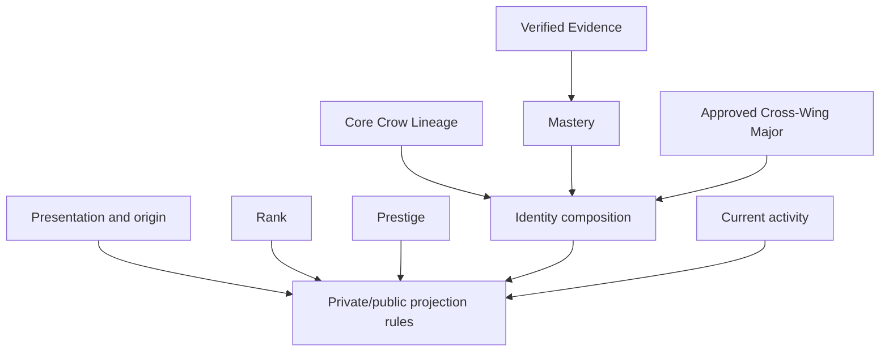

# GHURAVIA Crow Identity System — 1A Intake Baseline

**Baseline level:** Governance intake  
**Gate:** `GHV.CROW-IDENTITY.1A`  
**Date:** 2026-07-22  
**Implementation authority:** None

## 1. Purpose

This document defines the minimum Crow Identity system that GHURAVIA may carry forward into later governance. It establishes scope, terms, invariants, separations, and prohibited interpretations. It intentionally does not define Product Code, storage, APIs, automatic classification, curricula, or final art.

The governing principle is:

> The Crow a user chooses is not automatically the Crow their verified Evidence proves they have become.

## 2. Formal terminology

| Term | Intake meaning | Boundary |
|---|---|---|
| **Core Crow Lineage** | Formal internal noun for one of the 25 stable capability-practice identities. | Not a job, course, Rank, skin, permission, static asset, or personality type. |
| **Crow Lineage** | Concise user-facing English noun for Core Crow Lineage. | Final Arabic user-facing term remains open. |
| **Horizon** | One of five broad capability worlds: Operate, Build, Analyze, Protect, Lead. | A Horizon is broader than a Lineage and is not a rank ladder. |
| **Route** | A governed learning/capability path within or across Horizons. | Route access does not equal completion, Evidence, Mastery, Lineage, or Major. |
| **Cross-Wing Major** | An earned integrated capability formed from two governed Route clusters plus integration work, capstone, and verified Evidence. | Separate from Lineage and not created by merely completing unrelated content in two Horizons. |
| **Fusion Signature** | The unique semantic visual/motion identifier of an approved Cross-Wing Major. | It is not a Lineage Mark or Evidence Seal. Exact artwork is unapproved. |
| **Lineage Mark** | Compact taxonomy identifier for a Core Crow Lineage. | Identifies the category; it does not authenticate proof. |
| **Evidence Seal** | Authenticated indicator tied to governed Evidence. | Cannot be decorative, purchased, or reused as a taxonomy mark. |
| **Evidence** | Verified artifact, performance, observation, or outcome that supports a capability claim. | Attendance, payment, popularity, or XP alone is not Evidence. |
| **Mastery** | Evidence-backed degree of demonstrated capability. | Separate from XP, Rank, payment, Prestige, and Trust. Formula remains open. |
| **Rank** | Progress coordinate indicating where a learner stands. | Does not determine Lineage, Major, Trust, or Prestige. |
| **Trust** | Private, non-numeric assurance construct governed outside public identity. | Never publicly rendered, scored, searched, ornamented, or made inferable. |
| **Prestige Class** | Separately governed recognition class. Accepted top classes are Elite Raven, Prime Raven, and Obsidian Raven, with Obsidian highest. | Not automatic from Rank, Mastery, Major, Trust, payment, title, or popularity. |
| **Wingprint** | Undefined project term. | Must not enter UI, data, or APIs until 1C defines or retires it. |
| **Flight Signature** | Undefined project term. | Must not be conflated with Fusion Signature or Lineage Mark. |
| **Evolved Role** | Undefined possible concept; no approved roster exists. | Must not be invented or layered over Lineage/Major/Prestige without a distinct purpose. |

“Archetype,” “Core Crow,” “model,” and “style” may appear in historical or design discussion, but they are not the formal entity noun. “Skin,” “job,” and “role” must not describe a Core Crow Lineage in governed product copy.

## 3. System definition

The Crow Identity System is a deterministic, evidence-aware way to express how a user develops across GHURAVIA. It combines:

- a stable Core Crow Lineage foundation;
- verified capability and Mastery development;
- optional earned Cross-Wing Major expression;
- separate Evidence, Rank, Prestige, Trust, and entitlement states;
- presentation/context inputs that do not falsify capability;
- temporary current-activity signals;
- one consistent state expressed at three visual scales.

It is designed to support growth without creating a career prison. Sustained, governed evidence may shift emphasis or support multiple earned capabilities while preserving history and explainability.

## 4. Locked 5 × 5 foundation

Exactly five Horizons contain exactly five Core Crow Lineages each.

| Stable semantic key | Horizon | Core Crow Lineage | Protected capability center |
|---|---|---|---|
| O1 | Operate | Rhythm Keeper | Reliability, availability, performance, observability, and operational rhythm |
| O2 | Operate | Flow Navigator | Networks, routing, traffic, connectivity, and movement through live paths |
| O3 | Operate | Recovery Smith | Incidents, problems, continuity, failover, and restoration |
| O4 | Operate | Automation Conductor | Scripting, orchestration, infrastructure automation, and repeatable operations |
| O5 | Operate | Service Steward | Support, ITSM, application/service care, and user-facing service continuity |
| B1 | Build | Framework Seeker | Architecture, requirements, foundations, and structural design |
| B2 | Build | Prototype Spark | Experimentation, product prototyping, iteration, and rapid validation |
| B3 | Build | Systems Crafter | Infrastructure, cloud, hardware, embedded systems, and practical integration |
| B4 | Build | Network Weaver | APIs, interfaces, distributed systems, and ecosystem connections |
| B5 | Build | Silent Architect | Implementation quality, precision, performance, and high-assurance design |
| A1 | Analyze | Pattern Seeker | Analytics, statistics, anomaly recognition, and prediction |
| A2 | Analyze | Deep Observer | Research, experimentation, causal inquiry, and root-cause understanding |
| A3 | Analyze | Signal Cartographer | Visualization, topology, observability maps, and models |
| A4 | Analyze | Evidence Tracker | Provenance, validation, traceability, and data quality |
| A5 | Analyze | Insight Connector | Business intelligence, synthesis, decision support, and communicating insight |
| P1 | Protect | Azure Watcher | Monitoring, detection, defensive visibility, and security awareness |
| P2 | Protect | Boundary Warden | Security architecture, IAM, hardening, and access boundaries |
| P3 | Protect | Trace Hunter | Threat hunting, security investigation, and forensic tracing |
| P4 | Protect | Crisis Guardian | Containment, cyber response, recovery, and resilience |
| P5 | Protect | Crimson Validator | Authorized adversarial testing, penetration testing, and defensive validation |
| L1 | Lead | Formation Guide | Mentoring, learning, community, and capability development |
| L2 | Lead | Mission Commander | Project/program delivery, mission direction, and operational command |
| L3 | Lead | Quiet Coordinator | Product/service alignment, stakeholders, dependencies, and cross-team coordination |
| L4 | Lead | Systems Governor | Governance, risk, compliance, quality, control, and assurance |
| L5 | Lead | Horizon Pathfinder | Strategy, innovation, enterprise direction, and emerging technology |

The semantic keys above preserve the established O1–L5 references. Repository-grade immutable IDs and version rules must be ratified in 1B.

### Collision boundaries

- Flow Navigator operates movement through paths; Network Weaver creates and integrates paths.
- Rhythm Keeper governs technical reliability rhythm; Quiet Coordinator aligns people and dependencies.
- Recovery Smith restores failed service; Crisis Guardian contains and coordinates cyber harm.
- Service Steward serves users and services; Formation Guide develops people and capability.
- Deep Observer investigates general causes; Trace Hunter investigates security-relevant activity.
- Evidence Tracker establishes provenance; Systems Governor establishes policy, controls, and assurance.
- Framework Seeker makes architecture legible; Silent Architect perfects implementation quality.
- Analyze does not become Protect merely because it detects an anomaly.
- Lead does not acquire technical capability through authority or title.

## 5. Canonical identity layers



Trust is intentionally absent from public projection and public rendering. Entitlements are also absent from the identity-composition path; they control access only.

| Layer | What it may influence | What it may not claim |
|---|---|---|
| Presentation/origin | Atmosphere, harmless habitat style, viewing preferences, declared interests | Skill, Mastery, Evidence, Major, Trust, Prestige, authority |
| Core Crow Lineage | Stable capability-practice expression | Job, licensure, permission, moral character, guaranteed career |
| Evidence/Mastery | Earned capability depth and authenticated proof | Payment status, popularity, private Trust, automatic Prestige |
| Cross-Wing Major | Approved integrated capability and one unique Fusion Signature | Generic two-Horizon completion or automatic job title |
| Rank | Progress location | Identity type or capability proof |
| Prestige | Separately governed recognition and restrained presence | Technical competence, Trust, entitlement, organizational authority |
| Current activity | Temporary privacy-safe signal | Permanent anatomy, Evidence, history, or live sensitive details |
| Entitlement | Opportunity/service access | Any earned outcome or identity proof |

## 6. Crow Genome and Habitat Genome

The system admits two conceptual groupings, not production schemas.

### Crow Genome

Represents the user's enduring capability identity: Lineage, development, Evidence-backed Mastery, active Major integration, and other approved persistent identity facts.

### Habitat Genome

Represents the contextual world around the Crow: origin/presentation, verified portfolio landmarks, contribution context, relationships shown with consent, achievement context, and future ambition where voluntarily expressed.

The Habitat Genome must not expose private Evidence, client/security details, other people without consent, location/schedule, or Trust. A landmark may symbolize a verified output only after its publication rights and abstraction rules are approved.

## 7. Chosen, suggested, and earned states

The minimum conceptual separation is:

| State | Owner | Meaning | Public effect before 1C |
|---|---|---|---|
| Chosen/declarative | User | Interest or harmless presentation preference | Private by default; never proof |
| Suggested | System under a future explainable policy | A reversible recommendation based on admissible signals | No earned mark; user may reject |
| Earned | Governed evidence process | Approved capability identity supported by verified Evidence/Mastery | No production publication until projection rules exist |

One course, high XP, subscription, staff title, or self-selection cannot move a user directly to earned identity.

No production inference is permitted until admissible signals, exclusions, thresholds, recency, fairness review, explanation, correction, and appeal are approved.

## 8. Cross-Wing baseline

A legitimate two-Horizon Major requires all five elements:

1. governed Route Cluster A;
2. governed Route Cluster B;
3. an integration or bridge competency;
4. a Cross-Wing capstone that produces something neither side establishes alone;
5. verified Evidence under an approved rubric.

The system preserves ten two-Horizon pair families and a curated 50-Anchor structure—five intended candidates per pair family. This is a portfolio architecture, not 50 approved curricula. The 250 raw Lineage pairings are mathematical possibilities, not automatic Majors.

A Cross-Wing visual must integrate semantically. A crude left-wing/right-wing recolor is prohibited. One active Major should eventually own the dominant Fusion Signature to avoid visual overload, but that exact activation rule remains lock-ready pending 1C.

## 9. Three-scale presentation contract

One normalized, versioned identity state must eventually support:

1. **Living Profile World** — rich environmental portfolio view.
2. **Adaptive Crow Portrait/Token** — medium-detail profile and journey view.
3. **Compact Crow Mark** — small, accessible identity reference.

All three must agree semantically. A smaller renderer may omit detail, but it cannot change meaning or invent proof. Structured text/fact views remain mandatory; art cannot be the sole information channel.

## 10. Visual and motion invariants admitted at 1A

- All 25 remain one GHURAVIA cyber-corvid species.
- Color alone cannot distinguish a Lineage.
- Final designs must use independent cues such as silhouette, topology, posture, anatomical anchors, motion verb, and compact mark.
- Crimson means authorized test or detected fault, never evil or personality.
- Violet indicates confirmed integration/learning junction, not premium status.
- Ambient motion must not strobe; saturated red must not flash; milestone effects are one-shot.
- Reduced-motion output must preserve meaning.
- One semantic animation dominates according to safety/risk → current mission → active Major → Lineage → habitat/cosmetic priority.
- A paid cosmetic cannot imitate a Lineage Mark, Fusion Signature, Evidence Seal, or Prestige expression.
- AI concept art cannot be treated as a deterministic production identity.

Exact anatomical grammar, materials, palettes, glyph artwork, timings, and asset pipeline remain 1D candidates.

## 11. Public/private and safety baseline

Until 1C approves a projection contract:

- all earned identity and Evidence data is private by default;
- Trust is excluded from public schemas and rendering inputs;
- current activity is not public by default;
- sensitive security, client, location, schedule, and network details are not rendered literally;
- other users are not named or depicted without consent;
- search and analytics receive no private identity facts;
- publication, hiding, correction, dispute, deletion, cache invalidation, and retention behavior remain unimplemented;
- no user-facing claim may state or imply employment, license, authorization, or guaranteed capability beyond its verified scope.

## 12. Commercial separation

Open Flight, Wing Pass, Expedition Pass, and Merit Access may control availability of Routes, concurrency, content, labs, services, or Cross-Wing opportunities. They cannot alter earned state.

The required dependency direction is:

```text
Entitlement → opportunity/access
Evidence → Mastery → earned identity
```

There is no entitlement-to-Evidence, entitlement-to-Mastery, or entitlement-to-Prestige path.

## 13. Explicit exclusions from this baseline

This document is not:

- a final 25-Crow art bible;
- a curriculum catalogue;
- an inference or recommendation algorithm;
- an Evidence, Mastery, Trust, Prestige, or Merit Access lifecycle;
- a database, event, API, search, analytics, or cache design;
- a public-profile field list;
- a renderer or animation technology decision;
- a release plan or implementation authorization.

## 14. Intake acceptance invariants

Any later GHURAVIA baseline or implementation touching Crow Identity must preserve these truths unless an explicit superseding governance decision records the change:

1. Exactly 25 Core Crow Lineages across five Horizons form the foundation.
2. Lineage, Major, Evidence, Mastery, Rank, Trust, Prestige, entitlement, origin, and current state are not interchangeable.
3. Chosen is not earned; payment is not achievement; title is not capability.
4. Trust is private and cannot be inferred from public visual treatment.
5. Cross-Wing identity requires integrated, evidenced capability.
6. Production identity is deterministic, versioned, explainable, correctable, and privacy-safe.
7. Visual identity must survive without color or motion and must have a structured semantic equivalent.
8. No Product Code may treat a provisional name, conceptual entity, or concept image as approved production truth.
