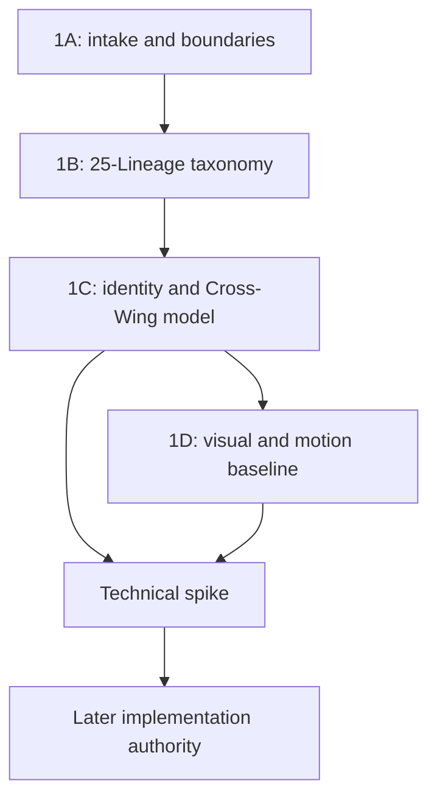

# GHV.CROW-IDENTITY.1A — Gate Report
# System Intake and Impact Assessment

**Date:** 2026-07-22  
**Input package:** `GHURAVIA Crow Identity Handoff — Candidate Intake v0.1`  
**Gate type:** Governance intake; no implementation  
**Assessment status:** COMPLETE  
**Candidate admission:** PASS  
**Repository admission:** CONDITIONAL / NOT EXECUTED  
**Implementation authority:** NONE

---

## 1. Executive verdict

The GHURAVIA Crow Identity System is coherent enough to enter governed product scope. The package successfully establishes a five-Horizon, 25-Lineage identity foundation; separates Lineage from Cross-Wing Major; protects earned identity from payment, Rank, XP, cosmetics, and self-declaration; and defines a scalable direction for deterministic, accessible visual expression.

The package is therefore **accepted as a governed candidate corpus**.

It is not accepted as a production specification. Final art, animation, inference rules, Evidence/Mastery lifecycles, public-profile fields, schemas, APIs, runtime technology, and all 50 Major curricula remain unapproved or incomplete. The five concept images demonstrate one-species visual feasibility, not 25-way differentiation or production readiness.

| Decision surface | Verdict | Meaning |
|---|---|---|
| Source package integrity | PASS | Supplied source files and archive match the recorded hashes and inventory. |
| Scope admission | PASS | Crow Identity becomes a formal GHURAVIA product/governance domain. |
| Decision-status discipline | PASS | Locked, lock-ready, provisional, exploratory, conflicting, and open material remain separate. |
| Identity boundary admission | PASS | Chosen, suggested, earned, paid, Rank, Trust, Prestige, current state, and origin boundaries are preserved. |
| Trust conflict | RESOLVED FOR INTAKE | Private/non-numeric Trust takes precedence; public visual/inferable Trust is prohibited. |
| Exact visual Canon | NOT BASELINED | Detailed 25-style art remains lock-ready until 1D validation and approval. |
| Prototype validation | PARTIAL ONLY | Species coherence is feasible; 25 silhouettes, glyphs, animation, accessibility, and performance are unvalidated. |
| Repository mapping | BLOCKED BY ABSENCE | No target repository or current baseline documents were available. |
| Product Code / schema / API | PROHIBITED | 1A grants no implementation authority. |
| Progression to 1B | CONDITIONAL GO | Taxonomy preparation may start; repository import requires current-tree mapping and authority review. |
| `GHV.IMPLEMENTATION.0E` | NO-GO | The supplied materials do not include the 0E contract, and multiple identity blockers remain. |

### Gate statement

> Admit the Crow Identity System as a traceable product-scope candidate; preserve its locked conceptual boundaries; correct its authority labels; prohibit premature implementation; and require repository-aware mapping before baseline import.

---

## 2. Scope examined

The assessment covered:

- the complete 23-section Crow Identity handoff;
- the prior assistant-authored Canon;
- the original extraction/intake brief;
- the package manifest and checksum record;
- five Living Profile feasibility images and their README;
- the carried GHURAVIA foundation constraints supplied with the task;
- all impact areas named by the intake brief;
- the proposed 1A → 1B → 1C → 1D governance sequence.

The assessment did **not** have:

- the GHURAVIA Git repository;
- repository `AGENTS.md` or equivalent contributor instructions;
- the current Product Constitution, Scope Baseline, Master User Journey, glossary, screen registry, progression baseline, Evidence/Mastery/Trust/Prestige baselines, payment baseline, or `GHV.IMPLEMENTATION.0E` contract;
- a complete older conversation transcript beyond the supplied handoff and excerpts;
- approved 25-Crow contact sheets, animation prototypes, user studies, accessibility results, or runtime benchmarks.

No missing repository fact is inferred.

---

## 3. Authority and source hierarchy adopted by 1A

When two sources differ, the following precedence controls this intake:

1. Explicit founder decisions and already-governed GHURAVIA baselines.
2. Newer explicit founder instructions that intentionally amend prior decisions.
3. Carried project constraints with clear status and no contrary founder instruction.
4. Conversation-derived synthesis that accurately preserves the above.
5. Assistant-authored specifications and recommendations.
6. Concept images and feasibility prototypes.
7. External professional or technical references, which may support feasibility but never override GHURAVIA decisions.

Consequences:

- A document calling itself “locked” does not create founder authority.
- The prior Canon remains a valuable design source, but its post-lock silhouettes, glyphs, materials, and exact motion details are `LOCK-READY`, not automatically final.
- The 50-Major structure is retained, while the 50 names, mappings, curricula, and exact Fusion Signatures remain provisional.
- Prototype imagery cannot promote an untested visual rule into a baseline.
- Where privacy and visual richness conflict, the explicit private-Trust constraint wins.

---

## 4. 1A decision record

### Status vocabulary

- **RECONFIRMED LOCKED** — a pre-existing approved rule admitted without changing its meaning.
- **1A RESOLUTION** — a governance clarification required to reconcile supplied sources; it does not authorize implementation.
- **ADMITTED LOCK-READY** — suitable for a later approval Gate, not final.
- **ADMITTED PROVISIONAL** — retained for evaluation; it must not be presented as decided.
- **DEFERRED** — deliberately left to the named downstream Gate.
- **PROHIBITED** — excluded unless a later explicit founder/governance amendment reverses it.

| ID | Decision | 1A status | Effect |
|---|---|---|---|
| 1A-DEC-001 | Crow Identity is a formal GHURAVIA product and governance domain spanning taxonomy, earned identity, Cross-Wing composition, projection, and visual semantics. | 1A RESOLUTION | The system belongs in scope, but implementation remains gated. |
| 1A-DEC-002 | The formal internal entity noun is **Core Crow Lineage**; the concise user-facing English noun is **Crow Lineage**. | 1A RESOLUTION | Reconciles “Core Crow,” “Archetype,” and “Lineage.” “Model/style/skin/job/role” are not formal entity nouns. Arabic display terminology remains open. |
| 1A-DEC-003 | Five Horizons—Operate, Build, Analyze, Protect, Lead—contain exactly five Core Crow Lineages each. | RECONFIRMED LOCKED | Establishes the 25 foundation without promoting detailed art. |
| 1A-DEC-004 | The 25 English names, Horizon assignments, and protected capability centers are preserved. | RECONFIRMED LOCKED | Stable repository IDs remain for 1B to ratify. |
| 1A-DEC-005 | A Core Crow Lineage is not a job, course, Rank, permission, purchasable skin, static model, or guaranteed profession. | RECONFIRMED LOCKED | Controls copy, data semantics, recommendations, and career claims. |
| 1A-DEC-006 | Chosen/declarative presentation, system suggestion, and earned identity are separate states. | RECONFIRMED LOCKED | A user may influence presentation and reject suggestions, but cannot self-award proof. |
| 1A-DEC-007 | Payment and entitlement may unlock opportunities; they cannot write XP, Evidence, Mastery, Lineage, Major, Trust, Prestige, leaderboard position, or proof marks. | RECONFIRMED LOCKED | Creates a hard service and test boundary. |
| 1A-DEC-008 | Evidence precedes Mastery and any earned Lineage/Major expression. XP, attendance, popularity, or one course is insufficient. | RECONFIRMED LOCKED | Exact verification and thresholds remain 1C blockers. |
| 1A-DEC-009 | Trust is private and non-numeric and is excluded from every public Crow, habitat, signal, score, search field, and public renderer input. | 1A RESOLUTION FROM HIGHER-PRIORITY RULE | Removes the conflicting visible/environmental Trust interpretation from the prior Canon. Private authorization use remains separately governed. |
| 1A-DEC-010 | Prestige is separate from skill, Rank, Mastery, Trust, payment, and authority. Elite Raven, Prime Raven, and Obsidian Raven remain accepted Prestige Classes, with Obsidian highest. | RECONFIRMED LOCKED | Qualification, appeal, revocation, Merit Access interaction, and visual treatment remain downstream work. |
| 1A-DEC-011 | Origin and environmental/cultural variety are presentation/context inputs, not proof or capability classifiers. | RECONFIRMED LOCKED | Desert, city, farm, hooded, mechanical, and similar expressions cannot alter earned state. |
| 1A-DEC-012 | Persistent identity differs from current activity. Current activity may produce temporary, privacy-safe state only and cannot rewrite anatomy, Evidence, Mastery, or history. | RECONFIRMED LOCKED | Exact visibility, delay, and sensitive-Mission rules remain open. |
| 1A-DEC-013 | Production identity must be deterministic and versioned; generative AI may support concept discovery but cannot regenerate earned identity arbitrarily at runtime. | RECONFIRMED LOCKED | Renderer contract and version model belong to 1C/1D. |
| 1A-DEC-014 | One identity state must support Living World, portrait/token, and compact mark representations with semantic parity. | RECONFIRMED LOCKED | Final visual thresholds and runtime remain open. |
| 1A-DEC-015 | Cross-Wing Major is distinct from Lineage and requires two Route clusters, an integration competency, a Cross-Wing capstone, and verified Evidence. | RECONFIRMED LOCKED | No Major can be awarded until curriculum/Evidence Gates exist. |
| 1A-DEC-016 | Every approved Major requires a unique Fusion Signature; two Majors using the same Horizon pair must remain distinguishable. | RECONFIRMED LOCKED | Exact signatures stay provisional and require collision testing. |
| 1A-DEC-017 | The 50-Anchor plan is a locked portfolio structure; the 50 candidate names/mappings are not awards or curricula. | RECONFIRMED LOCKED / ADMITTED PROVISIONAL | Prevents 250 raw combinations or 50 names from becoming automatic qualifications. |
| 1A-DEC-018 | Public symbol namespaces are semantically separate: `LineageMark`, `FusionSignature`, and authenticated `EvidenceSeal`. | 1A RESOLUTION | A taxonomy mark cannot impersonate Evidence; exact user-facing labels/art are deferred. |
| 1A-DEC-019 | Detailed silhouettes, feather topology, materials, postures, motion sentences, habitats, compact glyph artwork, and six development-state labels are design candidates. | ADMITTED LOCK-READY | Requires 1B semantic stability and 1D validation/approval. |
| 1A-DEC-020 | The five supplied images are exploratory feasibility evidence only. | 1A RESOLUTION | They cannot satisfy 25-way silhouette, compact-mark, animation, a11y, cultural, deterministic, or performance tests. |
| 1A-DEC-021 | Wingprint, Flight Signature, Evolved Roles, inference thresholds, public projection fields, data entities, schemas, APIs, and runtime technology are not defined by 1A. | DEFERRED | They must not enter Product Code as placeholders that acquire accidental authority. |
| 1A-DEC-022 | No Product Code, GitHub mutation, schema, API contract, or production asset is authorized by this Gate. | PROHIBITED | Requires later explicit Gates. |

---

## 5. Admitted system boundary

### In scope after 1A

- five Horizons and the exact 5 × 5 foundation;
- protected meanings and collision guards for the 25 Lineages;
- chosen/suggested/earned separation;
- Lineage versus Major separation;
- Cross-Wing qualification grammar and unique Fusion Signature rule;
- Crow Genome and Habitat Genome as conceptual layers;
- persistent identity versus current activity;
- three-scale presentation architecture;
- deterministic identity principle;
- payment/entitlement, Trust, Prestige, Rank, XP, origin, and leaderboard boundaries;
- semantic motion priority, no-flash intent, reduced-motion parity, and non-color identity requirements;
- the requirement for provenance, version history, correction, privacy, and testability.

### Explicitly not baselined by 1A

- final Arabic names or public copy;
- stable repository IDs and file locations;
- final silhouettes, glyph artwork, palettes, materials, shaders, habitats, animation timings, or asset technology;
- exact development-state names or thresholds;
- Lineage suggestion/inference algorithms;
- Evidence types, verifier authority, Mastery formula, dispute, expiry, deletion, or retention rules;
- Prestige criteria or Merit Access governance;
- exact Wingprint or Flight Signature definitions;
- any of the 50 Major candidates as a curriculum or award;
- three-Horizon production identities;
- database, event, API, cache, search, analytics, or renderer schemas;
- product milestones, MVP allocation, or release dates.

---

## 6. Prototype intake audit

The five 1254 × 1254 concept images were inspected as a set.

### What they demonstrate

- a consistent realistic cyber-corvid species can span Nest, Operate, Protect, Cross-Wing, and Lead contexts;
- black feathering and integrated cybernetic detail can remain visually coherent across environments;
- cyan, crimson, violet, infrastructure, and flock context can communicate broad narrative differences;
- the general art direction is feasible enough to justify formal contact-sheet exploration.

### What they do not demonstrate

- the five figures use substantially similar standing side-profile anatomy and overall silhouette;
- much of the perceived difference comes from glow color, circuit overlays, framing, and background;
- there are no five-within-Horizon contact sheets, black-silhouette tests, compact marks, animation clips, reduced-motion states, Arabic layouts, or Cross-Wing collision studies;
- there is no evidence of deterministic reconstruction from normalized identity state;
- there is no accessibility, cultural, mobile, frame-time, asset-size, thermal, or cache-removal test;
- the images contain scene details that cannot be assumed to represent authenticated user facts.

**Audit result:** `PROTOTYPE PARTIAL — FEASIBILITY ONLY`.

---

## 7. Acceptance checklist

| Acceptance requirement | Result | Evidence / condition |
|---|---|---|
| Candidate corpus identified and integrity checked | PASS | Files, archive inventory, and hashes verified. |
| Every admitted rule retains status and provenance | PASS | Source hierarchy and traceability file established. |
| Assistant-authored details are not silently promoted | PASS | Exact art and conceptual entities remain lock-ready/provisional. |
| Contradictions are exposed | PASS | Trust, authority label, glyph semantics, and taxonomy noun addressed explicitly. |
| Trust conflict receives a safe controlling rule | PASS | Public/inferable Trust prohibited. |
| Product and technical impact is assessed | PASS | All named areas classified in `PRODUCT-TECHNICAL-IMPACT.md`. |
| Open decisions have owners/timing/safe defaults | PASS | Recorded in `OPEN-DECISIONS.md`. |
| No Product Code or GitHub mutation | PASS | Only governance artifacts were created locally. |
| Current repository inventory and baseline diffs completed | NOT POSSIBLE | Target repository and authoritative current documents absent. |
| Repository authority confirmed | NOT EVIDENCED | Must be checked in the target project before import. |
| Exact `GHV.IMPLEMENTATION.0E` relation verified | NOT POSSIBLE | Contract not supplied. |

### Gate outcome

The **assessment itself passes**. The system is admitted to governance. The **repository-import portion remains conditional** until the target repository is available and the current baselines are mapped without overwriting unrelated content.

---

## 8. Blocking conditions and safe defaults

| Blocker | Blocks | Safe behavior until resolved |
|---|---|---|
| Target repository/current baselines absent | Actual repository import and impact diff | Keep this package external; do not guess paths or overwrite files. |
| `GHV.IMPLEMENTATION.0E` contract absent | Any claim that 0E may proceed | Treat 0E as NO-GO for Crow Identity. |
| Evidence lifecycle absent | Earned Lineage/Major/Mastery/Evidence marks | Store no production award; show no authenticated mark. |
| Mastery/inference thresholds absent | Automatic suggestion or identity transition | No automatic earned classification. |
| Public projection/retention/correction absent | Public Living Profile, search, caches | Default private; do not publish or index. |
| Arabic naming not reviewed | Arabic-first production labels | Use documented working labels only in internal drafts. |
| Final art validation absent | 25 production models and animation | Use neutral placeholders that assert no earned meaning. |
| Runtime/performance budget absent | Asset technology freeze | Run a later technical spike; do not select by preference alone. |

---

## 9. Repository mapping required before import

When the actual repository is available, the importing agent must:

1. Read repository instructions and authority/Gate conventions.
2. Inventory existing constitution, scope, journey, glossary, identity/progression, privacy, payment, architecture, test, and design files.
3. Locate the actual `GHV.IMPLEMENTATION.0E` contract.
4. Produce a mapping from each 1A deliverable to current files; do not assume `product/identity/crow-system/` is correct.
5. Generate impact diffs rather than replace entire documents.
6. Preserve current unrelated decisions and label conflicts instead of resolving them silently.
7. Import source hashes and status metadata with the candidate.
8. Obtain the repository's required approval before changing baseline labels.

No repository mutation was performed in this Gate.

---

## 10. Governance sequence after 1A

### `GHV.CROW-IDENTITY.1B` handoff contract

**Objective:** ratify the five-Horizon/25-Lineage taxonomy, stable IDs, protected meanings, collision guards, bilingual naming direction, and treatment of Evolved Roles.

**Required inputs:**

- this 1A package;
- the complete handoff as evidence corpus;
- target repository inventory and current glossary/taxonomy/progression baselines;
- Arabic linguistic and Saudi cultural review plan;
- scenario set for collision testing.

**Must decide:**

- stable IDs and version policy;
- exact English registry records;
- Arabic names or an explicitly provisional Arabic state;
- whether Evolved Role is removed, deferred, or defined without overlapping Lineage/Major/Prestige;
- capability boundaries and collision pairs;
- permissible career-alignment wording.

**Must defer:** schemas, inference algorithms, curricula, final art, animation timings, runtime, and public profile.

**1B entry condition:** repository mapping may be incomplete for research work, but no baseline import may occur until current authoritative files and Gate rules are known.

---

## 11. Relationship to `GHV.IMPLEMENTATION.0E`

The exact 0E contract is absent. Under the conservative interpretation that 0E authorizes architecture or Product Code, Crow Identity remains blocked until at least:

1. 1B freezes stable IDs and taxonomy semantics.
2. 1C defines chosen/suggested/earned states, Evidence/Mastery, public/private projection, history/correction, Cross-Wing award rules, and entitlement isolation.
3. Trust is excluded from public projections and renderer inputs in the approved architecture.
4. Accessibility and semantic animation constraints are binding on every renderer.
5. A later authority explicitly approves a scoped implementation contract.

Final art, all 50 curricula, and Prestige spectacle need not precede a narrowly scoped architecture prototype, but placeholders must never resemble earned proof.

---

## 12. Closing decision

`GHV.CROW-IDENTITY.1A` is **complete as an intake and impact assessment**.

- The system is admitted.
- Its status boundaries are preserved.
- Trust/public visualization is resolved conservatively.
- Prototype claims are narrowed to what the images actually prove.
- Product and technical consequences are mapped.
- Repository admission and implementation remain unauthorized.

**Next Gate:** `GHV.CROW-IDENTITY.1B — Core Crow Lineage Taxonomy Baseline`, after or alongside target-repository inventory, with no Product Code.
