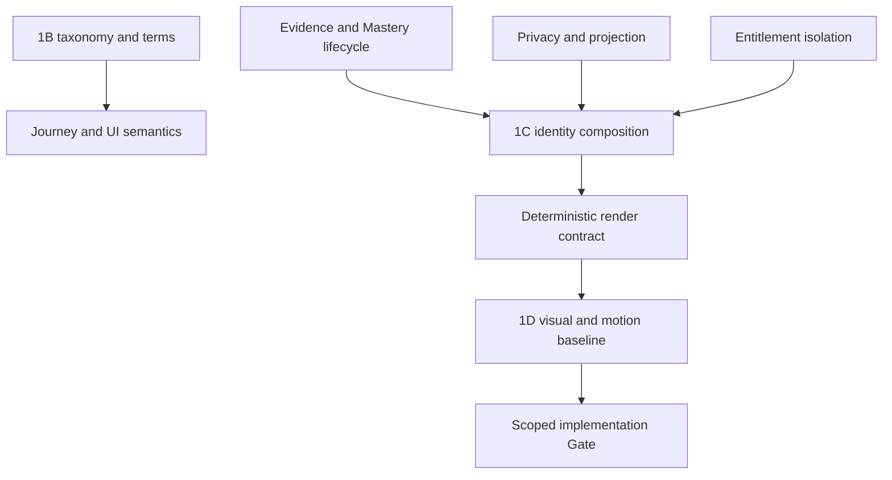

# GHURAVIA Crow Identity System — Product and Technical Impact

**Gate:** `GHV.CROW-IDENTITY.1A`  
**Assessment date:** 2026-07-22  
**Authority:** Impact assessment only; no implementation authorization

## 1. Classification key

| Code | Impact class |
|---|---|
| `NONE` | No required change identified from the available evidence |
| `TERM` | Terminology, glossary, or copy impact |
| `DES` | Product/interaction/visual design impact |
| `DATA` | Conceptual or future data-model impact; no schema authorized |
| `API` | Future contract/authorization/projection impact; no API authorized |
| `UI` | Screen, state, control, or presentation impact |
| `GOV` | Constitution, policy, authority, lifecycle, or Gate impact |
| `DEP` | Implementation dependency or sequencing constraint |

Priority indicates when the decision must be governed, not when code should be written:

- `P0` — blocks safe architecture/public identity.
- `P1` — must be settled before the named journey or baseline freezes.
- `P2` — required before production UI/content/art.
- `P3` — later expansion or optimization.

## 2. Area-by-area assessment

| Area | Classification | Priority | Required impact | Recommended governance timing | Blocking decisions / evidence |
|---|---|---:|---|---|---|
| Product Constitution | `TERM DES GOV DEP` | P0 | Add chosen ≠ suggested ≠ earned; payment ≠ achievement; private Trust; separate Prestige/Rank/Mastery; deterministic and correctable identity; no career prison; no universal identity score. | Import as a focused diff during repository-aware 1A mapping, before any 0E scope freeze. | Current Constitution and authority register absent; exact 0E contract absent. |
| Scope Baseline | `TERM DES GOV DEP` | P0 | Admit the five-Horizon/25-Lineage domain, Cross-Wing grammar, three render scales, privacy/accessibility scope, and explicit deferrals for final art/curricula/algorithms. | Before final onboarding, Horizon, profile, or renderer scope. | MVP versus later allocation; actual scope file absent. |
| Master User Journey | `TERM DES UI GOV DEP` | P1 | Represent interest/declaration, The Nest readiness, Horizon Seed, system suggestion, user rejection, evidence-backed formation, earned Lineage, Cross-Wing qualification, active Major, publication, correction, and history. | After 1B vocabulary and alongside 1C state model. | Wingprint; suggestion policy; Evidence/Mastery lifecycle; public projection. |
| Screen Registry | `TERM DES UI DEP` | P1 | Add or amend identity explanation, suggestion review, Lineage detail, Major detail, Evidence visibility, public projection/privacy, reduced-motion, history, and correction/dispute surfaces. | After 1B/1C; before wireframe freeze. | Final user-facing terms, projection contract, correction workflow. |
| Wireframes | `DES UI DEP` | P2 | Reserve Living World, portrait/token, compact mark, structured facts, status explanation, privacy controls, RTL, reduced-motion, empty/error/disputed states. Art must not be sole meaning. | After 1B; detailed flows after 1C. | Content hierarchy, compact semantics, Arabic labels, accessibility target. |
| Onboarding | `TERM DES UI GOV DEP` | P1 | Permit declared interests and harmless presentation choices; explain suggestions; prohibit choosing an earned profession/Lineage; provide rejection/reset without penalty. | Before onboarding implementation or final copy. | Wingprint definition; admissible signals; age-15+ comprehension; privacy notice. |
| Wingprint | `TERM DES DATA UI GOV DEP` | P0 | Define, rename, or retire. If retained, it must be declarative/recommendation input and never capability proof. Define fields, owner, visibility, reset, retention, and relation to Set Your Origin. | 1C, before onboarding/data work. | Entire construct is currently undefined. |
| Set Your Origin | `TERM DES DATA UI GOV DEP` | P0 | Collect only necessary calibration/presentation inputs; separate origin from capability; add consent, edit/reset, localization, and protected-trait safeguards. | Privacy design before onboarding implementation. | Exact fields, purpose limitation, retention, lawful/ethical basis, Saudi/global localization. |
| The Nest | `TERM DES UI GOV DEP` | P1 | Keep readiness and foundation completion separate from specialist identity; Flight-Ready may be a working state, not an automatic Lineage. Preserve authoritative Nest thresholds outside this package. | Before Nest exit copy and state contract. | Current Nest baseline and exact label authority absent; mapping to six candidate development states unresolved. |
| Horizon selection | `TERM DES UI GOV DEP` | P1 | Present five Horizons and potential Lineages as exploration, not skins/jobs/rank tiers. Explain boundaries and allow continued development across Horizons. | 1B before final selection UI. | Arabic names, collision comprehension, suggestion model. |
| Route selection | `TERM DES DATA UI GOV DEP` | P1 | Show access, prerequisite, recommendation, completion, Evidence eligibility, and earned outcome as distinct states; map Route competencies to Lineage/Major candidates under governance. | After curriculum registry and 1C concepts. | Route registry, prerequisites, bridge competencies, admissible Evidence. |
| Learning | `DES DATA UI API GOV DEP` | P1 | Temporary signals may show learning state; completion/attendance cannot become Evidence automatically; sensitive mission content must not leak into public state. | State semantics in 1C/1D; implementation later. | Mission events, Evidence capture, privacy, reduced-motion, offline/retry behavior. |
| Progression | `TERM DES DATA API GOV DEP` | P0 | Keep XP/Rank separate; define developmental state, suggestion, earned association, transition, recency, history, and decay without instant switching. | 1C before progression architecture freezes. | Admissible signals, weights/thresholds, bias/explainability, correction and history. |
| Evidence | `TERM DES DATA API UI GOV DEP` | P0 | Define types, provenance, verifier authority, rubric, status, expiry, dispute, correction, redaction, deletion/retention, publication rights, Evidence Seal, and audit. | Earliest 1C; blocks all earned identity. | No authoritative Evidence lifecycle supplied. |
| Mastery | `TERM DES DATA API GOV DEP` | P0 | Define capability-scoped calculation, levels/thresholds, versioning, Evidence dependency, decay/reassessment, explanation, and separation from Rank/Prestige. | 1C before earned-state or Major award design. | Formula, thresholds, governance owner, migration policy. |
| Trust | `TERM DATA API UI GOV DEP` | P0 | Remove Trust from public projection/render inputs, public analytics/search, score/band/ornament, and any visually inferable treatment. Keep private high-risk gating separately authorized. | Boundary is resolved in 1A; exact private service model later. | Private Trust authority, decision explanations, access-control separation, audit. |
| Prestige | `TERM DES DATA API UI GOV DEP` | P1 | Preserve Elite/Prime/Obsidian as separate recognition classes; define nomination/award, criteria, authority, appeal, revocation, history, public consent, Merit Access relationship, and restrained visuals. | After core identity model; before any Prestige display or Merit Access coupling. | Lifecycle absent; risk of title/popularity/pay coupling. |
| Community | `DES DATA API UI GOV DEP` | P2 | Show contribution/mentorship context without turning popularity into capability; require consent/aggregation for other Crows; prevent harassment and proof impersonation. | After 1C and moderation baseline. | Contribution Evidence policy, consent, abuse taxonomy, audience controls. |
| Leaderboards | `TERM DES DATA API UI GOV DEP` | P1 | Prohibit one universal identity/Trust/Prestige score. Any leaderboard must be activity-scoped, transparent, time-bounded, and unable to rewrite Crow identity. | Before leaderboard constitution/UI. | Existing leaderboard design absent; metric fairness and gaming controls. |
| Live Sky | `DES DATA API UI GOV DEP` | P1 | Current activity must be optional/coarse/delayed where needed; no location, schedule, sensitive security mission, or private participation leaks; animation must be performance-safe. | Privacy and event contract before spectator/profile integration. | Visibility controls, sensitive-state taxonomy, moderation, rate/performance budgets. |
| Profiles | `TERM DES DATA API UI GOV DEP` | P0 | Separate private canonical profile from public projection; support three scales plus structured facts, active/historical Majors, consent, hide/revoke, correction, and cache removal. | 1C before public-profile architecture; 1D before final visual release. | Field-level projection contract, retention/deletion, Trust exclusion, Evidence redaction. |
| Privacy | `DES DATA API UI GOV DEP` | P0 | Apply minimization, purpose limitation, private-by-default earned state, Evidence redaction, Trust exclusion, activity safety, consent, audience controls, erasure/retention, and cache/search removal. | 1A boundary; full policy in 1C before any public identity. | Authoritative privacy/retention policy, deletion versus audit, minors/15+ implications, jurisdictions. |
| Localization | `TERM DES UI GOV DEP` | P1 | Arabic-first naming, mature tone, RTL, gender-neutral/non-classist wording, English parity, and career-claim control. Review risky motifs such as Hunter, Warden, Commander, pirate, and hooded. | Naming work in 1B; visual/cultural validation in 1D. | Founder/linguistic approval; Saudi/Arabic and global user testing. |
| Accessibility | `DES UI GOV DEP` | P0 | No color/motion-only meaning; semantic text equivalents; reduced motion; no flash; contrast/zoom/low-vision; keyboard/screen reader control; semantic parity at all scales. | Non-negotiable requirements now; thresholds and tests in 1D/release. | Target conformance policy, device/assistive-tech matrix, final runtime/assets. |
| Architecture | `DES DATA API GOV DEP` | P0 | Separate entitlement, evidence, progression, identity composition, private canonical state, public projection, renderer input, asset version, and current activity; ensure deterministic reproduction and history. | 1C before architecture freeze or 0E. | Service boundaries, Evidence/Trust/projection models, version contract, threat model. |
| Data model | `DATA GOV DEP` | P0 | Future model requires stable IDs, taxonomy/asset versions, effective dates, chosen/suggested/earned states, Evidence links, Mastery, active/history, publication state, correction/dispute, and current-state expiry. | Conceptual design in 1C; schema only after implementation authority. | Entity definitions, lifecycle, cardinality, deletion/audit, immutable ID policy. |
| APIs | `API DATA GOV DEP` | P0 | Future APIs must separate private canonical profile, public projection, entitlements, Evidence verification, identity composition, renderer input, and history/correction; authorize every edge and minimize responses. | Contract design after 1C; code later. | Threat model, field classification, idempotency/versioning, projection policy. |
| Search | `DATA API UI GOV DEP` | P0 | Index only opted-in public projection fields; exclude Trust, private/disputed Evidence, live sensitive activity, network/client details; support revocation and deletion SLA. | After approved projection model; before public search. | Search field allowlist, cache/index removal, abuse controls, audience scopes. |
| Analytics | `DATA API GOV DEP` | P0 | Product telemetry may measure UX but cannot silently become Evidence, Trust, Lineage inference, or personality profiling. Define admissible use, retention, consent, bias review, and separation from award pipelines. | Before telemetry taxonomy or automatic suggestions. | Signal policy, consent, explainability, experiment governance, protected-trait risks. |
| Moderation | `TERM DES DATA API UI GOV DEP` | P1 | Detect impersonated seals/signatures, misleading career claims, hostile stereotypes, offensive variants, harassment, copied portfolios, and unsafe security demonstrations; provide appeal and remediation. | Before public profiles, UGC, marketplace, or Live Sky. | Moderation taxonomy, ownership, sanctions, appeals, regional policy. |
| Payments | `DATA API GOV DEP` | P0 | Enforce one-way effect from payment to entitlement only; no payment webhook/event/API may update Evidence, Mastery, Lineage, Major, Trust, Prestige, Rank, leaderboard, or proof assets. | Before monetization architecture; test with 1C boundaries. | Current payment design, event topology, entitlement matrix, refund/expiry behavior. |
| Entitlements | `TERM DATA API UI GOV DEP` | P0 | Model Open Flight, Wing Pass, Expedition Pass, and Merit Access as access opportunities; display locked/access/prerequisite/earned states separately; revoke access without rewriting earned history. | Scope/payment Gate and 1C integration. | Exact entitlement matrix, Merit Access award/revocation, offline/cache behavior. |

### Additional affected areas discovered during 1A

| Area | Classification | Priority | Required impact | Timing / blocker |
|---|---|---:|---|---|
| Design system and tokens | `TERM DES UI GOV DEP` | P1 | Reserve semantic signal tokens, non-color cues, reduced-motion states, symbol namespaces, and prohibited paid imitation. | 1D; exact palette and components open. |
| Asset pipeline | `DES DATA GOV DEP` | P1 | Version species rig, Horizon packs, Lineage modules, Major signatures, Evidence Seals, habitats, LODs, and provenance; reject arbitrary runtime generation. | 1D/technical spike; repository asset policy absent. |
| Test strategy | `DES DATA API UI GOV DEP` | P0 | Adopt taxonomy, boundary, privacy, payment, deterministic, visual, Arabic, cultural, accessibility, performance, and regression suites with evidence owners. | Catalogue may enter governance now; thresholds later. |
| Security/threat model | `DATA API GOV DEP` | P0 | Cover proof impersonation, privilege confusion, inference leakage, tampered renderer state, paid-asset collisions, profile scraping, malicious Evidence, cache persistence, and event replay. | 1C before architecture implementation. |
| Release/go-no-go | `GOV DEP` | P0 | Require closed critical privacy/Evidence blockers and passing semantic/a11y/performance tests before public earned identity. | Later release Gate; no release criteria currently supplied. |

No named area received `NONE`. Crow Identity is cross-cutting by design; the depth of change varies, but every listed area either consumes identity semantics or must be protected from them.

## 3. Highest-impact dependency chain

The critical path is not final artwork. It is the semantic path from Evidence and privacy to identity composition. A beautiful renderer built before that path is stable would encode ambiguity into Product Code.

## 4. Change classes by Gate

| Gate | Primary impact work | Must not do |
|---|---|---|
| 1A | Source/status admission, controlling boundaries, impact map, open-decision register, repository mapping plan | Product Code, final taxonomy IDs, schema, final art |
| 1B | Formal 25-Lineage registry, stable IDs, meanings/collisions, bilingual direction | Inference algorithm, Major award, production assets |
| 1C | Chosen/suggested/earned state, Evidence/Mastery relations, Cross-Wing award, projection/privacy/history/correction, entitlement isolation | Final DB/API without implementation authority; all 50 curricula |
| 1D | Species sheets, 25 differentiation, symbol system, motion priority/tokens, reduced motion, cultural/a11y/performance targets | Uncontrolled runtime generation; public earned profile without 1C |
| Later technical spike | Benchmark asset/runtime options and deterministic composition with synthetic, non-earned fixtures | Production award, real Trust, real customer Evidence |
| Later implementation | Only the explicitly approved slice with tests and migration/rollback | Any open semantic field or unapproved public claim |

## 5. MVP impact recommendation

This is a recommendation, not a scope decision.

### Minimum safe early capability

- five Horizon explanations;
- 25 internal taxonomy records after 1B;
- neutral non-earned placeholders;
- declared interest and suggestion explanation without automatic earned classification;
- structured, private progress facts;
- entitlement/access separation;
- reduced-motion and accessibility foundations.

### Defer from the first safe implementation slice

- public Living Profile worlds;
- automated Lineage inference;
- authenticated visual Evidence Seals;
- Cross-Wing Major awards;
- Prestige visuals and Merit Access coupling;
- real-time public current activity;
- searchable public identity;
- all 50 Major curricula;
- three-Horizon identities;
- high-detail animated multi-Crow scenes.

This split protects the foundation while the Evidence, privacy, and rendering contracts mature.

## 6. Non-negotiable implementation dependencies

No later implementation contract should proceed without explicitly addressing:

1. stable taxonomy IDs and versions;
2. field-level chosen/suggested/earned semantics;
3. Evidence verification and Mastery authority;
4. private canonical versus public projection boundary;
5. Trust exclusion from public and renderer state;
6. entitlement-only payment effects;
7. identity history, correction, dispute, and deletion behavior;
8. deterministic identity and asset-version reproduction;
9. semantic parity across world, portrait, compact, text, and reduced-motion forms;
10. threat, abuse, cultural, accessibility, and performance acceptance criteria.

## 7. Assessment limitation

This impact map is domain-complete against the supplied brief but not repository-diff complete. Actual filenames, existing decisions, schemas, services, screens, and code boundaries must be discovered in the target repository before any import or implementation estimate is accepted.
