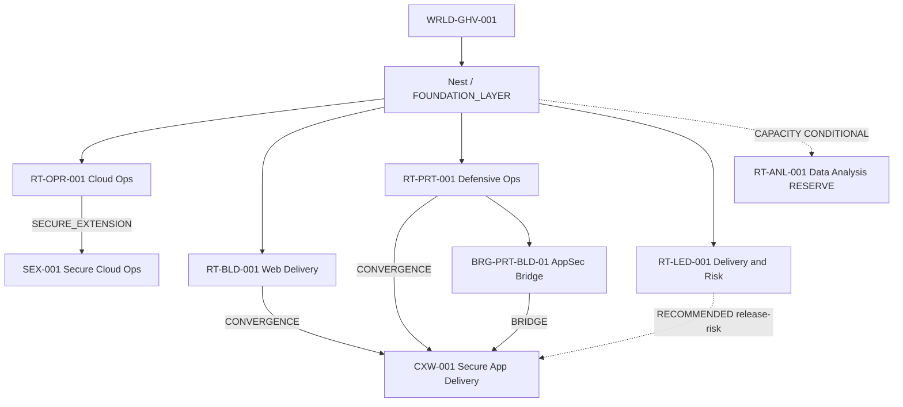
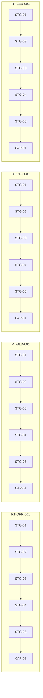
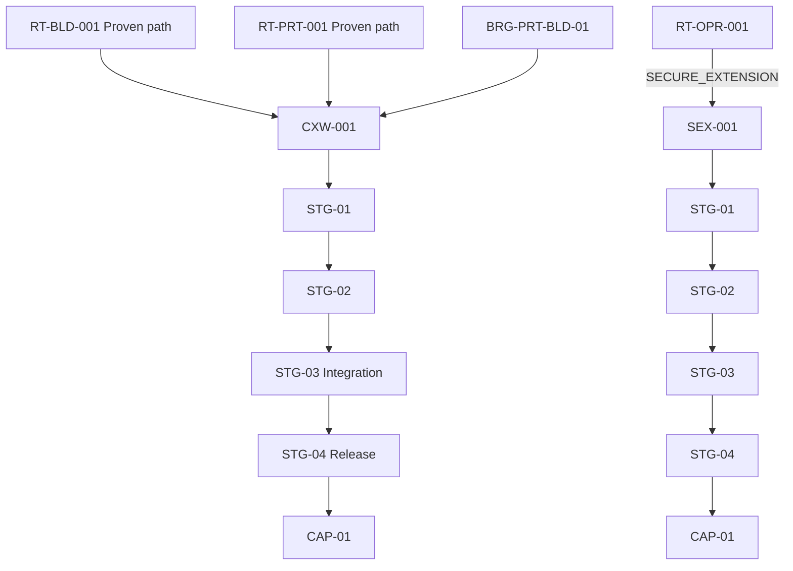
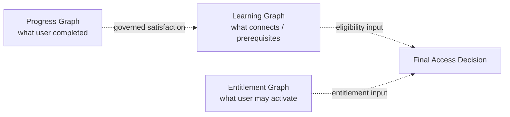

# Launch Graph Visualization (Conceptual)

| Field | Value |
|-------|-------|
| **Document ID** | GHV-LRN-GRAPH-VIS-001 |
| **Version** | 1.0.0 |
| **Status** | ARCHITECTURE RECOMMENDED — PENDING 1D LOCK |
| **Owner** | Founder (RAVEN) |
| **Source Gate** | GHV.LEARNING.1B |
| **Last updated** | 2026-07-21 |
| **Related** | [LAUNCH-GRAPH-REGISTRY.md](./LAUNCH-GRAPH-REGISTRY.md) · [LAUNCH-GRAPH-EDGE-MATRIX.md](./LAUNCH-GRAPH-EDGE-MATRIX.md) |
| **Limitations** | Mermaid is conceptual display only — not executable validation |
| **Change history** | 1.0.0 — LEARNING.1B |

## Layer reminder

```text
Learning Graph  ≠  Progress Graph  ≠  Entitlement Graph
```

This diagram shows **Learning Graph** structure only. Plans, Merit, and concurrency slots are excluded.

## Portfolio overview



## P0 Stage chains (simplified)



## Cross-Wing and Secure Extension



## Graph layer separation (conceptual)



Exact counts: [LAUNCH-GRAPH-REGISTRY.md](./LAUNCH-GRAPH-REGISTRY.md).
