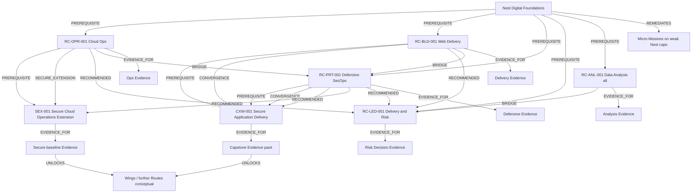

# Launch Learning Graph Concept

| Field | Value |
|-------|-------|
| **Document ID** | GHV-LRN-GRAPH-001 |
| **Version** | 1.0.0 |
| **Status** | RESEARCH BASELINE |
| **Owner** | Founder (RAVEN) |
| **Source Gate** | GHV.LEARNING.1A |
| **Last updated** | 2026-07-21 |
| **Review date** | 2027-01-21 |
| **Related** | [SCOPE-BASELINE.md](../../../governance/scope/SCOPE-BASELINE.md) §3.7 · [NEST-DEPENDENCY-MAP.md](../nest/NEST-DEPENDENCY-MAP.md) · [ROUTE-CANDIDATE-REGISTER.md](../routes/ROUTE-CANDIDATE-REGISTER.md) · [LAUNCH-CROSS-WING-STUDY.md](../cross-wing/LAUNCH-CROSS-WING-STUDY.md) · [LAUNCH-SECURE-EXTENSION-STUDY.md](../secure-extensions/LAUNCH-SECURE-EXTENSION-STUDY.md) · [LAUNCH-EVIDENCE-VALUE-MATRIX.md](../evidence/LAUNCH-EVIDENCE-VALUE-MATRIX.md) |
| **Limitations** | Conceptual map only — **no database schema**, no Product Codes, no locked catalogue; edge instances are research proposals; Nest Mission IDs unresolved; progression thresholds not invented |
| **Unresolved** | See § Unresolved questions for GHV.LEARNING.1B · cycle-prevention enforcement detail · EQUIVALENT policy for prior learning · bilingual node labeling · GHV.LEARNING.1C Atlas drafts · GHV.LEARNING.1D lock |
| **Change history** | 1.0.0 (2026-07-21) — Initial RESEARCH BASELINE for GHV.LEARNING.1A |

## Purpose

Describe a **conceptual** Learning Graph for the recommended launch portfolio: Nest → Routes → Cross-Wing → Secure Extension. Use **only** Scope-approved edge types. Separate Learning / Progress / Entitlement graphs remain distinct (Scope §3.7) — this document covers the **Learning** graph concept only.

## Allowed edge types (exhaustive for this Gate)

| Edge type | Meaning (research baseline) |
|-----------|-----------------------------|
| `PREREQUISITE` | Must satisfy before target (Nest readiness rules + Route Stage gates) |
| `COREQUISITE` | Should progress in parallel; target incomplete without it |
| `RECOMMENDED` | Strengthens outcomes; not a hard gate by itself |
| `EQUIVALENT` | Declared alternate path / recognition (policy TBD in 1B) |
| `BRIDGE` | Short connector content between capabilities or Horizons |
| `SECURE_EXTENSION` | Extension attaches to / deepens a host capability |
| `CONVERGENCE` | Multiple sources meet in an integrative node (e.g., Integration Mission) |
| `UNLOCKS` | Successful completion enables a next learning node (content unlock — not commercial entitlement) |
| `EVIDENCE_FOR` | Evidence artifact supports a capability / Stage claim |
| `REMEDIATES` | Remedial / Micro-Mission content addresses a readiness or mastery gap |

**Do not** introduce other edge type names in launch research.

## Hierarchy reminder (unchanged)

```text
World → Horizon → Route → Stage → Mission → Evidence → Unlock
```

Nest is the foundational layer before / alongside Horizon entry (Scope §3.5–3.8).

## Portfolio nodes (RECOMMENDED — NOT YET LOCKED)

```text
NEST ................ Digital Foundations (capability layer)
RC-OPR-001 .......... Cloud Systems Operations Foundations
RC-BLD-001 .......... Web Application Delivery Foundations
RC-PRT-001 .......... Defensive Security Operations Foundations
RC-LED-001 .......... Technology Delivery & Risk Foundations
RC-ANL-001 .......... Practical Data Analysis Foundations (optional alt)
CXW-001 ............. Secure Application Delivery
SEX-001 ............. Secure Cloud Operations Extension
```

Optional alt RC-ANL-001 is shown as a **parallel optional** OPERATE/BUILD sibling path — not required for minimum vertical slice if capacity is four Routes + CW + SE.

---

## Conceptual map (ASCII)

```text
                         ┌─────────────────────────┐
                         │   NEST (foundations)    │
                         │  caps N-* readiness     │
                         └───────────┬─────────────┘
              PREREQUISITE / REMEDIATES (Micro-Missions)
                                     │
         ┌───────────────┬───────────┼───────────┬───────────────┐
         ▼               ▼           ▼           ▼               ▼
   RC-OPR-001      RC-BLD-001   RC-PRT-001  RC-LED-001    RC-ANL-001
   OPERATE         BUILD        PROTECT     LEAD          ANALYZE (alt)
         │               │           │           │               │
         │               └─────┬─────┘           │               │
         │                     │ CONVERGENCE     │               │
         │                     ▼                 │               │
         │               ┌───────────┐           │               │
         │               │  CXW-001  │◄── PREREQUISITE (BLD+PRT) │
         │               └───────────┘           │               │
         │                                       │               │
         │ SECURE_EXTENSION                      │ RECOMMENDED   │
         ▼                                       ▼               │
   ┌───────────┐                          (LEAD glue edges)      │
   │  SEX-001  │◄── PREREQUISITE RC-OPR-001                      │
   └───────────┘                                                 │
         │                                                       │
         └──────── Evidence nodes (EVIDENCE_FOR) ────────────────┘
```

---

## Mermaid concept (same intent)



Edge labels in the diagram are conceptual; Progress and Entitlement unlocks are **out of this graph**.

---

## Proposed edge inventory (research — not locked)

### Nest → Routes

| From | To | Edge | Notes |
|------|----|------|-------|
| Nest readiness ≥ 50% or Nest path complete | Each launch Route | `PREREQUISITE` | Band rules per Scope §3.5 |
| Nest weak-cap Micro-Mission | Affected Route Stages | `REMEDIATES` | Guided Skip insertion |
| Nest optional review topics | Route entry | `RECOMMENDED` | Ready to Fly weakness reviews |
| Nest bridge module (e.g., HTML literacy) | RC-BLD-001 | `BRIDGE` | If Nest hosts the bridge content |
| Declared prior Nest-equivalent literacy | Nest path | `EQUIVALENT` | Policy TBD — do not auto-grant Route Mastery |

### Between Routes

| From | To | Edge | Notes |
|------|----|------|-------|
| RC-OPR-002 concepts (if present later) | RC-PRT-001 | `RECOMMENDED` | Scorecard alt; not required for this map’s primary set |
| RC-BLD-001 | RC-PRT-001 | `BRIDGE` | Secure delivery awareness without full PROTECT |
| RC-OPR-001 | RC-PRT-001 | `BRIDGE` | Ops→defense shared observability language |
| RC-ANL-001 | RC-LED-001 | `BRIDGE` | Data-informed decisions |
| Any completed foundational Route | RC-LED-001 | `RECOMMENDED` | LEAD benefits from lived practice |
| RC-PRT-002 slice (identity) | CXW-001 / SEX-001 | `COREQUISITE` or `RECOMMENDED` | Supporting identity literacy — not full Route enrollment |

### Cross-Wing

| From | To | Edge | Notes |
|------|----|------|-------|
| RC-BLD-001 foundation Stages | CXW-001 | `PREREQUISITE` | Required source |
| Selected RC-PRT-001 Stages | CXW-001 | `PREREQUISITE` | Secure SDLC / vuln triage concepts |
| RC-BLD-001 + RC-PRT-001 | CXW-001 Integration Mission | `CONVERGENCE` | Forces combined practice |
| RC-PRT-002 IAM awareness | CXW-001 | `RECOMMENDED` / `COREQUISITE` | Per Cross-Wing study |
| RC-BLD-002 scripting | CXW-001 | `RECOMMENDED` | Optional parallel |
| CXW-001 Capstone Evidence | CXW-001 capability claim | `EVIDENCE_FOR` | |
| CXW-001 completion | Further BUILD/PROTECT depth | `UNLOCKS` | Content unlock only |

### Secure Extension

| From | To | Edge | Notes |
|------|----|------|-------|
| RC-OPR-001 core Stages | SEX-001 | `PREREQUISITE` | Host capability |
| RC-OPR-001 | SEX-001 | `SECURE_EXTENSION` | Attachment edge (required type) |
| RC-OPR-002 / Linux-network | SEX-001 | `RECOMMENDED` | |
| Identity control snippets | SEX-001 | `COREQUISITE` | Not full PROTECT Route |
| SEX-001 Evidence | Secure ops claim | `EVIDENCE_FOR` | |
| Misconfig remediation Mission | Prior insecure baseline lab | `REMEDIATES` | Seeded finding pattern |

### Evidence (generic)

| From | To | Edge | Notes |
|------|----|------|-------|
| Mission Evidence artifact | Stage / Route capability | `EVIDENCE_FOR` | Prefer visible defensible Evidence |
| Revision Mission after failed review | Capability gap | `REMEDIATES` | |

Commercial entitlement and Merit Grant are **Entitlement graph** concerns — not modeled as Learning edges here. Cross-Wing access formula remains pending PROGRESSION.1 / LEARNING.1B–1D.

---

## Cycle prevention (conceptual rules)

1. No directed cycle among `PREREQUISITE` edges.
2. `SECURE_EXTENSION` may only point from host capability → Extension (not reverse).
3. `CONVERGENCE` targets are sinks or Integration Missions — not new hard prerequisites back into both sources without an explicit Bridge node.
4. `EQUIVALENT` must be symmetric in declaration but must not create Mastery inflation loops with `UNLOCKS`.
5. `REMEDIATES` may point “backward” to gaps without creating unlock cycles.

Enforcement mechanism: **GHV.LEARNING.1C** / platform Spike — not specified here.

## Explicit non-goals

- No DB schema, table design, or API contracts.
- No invented Mastery / Trust / Merit numeric formulas.
- No Nest band redesign (70 / 50 locked).
- No status `LOCKED` for Routes / CW / SE in this Gate.

---

## Unresolved questions for GHV.LEARNING.1B

1. **Nest node granularity** — One Nest node vs per-capability (`N-*`) nodes for graph queries and Micro-Mission targeting?
2. **EQUIVALENT policy** — What evidence proves Nest or Stage equivalence without granting advanced Mastery from skip alone?
3. **COREQUISITE enforcement** — Soft UI nudge vs hard gate before Capstone Evidence?
4. **BRIDGE ownership** — Nest-hosted vs Route-hosted bridge Missions; bilingual delivery?
5. **Evidence node model** — Is Evidence a first-class graph node or an attribute on Mission completion? (Prefer visible defensible Evidence; see Evidence matrix.)
6. **CXW Integration Readiness** — Which Learning edges (vs Progress metrics) declare “ready for Integration Mission”?
7. **SEX attachment cardinality** — One host Route only at launch, or allow multi-host `SECURE_EXTENSION` later?
8. **RC-ANL-001 inclusion** — If fifth Route capacity exists, which `BRIDGE` / `RECOMMENDED` edges become launch-critical?
9. **Revocation** — How does Evidence revocation traverse `EVIDENCE_FOR` / `UNLOCKS` without touching Entitlement incorrectly?
10. **Arabic / RTL labeling** — Canonical IDs vs localized display names on graph edges for Atlas publication.

## Next Gates

| Gate | Expected work |
|------|----------------|
| GHV.LEARNING.1B | Answer unresolved list; Evidence architecture binding |
| GHV.LEARNING.1C | Atlas drafts + authoritative edge instances |
| GHV.PROGRESSION.1 | Progress graph thresholds (separate from Learning edges) |
| GHV.LEARNING.1D | Catalogue lock |
)

